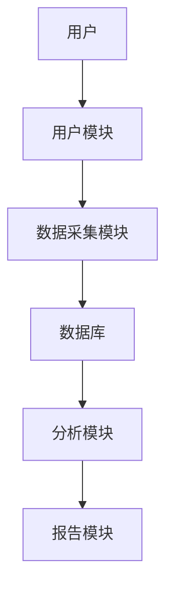
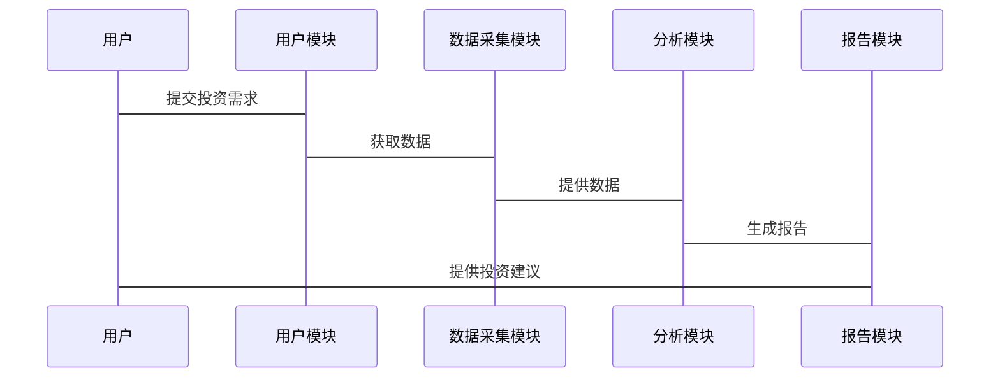

                 


# 价值投资在新能源领域的应用：绿色革命的机遇

> 关键词：价值投资、新能源、绿色革命、投资策略、数学模型、系统架构、项目实战

> 摘要：本文系统地探讨了价值投资在新能源领域的应用，分析了绿色革命带来的投资机遇，通过数学模型和系统架构的设计，结合实际案例，详细解读了如何在新能源领域进行有效投资。

---

# 第1章: 价值投资与新能源领域的背景介绍

## 1.1 价值投资的基本概念

### 1.1.1 价值投资的定义

价值投资是一种以基本面分析为基础的投资策略，强调以低于内在价值的价格购买优质资产，长期持有，获得超额收益。

### 1.1.2 价值投资的核心理念

价值投资的核心理念是寻找被市场低估的公司，关注公司的财务健康、行业地位和长期发展潜力。

## 1.2 新能源领域的基本概念

### 1.2.1 新能源的定义

新能源是指相对于传统能源（如煤炭、石油）之外的能源资源，主要包括太阳能、风能、生物质能、地热能、潮汐能等。

### 1.2.2 新能源的主要类型

- 太阳能
- 风能
- 生物质能
- 地热能
- 潮汐能
- 氢能

## 1.3 绿色革命的定义与背景

### 1.3.1 绿色革命的定义

绿色革命是指通过技术创新和政策支持，推动能源结构从化石能源向清洁能源转变的过程。

### 1.3.2 绿色革命的背景与驱动因素

- 环境保护：减少碳排放，应对气候变化。
- 能源安全：减少对化石能源的依赖，提高能源自主性。
- 技术进步：新能源技术的快速发展，降低成本，提高效率。

## 1.4 本章小结

本章介绍了价值投资的基本概念、新能源的定义和主要类型，以及绿色革命的背景和驱动因素，为后续分析奠定了基础。

---

# 第2章: 价值投资在新能源领域的核心概念与联系

## 2.1 价值投资在新能源中的核心要素

### 2.1.1 公司基本面分析

- 财务状况：关注公司的盈利能力、资产负债率、现金流等指标。
- 行业地位：分析公司在行业中的竞争力和市场份额。

### 2.1.2 行业分析

- 行业生命周期：判断行业所处阶段，选择处于成长期的行业。
- 政策环境：分析政府政策对行业的影响，如补贴、税收优惠等。

## 2.2 价值投资与新能源行业的关系

### 2.2.1 价值投资在新能源行业的应用

- 寻找具有竞争优势的公司：如技术领先、成本优势的新能源企业。
- 识别行业拐点：在行业需求快速增长时介入。

### 2.2.2 新能源行业的特点与价值投资的契合点

- 高成长性：新能源行业处于快速发展阶段，具有较高的增长潜力。
- 技术驱动：技术创新是行业发展的核心动力，价值投资者需要关注技术领先的企业。

## 2.3 价值投资与绿色革命的联系

### 2.3.1 绿色革命带来的投资机会

- 新能源技术的突破：如光伏发电效率提升、储能技术进步等。
- 政策支持：政府出台的绿色能源政策为行业提供了增长动力。

### 2.3.2 绿色革命对价值投资策略的影响

- 投资标的扩展：绿色革命涉及的领域广泛，投资者需要重新评估相关行业的价值。
- 风险管理：绿色革命的不确定性可能增加投资风险，需要加强风险管理。

## 2.4 本章小结

本章分析了价值投资在新能源行业中的核心要素，探讨了价值投资与新能源行业的关系，以及绿色革命对价值投资策略的影响，为后续分析提供了理论基础。

---

# 第3章: 新能源投资的数学模型与算法原理

## 3.1 新能源投资的数学模型

### 3.1.1 现金流贴现模型

现金流贴现模型（DCF模型）是评估公司内在价值的重要工具，适用于新能源企业的估值。

#### 公式：

$$
\text{内在价值} = \sum_{t=1}^{n} \frac{\text{现金流}_t}{(1+r)^t} + \frac{\text{残值}}{(1+r)^n}
$$

其中，\( r \) 是折现率，\( n \) 是项目寿命。

### 3.1.2 市盈率与市净率分析

市盈率（P/E）和市净率（P/B）是常用的估值指标，帮助投资者判断公司是否被低估。

## 3.2 价值评估算法的原理

### 3.2.1 现金流贴现模型的实现

- 确定未来现金流：预测公司未来几年的现金流。
- 确定折现率：通常使用行业平均资本成本。
- 计算现值：将未来现金流贴现，求和得到公司内在价值。

### 3.2.2 算法的优缺点

- 优点：能够准确反映公司未来现金流的现值。
- 缺点：依赖于未来现金流的预测，具有较高的不确定性。

## 3.3 代码实现与案例分析

### 3.3.1 Python代码实现

```python
def calculate_intrinsic_value(cash_flows, discount_rate, residual_value):
    n = len(cash_flows)
    intrinsic_value = 0
    for t in range(n):
        intrinsic_value += cash_flows[t] / (1 + discount_rate) ** t
    intrinsic_value += residual_value / (1 + discount_rate) ** n
    return intrinsic_value

# 示例数据
cash_flows = [100, 150, 200, 250, 300]
discount_rate = 0.1
residual_value = 500

intrinsic_value = calculate_intrinsic_value(cash_flows, discount_rate, residual_value)
print("内在价值：", intrinsic_value)
```

### 3.3.2 案例分析

以某新能源公司为例，假设未来五年的现金流分别为100、150、200、250、300万元，折现率为10%，残值为500万元。计算得到的内在价值为：

$$
\text{内在价值} = \sum_{t=1}^{5} \frac{\text{现金流}_t}{(1+0.1)^t} + \frac{500}{(1+0.1)^5}
$$

计算结果为内在价值为800万元。

## 3.4 本章小结

本章介绍了新能源投资的数学模型，特别是现金流贴现模型的应用，通过Python代码实现和案例分析，帮助投资者更好地理解模型的应用和优缺点。

---

# 第4章: 新能源投资的系统分析与架构设计

## 4.1 系统分析

### 4.1.1 问题场景介绍

投资者需要一个系统化的工具来分析新能源行业的投资机会，评估公司的内在价值，并制定投资策略。

### 4.1.2 项目介绍

本项目旨在开发一个新能源投资分析系统，帮助投资者进行基本面分析、行业分析和价值评估。

## 4.2 系统功能设计

### 4.2.1 领域模型设计

- 用户模块：管理用户信息。
- 数据采集模块：收集新能源行业的数据。
- 分析模块：包括基本面分析、行业分析和价值评估。
- 报告模块：生成投资报告。

### 4.2.2 功能模块划分

- 数据采集与处理
- 财务分析
- 价值评估
- 投资建议

## 4.3 系统架构设计

### 4.3.1 架构图设计



### 4.3.2 接口设计

- 用户接口：提供输入数据和查询功能。
- 数据接口：与第三方数据源对接。

## 4.4 系统交互设计

### 4.4.1 序列图设计



## 4.5 本章小结

本章通过系统分析和架构设计，展示了如何构建一个新能源投资分析系统，帮助投资者高效地进行投资决策。

---

# 第5章: 项目实战——新能源公司投资价值分析

## 5.1 环境安装

### 5.1.1 开发环境搭建

- 安装Python和相关库（如Pandas、NumPy、Matplotlib）。

### 5.1.2 数据获取与处理

- 数据来源：公开的财务报表、行业报告、政府数据等。

## 5.2 核心代码实现

### 5.2.1 代码实现

```python
import pandas as pd

# 示例数据
data = {
    '公司': ['公司A', '公司B', '公司C'],
    '市盈率': [15, 20, 25],
    '市净率': [2, 3, 4],
    'ROE': [15%, 20%, 25%]
}

df = pd.DataFrame(data)
print(df)
```

### 5.2.2 代码解读

- 数据表格展示公司名称、市盈率、市净率和ROE（净资产收益率）。

## 5.3 案例分析

### 5.3.1 案例选择

以某新能源公司为例，分析其市盈率、市净率和ROE指标，判断其是否被低估。

### 5.3.2 分析过程

- 计算公司内在价值。
- 对比市场价格与内在价值，判断投资价值。

## 5.4 项目总结

### 5.4.1 成果总结

通过系统分析和实际案例，投资者能够更好地理解新能源行业的投资机会。

### 5.4.2 经验与教训

- 数据的准确性至关重要。
- 模型的假设需要合理，避免偏差。

## 5.5 本章小结

本章通过实际案例分析，展示了如何应用价值投资方法在新能源领域的具体操作，帮助投资者更好地识别投资机会。

---

# 第6章: 总结与展望

## 6.1 全书总结

### 6.1.1 核心观点回顾

- 价值投资是新能源领域的重要策略。
- 绿色革命带来了丰富的投资机会。

### 6.1.2 主要内容总结

- 新能源行业的特点和价值投资的契合点。
- 数学模型和系统架构的应用。

## 6.2 未来展望

### 6.2.1 技术进步

- 新能源技术的进一步突破将带来更多投资机会。

### 6.2.2 政策支持

- 政府政策的持续支持将推动行业的发展。

## 6.3 本章小结

本章总结了全书的核心观点，并展望了未来的发展趋势，为投资者提供了长期投资的参考。

---

# 作者：AI天才研究院 & 禅与计算机程序设计艺术

---

**注：** 以上目录结构和内容仅为示例，实际撰写时需要根据具体需求进行调整和补充，以确保文章的完整性和专业性。

