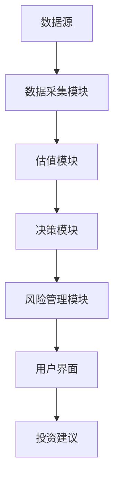

                 


# 价值投资在波动市场中的优势

> **关键词**：价值投资，波动市场，内在价值，安全边际，长期收益，风险管理，投资策略

> **摘要**：  
本文探讨了价值投资在波动市场中的优势，分析了其核心理念、策略和实际应用。通过背景介绍、核心概念、算法原理、系统架构、项目实战等多维度分析，揭示了价值投资在高波动性市场中的稳定性和长期收益能力，为投资者提供了理论支持和实践指导。

---

## 第一部分：背景介绍

### 第1章：价值投资的核心概念与波动市场的挑战

#### 1.1 价值投资的定义与核心理念
- **背景介绍**：价值投资是一种以基本面分析为基础的投资策略，强调寻找市场价格低于其内在价值的资产。其核心理念包括追求安全边际、长期持有和逆向思维。
- **问题背景**：在波动市场中，价格波动剧烈，投资者容易受到情绪影响，导致决策失误。
- **问题描述**：波动市场中，价值投资如何应对短期价格波动，抓住长期投资机会？

#### 1.2 波动市场的特征与影响
- **波动市场的定义**：市场价格在短时间内大幅波动，通常由市场情绪、突发事件或经济周期变化引发。
- **波动市场的挑战**：投资者在波动市场中容易受到情绪影响，出现恐慌性抛售或贪婪性追涨。
- **波动市场的投资机会**：波动市场中，价格与价值的偏离为价值投资者提供了潜在的买入机会。

---

## 第二部分：价值投资的核心概念

### 第2章：内在价值与市场价格波动

#### 2.1 内在价值的定义与计算
- **内在价值**：资产在合理DCF模型下的未来现金流的现值。
- **计算方法**：使用DCF模型，考虑自由现金流、贴现率（WACC）和永续增长率。
- **公式**：  
  内在价值 = 现金流的现值 + 终值  
  $$ V = \sum_{t=1}^{n} \frac{CF_t}{(1+r)^t} + \frac{TV}{(1+r)^n} $$  
  其中，$CF_t$ 是第 $t$ 年的现金流，$r$ 是贴现率，$TV$ 是终值。

#### 2.2 市场价格波动与安全边际
- **安全边际**：市场价格与内在价值的差异，提供了一种缓冲空间，以应对市场价格波动带来的风险。
- **公式**：  
  安全边际 = 内在价值 - 市场价格  
  $$ \text{Margin of Safety} = V - P $$  
  其中，$V$ 是内在价值，$P$ 是市场价格。

#### 2.3 价值投资的核心要素对比
| **要素**      | **描述**                                                                 |
|----------------|--------------------------------------------------------------------------|
| 内在价值       | 资产未来现金流的现值，基于基本面分析                                       |
| 市场价格       | 当前市场交易价格，受情绪和市场波动影响                                       |
| 安全边际       | 内在价值与市场价格的差异，提供风险缓冲                                       |

---

## 第三部分：算法原理

### 第3章：价值投资的算法与数学模型

#### 3.1 基于DCF模型的内在价值计算
- **流程图**：  
  ```mermaid
  graph TD
      A[开始] --> B[确定目标公司]
      B --> C[收集财务数据]
      C --> D[计算自由现金流]
      D --> E[估计贴现率（WACC）]
      E --> F[计算终值]
      F --> G[计算内在价值]
      G --> H[比较市场价格与内在价值]
      H --> I[得出投资决策]
      I --> 结束
  ```

- **自由现金流计算**：  
  $$ \text{FCF} = \text{EBIT} \times (1 - \text{税率}) - \text{资本支出} $$

- **WACC计算**：  
  $$ WACC = w_d \times k_d \times (1 - \text{税率}) + w_e \times k_e $$  
  其中，$w_d$ 是债务权重，$k_d$ 是债务成本，$w_e$ 是股权权重，$k_e$ 是股权成本。

#### 3.2 安全边际的应用
- **公式**：  
  $$ \text{安全边际比例} = \frac{V - P}{P} \times 100\% $$  
  安全边际比例越高，投资的安全性越强。

---

## 第四部分：系统架构与设计

### 第4章：价值投资系统的架构与实现

#### 4.1 系统功能模块
- **数据采集模块**：收集公司财务数据、行业信息和市场数据。
- **估值模块**：计算内在价值和安全边际。
- **决策模块**：根据安全边际和市场趋势，生成投资建议。
- **风险管理模块**：监控市场波动和投资组合风险。

#### 4.2 系统架构图  


---

## 第五部分：项目实战

### 第5章：价值投资在波动市场中的实际应用

#### 5.1 案例分析：科技公司XYZ的估值与投资决策
- **背景**：科技公司XYZ在波动市场中股价大幅波动，但基本面稳健。
- **数据**：  
  - 自由现金流（FCF）：$500M  
  - 税率：20%  
  - 资本支出：$100M  
  - WACC：8%  
  - 永续增长率：2.5%  
- **计算**：  
  $$ \text{内在价值} = \frac{500 \times (1 - 0.2)}{0.08 - 0.025} = 500 \times 0.8 / 0.055 \approx 727.27M $$  
  $$ \text{安全边际} = 727.27 - 600 = 127.27M $$  
  $$ \text{安全边际比例} = (727.27 - 600)/600 \times 100\% \approx 21.21\% $$  

---

## 第六部分：总结与展望

### 第6章：价值投资的长期策略与风险管理

#### 6.1 小结
- 价值投资在波动市场中通过寻找低估资产和安全边际，实现长期稳定的收益。
- 需要结合基本面分析和风险管理，应对市场波动带来的挑战。

#### 6.2 展望
- 随着市场波动加剧，价值投资的长期优势将更加显著。
- 未来可以通过大数据和人工智能技术，进一步提升估值模型和风险管理能力。

---

## 附录

### 附录A：价值投资工具与资源

#### A.1 推荐书籍
- 《The Intelligent Investor》 - 本杰明·格雷厄姆
- 《The Value Investing Handbook》 - 查尔斯·德雷克斯勒

#### A.2 Python代码示例
```python
import numpy as np
import pandas as pd

def calculate_intrinsic_value(fcf, tax_rate, wacc, terminal_growth):
    tax_rate = tax_rate / 100
    wacc = wacc / 100
    tv = fcf * (1 + terminal_growth) / (wacc - terminal_growth)
    return tv / (1 + wacc)
    
# 示例数据
fcf = 500
tax_rate = 20
wacc = 8
terminal_growth = 2.5

iv = calculate_intrinsic_value(fcf, tax_rate, wacc, terminal_growth)
print(f"内 在 价 值: {iv:.2f}")
```

---

## 作者信息

作者：AI天才研究院/AI Genius Institute & 禅与计算机程序设计艺术 /Zen And The Art of Computer Programming

