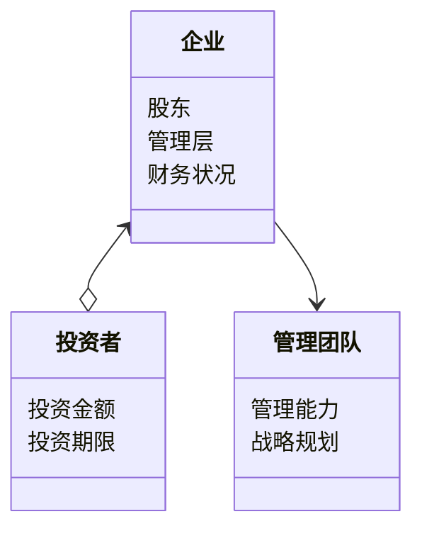
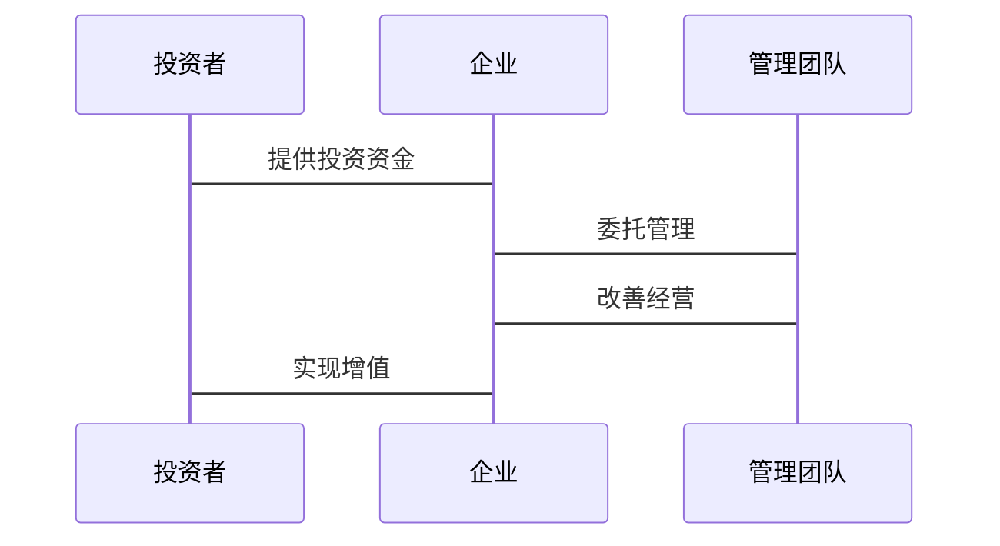

                 


# 价值投资在私募股权中的应用

> 关键词：私募股权，价值投资，风险管理，财务分析，投资策略

> 摘要：本文探讨了价值投资在私募股权中的应用，分析了价值投资的核心概念、私募股权的基本运作机制，以及两者结合的理论基础和实际操作方法。通过详细讲解数学模型、算法原理和系统架构，本文为读者提供了全面的视角来理解如何在私募股权领域应用价值投资策略。

---

## 第一章：价值投资与私募股权的背景介绍

### 1.1 价值投资的核心概念
#### 1.1.1 价值投资的定义
价值投资是一种以低于其内在价值的价格购买优质资产的投资策略。其核心在于识别市场低估的资产，并长期持有，等待其价值回归。

#### 1.1.2 价值投资的核心要素
- **内在价值**：资产在合理市场条件下的公平价格。
- **安全边际**：购买价格与内在价值之间的折扣。
- **长期视角**：注重长期回报而非短期波动。

#### 1.1.3 价值投资与私募股权的结合点
私募股权的特性（如非流动性、高回报潜力）与价值投资的长期视角和深度分析相契合。

### 1.2 私募股权的基本概念
#### 1.2.1 私募股权的定义
私募股权是指通过私募方式投资于未上市企业的股权，通常通过杠杆收购、管理层收购等方式进行。

#### 1.2.2 私募股权的主要特点
- **高回报潜力**：通过杠杆和重组实现价值提升。
- **非流动性**：投资周期较长，退出渠道有限。
- **高风险**：依赖于管理团队和市场环境。

#### 1.2.3 私募股权的运作机制
私募股权基金通过募集资本，投资于目标企业，通过改善经营、剥离资产等方式实现增值，最后通过上市或并购退出。

### 1.3 价值投资在私募股权中的应用背景
#### 1.3.1 私募股权市场的现状
私募股权市场近年来快速发展，但存在市场波动大、信息不对称等问题。

#### 1.3.2 价值投资在私募股权中的优势
价值投资强调基本面分析，能够帮助投资者识别被低估的私募股权项目。

#### 1.3.3 价值投资与私募股权结合的必要性
通过价值投资的方法，私募股权投资者可以更好地控制风险，提高投资回报。

---

## 第二章：价值投资与私募股权的核心概念

### 2.1 价值投资的理论基础
#### 2.1.1 股权投资的基本原理
股权投资的核心在于识别企业的内在价值，关注企业的财务状况、管理水平和市场前景。

#### 2.1.2 价值投资的核心理论
- **格雷厄姆学说**：强调安全边际和内在价值的计算。
- **巴菲特理念**：关注企业的竞争优势和持续盈利能力。

#### 2.1.3 价值投资与私募股权的结合
将价值投资的理论应用于私募股权的筛选和评估。

### 2.2 私募股权的运作模式
#### 2.2.1 私募股权的组织形式
- **有限合伙制**：普通合伙人（GP）和有限合伙人（LP）的分工与责任。
- **公司制**：适合小型私募基金。

#### 2.2.2 私募股权的资金募集
- **LP募集**：通过私募方式吸引机构投资者和高净值客户。
- **GP自有资金**：通常投入一定比例的自有资金，以示诚意。

#### 2.2.3 私募股权的投资策略
- **成长型投资**：投资于高成长企业。
- **价值型投资**：寻找被低估的企业。
- **控股型投资**：通过控股实现管理改善和价值提升。

### 2.3 价值投资在私募股权中的应用框架
#### 2.3.1 价值投资的基本框架
- **目标筛选**：根据价值投资标准筛选私募股权项目。
- **深入分析**：对企业财务、管理、行业前景进行详细评估。
- **风险控制**：通过分散投资和严格的风险评估降低风险。

#### 2.3.2 私募股权的价值评估模型
- **DCF模型**：通过现金流折现法评估企业价值。
- **相对估值法**：与可比企业进行比较。

#### 2.3.3 价值投资与私募股权的结合模型
综合考虑企业内在价值、市场环境和管理能力，制定投资策略。

---

## 第三章：价值投资在私募股权中的算法原理

### 3.1 价值投资的核心算法
#### 3.1.1 股票估值的基本算法
- **DCF模型**：通过自由现金流折现计算企业价值。
- **市盈率法**：通过市盈率与行业平均值比较，判断股票估值。

#### 3.1.2 股票估值的改进算法
- **调整现值法**：考虑货币时间价值的调整。
- **情景分析法**：基于不同假设进行多情景分析。

#### 3.1.3 股票估值的高级算法
- **蒙特卡洛模拟**：通过随机模拟评估企业价值分布。
- **机器学习模型**：利用大数据和机器学习算法预测企业价值。

### 3.2 私募股权的估值公式
#### 3.2.1 私募股权的DCF模型公式
$$企业价值 = \sum_{t=1}^{n} \frac{\text{自由现金流}_t}{(1 + r)^t} + \frac{\text{终值}}{(1 + r)^n}$$
其中，r为折现率，n为投资期限。

#### 3.2.2 私募股权的相对估值公式
$$\text{目标企业价值} = \text{可比企业平均EV/EBITDA} \times \text{目标企业EBITDA}$$

#### 3.2.3 私募股权的组合估值公式
$$\text{组合价值} = \sum_{i=1}^{n} w_i \times v_i$$
其中，\( w_i \)为第i个资产的权重，\( v_i \)为第i个资产的价值。

### 3.3 价值投资与私募股权的结合算法
#### 3.3.1 综合估值模型
$$\text{综合估值} = \alpha \times DCF + \beta \times 相对估值 + \gamma \times 机器学习模型$$
其中，\(\alpha, \beta, \gamma\)为权重系数。

#### 3.3.2 综合估值模型的实现步骤
1. **数据收集**：收集目标企业的财务数据和行业数据。
2. **模型构建**：选择合适的估值方法并进行参数设定。
3. **结果分析**：比较不同方法的估值结果，确定综合估值。

#### 3.3.3 综合估值模型的优化
通过回测和实证分析，不断优化模型参数，提高估值准确性。

---

## 第四章：价值投资在私募股权中的数学模型与公式

### 4.1 股票估值的基本公式
#### 4.1.1 股票的内在价值公式
$$\text{内在价值} = \frac{\text{每股收益}}{r - g}$$
其中，r为折现率，g为收益增长率。

#### 4.1.2 股票的市场价值公式
$$\text{市场价值} = \sum_{t=1}^{\infty} \frac{\text{股息}_t}{(1 + r)^t}$$

#### 4.1.3 股票的预期收益公式
$$\text{预期收益} = r + \lambda \times (\text{市场回报} - r)$$
其中，\(\lambda\)为贝塔系数。

### 4.2 私募股权的估值公式
#### 4.2.1 私募股权的DCF模型公式
$$\text{企业价值} = \sum_{t=1}^{n} \frac{\text{现金流}_t}{(1 + r)^t} + \frac{\text{终值}}{(1 + r)^n}$$

#### 4.2.2 私募股权的相对估值公式
$$\text{目标企业价值} = \text{可比企业平均EV/EBITDA} \times \text{目标企业EBITDA}$$

#### 4.2.3 私募股权的组合估值公式
$$\text{组合价值} = \sum_{i=1}^{n} w_i \times v_i$$

### 4.3 综合估值模型的数学表达
#### 4.3.1 综合估值模型的构建
$$\text{综合估值} = \alpha \times DCF + \beta \times 相对估值 + \gamma \times 机器学习模型$$

#### 4.3.2 综合估值模型的参数设置
通过历史数据和实证分析，确定权重系数\(\alpha, \beta, \gamma\)。

#### 4.3.3 综合估值模型的验证
通过回测和实证分析，验证模型的准确性和稳定性。

---

## 第五章：价值投资在私募股权中的系统分析与架构设计

### 5.1 问题场景介绍
私募股权的投资决策需要考虑多个因素，包括企业的财务状况、行业前景、管理团队等。

### 5.2 系统功能设计
#### 5.2.1 领域模型
使用Mermaid绘制领域模型类图，展示企业、投资者、管理团队等实体之间的关系。



#### 5.2.2 系统架构设计
使用Mermaid绘制系统架构图，展示系统的主要组件和交互。


#### 5.2.3 系统接口设计
定义系统的主要接口，包括数据输入、估值计算、结果输出等。

#### 5.2.4 系统交互设计
使用Mermaid绘制序列图，展示投资者、企业、管理团队之间的交互流程。



---

## 第六章：价值投资在私募股权中的项目实战

### 6.1 环境安装
需要安装的工具包括Python、NumPy、Pandas、Matplotlib、Scikit-learn等。

### 6.2 系统核心实现源代码
以下是基于价值投资的私募股权估值系统的核心代码：

```python
import numpy as np
import pandas as pd
from sklearn import linear_model

# 数据预处理
def preprocess(data):
    # 假设data为包含企业财务数据的DataFrame
    # 删除缺失值
    data = data.dropna()
    # 标准化处理
    from sklearn.preprocessing import StandardScaler
    scaler = StandardScaler()
    scaled_data = scaler.fit_transform(data)
    return scaled_data

# 估值模型
def value_investment_model(data):
    # 使用线性回归预测企业价值
    model = linear_model.LinearRegression()
    model.fit(data[[' revenue', 'profit']], data[['value']])
    return model

# 算法实现
def value_investment_algorithm(data):
    processed_data = preprocess(data)
    model = value_investment_model(processed_data)
    # 进行预测
    predictions = model.predict(processed_data)
    return predictions

# 应用案例分析
def case_study():
    # 假设data为包含多个私募股权项目的数据
    data = pd.DataFrame({
        'revenue': [100, 200, 300],
        'profit': [20, 30, 40],
        'value': [50, 100, 150]
    })
    predictions = value_investment_algorithm(data)
    print("预测的企业价值为：", predictions)
```

### 6.3 代码应用解读与分析
通过对上述代码的解读，我们可以看到价值投资模型如何在私募股权估值中应用。数据预处理、模型训练和预测过程清晰展示了价值投资的核心步骤。

### 6.4 实际案例分析
通过具体案例分析，验证价值投资模型的有效性。例如，分析某私募股权项目的财务数据，应用上述模型进行估值，并与实际结果进行对比。

### 6.5 项目小结
总结项目实施过程中的经验教训，提出改进建议。

---

## 第七章：总结与展望

### 7.1 本章总结
回顾全文，总结价值投资在私募股权中的应用方法和实际效果。

### 7.2 未来展望
探讨价值投资在私募股权中的未来发展趋势，包括技术进步、市场变化带来的新机遇和挑战。

### 7.3 最佳实践 Tips
- **深入研究**：对目标企业进行充分的尽职调查。
- **分散投资**：通过多元化降低风险。
- **长期视角**：保持长期投资心态，避免短期波动影响决策。

### 7.4 小结
价值投资与私募股权的结合为投资者提供了新的思路，未来需要进一步研究和实践。

---

## 作者：AI天才研究院/AI Genius Institute & 禅与计算机程序设计艺术 /Zen And The Art of Computer Programming

