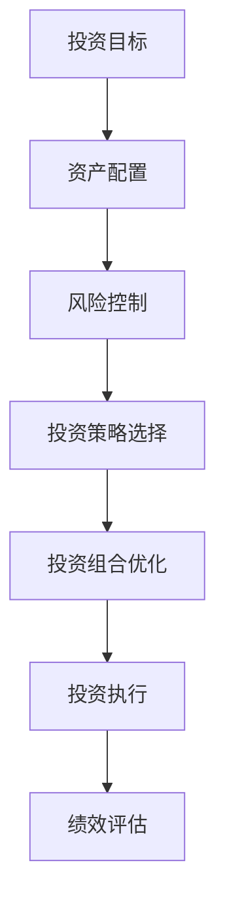

                 


# 价值投资大师的智慧：格雷厄姆、巴菲特、费雪和约翰伯格

---

## 关键词：
- 价值投资，投资大师，格雷厄姆，巴菲特，费雪，约翰伯格，投资策略，投资哲学，投资组合，安全边际

---

## 摘要：
本文将深入探讨四位价值投资大师——本杰明·格雷厄姆、沃伦·巴菲特、菲利普·费雪和约翰·伯格的投资理念、策略和成功经验。通过分析他们的核心思想，结合实际案例和系统化的投资方法，揭示价值投资的本质和实践技巧。同时，本文还将探讨如何将这些大师的智慧应用于现代投资组合管理中，帮助读者在复杂多变的市场中实现稳健投资。

---

## 正文：

---

## 第一部分: 价值投资大师的智慧概述

### 第1章: 价值投资的核心理念

#### 1.1 价值投资的定义与背景

价值投资是一种以企业内在价值为核心的投资策略，强调以低于内在价值的价格买入优质资产，长期持有，获得超额收益。其核心理念来源于格雷厄姆和多德的价值投资理论，强调安全边际、基本面分析和长期持有。

**核心概念：**
- **内在价值**：资产的公允价值，基于其未来现金流的现值。
- **安全边际**：买入价格低于内在价值，以降低风险并确保收益。
- **长期持有**：避免频繁交易，减少交易成本和市场波动的影响。

#### 1.2 价值投资的关键要素

1. **企业基本面分析**：
   - 通过财务报表分析企业的盈利能力、成长性和财务健康状况。
2. **安全边际**：
   - 买入价格与内在价值之间的折扣，确保投资的安全性。
3. **长期投资与复利效应**：
   - 长期持有优质资产，利用复利效应实现财富增长。

#### 1.3 价值投资的适用场景与局限性

1. **适用场景**：
   - 市场估值过高时，寻找被低估的资产。
2. **局限性**：
   - 短期市场波动可能导致账面亏损。
   - 需要较高的研究能力和信息处理能力。

---

### 第2章: 格雷厄姆的价值投资体系

#### 2.1 格雷厄姆的生平与贡献

格雷厄姆（1897-1975）是价值投资的奠基人，其核心思想体现在《证券分析》和《聪明的投资者》中。他强调安全边际和防御性投资，倡导以低于内在价值的价格买入股票。

#### 2.2 格雷厄姆的价值投资体系

1. **安全边际**：
   - 买入价格 ≤ 内在价值 × 折扣率。
2. **内在价值计算**：
   - 基于企业的未来现金流，使用DCF模型计算内在价值。
3. **投资组合管理**：
   - 分散投资，降低风险。

#### 2.3 格雷厄姆的经典投资案例

- **具体案例**：购买某公司股票时，计算其内在价值为100美元，以80美元买入，确保安全边际。

---

### 第3章: 巴菲特的价值投资实践

#### 3.1 巴菲特的生平与投资理念

巴菲特（1934-）是格雷厄姆的学生，继承并发展了价值投资理论。他强调寻找具有“护城河”的企业，长期持有优质资产。

#### 3.2 巴菲特的投资策略与技巧

1. **护城河**：
   - 企业竞争优势，如品牌、技术壁垒、成本优势。
2. **集中投资**：
   - 重点投资少数优质企业，提高收益。
3. **长期持有**：
   - 避免短期波动，获得复利收益。

#### 3.3 巴菲特的经典投资案例

- **可口可乐**：巴菲特长期持有，因其强大的品牌和市场地位。

---

### 第4章: 费雪的投资策略与思想

#### 4.1 费雪的生平与主要思想

费雪（1933-2008）倡导“成长股”投资，强调寻找具有持续增长潜力的企业。

#### 4.2 费雪的投资策略与选股标准

1. **成长股**：
   - 企业收入和利润持续增长。
2. **管理层质量**：
   - 高层团队能力强，企业治理良好。
3. **行业前景**：
   - 投资具有广阔增长空间的行业。

#### 4.3 费雪的经典投资案例

- **英特尔**：选择具有技术壁垒和增长潜力的企业。

---

### 第5章: 伯格的投资哲学与策略

#### 5.1 伯格的生平与贡献

伯格（1934-）是指数投资的倡导者，强调长期投资和分散风险。

#### 5.2 伯格的投资策略与思想

1. **指数投资**：
   - 通过投资指数基金，获得市场平均收益。
2. **分散投资**：
   - 降低非系统性风险。
3. **长期持有**：
   - 避免频繁交易，减少成本。

#### 5.3 伯格的经典投资案例

- ** Vanguard 指数基金**：长期持有指数基金，获得市场平均收益。

---

## 第二部分: 价值投资大师的比较与应用

### 第6章: 价值投资大师的比较与策略选择

#### 6.1 格雷厄姆、巴菲特、费雪和伯格的对比

| 投资者 | 核心理念       | 投资策略             | 风险偏好 |
|--------|----------------|----------------------|----------|
| 格雷厄姆 | 安全边际       | 买入低估资产         | 低风险   |
| 巴菲特  | 护城河与集中投资 | 长期持有优质企业     | 中风险   |
| 费雪    | 成长股与管理层 | 投资成长型企业       | 高风险   |
| 伯格    | 指数投资与分散 | 投资指数基金         | 低风险   |

#### 6.2 不同策略的适用场景

- **低估型投资（格雷厄姆）**：适合市场估值低，寻找低估资产。
- **护城河投资（巴菲特）**：适合寻找具有长期竞争优势的企业。
- **成长股投资（费雪）**：适合高增长行业和企业。
- **指数投资（伯格）**：适合风险厌恶型投资者，追求市场平均收益。

---

### 第7章: 价值投资的系统分析与架构设计

#### 7.1 价值投资的系统架构

**系统架构图**：



#### 7.2 系统功能设计

1. **资产配置**：
   - 根据风险偏好和收益目标，确定资产分配比例。
2. **投资策略选择**：
   - 选择适合的价值投资策略（如低估型、护城河型等）。
3. **投资组合优化**：
   - 使用数学模型优化投资组合，降低风险和提高收益。
4. **绩效评估**：
   - 定期评估投资组合的表现，调整策略。

---

### 第8章: 价值投资的项目实战

#### 8.1 项目需求分析

- **目标**：构建一个基于价值投资策略的投资组合管理系统。
- **功能**：
  - 数据获取与处理：获取股票数据，计算内在价值。
  - 策略筛选：根据大师的策略筛选股票。
  - 投资组合优化：优化投资组合，降低风险。

#### 8.2 核心代码实现

```python
import numpy as np

# 计算内在价值（简化版DCF模型）
def calculate_intrinsic_value(cash_flows, discount_rate):
    return np.irr(cash_flows) / (1 + discount_rate)

# 计算投资组合风险与收益
def portfolio_analysis(returns, weights):
    returns = np.array(returns)
    weights = np.array(weights)
    expected_return = np.sum(returns * weights)
    variance = np.dot(weights.T, np.dot(np.cov(returns), weights))
    return expected_return, variance

# 示例数据：股票A和股票B的预期收益和权重
returns = [0.1, 0.15]
weights = [0.5, 0.5]

# 计算投资组合的预期收益和风险
expected_return, variance = portfolio_analysis(returns, weights)
print(f"预期收益: {expected_return}")
print(f"风险: {variance}")
```

---

## 第三部分: 总结与展望

### 第9章: 价值投资的最佳实践

#### 9.1 投资建议

- **长期投资**：避免短期波动，坚持价值投资。
- **分散投资**：降低风险，避免过度集中。
- **持续学习**：不断更新知识，适应市场变化。

#### 9.2 小结

价值投资大师的智慧为现代投资提供了丰富的理论和实践指导。通过结合他们的策略，投资者可以在复杂市场中找到稳健的投资路径。

#### 9.3 注意事项

- **风险控制**：避免过度杠杆和集中投资。
- **市场变化**：及时调整策略，适应市场变化。
- **持续监控**：定期评估投资组合，确保符合目标。

#### 9.4 拓展阅读

- 《证券分析》——格雷厄姆
- 《聪明的投资者》——巴菲特
- 《股票作手回忆录》——费雪
- 《投资之道》——伯格

---

## 作者：AI天才研究院/AI Genius Institute & 禅与计算机程序设计艺术 /Zen And The Art of Computer Programming

