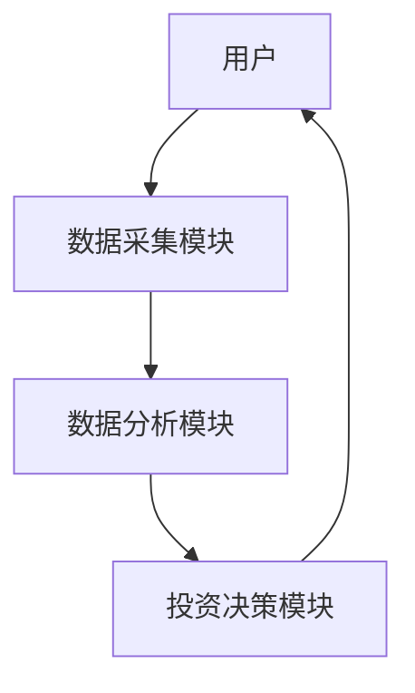
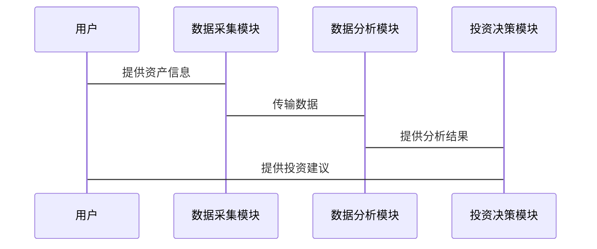

                 


# 价值投资的核心原则：安全边际

## 关键词：价值投资、安全边际、内在价值、投资决策、风险管理

## 摘要：  
价值投资是一种以基本面分析为基础的投资策略，其核心原则之一是安全边际。安全边际通过在低于内在价值的价格买入资产，降低了投资风险并提高了长期收益的稳定性。本文将详细探讨安全边际的理论基础、计算方法及其在投资决策中的实际应用，结合数学模型和系统架构设计方案，帮助读者全面理解这一原则。

---

## 第1章：价值投资与安全边际概述

### 1.1 价值投资的背景与意义

#### 1.1.1 投资的本质与目标  
投资的本质是通过合理配置资源，实现资产的保值与增值。投资者的目标是在风险可控的前提下，获得超越市场平均水平的回报。  

#### 1.1.2 价值投资的起源与发展  
价值投资由本杰明·格雷厄姆和戴维·多德提出，强调以低于资产内在价值的价格买入，长期持有。其核心理念是寻找市场低估的资产，并通过安全边际保护投资本金。  

#### 1.1.3 安全边际在价值投资中的重要性  
安全边际是价值投资的核心原则之一，它通过为投资提供“缓冲区”，降低了市场波动和估值错误带来的风险。  

### 1.2 安全边际的核心概念

#### 1.2.1 安全边际的定义与作用  
安全边际 = 内在价值 - 市场价格  
其作用是通过价格折扣降低投资风险，确保在合理范围内实现盈利。  

#### 1.2.2 安全边际与投资风险的关系  
更高的安全边际意味着更低的投资风险。在市场波动中，安全边际为投资者提供了更大的容错空间。  

#### 1.2.3 安全边际的计算方法  
安全边际 = 内在价值 - 市场价格  
其中，内在价值需要通过现金流折现法等方法计算得出。  

---

## 第2章：价值投资的理论基础

### 2.1 市场的有效性与非有效性

#### 2.1.1 市场有效性的定义与分类  
市场有效性分为强有效、弱有效和半有效。在强有效市场中，价格反映所有可获取信息，但在弱有效市场中，价格可能偏离内在价值。  

#### 2.1.2 非有效市场中的投资机会  
在非有效市场中，资产价格可能被高估或低估，价值投资者通过寻找被低估的资产获得超额收益。  

#### 2.1.3 安全边际在非有效市场中的应用  
安全边际在非有效市场中尤为重要，投资者需要通过深入分析找到低估的资产，并计算其安全边际。  

### 2.2 股票的内在价值评估

#### 2.2.1 内在价值的定义与计算方法  
内在价值是基于公司基本面因素（如现金流、盈利能力、成长性）计算的未来现金流的现值。  

#### 2.2.2 股东权益与现金流的分析  
通过分析公司股权价值和现金流，可以更准确地评估其内在价值。  

#### 2.2.3 市盈率与市净率的比较  
市盈率 = 股价 / 每股收益  
市净率 = 股价 / 每股净资产  
两者均可用于评估资产的估值是否合理。  

---

## 第3章：安全边际的核心原理

### 3.1 安全边际的理论基础

#### 3.1.1 安全边际的数学模型  
$$\text{安全边际} = \text{内在价值} - \text{市场价格}$$  
其中，内在价值的计算公式为：  
$$\text{内在价值} = \sum_{t=1}^{n} \frac{\text{现金流}}{(1 + r)^t}$$  
其中，r为折现率，n为预测期。  

#### 3.1.2 安全边际的属性特征对比  
| 属性       | 安全边际高的资产 | 安全边际低的资产 |
|------------|------------------|------------------|
| 风险        | 低               | 高               |
| 收益潜力    | 中高             | 低               |
| 估值错误    | 容错空间大       | 容错空间小       |

#### 3.1.3 安全边际的ER实体关系图  
```mermaid
erDiagram
    股票 {
        <属性>
        市场价格
        内在价值
        安全边际
    }
    公司 {
        <属性>
        股东权益
        现金流
        盈利能力
    }
    股票 <---- 关联 ----> 公司
    股票 <---- 关联 ----> 市场
```

---

## 第4章：安全边际的算法原理

### 4.1 安全边际的评估流程

#### 4.1.1 评估步骤  
1. 计算资产的内在价值。  
2. 确定市场价格。  
3. 计算安全边际。  

#### 4.1.2 算法流程图  
```mermaid
graph TD
    A[开始] -> B[计算内在价值]
    B -> C[确定市场价格]
    C -> D[计算安全边际]
    D -> E[结束]
```

### 4.2 内在价值计算的Python实现

#### 4.2.1 现金流折现法的代码实现  
```python
def calculate_intrinsic_value(cash_flows, discount_rate):
    present_value = sum(cash_flow / (1 + discount_rate) ** t for t, cash_flow in enumerate(cash_flows))
    return present_value

# 示例
cash_flows = [100, 150, 200]  # 假设现金流分别为100, 150, 200
discount_rate = 0.10  # 折现率10%
iv = calculate_intrinsic_value(cash_flows, discount_rate)
print(f"内在价值：${iv:.2f}")
```

#### 4.2.2 安全边际计算的代码实现  
```python
def calculate_margin_of_safety(intrinsic_value, market_price):
    return intrinsic_value - market_price

# 示例
iv = 200  # 内在价值
mp = 150  # 市场价格
mos = calculate_margin_of_safety(iv, mp)
print(f"安全边际：${mos:.2f}")
```

---

## 第5章：安全边际的系统分析与架构设计方案

### 5.1 系统功能设计

#### 5.1.1 系统功能模块  
- 数据采集：获取资产的市场数据和基本面数据。  
- 数据分析：计算内在价值和安全边际。  
- 投资决策：根据安全边际提供投资建议。  

#### 5.1.2 领域模型类图  


### 5.2 系统架构设计

#### 5.2.1 系统架构图  


#### 5.2.2 系统接口设计  
- 数据接口：与数据源（如金融数据库）连接，获取资产数据。  
- 用户接口：提供输入参数和结果显示。  

#### 5.2.3 系统交互流程图  


---

## 第6章：安全边际的项目实战

### 6.1 环境安装与配置

#### 6.1.1 安装Python与相关库  
```bash
pip install numpy pandas matplotlib
```

### 6.2 核心代码实现

#### 6.2.1 内在价值计算  
```python
import numpy as np

def calculate_intrinsic_value(cash_flows, discount_rate):
    return np.npv(discount_rate, cash_flows)
```

#### 6.2.2 安全边际计算  
```python
def calculate_margin_of_safety(iv, mp):
    return iv - mp
```

#### 6.2.3 数据可视化  
```python
import matplotlib.pyplot as plt

# 示例数据
prices = [100, 90, 80, 70, 60]
ivs = [100, 110, 120, 130, 140]
plt.plot(prices, label='市场价格')
plt.plot(ivs, label='内在价值')
plt.xlabel('时间')
plt.ylabel('价值')
plt.legend()
plt.show()
```

### 6.3 实际案例分析

#### 6.3.1 案例背景  
假设某公司股票的市场价格为50元，内在价值为60元。  

#### 6.3.2 计算安全边际  
$$\text{安全边际} = 60 - 50 = 10\text{元}$$  

#### 6.3.3 投资建议  
由于安全边际为10元，建议买入该股票，因为其市场价格低于内在价值。  

---

## 第7章：总结与展望

### 7.1 最佳实践 tips

- **长期持有**：安全边际高的资产适合长期持有，避免频繁交易。  
- **分散投资**：通过分散投资降低单一资产的风险。  
- **持续学习**：市场变化快，需不断更新知识和技能。  

### 7.2 小结

安全边际是价值投资的核心原则，通过在低于内在价值的价格买入资产，投资者可以有效降低风险并实现稳定收益。  

### 7.3 注意事项

- 安全边际并非绝对，需结合市场环境和其他因素综合考虑。  
- 内在价值的计算需要基于可靠的财务数据和合理的假设。  

### 7.4 拓展阅读

- 格雷厄姆的《证券分析》  
- 巴菲特的《巴菲特致股东的信》  

---

## 作者：AI天才研究院 & 禅与计算机程序设计艺术

