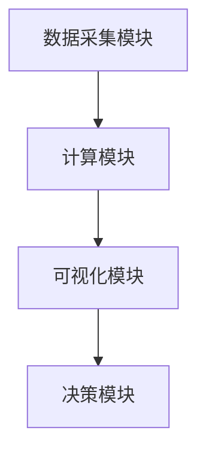

                 


# 价值投资的核心原则：安全边际理论

> 关键词：价值投资、安全边际、投资决策、内在价值、市场波动

> 摘要：本文深入探讨了价值投资中的核心原则——安全边际理论。通过系统的背景介绍、核心概念解析、数学模型分析、算法实现和实际案例研究，本文详细阐述了安全边际在投资决策中的重要性及其应用方法。文章不仅提供了理论支持，还通过Python代码和Mermaid图示，展示了如何在实际操作中应用安全边际理论，以降低投资风险并提高投资回报。

---

## 第一部分：价值投资的背景与基础

### 第1章：价值投资的背景与基础

#### 1.1 价值投资的基本概念

##### 1.1.1 投资的基本定义与分类

投资是指将资金投入某个领域以期望获得收益的行为。根据投资对象的不同，可以将投资分为以下几类：

- **股票投资**：通过购买公司股份，期望获得股息收益和资本增值。
- **债券投资**：通过购买政府或企业发行的债券，期望获得固定的利息收益。
- **房地产投资**：通过购买房地产，期望获得租金收益和资本增值。
- **其他投资**：包括艺术品、贵金属等。

##### 1.1.2 价值投资的起源与发展

价值投资是一种以基本面分析为基础的投资策略，其核心在于寻找市场价格低于其内在价值的资产。这一理论起源于20世纪初，由本杰明·格雷厄姆（Benjamin Graham）和戴维·多德（David Dodd）提出。格雷厄姆的学生沃伦·巴菲特（Warren Buffett）进一步发展了这一理论，并使其成为现代投资学的重要组成部分。

##### 1.1.3 安全边际理论的提出与核心思想

安全边际理论是价值投资的核心原则之一。格雷厄姆提出，投资者应该以低于资产内在价值的价格购买资产，以确保在市场价格波动时能够避免损失并获得长期收益。安全边际的大小决定了投资的安全性，即市场价格与内在价值之间的差距越大，投资的安全边际越高。

---

#### 1.2 安全边际的定义与作用

##### 1.2.1 安全边际的定义

安全边际是指市场价格与内在价值之间的差异。具体来说，安全边际 = 内在价值 - 市场价格。当市场价格低于内在价值时，资产具有安全边际，这意味着投资者能够以低于其实际价值的价格购买资产，从而在市场价格波动时获得保护。

##### 1.2.2 安全边际在投资中的作用

安全边际在投资中起着关键作用，主要体现在以下几个方面：

1. **降低投资风险**：通过购买具有安全边际的资产，投资者可以降低因市场价格波动而造成的损失。
2. **提高投资收益**：安全边际较高的资产通常具有较大的上涨潜力，能够在市场复苏时带来更高的收益。
3. **提供心理保护**：安全边际为投资者提供了心理上的保护，使他们在市场下跌时能够保持冷静。

##### 1.2.3 安全边际与投资风险的关系

安全边际与投资风险呈负相关关系。安全边际越高，投资风险越低；反之，安全边际越低，投资风险越高。因此，在选择投资标的时，投资者应优先考虑具有较高安全边际的资产。

---

## 第二部分：安全边际的核心概念与计算方法

### 第2章：安全边际的核心概念与计算方法

#### 2.1 安全边际的计算公式

##### 2.1.1 内在价值的计算公式

内在价值是资产在理性市场中的公允价值，通常通过基本面分析得出。对于股票而言，内在价值可以通过以下公式计算：

$$
\text{内在价值} = \frac{\text{预期现金流}}{\text{折现率}}
$$

##### 2.1.2 安全边际率的计算公式

安全边际率是指市场价格与内在价值之间的差异占市场价格的比例。其计算公式为：

$$
\text{安全边际率} = \frac{\text{内在价值} - \text{市场价格}}{\text{市场价格}}
$$

##### 2.1.3 安全边际金额的计算方法

安全边际金额是指市场价格与内在价值之间的差异。其计算公式为：

$$
\text{安全边际金额} = \text{内在价值} - \text{市场价格}
$$

---

#### 2.2 安全边际的评估与应用

##### 2.2.1 安全边际的评估指标

安全边际的评估指标包括：

1. **安全边际率**：衡量市场价格与内在价值之间的差异占市场价格的比例。
2. **安全边际金额**：衡量市场价格与内在价值之间的绝对差异。
3. **市场波动**：考虑市场价格波动对安全边际的影响。

##### 2.2.2 安全边际与市场波动的关系

市场波动会影响安全边际的大小。在市场下跌时，安全边际会增加；在市场上涨时，安全边际会减少。因此，投资者需要动态调整安全边际的评估指标。

##### 2.2.3 安全边际在不同市场环境下的应用

在不同市场环境下，安全边际的应用策略有所不同：

- **牛市**：市场上涨，安全边际减少，投资者应谨慎选择标的。
- **熊市**：市场下跌，安全边际增加，投资者应积极寻找具有高安全边际的标的。

---

### 第3章：安全边际的理论基础与数学模型

#### 3.1 安全边际的数学模型

##### 3.1.1 内在价值的计算模型

内在价值的计算模型可以通过以下步骤进行：

1. **预测未来现金流**：根据公司的财务状况和行业前景，预测未来几年的现金流。
2. **确定折现率**：根据市场利率和风险偏好，确定合适的折现率。
3. **计算内在价值**：将未来现金流折现，得到内在价值。

##### 3.1.2 安全边际的计算模型

安全边际的计算模型可以通过以下步骤进行：

1. **计算内在价值**：根据公司基本面分析，计算其内在价值。
2. **确定市场价格**：获取当前市场价格。
3. **计算安全边际**：根据公式，计算安全边际金额和安全边际率。

##### 3.1.3 市场价格与内在价值的比较

市场价格与内在价值的比较可以通过以下步骤进行：

1. **计算内在价值**：根据公司基本面分析，计算其内在价值。
2. **获取市场价格**：通过市场数据获取当前市场价格。
3. **比较结果**：如果市场价格低于内在价值，则资产具有安全边际；否则，资产没有安全边际。

---

#### 3.2 安全边际的经济意义

##### 3.2.1 安全边际与投资风险的关系

安全边际越高，投资风险越低。这是因为安全边际提供了市场价格波动的缓冲空间，使得投资者能够在市场下跌时避免损失。

##### 3.2.2 安全边际与投资收益的关系

安全边际较高的资产通常具有较大的上涨潜力。这是因为内在价值较高的资产在市场复苏时能够带来更高的收益。

##### 3.2.3 安全边际在投资决策中的应用

安全边际在投资决策中的应用主要体现在以下几点：

- **选择投资标的**：优先选择具有较高安全边际的资产。
- **动态调整投资组合**：根据市场价格波动，动态调整安全边际的评估指标。
- **长期投资策略**：通过长期持有具有高安全边际的资产，实现稳定的收益。

---

## 第三部分：安全边际的系统分析与架构设计

### 第4章：安全边际的系统分析与架构设计

#### 4.1 安全边际的系统分析

##### 4.1.1 安全边际的评估流程

安全边际的评估流程可以通过以下步骤进行：

1. **数据收集**：收集公司的财务数据和市场数据。
2. **计算内在价值**：根据基本面分析，计算内在价值。
3. **计算安全边际**：根据公式，计算安全边际金额和安全边际率。
4. **比较结果**：判断市场价格与内在价值的关系，确定安全边际的高低。

##### 4.1.2 安全边际的计算模块

安全边际的计算模块包括以下功能：

- **数据输入**：输入公司财务数据和市场数据。
- **内在价值计算**：根据公式，计算内在价值。
- **安全边际计算**：根据公式，计算安全边际金额和安全边际率。
- **结果输出**：输出安全边际的评估结果。

##### 4.1.3 安全边际的可视化展示

安全边际的可视化展示可以通过以下方式实现：

- **图表展示**：使用折线图或柱状图展示内在价值和市场价格的变化。
- **仪表盘**：通过仪表盘展示安全边际率和安全边际金额的实时变化。

---

#### 4.2 安全边际的系统架构

##### 4.2.1 系统功能设计

安全边际的系统架构包括以下功能模块：

1. **数据采集模块**：负责采集公司财务数据和市场数据。
2. **计算模块**：负责计算内在价值和安全边际。
3. **可视化模块**：负责展示安全边际的评估结果。
4. **决策模块**：根据评估结果，生成投资决策建议。

##### 4.2.2 系统架构图

以下是安全边际系统的架构图：



##### 4.2.3 系统接口设计

安全边际系统的接口设计包括：

- **输入接口**：用于输入公司财务数据和市场数据。
- **输出接口**：用于输出安全边际的评估结果。
- **决策接口**：用于生成投资决策建议。

---

## 第四部分：安全边际的项目实战

### 第5章：安全边际的项目实战

#### 5.1 项目背景与目标

##### 5.1.1 项目背景

本项目旨在通过实际案例分析，验证安全边际理论在投资决策中的应用效果。我们选择一家上市公司作为研究对象，分析其财务数据和市场数据，计算其安全边际，并制定投资策略。

##### 5.1.2 项目目标

1. 计算公司的内在价值。
2. 计算公司的安全边际。
3. 根据安全边际评估结果，制定投资策略。

##### 5.1.3 项目范围

本项目仅限于对一家上市公司的财务数据和市场数据进行分析，不涉及其他类型资产的投资分析。

---

#### 5.2 项目实施与代码实现

##### 5.2.1 环境配置

为了实现本项目，我们需要以下环境配置：

- **操作系统**：Windows 10 或更高版本。
- **编程语言**：Python 3.8 或更高版本。
- **开发工具**：PyCharm 或其他Python开发工具。
- **数据源**：公司财务数据和市场数据。

##### 5.2.2 数据收集与处理

首先，我们需要收集公司的财务数据和市场数据。以下是数据收集的步骤：

1. **收集公司财务数据**：包括收入、利润、现金流等。
2. **收集市场数据**：包括市场价格、行业指数等。

##### 5.2.3 安全边际的计算与分析

接下来，我们根据收集到的数据，计算公司的内在价值和安全边际。

1. **计算内在价值**：根据基本面分析，计算公司的内在价值。
2. **计算安全边际**：根据公式，计算安全边际金额和安全边际率。

##### 5.2.4 Python代码实现

以下是安全边际计算的Python代码示例：

```python
# 安全边际计算示例代码
import pandas as pd

# 数据输入
market_price = 50.0  # 市场价格
intrinsic_value = 60.0  # 内在价值

# 安全边际计算
margin_of_safety_amount = intrinsic_value - market_price  # 安全边际金额
margin_of_safety_rate = (intrinsic_value - market_price) / market_price  # 安全边际率

# 结果输出
print("安全边际金额:", margin_of_safety_amount)
print("安全边际率:", margin_of_safety_rate)
```

---

## 第五部分：安全边际的最佳实践与小结

### 第6章：安全边际的最佳实践与小结

#### 6.1 最佳实践 tips

1. **长期投资**：安全边际理论更适合长期投资，因为短期市场波动可能会影响安全边际的评估结果。
2. **动态调整**：根据市场价格波动，动态调整安全边际的评估指标。
3. **分散投资**：通过分散投资，降低单一资产的风险。
4. **深入研究**：在投资前，进行深入的研究和分析，确保对标的资产有充分的了解。

#### 6.2 小结

安全边际理论是价值投资的核心原则之一。通过计算市场价格与内在价值之间的差异，投资者可以评估投资的安全性，并在市场波动中保护自己的投资。然而，安全边际理论的应用需要结合实际情况，根据市场环境和资产特性进行动态调整。

---

## 作者信息

作者：AI天才研究院/AI Genius Institute & 禅与计算机程序设计艺术 /Zen And The Art of Computer Programming

---

通过以上内容，我们详细探讨了价值投资中的安全边际理论，从背景介绍到实际应用，为投资者提供了理论支持和实践指导。希望本文能够帮助读者更好地理解安全边际理论，并在实际投资中灵活运用。

