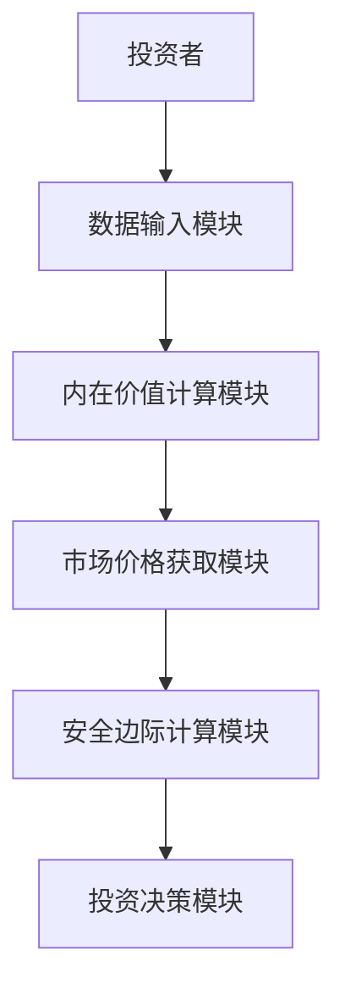
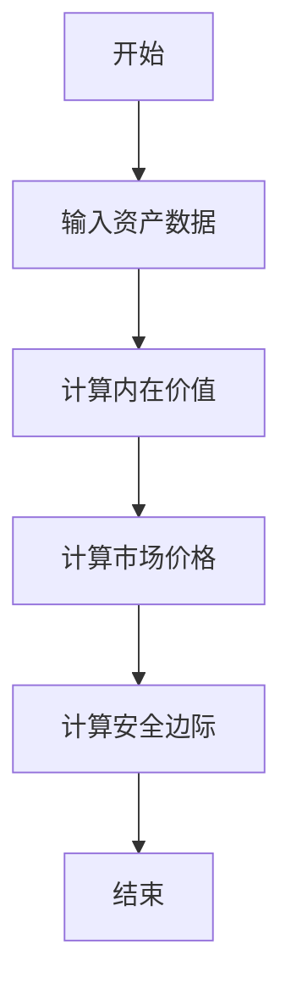

                 


# 价值投资的核心原则：安全边际理论解析

## 关键词：价值投资，安全边际，巴菲特，投资策略，风险管理

## 摘要：  
价值投资是一种以基本面分析为基础的投资策略，其核心在于寻找市场价格低于内在价值的资产。安全边际理论是价值投资的重要组成部分，它通过计算内在价值和市场价格之间的差异，帮助投资者降低风险并实现长期稳定的收益。本文将深入解析安全边际理论的核心原理，探讨其在投资决策中的实际应用，并通过系统架构和算法设计，展示如何在现代投资实践中有效应用这一理论。

---

## 第一部分: 价值投资的核心概念与安全边际理论基础

### 第1章: 价值投资的起源与发展

#### 1.1 价值投资的起源
##### 1.1.1 价值投资的定义与核心理念  
价值投资是一种以基本面分析为基础的投资策略，强调以低于资产内在价值的价格买入资产。其核心理念是通过分析企业的财务状况、行业地位和竞争优势，找到具有长期增长潜力的优质资产。与短期市场波动相比，价值投资者更关注企业的内在价值。

##### 1.1.2 巴菲特与格雷厄姆的价值投资体系  
价值投资的理论基础主要来源于本杰明·格雷厄姆和戴维·多德的著作，而巴菲特则是将这一理论发扬光大的代表人物。格雷厄姆提出“安全边际”概念，强调在投资中留有余地，避免承担过高的风险。

##### 1.1.3 价值投资在现代投资学中的地位  
价值投资与技术分析、趋势投资等其他投资策略不同，它更注重企业的基本面分析。尽管在短期内市场波动可能会影响股价，但长期来看，企业的内在价值将主导其股价表现。

---

#### 1.2 安全边际理论的定义与核心要素
##### 1.2.1 安全边际的定义  
安全边际是指资产的市场价格与内在价值之间的差额。具体来说，安全边际 = 内在价值 - 市场价格。当市场价格低于内在价值时，资产具有投资价值，安全边际越大，投资风险越小。

##### 1.2.2 安全边际的核心要素  
- **内在价值**：资产的真实价值，基于其未来现金流的现值计算得出。
- **市场价格**：资产在市场上的交易价格。
- **安全边际宽度**：内在价值与市场价格之间的差额，反映了投资的安全程度。

##### 1.2.3 安全边际与投资风险的关系  
安全边际越大，投资者在市场价格波动中承受的风险越小。当市场价格因市场情绪波动而偏离内在价值时，拥有安全边际的投资者能够避免损失，并在市场回归理性后获得收益。

---

## 第二部分: 安全边际理论的系统分析与架构设计

### 第4章: 安全边际理论的系统架构

#### 4.1 系统架构概述
##### 4.1.1 系统架构图  
以下是一个基于安全边际理论的投资分析系统的架构图：



##### 4.1.2 系统功能设计  
- **数据输入模块**：接收企业的财务数据、行业信息和市场数据。
- **内在价值计算模块**：基于现金流折现法计算企业的内在价值。
- **市场价格获取模块**：从市场数据源获取资产的当前市场价格。
- **安全边际计算模块**：计算内在价值与市场价格之间的差额。
- **投资决策模块**：根据安全边际的宽度，生成买入、持有或卖出的决策信号。

---

### 第5章: 安全边际的算法原理与实现

#### 5.1 安全边际计算算法
##### 5.1.1 算法流程图  
以下是一个安全边际计算算法的流程图：



##### 5.1.2 算法实现代码  
以下是一个简单的安全边际计算代码示例：

```python
def calculate_intrinsic_value(enterprise_value, free_cash_flow, discount_rate, growth_rate):
    return free_cash_flow / (discount_rate - growth_rate)

def calculate_market_price(asset, data_source):
    return data_source.get_price(asset)

def calculate_margin_of_safety(intrinsic_value, market_price):
    return intrinsic_value - market_price

# 示例使用
data_source = {"AAPL": 150}  # 假设苹果的市场价格为150美元
enterprise_value = 200
free_cash_flow = 10
discount_rate = 0.1
growth_rate = 0.05

intrinsic_value = calculate_intrinsic_value(enterprise_value, free_cash_flow, discount_rate, growth_rate)
market_price = calculate_market_price("AAPL", data_source)
margin_of_safety = calculate_margin_of_safety(intrinsic_value, market_price)

print(f"内在价值: ${intrinsic_value}")
print(f"市场价格: ${market_price}")
print(f"安全边际: ${margin_of_safety}")
```

---

## 第三部分: 项目实战与总结

### 第6章: 项目实战

#### 6.1 项目环境安装
为了实现安全边际计算系统，我们需要以下工具：
- Python编程语言
- 数据分析库（如Pandas、NumPy）
- 数据可视化库（如Matplotlib、Seaborn）
- 数据源接口（如Yahoo Finance API）

#### 6.2 核心实现源代码
以下是一个完整的安全边际计算系统的实现代码：

```python
import pandas as pd
import numpy as np
import requests

def get_stock_data(ticker):
    url = f"https://query1.finance.yahoo.com/v8/finance/chart/{ticker}"
    response = requests.get(url)
    data = response.json()
    return data

def calculate_intrinsic_value(enterprise_value, free_cash_flow, discount_rate, growth_rate):
    return free_cash_flow / (discount_rate - growth_rate)

def calculate_market_price(data):
    return data['chart']['result'][0]['meta']['regularMarketPrice']

def calculate_margin_of_safety(intrinsic_value, market_price):
    return intrinsic_value - market_price

# 示例使用
ticker = "AAPL"
data = get_stock_data(ticker)
enterprise_value = 200
free_cash_flow = 10
discount_rate = 0.1
growth_rate = 0.05

intrinsic_value = calculate_intrinsic_value(enterprise_value, free_cash_flow, discount_rate, growth_rate)
market_price = calculate_market_price(data)
margin_of_safety = calculate_margin_of_safety(intrinsic_value, market_price)

print(f"苹果公司的内在价值: ${intrinsic_value}")
print(f"当前市场价格: ${market_price}")
print(f"安全边际: ${margin_of_safety}")
```

#### 6.3 案例分析
以苹果公司为例，假设其企业价值为200亿美元，自由现金流为10亿美元，折现率为10%，增长率5%。计算其内在价值和安全边际：

- 内在价值 = 10 / (0.1 - 0.05) = 200亿美元
- 市场价格 = 150美元
- 安全边际 = 200 - 150 = 50美元

这意味着苹果公司的股价具有50美元的安全边际，具有较高的投资价值。

---

## 第四部分: 总结与展望

### 第7章: 总结与展望

#### 7.1 总结  
安全边际理论是价值投资的核心原则，它通过计算内在价值与市场价格的差异，帮助投资者降低风险并实现长期稳定的收益。本文通过系统架构和算法设计，展示了如何在现代投资实践中有效应用这一理论。

#### 7.2 展望  
未来，随着人工智能和大数据技术的发展，安全边际理论将更加精准和高效。投资者可以利用机器学习算法，进一步优化内在价值计算和市场价格预测，从而提升投资决策的准确性。

#### 7.3 最佳实践 tips  
- **长期投资**：价值投资强调长期持有优质资产，避免频繁交易。
- **分散投资**：通过分散投资降低风险，避免过度集中于单一资产。
- **持续学习**：市场环境不断变化，投资者需要持续学习和调整投资策略。

---

## 作者：AI天才研究院/AI Genius Institute & 禅与计算机程序设计艺术 /Zen And The Art of Computer Programming

---

通过本文的系统分析和实践案例，读者可以深入理解安全边际理论的核心原理，并将其应用于实际投资决策中。无论是从理论深度还是实践应用，安全边际理论都是价值投资中不可或缺的重要工具。

