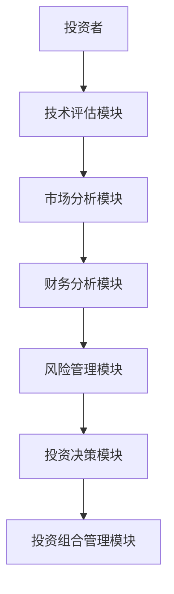
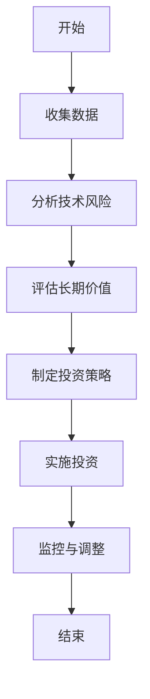
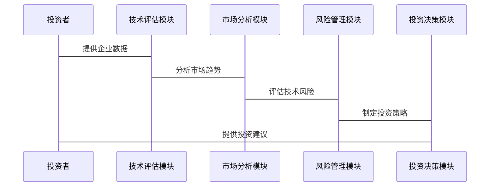

                 


```markdown
# 价值投资者如何应对技术颠覆和行业变革

## 关键词
价值投资，技术颠覆，行业变革，投资策略，风险管理

## 摘要
技术的迅速发展正在重塑 industries，价值投资者必须适应这些变化，调整其策略以应对技术颠覆带来的挑战。本文探讨了技术如何影响 industries，提供了应对技术变革的核心策略，包括技术评估、投资组合管理和风险管理等方面。

## 第1章: 技术颠覆与行业变革的背景

### 1.1 技术颠覆的现状与趋势
#### 1.1.1 数字化与技术变革的加速
当前，技术进步的速度显著加快，数字化转型正在重塑 industries。例如，人工智能、区块链和大数据等技术正在改变传统的商业模式和价值链条。技术的快速迭代使得 industries 面临前所未有的挑战和机会。

#### 1.1.2 技术颠覆对企业与行业的核心影响
技术颠覆不仅改变了企业的运营方式，还影响了整个行业的结构。例如，互联网技术的普及导致传统零售业的衰退，而电子商务平台的崛起则重新定义了零售行业的价值链条。

#### 1.1.3 技术变革对投资策略的挑战
技术变革对投资者的策略提出了新的要求。传统的价值投资方法需要结合技术因素进行调整，以更好地应对技术颠覆带来的市场变化。

### 1.2 价值投资的基本原理
#### 1.2.1 价值投资的核心概念
价值投资是一种以内在价值为导向的投资策略，强调以低于内在价值的价格购买优质资产。其核心在于识别具有持续竞争优势和良好管理的企业。

#### 1.2.2 价值投资与技术变革的结合
技术变革为价值投资提供了新的维度。投资者需要评估技术对企业的长期影响，包括技术的创新能力和对行业竞争格局的改变。

#### 1.2.3 价值投资的长期视角与风险管理
价值投资强调长期视角，但技术变革的不确定性要求投资者具备动态调整策略的能力，同时注重风险管理，以应对技术颠覆带来的潜在风险。

## 第2章: 技术颠覆对行业的影响

### 2.1 行业颠覆的典型案例分析
#### 2.1.1 互联网对传统零售业的颠覆
互联网技术的普及导致传统零售业的衰退，电子商务平台的崛起重新定义了零售行业的价值链条。

#### 2.1.2 人工智能对金融行业的冲击
人工智能技术的应用正在改变金融行业的运作方式，自动化交易和智能投顾服务逐渐取代传统的人工操作。

#### 2.1.3 区块链对传统金融体系的挑战
区块链技术的兴起威胁到了传统金融体系的基础设施，可能引发金融行业核心业务模式的变革。

### 2.2 技术颠覆对行业结构的核心影响
#### 2.2.1 技术如何改变行业竞争格局
技术革新可能导致行业竞争格局的变化，新兴技术的采用者可能占据竞争优势，而未能及时转型的企业可能被淘汰。

#### 2.2.2 技术对行业成本结构的优化
技术的应用可以优化企业的成本结构，例如自动化技术可以降低生产成本，数据分析技术可以提高运营效率。

#### 2.2.3 技术对行业价值链的重构
技术颠覆可能导致行业价值链的重构，新的价值创造方式和价值分配模式可能取代传统的做法。

## 第3章: 价值投资者应对技术变革的核心策略

### 3.1 价值投资者的核心能力
#### 3.1.1 技术分析能力的培养
价值投资者需要具备技术分析能力，能够评估技术对企业的长期影响，包括技术的创新能力和对行业竞争格局的改变。

#### 3.1.2 风险评估与应对策略
投资者需要具备风险评估能力，能够识别技术变革带来的潜在风险，并制定相应的应对策略，以降低投资组合的波动性。

#### 3.1.3 长期价值判断的准确性
价值投资者需要准确判断企业在长期的技术变革中的价值，选择那些能够持续创造价值的企业进行投资。

### 3.2 价值投资中的技术评估方法
#### 3.2.1 技术评估的核心指标
投资者需要关注企业的技术储备、研发投入、技术团队的能力、技术专利的数量和质量等因素，以评估企业的技术实力。

#### 3.2.2 技术风险的量化分析
通过量化分析技术风险，投资者可以更好地评估技术对投资标的潜在影响，并据此调整投资策略。

#### 3.2.3 技术对投资标的长期价值的影响
技术的应用可能改变企业的盈利模式和增长潜力，投资者需要评估技术对企业的长期价值创造能力的影响。

## 第4章: 技术颠覆下的投资组合管理

### 4.1 投资组合的动态调整
#### 4.1.1 技术变革对投资组合的影响
技术变革可能改变行业的竞争格局，影响企业的盈利能力，从而影响投资组合的收益和风险。

#### 4.1.2 投资组合的再平衡策略
投资者需要定期审视投资组合，根据技术变革的情况进行再平衡，以维持投资组合的风险收益平衡。

#### 4.1.3 技术风险的分散化管理
通过分散投资，投资者可以降低单一技术风险对投资组合的影响，从而更好地应对技术颠覆带来的潜在风险。

### 4.2 价值投资者的资产配置策略
#### 4.2.1 不同行业的技术颠覆风险评估
投资者需要评估不同行业的技术颠覆风险，选择那些具有较低技术风险或能够有效应对技术变革的行业进行投资。

#### 4.2.2 资产配置中的技术因素权重
技术因素在资产配置中的权重需要根据市场和技术变革的情况进行动态调整，以反映技术对不同资产的影响。

#### 4.2.3 技术颠覆下的防御性投资策略
投资者可以采取防御性策略，选择那些在技术变革中具有较强防御能力的资产，以降低投资组合的波动性。

## 第5章: 价值投资中的风险管理与应对策略

### 5.1 技术风险的识别与评估
#### 5.1.1 技术风险的来源与特征
技术风险主要来源于技术本身的不确定性和技术应用的不确定性，投资者需要识别这些风险并评估其潜在影响。

#### 5.1.2 技术风险的量化方法
通过建立量化模型，投资者可以量化技术风险对投资标的潜在影响，从而更好地进行风险管理和投资决策。

#### 5.1.3 技术风险对投资组合的影响
技术风险可能影响投资组合的收益和风险，投资者需要评估这些影响，并采取相应的风险管理措施。

### 5.2 风险管理的系统化方法
#### 5.2.1 风险管理框架的构建
投资者需要构建系统化的风险管理框架，包括风险识别、风险评估、风险应对和风险监控等环节。

#### 5.2.2 技术风险的监控与预警
通过建立技术风险的监控机制，投资者可以及时发现潜在风险，并采取预警措施，以降低风险的影响。

#### 5.2.3 技术风险的应对策略
投资者可以根据风险的性质和严重程度，采取相应的应对策略，包括风险规避、风险降低、风险转移和风险接受等。

## 第6章: 项目实战与最佳实践

### 6.1 项目实战
#### 6.1.1 项目背景与目标
选择一个具体的行业，例如金融科技，分析技术变革对该行业的影响，制定相应的投资策略。

#### 6.1.2 数据收集与分析
收集相关数据，分析企业的技术储备、市场表现、财务状况等，评估企业的长期价值。

#### 6.1.3 投资策略的制定与实施
根据分析结果，制定相应的投资策略，选择具有长期价值的企业进行投资，并进行动态调整。

### 6.2 最佳实践
#### 6.2.1 投资者的核心能力培养
投资者需要不断提升技术分析能力，关注行业动态，了解技术变革对企业的影响。

#### 6.2.2 风险管理的重要性
在技术变革的环境下，投资者需要重视风险管理，建立系统化的风险管理机制，以应对潜在的技术风险。

#### 6.2.3 长期视角的重要性
价值投资者需要保持长期视角，关注企业的长期价值创造能力，避免短期波动的干扰。

## 结语

技术的迅速发展正在重塑 industries，价值投资者必须适应这些变化，调整其策略以应对技术颠覆带来的挑战。通过系统的分析和动态的调整，价值投资者可以在技术变革中把握机会，规避风险，实现长期稳健的投资回报。

## 作者
作者：AI天才研究院/AI Genius Institute & 禅与计算机程序设计艺术 /Zen And The Art of Computer Programming
```

# 附录

## 附录A: 技术评估的核心指标
- 技术储备：企业的研发投入、技术专利数量、技术团队的能力等。
- 市场表现：企业的市场份额、市场地位、客户满意度等。
- 财务状况：企业的财务健康状况，包括盈利能力、资产负债情况等。
- 竞争优势：企业的核心竞争力、竞争优势、技术壁垒等。

## 附录B: 风险管理框架
1. **风险识别**：识别潜在的技术风险，评估其可能的影响。
2. **风险评估**：量化技术风险的可能性和影响程度。
3. **风险应对**：制定应对策略，包括风险规避、降低、转移和接受。
4. **风险监控**：持续监控技术风险的变化，及时调整应对策略。

## 附录C: 技术风险的量化模型
$$
\text{技术风险指数} = \sum_{i=1}^{n} w_i \times r_i
$$
其中，$w_i$ 是第$i$个风险因素的权重，$r_i$ 是第$i$个风险因素的风险程度。

## 附录D: 系统架构图


## 附录E: 算法流程图


## 附录F: Python代码示例
```python
import pandas as pd
import numpy as np

def calculate_technical_risk(factors):
    weights = [0.3, 0.2, 0.25, 0.25]
    risks = [factors[i] * weights[i] for i in range(len(weights))]
    return sum(risks)

# 示例数据
data = {
    '技术储备': [0.8, 0.6, 0.7],
    '市场表现': [0.7, 0.5, 0.6],
    '财务状况': [0.6, 0.4, 0.5],
    '竞争优势': [0.9, 0.7, 0.8]
}

df = pd.DataFrame(data)
risk_scores = []
for i in range(len(df)):
    risk = calculate_technical_risk([df.iloc[i]['技术储备'], df.iloc[i]['市场表现'], 
                                      df.iloc[i]['财务状况'], df.iloc[i]['竞争优势']])
    risk_scores.append(risk)

print("技术风险指数：", risk_scores)
```

## 附录G: 数学公式解释
$$
\text{技术风险指数} = \sum_{i=1}^{n} w_i \times r_i
$$
其中，$w_i$ 是第$i$个风险因素的权重，$r_i$ 是第$i$个风险因素的风险程度。该公式用于量化技术风险，帮助投资者评估技术变革对投资标的潜在影响。

## 附录H: 系统交互图


## 附录I: 项目小结
通过选择金融科技行业作为案例，我们展示了如何应用技术评估、市场分析和风险管理等方法进行投资决策。投资者需要动态调整策略，以应对技术变革带来的挑战，同时注重风险管理，确保投资组合的稳健性。

## 附录J: 拓展阅读
1. **技术分析与投资策略**：深入探讨技术分析在投资决策中的应用。
2. **风险管理工具与方法**：介绍多种风险管理工具和方法，帮助投资者更好地应对技术风险。
3. **行业动态与技术趋势**：分析不同行业和技术领域的最新动态，为投资者提供参考。
4. **长期投资策略**：探讨长期投资策略在技术变革中的应用，帮助投资者实现稳健收益。

通过系统的分析和动态的调整，价值投资者可以在技术变革中把握机会，规避风险，实现长期稳健的投资回报。
```

