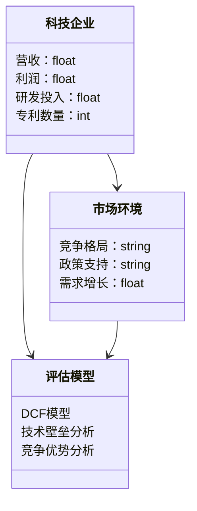

                 


# 价值投资者如何评估新兴科技行业

> 关键词：价值投资、新兴科技行业、DCF模型、科技估值、行业分析

> 摘要：新兴科技行业是价值投资者关注的重点领域之一。本文将从价值投资的核心理念出发，结合科技行业的特殊性，详细探讨如何对新兴科技行业进行评估。通过分析科技行业的财务指标、竞争格局、技术壁垒等关键因素，结合贴现现金流模型（DCF）等数学工具，为价值投资者提供一套系统化的评估框架。同时，本文还将通过具体案例分析，展示如何将理论应用于实际投资决策中。

---

## 第1章: 价值投资与科技行业的背景介绍

### 1.1 价值投资的基本原理

#### 1.1.1 价值投资的定义与核心理念
价值投资是一种以基本面分析为基础的投资策略，强调以低于内在价值的价格买入优质资产。其核心理念包括：
- **安全边际**：买入价格低于内在价值，确保投资的安全性。
- **长期视角**：关注企业的长期竞争优势和盈利能力。
- **市场先生**：利用市场情绪的波动性寻找低估的投资机会。

#### 1.1.2 价值投资与成长投资的区别
| 投资策略 | 价值投资 | 成长投资 |
|----------|----------|----------|
| 核心目标 | 寻找低估资产 | 寻找高增长潜力资产 |
| 估值方法 | 基于内在价值 | 基于未来增长率 |
| 风险偏好 | 低风险偏好 | 高风险偏好 |

#### 1.1.3 价值投资在不同市场环境下的应用
- **牛市**：寻找基本面良好但被高估的资产，避免追高。
- **熊市**：积极寻找低估资产，增加安全边际。

### 1.2 新兴科技行业的特点与挑战

#### 1.2.1 新兴科技行业的定义与范围
新兴科技行业通常指那些基于新技术或创新商业模式的行业，例如人工智能、区块链、量子计算等。这些行业具有以下特点：
- **高增长潜力**：技术创新可能带来指数级增长。
- **高不确定性**：技术商业化存在失败风险。
- **高竞争壁垒**：技术优势可能迅速被模仿。

#### 1.2.2 新兴科技行业的核心驱动力
- **技术创新**：技术进步是行业发展的主要动力。
- **政策支持**：政府政策和法规对行业发展有重要影响。
- **市场需求**：消费者需求的变化推动行业变革。

#### 1.2.3 新兴科技行业的周期性分析
科技行业通常经历以下周期：
1. **导入期**：技术初步成熟，市场需求小。
2. **成长期**：市场需求快速增长，企业竞争加剧。
3. **成熟期**：市场趋于饱和，竞争格局稳定。
4. **衰退期**：技术被替代，市场需求下降。

---

## 第2章: 科技行业价值评估的核心框架

### 2.1 科技行业的财务指标分析

#### 2.1.1 营业收入与利润分析
- **营业收入**：反映企业的市场地位和增长能力。
- **净利润**：衡量企业的盈利能力。
- **研发投入**：技术创新的核心保障。

#### 2.1.2 研发投入与技术壁垒
- **研发投入占比**：高研发投入通常意味着技术创新能力强。
- **技术壁垒**：高壁垒意味着竞争对手难以复制。

#### 2.1.3 财务健康状况评估
- **现金流**：企业维持运营和扩张的核心资金来源。
- **资产负债表**：评估企业的财务健康状况和偿债能力。

### 2.2 科技行业的竞争格局分析

#### 2.2.1 市场竞争结构
- **垄断竞争**：少数几家企业占据大部分市场份额。
- **完全竞争**：市场参与者众多，竞争激烈。

#### 2.2.2 行业集中度分析
- **CR5**（行业前五名的市场份额）：高集中度意味着市场稳定性强。

#### 2.2.3 关键技术与专利分析
- **专利数量**：反映企业的技术储备。
- **技术领先性**：专利的质量比数量更重要。

---

## 第3章: 价值评估的数学模型与算法

### 3.1 贴现现金流模型（DCF）的数学公式

#### 3.1.1 DCF模型的基本公式
$$
\text{企业价值} = \sum_{t=1}^{n} \frac{\text{现金流}_t}{(1 + r)^t} + \frac{\text{残值}}{(1 + r)^n}
$$
其中：
- $\text{现金流}_t$：第t年的现金流。
- $r$：折现率。
- $n$：预测期数。
- $\text{残值}$：终值或余值。

#### 3.1.2 现金流的计算方法
现金流通常包括：
- 营业收入。
- 付现成本。
- 税费支出。

#### 3.1.3 折现率的确定方法
折现率通常基于无风险利率和风险溢价。

---

## 第4章: 系统分析与架构设计

### 4.1 系统功能设计

#### 4.1.1 领域模型（mermaid类图）


### 4.2 系统架构设计（mermaid架构图）
```mermaid
archimate
Integration
Component(科技企业)
Component(市场环境)
Component(评估模型)
```

---

## 第5章: 项目实战与案例分析

### 5.1 环境安装
- **工具**：Python、Pandas、NumPy、Matplotlib。

### 5.2 核心实现代码

#### 5.2.1 DCF模型实现
```python
def calculate_dcf(revenue, growth_rate, discount_rate, period):
    cash_flows = []
    for t in range(period):
        cash_flow = revenue * (1 + growth_rate/100)**t
        cash_flows.append(cash_flow)
    present_value = sum([cf / (1 + discount_rate/100)**t for t, cf in enumerate(cash_flows)])
    return present_value

# 示例计算
revenue = 1000
growth_rate = 20
discount_rate = 8
period = 5
dcf_value = calculate_dcf(revenue, growth_rate, discount_rate, period)
print(f"DCF企业价值：{dcf_value}")
```

---

## 第6章: 总结与最佳实践

### 6.1 小结
新兴科技行业的价值评估需要结合技术、财务和市场多方面因素，DCF模型是常用的工具之一。

### 6.2 注意事项
- **数据质量**：确保财务数据的准确性和完整性。
- **模型假设**：合理假设现金流和折现率。

### 6.3 拓展阅读
- 格雷厄姆的《证券分析》。
- 巴菲特的《巴菲特致股东的信》。

---

作者：AI天才研究院 & 禅与计算机程序设计艺术

