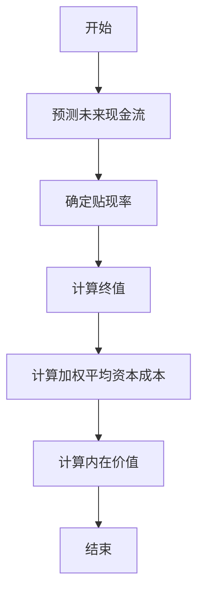

                 

# 价值投资者如何看待科技股

## 关键词：
- 价值投资、科技股、DCF模型、财务分析、竞争优势

## 摘要：
科技股作为推动现代经济的核心力量，其投资价值备受关注。本文从价值投资者的视角，深入分析科技股的投资逻辑、评估方法和风险管理策略，探讨如何在科技行业中寻找具备长期增长潜力的优质标的。

---

# 引言

## 1. 价值投资者如何看待科技股

科技股的高增长潜力与高波动性并存，价值投资者需要在技术创新、市场需求和财务健康之间找到平衡点。科技股的投资逻辑不同于传统行业，需要结合DCF模型、财务指标和竞争优势分析。

---

# 第一部分：背景介绍

## 2. 科技行业的现状与趋势

### 2.1 科技行业的现状分析
科技行业涵盖半导体、人工智能、云计算、5G通信等领域，技术创新驱动行业持续增长。近年来，科技公司通过并购、研发和全球化布局，进一步巩固市场地位。

### 2.2 未来科技发展趋势预测
人工智能、量子计算、元宇宙等新兴技术将成为未来5-10年的主要驱动力。科技行业的周期性波动将影响科技股的投资价值。

### 2.3 科技股的周期性与波动性
科技股的波动性较高，受政策、竞争和技术不确定性的影响较大。价值投资者需要关注行业的长期趋势，而非短期波动。

---

# 第二部分：核心概念

## 3. 价值投资的核心原理

### 3.1 价值投资的定义与核心理念
价值投资强调以低于内在价值的价格买入优质资产，关注企业的基本面和长期增长潜力。科技股的价值投资需要结合技术壁垒和财务健康状况。

### 3.2 DCF模型的应用
DCF模型是评估科技股价值的重要工具，通过预测未来现金流并贴现为现值，计算目标公司的内在价值。以下是一个简单的DCF模型流程图：

### 3.3 科技股的估值指标
以下是科技股常用的估值指标对比表：

| 指标         | 定义与应用                   |
|--------------|-----------------------------|
| 市盈率（P/E） | 当前股价/每股净利润，衡量估值是否合理 |
| 市净率（P/B） | 当前股价/每股净资产，适用于重资产行业 |
| EV/EBITDA    | 企业价值/息税折旧及摊销前利润，衡量企业整体价值 |

---

# 第三部分：分析方法

## 4. 科技股的财务分析与投资决策

### 4.1 财务报表分析

#### 4.1.1 利润表分析
利润表反映了企业的收入、成本和利润情况。以下是利润表的关键指标：

- 营业收入：企业核心业务的收入来源。
- 净利润：企业税后利润，衡量盈利能力。
- 毛利率：营业收入减去营业成本，衡量产品盈利能力。

#### 4.1.2 资产负债表分析
资产负债表反映了企业的资产、负债和所有者权益。以下是资产负债表的关键指标：

- 总资产：企业所有资产的总和。
- 总负债：企业所有负债的总和。
- 净资产：总资产减去总负债，衡量企业财务健康状况。

#### 4.1.3 现金流量表分析
现金流量表反映了企业现金流入和流出的情况。以下是现金流量表的关键指标：

- 经营活动现金流：企业经营活动产生的现金流，衡量企业造血能力。
- 投资活动现金流：企业投资活动产生的现金流，衡量企业扩张能力。
- 筹资活动现金流：企业筹资活动产生的现金流，衡量企业融资能力。

### 4.2 财务指标的解读与应用

#### 4.2.1 营业利润率与净利润率
- 营业利润率 = 营业利润 / 营业收入
- 净利润率 = 净利润 / 营业收入

#### 4.2.2 资产周转率与负债比率
- 资产周转率 = 营业收入 / 平均资产总额
- 负债比率 = 总负债 / 总资产

#### 4.2.3 现金流健康度与分红政策
- 现金流健康度：经营活动现金流是否为正，是否能够覆盖资本支出。
- 分红政策：公司是否保持稳定的分红政策，分红率是否合理。

---

# 第四部分：竞争优势与护城河分析

## 5. 科技股的竞争优势与护城河

### 5.1 竞争优势的定义与分类
竞争优势是企业能够在市场上获得超额收益的核心能力。以下是科技股竞争优势的主要类型：

- 技术壁垒：专利、研发能力、技术标准等。
- 市场占有率：品牌影响力、客户粘性、渠道优势等。
- 成本优势：规模化生产、供应链管理、成本控制等。

### 5.2 护城河的构建与评估
护城河是企业抵御竞争的核心能力。以下是护城河的主要类型：

- 技术创新：持续研发投入，保持技术领先。
- 网络效应：用户数量越多，平台价值越大。
- 规模效应：成本随规模增长而下降。

---

# 第五部分：风险评估与投资策略

## 6. 科技股的风险评估

### 6.1 科技股的主要风险因素
- 技术风险：技术创新不确定性，技术被替代的风险。
- 市场风险：市场竞争加剧，需求下降的风险。
- 政策风险：监管政策变化，行业政策不确定性。

### 6.2 价值投资者的风险管理策略
- 分散投资：避免过度集中，降低风险敞口。
- 风险对冲：通过期权、期货等工具对冲价格波动风险。

---

# 第六部分：实战案例分析

## 7. 价值投资者如何选择科技股标的

### 7.1 实战案例：苹果公司
- **DCF模型评估**：通过预测未来现金流，计算苹果的内在价值。
- **财务指标分析**：苹果的高毛利率和稳定的现金流表明财务健康。
- **竞争优势**：苹果的品牌影响力和技术创新能力是其核心竞争力。

### 7.2 实战案例：英伟达
- **DCF模型评估**：英伟达的人工智能芯片业务增长潜力巨大。
- **财务指标分析**：英伟达的高研发投入和快速增长的收入表明其竞争优势明显。

---

# 结论

## 8. 价值投资者的总结与展望

科技股的投资需要结合长期趋势、财务健康和竞争优势。价值投资者应注重企业的基本面分析，选择具备长期增长潜力的科技股。未来，随着科技行业的持续创新，价值投资在科技股中的应用将更加广泛。

---

## 作者：AI天才研究院 & 禅与计算机程序设计艺术

