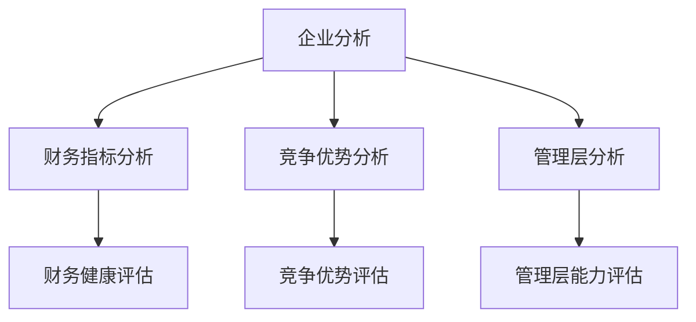

                 


# 价值投资者的耐心：长期持有的重要性

> 关键词：价值投资、耐心、长期持有、复利效应、投资策略、安全边际、内在价值

> 摘要：本文深入探讨了价值投资中耐心和长期持有的重要性，分析了长期持有策略的核心逻辑，以及耐心在投资过程中的关键作用。通过结合理论与实践，本文详细阐述了如何通过长期持有优质资产，利用复利效应实现财富增长，并通过具体案例和系统架构设计，为读者提供了一套完整的价值投资方法论。

---

## 第一部分：价值投资的背景与核心概念

### 第1章：价值投资的起源与发展

#### 1.1 价值投资的定义与起源

- **价值投资的定义**：价值投资是一种以基本面分析为基础的投资策略，旨在通过识别市场低估的资产，长期持有并等待其价值回归的过程。其核心在于寻找具有安全边际的优质企业，以实现长期稳定的收益。

- **价值投资的起源与发展历程**：价值投资的理论基础可以追溯到20世纪初，以本杰明·格雷厄姆和戴维·多德为代表，他们提出了“安全边际”和“内在价值”的概念。随后，沃伦·巴菲特继承并发扬了这一理念，将其应用于实践，并取得了巨大成功。

- **价值投资的核心理念**：价值投资强调以低于内在价值的价格买入优质资产，并通过长期持有实现价值的逐步释放。其核心在于对企业的深入研究和对市场的独立思考，避免短期市场波动的干扰。

#### 1.2 耐心在价值投资中的重要性

- **耐心的定义与内涵**：耐心是指在投资过程中，面对市场波动和短期亏损时，保持冷静和理性，不被短期情绪左右，坚持长期持有优质资产的特质。

- **耐心在价值投资中的作用**：耐心是价值投资成功的关键因素之一。市场短期波动可能导致投资者情绪波动，而耐心使得投资者能够坚持长期持有，避免频繁交易带来的成本和错误决策。

- **长期持有策略的逻辑**：长期持有策略的核心在于利用复利效应，通过时间的积累实现财富的稳步增长。长期持有不仅能够降低交易成本，还能够避免短期波动对投资组合的冲击。

#### 1.3 长期持有的重要性

- **长期持有的定义与特点**：长期持有是指投资者在买入优质资产后，长期持有不轻易卖出的投资策略。其特点是强调时间的价值，通过长期积累实现收益的最大化。

- **长期持有与复利效应的关系**：复利效应是指资金在长期持有过程中，通过不断再投资实现收益的指数增长。长期持有策略能够充分发挥复利效应的优势，使投资者的财富实现几何级增长。

- **长期持有在价值投资中的地位**：长期持有是价值投资的核心策略之一。通过长期持有优质资产，投资者能够分享企业的长期成长，实现财富的稳步增长。

---

## 第二部分：价值投资的核心概念与理论

### 第2章：价值投资的核心理论

#### 2.1 格雷厄姆的价值投资理论

- **格雷厄姆的“安全边际”概念**：安全边际是指股票的内在价值与市场价格之间的差额。通过购买市场价格低于内在价值的股票，投资者能够降低投资风险，确保投资的安全性。

- **股票的内在价值与市场价值的对比**：内在价值是基于企业基本面分析得出的理论价值，而市场价值是市场参与者共同决定的价格。内在价值与市场价值之间的差异为投资者提供了安全边际。

- **投资的三重标准：cheap, clear, and safe**：格雷厄姆提出了投资的三重标准，即股票必须便宜（价格低于内在价值）、清晰（企业基本面稳定可预测）和安全（具备足够的安全边际）。

#### 2.2 巴菲特的价值投资策略

- **巴菲特的投资理念：企业护城河与竞争优势**：巴菲特强调投资于具有强大竞争优势的企业，这些企业通常具备宽护城河、持续的盈利能力以及优秀的管理层。

- **巴菲特的长期持有策略**：巴菲特认为，长期持有优质资产是实现财富增长的最佳方式。他倾向于投资于那些能够持续创造价值的企业，并在市场波动中保持耐心。

- **巴菲特的选股标准：管理层、商业模式、财务状况**：巴菲特选股注重企业管理层的诚信与能力、商业模式的可持续性以及财务状况的稳健性。他认为，优秀的企业具备长期的竞争优势和稳定的财务表现。

#### 2.3 彼得·林奇的长期持有理念

- **彼得·林奇的投资哲学：长期持有优质企业**：彼得·林奇强调投资于那些具有成长潜力的企业，并长期持有以分享企业的成长成果。

- **长期持有与投资分散化的结合**：林奇认为，通过分散投资于多个优质企业，并长期持有，投资者能够降低风险并实现长期收益的最大化。

- **彼得·林奇的成功经验：耐心与专注**：林奇的成功在于他对投资对象的深入研究和长期持有策略。他强调，投资需要耐心和专注，避免短期波动的干扰。

---

## 第三部分：价值投资的算法与系统架构

### 第3章：价值投资的算法原理

#### 3.1 内在价值评估的数学模型

- **DCF模型（现金流折现法）**：现金流折现法是一种常用的评估企业内在价值的方法。其核心在于将企业未来现金流的现值加总，得出企业的内在价值。

- **DCF模型的数学公式**：  
  $$ \text{内在价值} = \sum_{t=1}^{n} \frac{\text{现金流}_t}{(1 + r)^t} + \frac{\text{终值}}{(1 + r)^n} $$  
  其中，\( r \) 为折现率，\( n \) 为预测期限，现金流 \( t \) 为企业在第 \( t \) 年产生的现金流。

- **DCF模型的实现步骤**：  
  1. 预测企业未来现金流。  
  2. 确定合适的折现率。  
  3. 计算未来现金流的现值。  
  4. 加总现值并加终值，得出内在价值。

- **Python代码实现DCF模型**：

```python
def discounted_cash_flow(cash_flows, discount_rate, terminal_value):
    present_value = 0
    for t, cash_flow in enumerate(cash_flows):
        if t == 0:
            present_value += cash_flow
        else:
            present_value += cash_flow / (1 + discount_rate) ** t
    present_value += terminal_value / (1 + discount_rate) ** len(cash_flows)
    return present_value

# 示例：计算某企业的内在价值
cash_flows = [100, 120, 140, 160]
discount_rate = 0.1
terminal_value = 200
intrinsic_value = discounted_cash_flow(cash_flows, discount_rate, terminal_value)
print(f"内在价值：{intrinsic_value:.2f}")
```

---

## 第四部分：价值投资的系统分析与架构设计

### 第4章：价值投资的系统架构

#### 4.1 价值投资的系统功能设计

- **企业分析模块**：用于对企业基本面进行深入分析，包括财务指标、竞争优势、管理层等方面。

- **财务指标分析模块**：通过分析企业的收入、利润、现金流等财务指标，评估企业的财务健康状况。

- **竞争优势分析模块**：识别企业的竞争优势，如技术壁垒、品牌优势、成本优势等。

- **管理层分析模块**：评估企业管理层的诚信与能力，确保管理层能够为股东创造长期价值。

#### 4.2 价值投资的系统架构设计

- **系统架构图**：通过Mermaid图展示系统架构，包括企业分析、财务分析、竞争优势分析、管理层分析等模块。



---

## 第五部分：价值投资的项目实战

### 第5章：价值投资的项目实战

#### 5.1 项目环境与工具安装

- **环境要求**：安装Python、Pandas、NumPy等工具，用于数据处理和分析。

- **工具安装**：通过以下命令安装所需库：

```bash
pip install pandas numpy matplotlib
```

#### 5.2 核心代码实现

- **DCF模型的Python实现**：

```python
import pandas as pd
import numpy as np

def calculate_intrinsic_value(financial_data, discount_rate):
    cash_flows = financial_data['cash_flows'].tolist()
    terminal_value = financial_data['terminal_value'].tolist()[-1]
    present_value = 0
    for t, cash_flow in enumerate(cash_flows):
        if t == 0:
            present_value += cash_flow
        else:
            present_value += cash_flow / (1 + discount_rate) ** t
    present_value += terminal_value / (1 + discount_rate) ** len(cash_flows)
    return present_value

# 示例数据
data = {
    'cash_flows': [100, 120, 140, 160],
    'terminal_value': [200]
}
financial_data = pd.DataFrame(data)

discount_rate = 0.1
iv = calculate_intrinsic_value(financial_data, discount_rate)
print(f"内在价值：{iv:.2f}")
```

---

## 第六部分：价值投资的总结与展望

### 第6章：价值投资的总结与展望

#### 6.1 长期投资的成功要素

- **耐心与纪律**：长期投资需要投资者具备耐心和纪律，避免短期波动的干扰。

- **深入研究**：投资者需要对企业基本面进行深入研究，识别出具有长期竞争优势的企业。

- **持续学习**：投资环境不断变化，投资者需要持续学习，更新自己的知识和技能。

#### 6.2 面对市场的波动与诱惑

- **市场波动的应对策略**：投资者需要在市场波动中保持冷静，避免情绪化决策。

- **诱惑的克服方法**：面对市场的短期诱惑，投资者需要坚持自己的投资策略，避免被短期收益所迷惑。

#### 6.3 价值投资的未来展望

- **价值投资的持续发展**：随着市场环境的变化，价值投资理论和方法也在不断发展和完善。

- **技术与数据的结合**：未来，价值投资将更加依赖于技术手段和数据分析，通过大数据和人工智能提高投资效率和准确性。

---

## 结语

价值投资者的耐心是长期持有的重要性。通过深入研究企业基本面，识别出具有长期竞争优势的企业，并长期持有，投资者能够实现财富的稳步增长。耐心不仅是价值投资的核心要素，也是投资者在面对市场波动和短期诱惑时的重要品质。

---

## 作者

作者：AI天才研究院/AI Genius Institute & 禅与计算机程序设计艺术 /Zen And The Art of Computer Programming

