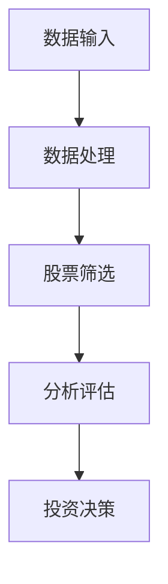

                 

# 价格公道的好公司：巴菲特投资理念的核心

---

## 关键词：
巴菲特，价值投资，价格公道，好公司，内在价值，安全边际，长期投资，投资策略

---

## 摘要：
本文系统地分析了巴菲特投资理念的核心，从价值投资的哲学基础到价格公道的好公司的定义，再到投资策略的数学模型和实战案例，深入剖析了巴菲特的投资体系。文章不仅揭示了巴菲特投资理念的内在逻辑，还通过具体的数学模型和系统架构，展示了如何在实际投资中应用这些理念。文章最后总结了巴菲特投资哲学的启示与最佳实践，为现代投资者提供了深刻的指导。

---

## 第一部分：巴菲特投资理念的背景与核心概念

### 第1章：价值投资的起源与发展

#### 1.1 价值投资的起源
- **1.1.1 投资的基本概念与定义**  
  投资是指将资金投入到能够产生收益的资产中，以实现财富增值。投资的核心在于选择优质的资产和合理的时机。

- **1.1.2 价值投资的哲学基础**  
  价值投资是一种基于对公司内在价值评估的投资策略，强调以低于内在价值的价格买入优质资产。这一理念起源于本杰明·格雷厄姆的“捡烟蒂”投资法，强调安全边际和对公司基本面的深入分析。

- **1.1.3 巴菲特对价值投资的贡献**  
  巴菲特将格雷厄姆的价值投资理论进一步发展，强调了企业竞争优势和长期投资的重要性，形成了自己独特的投资哲学。

---

### 第2章：价格公道的好公司的定义与特征

#### 2.1 好公司的核心特征
- **2.1.1 公司基本面分析**  
  好公司的基本面包括稳定的盈利能力、健康的财务状况和强大的竞争优势。巴菲特特别强调企业的护城河，即公司在行业中的独特优势。

- **2.1.2 企业的竞争优势**  
  企业的竞争优势可以是成本优势、品牌优势、技术优势或商业模式优势。这些竞争优势能够确保公司在长期内保持领先地位。

- **2.1.3 可持续盈利能力**  
  好公司必须具备持续盈利能力的能力，能够在不同经济周期中稳定发展。

#### 2.2 价格公道的评估标准
- **2.2.1 市盈率与市净率分析**  
  市盈率（P/E）和市净率（P/B）是评估股票价值的重要指标。巴菲特通常寻找那些市盈率和市净率低于行业平均水平的股票。

- **2.2.2 内在价值的计算方法**  
  内在价值是公司未来现金流的现值。巴菲特使用简化模型计算内在价值，以确定股票是否被低估。

- **2.2.3 安全边际的概念与应用**  
  安全边际是指股票价格与内在价值之间的差距。巴菲特强调在购买股票时留有安全边际，以降低投资风险。

---

## 第二部分：巴菲特投资策略的核心要素

### 第3章：股票分析的三要素

#### 3.1 股票分析的三要素
- **3.1.1 企业盈利能力**  
  盈利能力是衡量公司财务健康状况的重要指标，包括净利润率、毛利率等。

- **3.1.2 财务健康状况**  
  公司的财务报表是分析财务健康状况的核心工具，重点关注资产负债表、利润表和现金流。

- **3.1.3 管理层的质量与诚信**  
  管理层的素质和诚信是决定公司长期发展的重要因素。巴菲特特别重视管理层的诚信和决策能力。

---

### 第4章：投资组合的构建原则

#### 4.1 投资组合的构建原则
- **4.1.1 集中投资与分散投资的平衡**  
  巴菲特主张集中投资，但也要注意分散投资以降低风险。

- **4.1.2 长期持有的优势**  
  长期持有优质股票能够最大化复利效应，同时避免短期波动的影响。

- **4.1.3 调整投资组合的时机与策略**  
  投资组合的调整应基于市场变化和公司基本面的改变，而不是短期市场波动。

---

### 第5章：巴菲特投资理念的数学模型与公式

#### 5.1 内在价值的计算公式
$$ \text{内在价值} = \frac{\text{未来现金流的现值}}{\text{折现率}} $$

#### 5.2 安全边际的计算方法
$$ \text{安全边际} = \text{内在价值} - \text{市场价格} $$

#### 5.3 股票估值的简化模型
$$ \text{合理股价} = \text{每股收益} \times \text{市盈率} $$

---

### 第6章：巴菲特投资理念的系统架构与设计

#### 6.1 投资系统的核心模块
- **6.1.1 数据采集与处理模块**  
  包括收集公司财务数据、行业分析和市场数据。

- **6.1.2 股票筛选与分析模块**  
  基于价值投资的指标筛选股票，进行深入的财务分析和竞争优势评估。

- **6.1.3 投资决策支持模块**  
  结合安全边际和市场环境，制定投资策略。

#### 6.2 系统架构的流程图

---

## 第三部分：巴菲特投资理念的实战案例分析

### 第7章：可口可乐的投资案例

#### 7.1 可口可乐的投资案例
- **7.1.1 公司背景与竞争优势**  
  可口可乐拥有强大的品牌优势和全球分销网络，具备持续盈利能力。

- **7.1.2 投资决策过程**  
  巴菲特基于可口可乐的稳定现金流和合理估值，决定投资该公司。

- **7.1.3 投资结果与经验总结**  
  可口可乐的投资案例展示了巴菲特对品牌和竞争优势的重视。

### 第8章：苹果公司的投资分析

#### 8.1 苹果公司的投资分析
- **8.1.1 企业的财务状况**  
  苹果公司财务健康，现金流充裕，具备强大的研发能力。

- **8.1.2 产品的市场竞争力**  
  苹果的产品创新能力强，市场占有率高。

- **8.1.3 投资的潜在风险与回报**  
  苹果的投资回报潜力大，但也面临一定的市场风险。

---

## 第四部分：巴菲特投资哲学的启示与应用

### 第9章：长期投资的重要性

#### 9.1 长期投资的重要性
- **9.1.1 时间的复利效应**  
  长期投资能够最大化复利效应，实现财富的指数增长。

- **9.1.2 避免短期波动的干扰**  
  短期市场波动通常由情绪驱动，长期投资能够避免情绪化决策的影响。

- **9.1.3 保持耐心与纪律**  
  长期投资需要耐心和纪律，避免频繁交易和过度关注短期市场变化。

### 第10章：风险管理的策略

#### 10.1 风险管理的策略
- **10.1.1 分散投资的**  
  通过分散投资降低特定资产的风险，同时保持投资组合的稳定性。

- **10.1.2 安全边际的重要性**  
  通过购买低于内在价值的股票，降低市场波动带来的风险。

- **10.1.3 定期审视与调整**  
  定期审视投资组合，根据市场变化和公司基本面调整投资策略。

---

## 第五部分：总结与展望

### 第11章：巴菲特投资理念的总结与启示

#### 11.1 总结
巴菲特的投资理念以价值投资为核心，强调选择价格公道的好公司，注重长期投资和风险管理。他的投资哲学为现代投资者提供了深刻的指导。

#### 11.2 启示与展望
- **启示**：投资者应注重基本面分析，选择具备竞争优势和持续盈利能力的公司，避免短期市场波动的干扰。  
- **展望**：随着市场环境的变化，投资者需要不断调整投资策略，灵活应对市场变化。

---

## 作者：AI天才研究院/AI Genius Institute & 禅与计算机程序设计艺术 /Zen And The Art of Computer Programming

---

通过本文的系统分析，我们可以清晰地看到巴菲特投资理念的核心要素，以及如何在实际投资中应用这些理念。希望本文能为投资者提供有价值的指导和启示。

