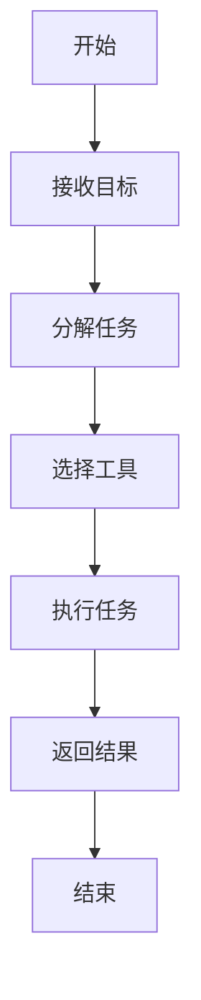
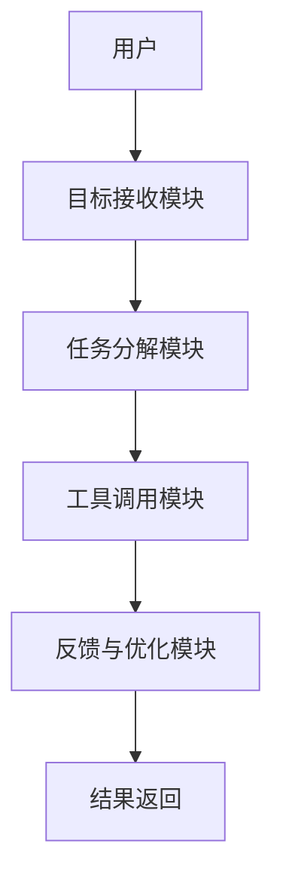

                 


# 任务导向型 AI Agent：基于 LLM 的目标完成系统

## 关键词：
- 任务导向型 AI Agent
- LLM
- 目标完成系统
- 人工智能
- 自然语言处理
- 系统架构
- 项目实战

## 摘要：
本文将详细介绍任务导向型 AI Agent 的概念、核心原理、系统架构以及基于 LLM 的实现方法。通过逐步分析和具体案例，展示如何构建一个能够根据目标自主规划和执行任务的 AI Agent。内容涵盖从理论到实践的全链条，帮助读者深入理解并掌握任务导向型 AI Agent 的设计与实现。

---

## 第一部分：任务导向型 AI Agent 的背景与概念

### 第1章：任务导向型 AI Agent 的问题背景

#### 1.1 问题背景与问题描述
随着人工智能技术的快速发展，AI Agent（智能体）在各个领域的应用越来越广泛。传统的 AI Agent 更注重数据处理和模式识别，但在复杂任务的执行过程中，往往缺乏明确的目标导向性和任务规划能力。例如，在客服系统中，传统 AI Agent 可能只能回答简单的问题，但在处理复杂咨询时，无法自主规划任务、调用所需资源或协调多方进行问题解决。

任务导向型 AI Agent 的提出，正是为了解决这一问题。它以目标为导向，能够根据任务要求，自主规划行动步骤，并调用多种工具和资源完成目标。

---

#### 1.2 任务导向型 AI Agent 的定义与特点
任务导向型 AI Agent 是一种基于大语言模型（LLM）的智能体，能够根据给定的目标，自主规划行动步骤，并利用外部工具和资源完成任务。其核心特点包括：

1. **目标导向性**：以明确的目标为导向，能够分解任务并制定行动计划。
2. **自主性**：无需人工干预，能够自主完成任务。
3. **知识丰富性**：利用 LLM 的强大能力，具备丰富的知识储备和语言理解能力。
4. **工具调用能力**：能够调用外部工具（如搜索引擎、API 等）辅助完成任务。
5. **动态适应性**：在执行过程中能够根据反馈动态调整行动计划。

---

#### 1.3 任务导向型 AI Agent 的核心要素
任务导向型 AI Agent 的核心要素包括以下几个方面：

1. **目标设定与分解**：将目标分解为多个子任务，并为每个子任务制定具体的操作步骤。
2. **任务规划与执行**：根据子任务的特点，选择合适的工具和方法，制定执行计划。
3. **知识库与上下文管理**：维护一个动态的知识库，记录任务执行过程中的相关信息。
4. **反馈与优化机制**：根据执行结果，评估任务完成情况，并进行优化。

---

#### 1.4 任务导向型 AI Agent 的边界与外延
任务导向型 AI Agent 的边界主要体现在以下几个方面：

1. **功能边界**：专注于任务的规划与执行，不涉及目标设定以外的功能。
2. **与其他技术的区分**：与传统的 AI Agent 区别在于，任务导向型 AI Agent 更注重目标导向性和任务执行能力。
3. **未来发展方向**：随着技术的进步，任务导向型 AI Agent 可能会进一步增强其工具调用能力和自主学习能力。

---

#### 1.5 本章小结
本章主要介绍了任务导向型 AI Agent 的背景、定义、特点以及核心要素。通过分析，我们可以看出，任务导向型 AI Agent 是一种以目标为导向，能够自主规划和执行任务的智能体，其核心在于将目标分解为可执行的子任务，并通过调用工具和资源完成任务。

---

## 第二部分：任务导向型 AI Agent 的核心概念与联系

### 第2章：任务导向型 AI Agent 的核心概念

#### 2.1 核心概念原理
任务导向型 AI Agent 的核心概念包括以下几个方面：

1. **目标设定**：明确任务目标，并将其分解为可执行的子任务。
2. **任务规划**：根据子任务的特点，选择合适的工具和方法，制定执行计划。
3. **LLM 的作用**：利用大语言模型的自然语言理解和生成能力，完成任务的分解和执行。

---

#### 2.2 核心概念属性对比表
以下是任务导向型 AI Agent 与其他 AI 技术的对比：

| 对比维度 | 传统 AI Agent | 任务导向型 AI Agent |
|----------|----------------|-----------------------|
| 核心目标 | 数据处理与模式识别 | 任务导向与自主执行 | 
| 任务分解能力 | 无 | 强 |
| 工具调用能力 | 弱 | 强 |
| 自主性 | 低 | 高 |

---

#### 2.3 实体关系图（ER 图）
任务导向型 AI Agent 的 ER 图如下：

```mermaid
er
actor: 用户
goal: 目标
task: 子任务
tool: 工具
feedback: 反馈

actor --> goal: 提交目标
goal --> task: 分解为子任务
task --> tool: 调用工具
tool --> feedback: 返回结果
feedback --> actor: 提供反馈
```

---

## 第三部分：任务导向型 AI Agent 的算法原理

### 第3章：基于 LLM 的任务导向型 AI Agent 算法

#### 3.1 算法原理概述
任务导向型 AI Agent 的算法流程如下：

1. **目标接收**：接收用户的目标，并将其转化为可执行的任务。
2. **任务分解**：将目标分解为多个子任务，并为每个子任务制定执行步骤。
3. **工具调用**：根据子任务的特点，选择合适的工具（如搜索引擎、API 等）进行任务执行。
4. **结果反馈**：将工具的执行结果返回给用户，并根据反馈进行优化。

---

#### 3.2 算法实现流程
以下是任务导向型 AI Agent 的算法流程图：



---

#### 3.3 算法实现代码
以下是任务导向型 AI Agent 的核心代码实现：

```python
def task_oriented_ai_agent(goal):
    # 分解目标为子任务
    sub_tasks = decompose_goal(goal)
    # 为每个子任务选择工具
    for task in sub_tasks:
        tool = select_tool(task)
        # 执行任务
        result = execute_tool(tool, task)
        # 返回结果
        return result
```

---

## 第四部分：任务导向型 AI Agent 的系统分析与架构设计

### 第4章：任务导向型 AI Agent 的系统架构

#### 4.1 系统功能设计
任务导向型 AI Agent 的系统功能模块如下：

1. **目标接收模块**：接收用户的目标，并将其转化为可执行的任务。
2. **任务分解模块**：将目标分解为多个子任务，并为每个子任务制定执行步骤。
3. **工具调用模块**：根据子任务的特点，选择合适的工具（如搜索引擎、API 等）进行任务执行。
4. **反馈与优化模块**：将工具的执行结果返回给用户，并根据反馈进行优化。

---

#### 4.2 系统架构设计
以下是任务导向型 AI Agent 的系统架构图：



---

## 第五部分：任务导向型 AI Agent 的项目实战

### 第5章：任务导向型 AI Agent 的项目实现

#### 5.1 项目环境安装
以下是项目环境安装代码：

```bash
pip install llm-engine
pip install tools-library
```

---

#### 5.2 核心代码实现
以下是任务导向型 AI Agent 的核心代码实现：

```python
class TaskOrientedAI:
    def __init__(self):
        self.goal = None
        self.sub_tasks = []

    def set_goal(self, goal):
        self.goal = goal
        self.sub_tasks = self.decompose_goal(goal)

    def decompose_goal(self, goal):
        # 分解目标为子任务
        return sub_tasks

    def select_tool(self, task):
        # 选择工具
        return tool

    def execute_tool(self, tool, task):
        # 执行工具
        return result

    def run(self):
        for task in self.sub_tasks:
            tool = self.select_tool(task)
            result = self.execute_tool(tool, task)
            return result
```

---

## 第六部分：任务导向型 AI Agent 的总结与展望

### 第6章：总结与展望

#### 6.1 本章小结
任务导向型 AI Agent 是一种以目标为导向，能够自主规划和执行任务的智能体。其核心在于将目标分解为可执行的子任务，并通过调用外部工具和资源完成任务。

---

#### 6.2 注意事项与最佳实践
在实际应用中，需要注意以下几点：

1. **目标分解的准确性**：目标分解是否准确，直接影响任务执行的效果。
2. **工具选择的合理性**：工具选择是否合理，影响任务执行的效率。
3. **反馈机制的有效性**：反馈机制的有效性，影响任务执行的优化程度。

---

#### 6.3 未来展望
随着大语言模型（LLM）的不断发展，任务导向型 AI Agent 的能力将不断提升。未来，任务导向型 AI Agent 可能会进一步增强其工具调用能力和自主学习能力，更好地服务于人类社会。

---

## 作者信息

作者：AI天才研究院/AI Genius Institute & 禅与计算机程序设计艺术 /Zen And The Art of Computer Programming

---

以上就是《任务导向型 AI Agent：基于 LLM 的目标完成系统》的完整内容，希望对您有所帮助！

