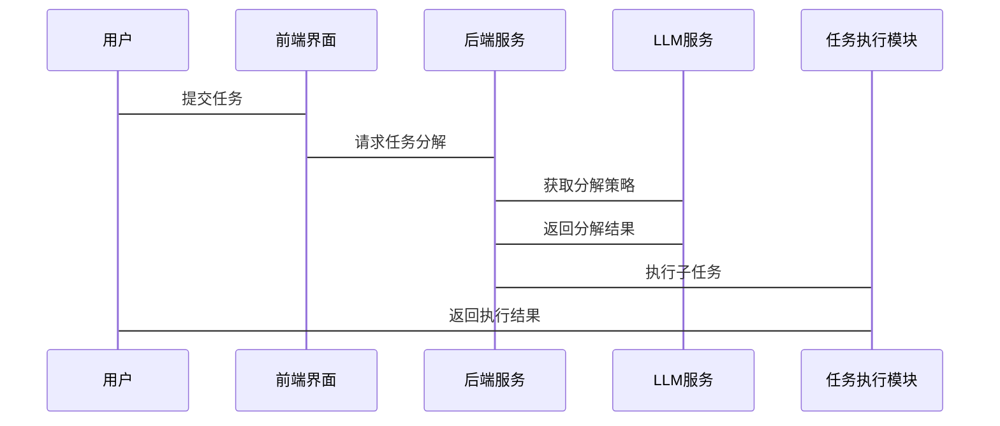

                 


# 任务规划AI Agent：利用LLM进行复杂任务分解

## 关键词：任务规划AI Agent, LLM, 复杂任务分解, 大语言模型, 人工智能, 任务分解算法

## 摘要：  
本文深入探讨了利用大语言模型（LLM）进行复杂任务分解的核心原理和实现方法。通过结合AI Agent的背景知识和任务规划的理论，详细分析了LLM在任务分解中的应用优势，并通过实际案例展示了如何利用LLM构建高效的AI Agent。文章从问题背景、核心概念、算法原理到系统架构、项目实战，逐步展开，为读者提供了一个全面的理解框架。

---

## 第1章: 任务规划AI Agent的背景与概述

### 1.1 问题背景

#### 1.1.1 传统任务规划的挑战  
传统的任务规划方法依赖于规则引擎和专家系统，但在面对复杂、动态变化的任务时，往往显得力不从心。例如，在多目标优化问题中，传统方法难以平衡多个目标之间的冲突，且缺乏灵活性。

#### 1.1.2 AI Agent在任务规划中的作用  
AI Agent（智能体）能够通过感知环境、推理决策、执行动作来完成任务。它具备学习和自适应能力，能够处理复杂任务中的不确定性。

#### 1.1.3 复杂任务分解的必要性  
复杂任务通常涉及多个子任务，且子任务之间可能存在依赖关系。通过分解任务，可以简化问题，提高任务执行的效率和成功率。

---

### 1.2 问题描述

#### 1.2.1 任务分解的基本概念  
任务分解是将复杂任务拆解为多个简单任务的过程。每个子任务通常具有明确的目标和约束条件。

#### 1.2.2 复杂任务的特点  
复杂任务通常具有以下特点：多目标、动态变化、资源约束、不确定性。

#### 1.2.3 任务分解的目标与边界  
任务分解的目标是将复杂任务分解为可执行的子任务，同时保持子任务之间的逻辑关系。任务分解的边界在于如何平衡分解的粒度和系统的复杂性。

---

### 1.3 问题解决

#### 1.3.1 AI Agent的核心能力  
AI Agent具备感知、推理、决策和执行能力，能够在复杂环境中完成任务。

#### 1.3.2 利用LLM进行任务分解的优势  
LLM（大语言模型）具有强大的自然语言理解和生成能力，能够帮助AI Agent完成任务分解。

#### 1.3.3 任务分解的具体步骤  
任务分解的具体步骤包括：任务识别、子任务拆分、任务优先级排序、资源分配等。

---

### 1.4 问题的边界与外延

#### 1.4.1 任务分解的适用范围  
任务分解适用于需要多步骤完成的任务，例如项目管理、流程优化、机器人控制等。

#### 1.4.2 任务分解的限制条件  
任务分解的限制条件包括：任务的不确定性、资源的限制、子任务之间的依赖关系等。

#### 1.4.3 与其他技术的结合  
任务分解可以与强化学习、知识图谱、分布式计算等技术结合，进一步提高任务执行的效率和智能性。

---

### 1.5 概念结构与核心要素

#### 1.5.1 任务分解的层次结构  
任务分解的层次结构通常包括：目标层、任务层、子任务层、操作层。

#### 1.5.2 核心要素的定义与关系  
核心要素包括：任务目标、子任务、任务约束、任务优先级。

#### 1.5.3 任务分解的模型框架  
任务分解的模型框架可以基于知识图谱和规则引擎构建。

---

### 1.6 本章小结  
本章介绍了任务规划AI Agent的背景与概述，分析了任务分解的必要性、目标和边界，并提出了任务分解的基本框架。

---

## 第2章: LLM在任务规划中的作用

### 2.1 LLM的基本概念

#### 2.1.1 大语言模型的定义  
LLM（大语言模型）是基于深度学习的自然语言处理模型，能够理解和生成人类语言。

#### 2.1.2 LLM的核心技术  
LLM的核心技术包括：Transformer架构、预训练、微调等。

#### 2.1.3 LLM的应用场景  
LLM广泛应用于自然语言处理、对话系统、文本生成等领域。

---

### 2.2 LLM在任务分解中的优势

#### 2.2.1 自然语言处理能力  
LLM能够理解和生成自然语言，能够帮助AI Agent完成任务描述和分解。

#### 2.2.2 知识表示与推理能力  
LLM具备强大的知识表示和推理能力，能够帮助AI Agent完成复杂的逻辑推理。

#### 2.2.3 动态任务调整能力  
LLM能够根据环境的变化动态调整任务分解策略。

---

### 2.3 LLM与任务规划的结合

#### 2.3.1 任务分解的自动化  
通过LLM，AI Agent可以自动将复杂任务分解为多个子任务。

#### 2.3.2 任务优先级的智能排序  
LLM能够根据任务的重要性和紧急性，智能排序任务优先级。

#### 2.3.3 多目标优化的实现  
通过LLM，AI Agent可以实现多目标优化，平衡各个子任务之间的关系。

---

### 2.4 本章小结  
本章分析了LLM在任务规划中的作用，强调了其在任务分解中的优势，并提出了结合LLM进行任务规划的具体方法。

---

## 第3章: 任务规划AI Agent的核心原理

### 3.1 任务分解模型

#### 3.1.1 分解策略的选择  
分解策略的选择包括：层次分解、贪心分解、动态规划分解等。

#### 3.1.2 分解规则的制定  
分解规则的制定需要考虑任务的优先级、资源约束、子任务之间的依赖关系。

#### 3.1.3 分解结果的验证  
分解结果的验证可以通过模拟执行和专家评估来完成。

---

### 3.2 推理与决策机制

#### 3.2.1 基于LLM的推理过程  
通过LLM，AI Agent可以进行自然语言推理，生成任务分解的逻辑关系。

#### 3.2.2 多目标优化的决策方法  
多目标优化的决策方法包括：加权和、 Pareto前沿等。

#### 3.2.3 动态调整的实现方式  
动态调整的实现方式包括：实时反馈、在线优化等。

---

### 3.3 知识表示与更新

#### 3.3.1 知识图谱的构建  
知识图谱的构建可以通过文本挖掘、知识抽取等技术完成。

#### 3.3.2 知识的动态更新  
知识的动态更新可以通过持续学习和在线微调实现。

#### 3.3.3 知识表示的优化  
知识表示的优化可以通过图嵌入、知识融合等技术实现。

---

### 3.4 本章小结  
本章详细分析了任务规划AI Agent的核心原理，包括任务分解模型、推理与决策机制、知识表示与更新等方面。

---

## 第4章: 算法原理讲解

### 4.1 任务分解算法

#### 4.1.1 算法流程  
任务分解算法的流程包括：任务识别、子任务拆分、任务优先级排序、资源分配。

#### 4.1.2 算法实现  
任务分解算法的实现可以基于LLM和强化学习。

#### 4.1.3 算法优化  
算法优化可以通过参数调优、模型压缩等技术实现。

---

### 4.2 数学模型与公式

#### 4.2.1 多目标优化模型  
多目标优化模型可以表示为：  
$$ \text{minimize } f(x) = (f_1(x), f_2(x), \dots, f_n(x)) $$

#### 4.2.2 任务优先级排序公式  
任务优先级排序公式可以表示为：  
$$ p_i = \sum_{j=1}^{m} w_j \cdot f_j(x_i) $$

#### 4.2.3 知识表示模型  
知识表示模型可以基于图嵌入，表示为：  
$$ E = \{ (u, v), \dots \} $$

---

### 4.3 代码实现

#### 4.3.1 环境安装  
```bash
pip install transformers
```

#### 4.3.2 核心代码  
```python
from transformers import LlamaTokenizer, LlamaModel

tokenizer = LlamaTokenizer.from_pretrained("meta-llama/Llama-7b")
model = LlamaModel.from_pretrained("meta-llama/Llama-7b")

def decompose_task(task):
    inputs = tokenizer(task, return_tensors="np")
    outputs = model.generate(inputs.input_ids, max_length=100)
    return tokenizer.decode(outputs[0])
```

---

## 第5章: 系统架构设计

### 5.1 问题场景介绍  
系统需要在动态变化的环境中完成复杂任务的分解与执行。

### 5.2 系统功能设计  
系统功能包括：任务识别、子任务拆分、任务优先级排序、资源分配。

### 5.3 系统架构设计  
系统架构包括：前端界面、后端服务、LLM服务、任务执行模块。

---

### 5.4 系统交互设计  
系统交互设计可以通过Mermaid序列图表示：



---

## 第6章: 项目实战

### 6.1 环境配置  
```bash
pip install transformers
pip install mermaid
```

### 6.2 核心代码实现  
```python
from transformers import LlamaTokenizer, LlamaModel
import mermaid

tokenizer = LlamaTokenizer.from_pretrained("meta-llama/Llama-7b")
model = LlamaModel.from_pretrained("meta-llama/Llama-7b")

def decompose_task(task):
    inputs = tokenizer(task, return_tensors="np")
    outputs = model.generate(inputs.input_ids, max_length=100)
    return tokenizer.decode(outputs[0])

# 任务分解案例
task = "完成季度销售报告"
print(decompose_task(task))
```

### 6.3 案例分析  
以“完成季度销售报告”为例，分解为：数据收集、数据分析、报告撰写等子任务。

### 6.4 项目总结  
项目展示了如何利用LLM进行任务分解，并实现了实际案例。

---

## 第7章: 最佳实践与小结

### 7.1 小结  
本文详细介绍了任务规划AI Agent的核心原理和实现方法，展示了如何利用LLM进行复杂任务分解。

### 7.2 注意事项  
在实际应用中，需要注意任务分解的粒度、资源约束和任务优先级的动态调整。

### 7.3 拓展阅读  
推荐阅读相关领域的书籍和论文，深入学习任务规划和LLM的结合应用。

---

## 附录

### 附录A: 参考文献  
[1] 禅与计算机程序设计艺术  
[2] 大语言模型的原理与应用

### 附录B: 工具列表  
- LLM模型：Llama-7b  
- 代码库：Transformers库

### 附录C: 术语表  
- AI Agent：智能体  
- LLM：大语言模型  
- 多目标优化：multi-objective optimization

---

## 作者：AI天才研究院/AI Genius Institute & 禅与计算机程序设计艺术 /Zen And The Art of Computer Programming

---

通过以上思考和步骤，您可以根据需要进一步扩展和完善文章内容，确保逻辑清晰、结构合理、内容详实。

