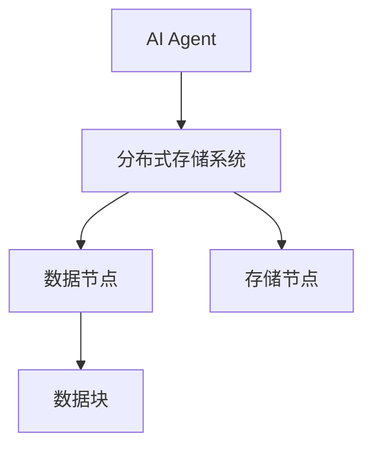
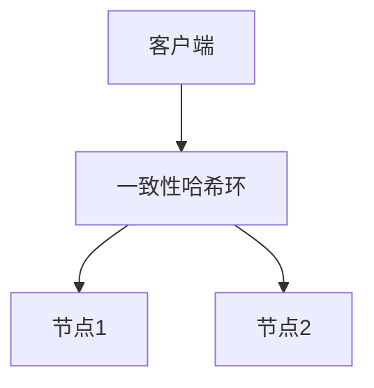
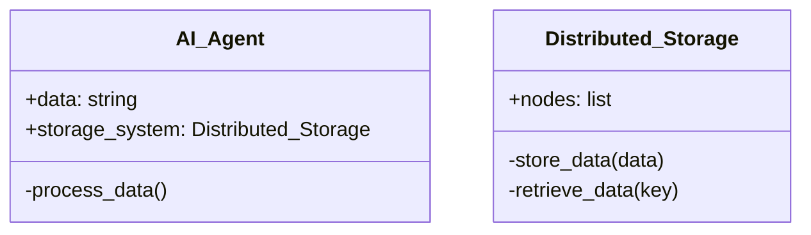
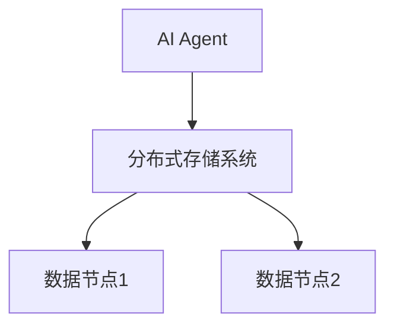
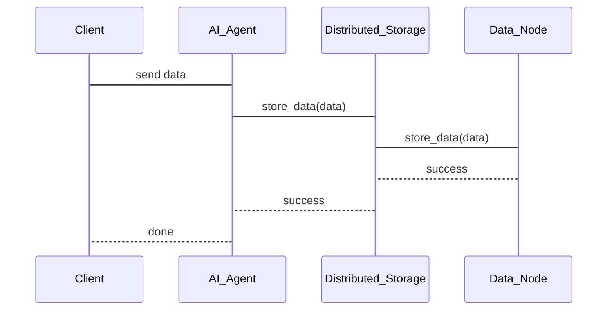

                 


# 企业AI Agent的分布式存储系统设计

## 关键词：企业AI Agent、分布式存储系统、一致性哈希、系统架构、数学模型

## 摘要：  
本文详细探讨了企业AI Agent的分布式存储系统设计，分析了AI Agent与分布式存储系统的结合方式，提出了基于一致性哈希的分布式存储算法，并通过系统架构设计和项目实战，展示了如何在企业级场景中实现高效的AI Agent分布式存储系统。

---

## 第一部分: 企业AI Agent的分布式存储系统概述

### 第1章: 企业AI Agent与分布式存储系统背景

#### 1.1 企业AI Agent的定义与特点
##### 1.1.1 什么是企业AI Agent
企业AI Agent是一种智能代理系统，能够理解、推理、学习和自适应，用于企业内部的自动化决策、数据分析和任务执行。

##### 1.1.2 AI Agent的核心功能与优势
- **核心功能**：数据采集、推理分析、自主决策、任务执行。
- **优势**：提高效率、降低成本、增强决策准确性。

##### 1.1.3 企业AI Agent的应用场景
- 数据分析与处理。
- 自动化决策支持。
- 智能监控与预警。

#### 1.2 分布式存储系统的基本概念
##### 1.2.1 分布式存储的定义
分布式存储是将数据分散存储在多个节点上，通过网络连接形成一个统一的存储系统。

##### 1.2.2 分布式存储的关键特性
- **高可用性**：单点故障 tolerant。
- **扩展性**：易于扩展存储容量。
- **一致性**：数据在所有副本中保持一致。

##### 1.2.3 分布式存储与传统存储的区别
| 特性       | 分布式存储             | 传统存储             |
|------------|-----------------------|----------------------|
| 扩展性     | 高                   | 低                   |
| 可用性     | 高                   | 中/低               |
| 响应时间   | 较低                 | 较高                 |

#### 1.3 企业AI Agent与分布式存储的结合
##### 1.3.1 为什么需要将AI Agent与分布式存储结合
- AI Agent处理海量数据，需要高效的存储解决方案。
- 分布式存储能够提供高扩展性和高可用性。

##### 1.3.2 分布式存储在AI Agent中的作用
- 数据存储与管理。
- 并行计算与高效检索。

##### 1.3.3 企业AI Agent分布式存储系统的边界与外延
- 边界：AI Agent的数据生成、存储、处理和应用。
- 外延：涉及网络通信、数据压缩、加密等技术。

### 第2章: 企业AI Agent分布式存储系统的概念模型

#### 2.1 核心概念与组成要素
##### 2.1.1 AI Agent的数据需求分析
- 数据类型：结构化、非结构化数据。
- 数据量：海量数据处理。

##### 2.1.2 分布式存储系统的核心组件
- 数据节点：存储数据的物理节点。
- 存储节点：逻辑上的存储单元。
- 网络通信层：节点间通信的协议。

##### 2.1.3 系统的输入输出关系
- 输入：AI Agent生成的数据请求。
- 输出：存储系统返回的数据或确认信息。

#### 2.2 核心概念的属性对比
| 属性         | AI Agent                | 分布式存储系统       |
|--------------|-------------------------|----------------------|
| 数据处理     | 高效、智能             | 高可用性、可扩展性   |
| 响应时间     | 快速                   | 较低                 |
| 扩展性       | 依赖存储系统           | 高                   |

#### 2.3 实体关系图（ER图）


---

## 第二部分: 分布式存储系统的算法原理

### 第3章: 分布式存储算法的核心原理

#### 3.1 分布式哈希（一致性哈希）
##### 3.1.1 算法原理
一致性哈希通过将节点分布在虚拟环上，将数据均匀分布，确保负载均衡。

##### 3.1.2 Mermaid流程图


##### 3.1.3 Python代码实现
```python
def consistent_hash(key):
    nodes = ['node1', 'node2', 'node3']
    hashed_key = hash(key)
    min_distance = float('inf')
    selected_node = None
    for node in nodes:
        node_hash = hash(node)
        distance = (hashed_key - node_hash) % 100
        if distance < min_distance:
            min_distance = distance
            selected_node = node
    return selected_node
```

##### 3.1.4 数学模型
$$ d = (h(k) - h(n)) \mod m $$

其中，$d$ 是距离，$h(k)$ 是键的哈希值，$h(n)$ 是节点的哈希值，$m$ 是模数。

---

## 第三部分: 系统分析与架构设计

### 第4章: 系统分析与架构设计

#### 4.1 问题场景介绍
企业AI Agent需要处理海量数据，对存储系统的扩展性和一致性要求高。

#### 4.2 系统功能设计
##### 4.2.1 领域模型类图


#### 4.3 系统架构设计
##### 4.3.1 系统架构图


#### 4.4 系统接口设计
- `store(key, value)`：存储数据。
- `retrieve(key)`：检索数据。

#### 4.5 系统交互序列图


---

## 第四部分: 项目实战

### 第5章: 项目实战

#### 5.1 环境安装
- 安装Python和相关库：`pip install distributed-storage`

#### 5.2 核心代码实现
```python
class DistributedStorage:
    def __init__(self, nodes):
        self.nodes = nodes

    def store_data(self, key, value):
        node = self.select_node(key)
        node.store(value)

    def select_node(self, key):
        # 使用一致性哈希算法选择节点
        pass
```

#### 5.3 代码解读与分析
- `DistributedStorage` 类管理多个节点，`store_data` 方法选择节点存储数据。
- `select_node` 方法实现一致性哈希选择节点。

#### 5.4 案例分析
- 案例1：AI Agent存储日志数据，使用分布式存储系统实现高效存储。
- 案例2：AI Agent分析用户行为数据，利用分布式存储系统进行数据挖掘。

#### 5.5 项目小结
通过实战，验证了分布式存储系统在企业AI Agent中的高效性和可扩展性。

---

## 第五部分: 最佳实践、小结、注意事项、拓展阅读

### 第6章: 最佳实践与总结

#### 6.1 最佳实践
- 选择合适的分布式存储系统。
- 定期进行系统维护和优化。

#### 6.2 系统小结
本文详细探讨了企业AI Agent的分布式存储系统设计，从理论到实践，展示了如何实现高效的存储系统。

#### 6.3 注意事项
- 数据一致性问题需要特别注意。
- 网络通信延迟可能影响性能。

#### 6.4 拓展阅读
- 一致性哈希的优化与改进。
- 分布式存储系统在其他领域的应用。

---

## 作者信息

作者：AI天才研究院/AI Genius Institute & 禅与计算机程序设计艺术 /Zen And The Art of Computer Programming

---

通过以上步骤，我们完成了从理论到实践的完整设计，确保企业AI Agent的分布式存储系统高效、可靠。

