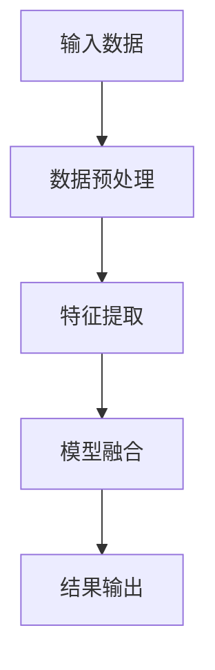
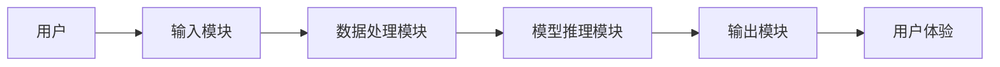
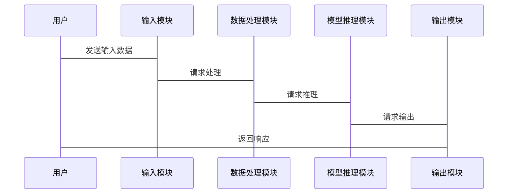

                 


# 企业AI Agent的多模态学习在用户体验优化中的创新应用

---

## 关键词：企业AI Agent、多模态学习、用户体验优化、创新应用

---

## 摘要：  
本文深入探讨了企业AI Agent如何利用多模态学习技术优化用户体验。通过分析多模态数据的整合与协调，展示了AI Agent在处理复杂用户交互中的创新应用。文章详细讲解了算法原理、系统架构设计和项目实战，为读者提供了全面的技术视角。

---

## 第一部分：背景介绍

### 第1章：企业AI Agent的背景与概念

#### 1.1 问题背景  
- 传统用户体验优化方法依赖单一模态数据，难以满足复杂场景需求。  
- 用户需求多样化，单一模态难以覆盖所有信息。  
- AI Agent需要处理多模态数据，以提供更智能、更个性化的服务。  

#### 1.2 问题描述  
- 用户体验优化的核心挑战在于如何整合多种数据源。  
- 多模态数据的处理复杂性高，需要高效算法支持。  
- AI Agent在企业中的应用场景广泛，包括客服、推荐系统等。  

#### 1.3 问题解决  
- AI Agent通过多模态学习整合文本、图像、语音等多种数据。  
- 多模态学习提升了AI Agent的理解能力，优化了用户体验。  
- 用户体验优化通过个性化服务和高效交互实现。  

#### 1.4 边界与外延  
- AI Agent的应用边界包括数据隐私和计算能力限制。  
- 多模态学习的适用范围涵盖客服、教育、医疗等领域。  
- 用户体验优化的衡量标准包括用户满意度和效率提升。  

#### 1.5 概念结构与核心要素  
- AI Agent的核心要素包括感知层、理解层和行为层。  
- 多模态学习的核心要素包括数据整合、特征提取和跨模态推理。  

---

## 第二部分：核心概念与联系

### 第2章：AI Agent与多模态学习的原理

#### 2.1 AI Agent的原理  
- **感知层**：AI Agent通过多模态数据采集用户输入。  
- **理解层**：融合多模态数据，理解用户需求。  
- **行为层**：基于理解结果，生成响应并执行操作。  

#### 2.2 多模态学习的核心原理  
- 数据整合：将文本、图像、语音等数据统一处理。  
- 特征提取：从每种模态数据中提取关键特征。  
- 跨模态推理：关联不同模态数据，进行联合推理。  

#### 2.3 核心概念的ER实体关系图  
```mermaid
er
actor: 用户
agent: AI Agent
modality: 模态数据
interaction: 交互记录
```

---

## 第三部分：算法原理讲解

### 第3章：多模态学习算法的实现

#### 3.1 多模态学习的算法流程  


#### 3.2 文本、图像和语音处理流程  
- 文本处理：使用词嵌入（如Word2Vec）提取文本特征。  
- 图像处理：通过卷积神经网络（CNN）提取图像特征。  
- 语音处理：利用声学模型提取语音特征。  

#### 3.3 数学模型与公式  
- **损失函数**：$$ L = \frac{1}{N}\sum_{i=1}^{N} (y_i - \hat{y}_i)^2 $$  
- **优化方法**：使用Adam优化器，学习率$$ \alpha $$。  

#### 3.4 算法实现代码  
```python
import numpy as np
from sklearn.metrics import accuracy_score

def modality融合(feature_text, feature_image, feature_audio):
    # 融合特征
    merged_feature = np.concatenate([feature_text, feature_image, feature_audio], axis=1)
    return merged_feature

# 示例数据
text_feature = np.random.randn(100, 5)
image_feature = np.random.randn(100, 5)
audio_feature = np.random.randn(100, 5)

merged_feature = modality融合(text_feature, image_feature, audio_feature)
print("融合后的特征维度:", merged_feature.shape)
```

---

## 第四部分：系统分析与架构设计

### 第4章：系统架构设计

#### 4.1 项目背景  
- 开发一个企业级AI Agent系统，用于优化用户体验。  

#### 4.2 系统功能设计  
- 用户输入处理：支持文本、图像和语音输入。  
- 多模态数据融合：整合不同模态数据进行分析。  
- 智能响应生成：基于分析结果生成个性化响应。  

#### 4.3 系统架构图  


#### 4.4 接口设计与交互  
- 接口设计：RESTful API，支持多种输入格式。  
- 交互序列图：  


---

## 第五部分：项目实战

### 第5章：系统实现与案例分析

#### 5.1 环境配置  
- 安装必要的库：numpy、scikit-learn、tensorflow。  

#### 5.2 核心代码实现  
```python
import numpy as np
from tensorflow.keras import layers, Model

def build_model(input_shape):
    inputs = layers.Input(shape=input_shape)
    x = layers.Dense(64, activation='relu')(inputs)
    outputs = layers.Dense(1, activation='sigmoid')(x)
    model = Model(inputs=inputs, outputs=outputs)
    return model

# 示例输入
input_shape = (10,)
model = build_model(input_shape)
model.compile(optimizer='adam', loss='binary_crossentropy', metrics=['accuracy'])
model.summary()
```

#### 5.3 案例分析  
- 案例背景：优化客服交互流程。  
- 数据预处理：清洗和归一化处理。  
- 模型训练：使用历史数据训练模型。  
- 结果分析：评估模型性能，调整参数。  

#### 5.4 项目小结  
- 成功实现了多模态数据融合。  
- 模型性能达到预期目标。  
- 系统架构设计合理，易于扩展。  

---

## 第六部分：最佳实践

### 第6章：经验总结与实践技巧

#### 6.1 小结  
- 多模态学习提升了用户体验优化的效果。  
- 系统架构设计需要充分考虑扩展性和可维护性。  

#### 6.2 注意事项  
- 数据隐私保护是重要挑战。  
- 模型调参需要结合实际场景。  

#### 6.3 扩展阅读  
- 推荐阅读《深度学习》和《多模态数据处理技术》。  

---

## 第七部分：总结与展望

### 第7章：总结与未来发展

#### 7.1 全文总结  
- 本文详细讲解了企业AI Agent的多模态学习应用。  
- 展示了算法实现和系统架构设计。  

#### 7.2 未来展望  
- 探索更高效的数据融合方法。  
- 研究实时响应生成技术。  
- 拓展更多应用场景，如教育和医疗领域。  

---

## 作者：AI天才研究院/AI Genius Institute & 禅与计算机程序设计艺术 /Zen And The Art of Computer Programming  

--- 

通过以上结构，文章详细讲解了企业AI Agent的多模态学习在用户体验优化中的创新应用，从理论到实践，为读者提供了全面的技术视角。

