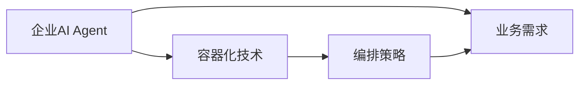
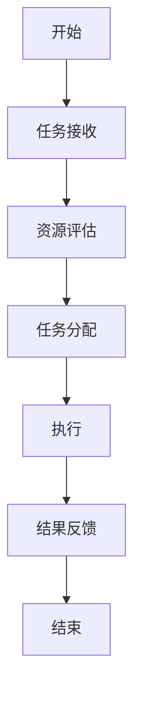
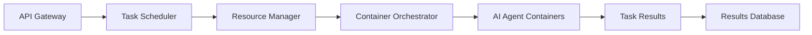

                 


# 企业AI Agent的容器化应用编排策略

## 关键词：企业AI Agent，容器化应用，编排策略，分布式系统，资源分配

## 摘要：  
随着人工智能技术的快速发展，企业AI Agent在各个行业的应用日益广泛。为了提高效率、降低成本并增强系统的可扩展性，容器化技术被引入到AI Agent的管理与编排中。本文将详细探讨企业AI Agent的容器化应用编排策略，涵盖核心概念、算法原理、系统架构设计、项目实战等内容，为读者提供全面的技术指导。

---

## 第一部分: 企业AI Agent的容器化应用编排背景

### 第1章: 问题背景与问题描述

#### 1.1 企业AI Agent的定义与特点
企业AI Agent是一种智能代理系统，能够感知环境、理解业务需求并执行任务。其特点包括：
- **自主性**：无需人工干预，自动完成任务。
- **反应性**：能够实时感知环境变化并调整行为。
- **协作性**：与其他系统或AI Agent协同工作，完成复杂任务。

#### 1.2 容器化技术在企业AI Agent中的应用背景
容器化技术（如Docker）通过将应用程序及其依赖打包为轻量级容器，实现了环境一致性与快速部署。在企业AI Agent中，容器化技术可以帮助：
- **快速部署**：AI Agent可以在任何环境中快速启动。
- **资源隔离**：确保不同AI Agent之间的资源互不影响。
- **弹性扩展**：根据负载自动调整资源分配。

#### 1.3 问题解决目标与边界
企业AI Agent的容器化编排目标是：
- 提高系统的可用性与可靠性。
- 最优化资源利用率。
- 实现高效的分布式任务调度。

边界包括：
- 仅关注容器化编排策略，不涉及底层容器技术实现。
- 专注于企业级AI Agent的应用，不涉及个人或小规模应用。

### 第2章: 核心概念与联系

#### 2.1 核心概念原理
- **容器化技术**：通过容器化实现环境一致性与资源隔离。
- **编排策略**：定义容器的部署、调度与资源分配规则。
- **AI Agent**：智能代理系统，负责执行业务逻辑。

#### 2.2 概念属性特征对比
| 概念         | 属性特征                 |
|--------------|--------------------------|
| 容器化技术    | 轻量级、环境隔离、可移植  |
| 编排策略     | 自动化、高效、可扩展      |
| AI Agent     | 智能化、自主性、协作性    |

#### 2.3 实体关系架构


---

## 第二部分: 核心概念与联系

### 第3章: 核心概念与联系

#### 3.1 容器化编排策略的核心原理
容器化编排策略通过定义容器的生命周期管理、资源分配和任务调度规则，确保系统高效运行。其核心包括：
- **任务调度**：根据负载动态分配任务。
- **资源分配**：基于容器需求分配计算资源。
- **负载均衡**：确保系统资源利用均衡。

#### 3.2 AI Agent与容器化编排的关系
AI Agent通过容器化编排策略实现任务的高效执行与资源的最优利用。容器化编排为AI Agent提供了：
- **快速部署能力**：AI Agent可以在任何环境中快速启动。
- **弹性扩展能力**：根据负载自动调整容器数量。
- **高可用性**：通过容器的自动重启和替换保证系统可靠性。

---

## 第三部分: 算法原理讲解

### 第4章: 算法原理与实现

#### 4.1 基于资源分配的优化算法
为了实现高效的资源分配，我们采用基于资源利用率的优化算法。该算法通过评估每个容器的资源需求，动态调整资源分配策略。

#### 4.2 算法流程图


#### 4.3 算法实现代码
```python
def allocate_resource(tasks, resources):
    allocated_tasks = []
    remaining_resources = resources
    for task in tasks:
        if task.requested_resources <= remaining_resources:
            allocated_tasks.append(task)
            remaining_resources -= task.requested_resources
        else:
            continue
    return allocated_tasks, remaining_resources
```

---

## 第四部分: 系统分析与架构设计

### 第5章: 系统分析与架构设计

#### 5.1 项目背景与目标
企业AI Agent的容器化应用编排系统旨在通过容器化技术实现AI Agent的高效部署与管理，提升系统的可用性与扩展性。

#### 5.2 系统功能设计
系统功能包括：
- **任务接收与解析**：接收业务任务并解析需求。
- **资源评估与分配**：评估系统资源并动态分配。
- **任务执行与反馈**：执行任务并反馈结果。

#### 5.3 系统架构设计


---

## 第五部分: 项目实战

### 第6章: 项目实战

#### 6.1 环境安装
安装Docker和Kubernetes：
```bash
# 安装Docker
sudo apt-get update && sudo apt-get install docker.io
# 安装Kubernetes
curl -s https://get.docker.com | bash -s docker
```

#### 6.2 核心功能实现
实现资源分配算法：
```python
def allocate_resource(tasks, resources):
    allocated_tasks = []
    remaining_resources = resources
    for task in tasks:
        if task.requested_resources <= remaining_resources:
            allocated_tasks.append(task)
            remaining_resources -= task.requested_resources
        else:
            continue
    return allocated_tasks, remaining_resources
```

#### 6.3 应用案例分析
案例分析：假设我们有3个AI Agent任务，每个任务需要2个CPU核。系统总资源为6个CPU核。通过资源分配算法，可以分配3个任务，每个任务分配2个CPU核，资源利用率为100%。

---

## 第六部分: 最佳实践与总结

### 第7章: 最佳实践与总结

#### 7.1 最佳实践
- **资源预留**：为关键任务预留资源，确保系统稳定性。
- **监控与日志**：实时监控容器运行状态，记录日志以便排查问题。
- **弹性伸缩**：根据负载动态调整容器数量，优化资源利用。

#### 7.2 小结
企业AI Agent的容器化应用编排策略通过高效的资源分配与任务调度，显著提升了系统的可用性与扩展性。通过本文的详细讲解，读者可以深入了解其核心原理与实现方法。

#### 7.3 注意事项
- 确保容器化编排策略与业务需求匹配。
- 定期优化资源分配算法，提升系统性能。
- 注意容器间的依赖关系，避免资源冲突。

#### 7.4 拓展阅读
- 《Docker容器化技术入门与实践》
- 《Kubernetes集群搭建与管理》
- 《分布式系统设计与实现》

---

## 作者：AI天才研究院/AI Genius Institute & 禅与计算机程序设计艺术 /Zen And The Art of Computer Programming

