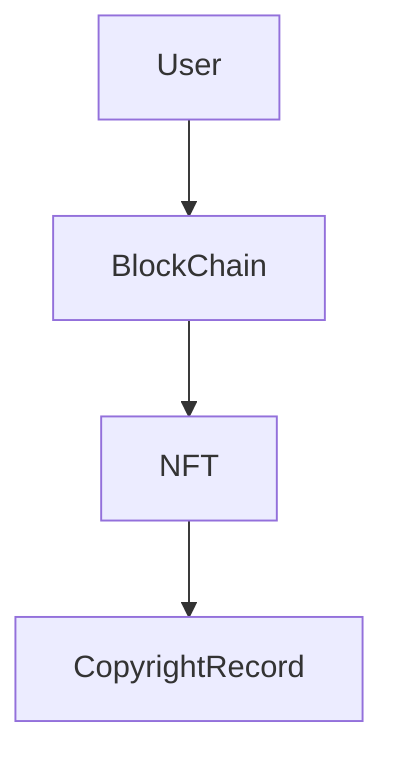
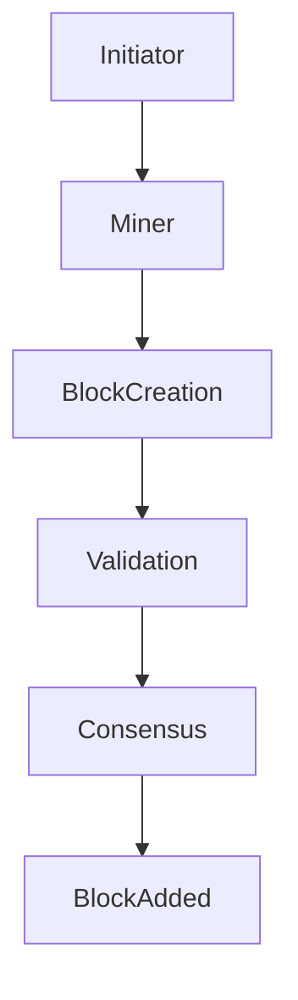
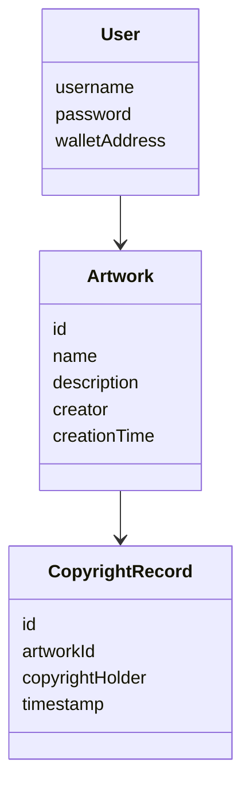
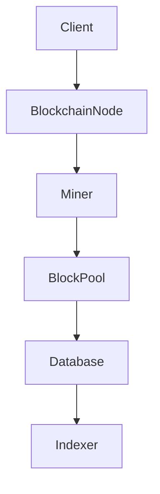
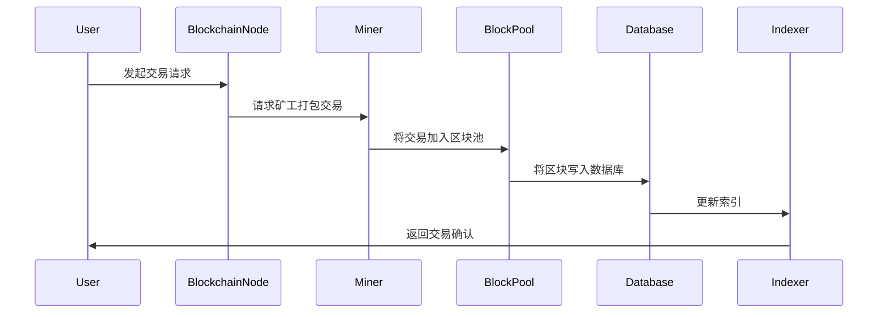

                 


# 企业估值中的区块链数字艺术品版权管理平台评估

> **关键词：** 区块链、数字艺术品、版权管理、企业估值、智能合约、共识机制

> **摘要：** 本文深入探讨了区块链技术在数字艺术品版权管理中的应用，分析了区块链数字艺术品版权管理平台对企业估值的影响。文章从背景介绍、核心概念、算法原理、系统架构到项目实战，全面解析了该平台的构建与评估过程，为企业估值提供了新的视角和方法。

---

## 第一部分: 背景介绍

### 第1章: 问题背景与描述

#### 1.1 数字艺术品版权管理的现状与挑战

- **数字艺术品的定义与特点**
  - 数字艺术品是指以数字形式存在的艺术作品，如数字画作、音乐、视频等。
  - 特点：可复制性强、易于传播、难以确权。

- **当前数字艺术品版权管理的痛点**
  - 版权归属难以证明：由于数字内容易于复制和传播，创作者的版权容易被侵犯。
  - 交易过程不透明：艺术品交易过程中，买家和卖家之间缺乏信任机制，容易出现欺诈行为。
  - 估值困难：缺乏统一的估值标准和透明的交易记录，导致艺术品价值难以准确评估。

- **区块链技术在版权管理中的潜在价值**
  - 区块链的去中心化特性可以确保数字艺术品的版权信息不可篡改。
  - 智能合约可以自动执行交易，减少中间环节，提高交易透明度。
  - 区块链的分布式账本可以记录艺术品的全生命周期，为估值提供可靠依据。

#### 1.2 区块链技术的基本概念与特点

- **区块链的核心原理**
  - 区块链是一种去中心化的分布式账本技术，通过密码学保证数据的安全性和完整性。
  - 每个区块包含交易信息和时间戳，区块之间通过哈希指针连接，形成一条不可篡改的链。

- **区块链的主要特点**
  - **去中心化：** 没有单点控制，数据由多个节点共同维护。
  - **不可篡改：** 数据一旦写入区块链，难以被修改。
  - **透明性：** 区块链上的交易记录对所有参与者公开，但参与者身份可以匿名。

- **区块链在企业估值中的应用潜力**
  - 提供透明的交易记录，增强投资者信任。
  - 通过智能合约自动执行合同条款，降低交易成本。
  - 提供实时的市场数据，帮助企业快速评估资产价值。

### 第2章: 问题解决与边界定义

#### 2.1 区块链数字艺术品版权管理平台的解决方案

- **平台的核心功能设计**
  - **版权登记：** 创作者可以在平台上登记数字艺术品的版权信息，包括作品的创作时间、作者身份等。
  - **版权追踪：** 平台可以记录数字艺术品的每一次交易和使用情况，确保版权信息的可追溯性。
  - **版权交易：** 平台支持数字艺术品的在线交易，通过智能合约自动完成交易流程。

- **平台如何实现版权确权与追踪**
  - 利用区块链的去中心化特性，确保版权信息的安全性和不可篡改性。
  - 通过数字签名技术，确保创作者的身份认证和版权归属。

- **平台如何支持艺术品的交易与估值**
  - 提供透明的交易记录，帮助买家和卖家建立信任。
  - 基于历史交易数据，提供艺术品的市场估值参考。

#### 2.2 平台的边界与外延

- **平台的功能边界**
  - 平台仅负责数字艺术品的版权管理，不涉及实物艺术品。
  - 平台不直接参与艺术品的交易，但可以通过智能合约支持交易的自动化。

- **平台的适用范围与限制**
  - 适用于数字形式的艺术品，如数字画作、音乐、视频等。
  - 由于区块链的去中心化特性，平台需要依赖社区的共同维护。

- **平台与现有法律框架的结合**
  - 平台需要与相关法律法规相结合，确保版权管理的合法性。
  - 平台可以通过区块链技术提供法律证据，帮助创作者维护版权权益。

### 第3章: 核心概念与联系

#### 3.1 核心概念的原理分析

- **区块链的共识机制**
  - 共识机制是区块链的核心技术，确保所有节点达成一致。
  - 常见的共识机制包括工作量证明（PoW）、权益证明（PoS）、实用拜占庭容错（PBFT）等。

- **数字签名与身份验证**
  - 数字签名通过加密技术确保数据的完整性和真实性。
  - 身份验证用于确认用户身份，确保只有合法用户可以进行操作。

- **智能合约在版权管理中的应用**
  - 智能合约是区块链上的自动执行程序，可以用于自动执行版权交易和支付。

#### 3.2 核心概念的对比分析

| **对比项** | **区块链** | **传统数据库** |
|------------|------------|----------------|
| **数据存储** | 去中心化存储，数据分布在网络中的多个节点 | 中心化存储，数据集中在一个或多个中心服务器 |
| **数据修改** | 数据一旦写入区块链，难以篡改 | 数据可以被修改或删除 |
| **透明性** | 高度透明，所有交易记录对参与者公开 | 透明性较低，数据可能仅限于授权用户访问 |

#### 3.3 实体关系图



---

## 第二部分: 算法原理讲解

### 第4章: 区块链共识机制的实现

#### 4.1 共识机制的选择与实现

- **工作量证明机制（PoW）**
  - PoW通过计算哈希值来证明工作量，确保区块链的安全性。
  - 优点：安全性高，抗女娲攻击能力强。
  - 缺点：需要大量计算资源，能耗较高。

- **权益证明机制（PoS）**
  - PoS通过持有代币的数量来决定记账权，减少能源消耗。
  - 优点：节能环保，适合大规模应用。
  - 缺点：安全性依赖于代币的分布情况，存在被恶意攻击的风险。

- **混合共识机制的设计**
  - 结合PoW和PoS的优点，通过动态调整权重来实现更优的安全性和效率。

#### 4.2 共识机制的实现流程



---

## 第三部分: 系统分析与架构设计方案

### 第5章: 系统分析与架构设计

#### 5.1 系统功能设计

- **领域模型类图**


#### 5.2 系统架构设计



#### 5.3 系统接口设计

- **用户接口**
  - 登录接口：`POST /api/login`
  - 注册接口：`POST /api/register`
  - 上链接口：`POST /api/upload-artwork`

- **区块链节点接口**
  - 获取区块头：`GET /api/block-header`
  - 获取交易记录：`GET /api/transaction`

#### 5.4 系统交互序列图



---

## 第四部分: 项目实战

### 第6章: 项目实战

#### 6.1 环境安装

```bash
pip install eth_account
pip install web3
pip install hexbytes
```

#### 6.2 核心代码实现

```python
from eth_account import Account
from web3 import Web3
from hexbytes import HexBytes

# 初始化区块链节点
web3 = Web3(Web3.HTTPProvider("http://localhost:8545"))

# 创建用户账户
account = Account.new_account("password")

# 数字签名
signed_transaction = account.sign_transaction({
    'to': '0x123456789...',
    'value': 1000000000000000000,
    'gas': 2000000,
    'gasPrice': 1000000000000,
    'nonce': 0
})

# 发送交易
tx_hash = web3.eth.send_raw_transaction(signed_transaction.rawTransaction)
print(f"Transaction hash: {tx_hash.hex()}")
```

#### 6.3 代码应用解读与分析

- **数字签名**：通过 `Account.sign_transaction` 方法对交易进行签名，确保交易的合法性和真实性。
- **智能合约**：通过 `web3` 接口与区块链节点交互，实现智能合约的部署和执行。

#### 6.4 实际案例分析

- **案例背景**：某数字艺术家在平台上登记了他的数字画作《抽象艺术1号》。
- **登记流程**：
  1. 艺术家创建账户并登录平台。
  2. 艺术家上传画作并填写版权信息。
  3. 平台通过区块链技术对画作进行哈希计算，并将版权信息写入区块链。
  4. 画作的版权信息包括创作时间、作者身份等，确保信息不可篡改。
  5. 画作的每一次交易都会被记录在区块链上，确保交易的透明性和可追溯性。

#### 6.5 项目小结

- **项目成果**：成功实现了数字艺术品的版权登记、交易追踪和估值功能。
- **项目经验**：区块链技术的应用可以有效解决数字艺术品版权管理中的痛点，提高交易的透明度和信任度。

---

## 第五部分: 最佳实践

### 第7章: 最佳实践

#### 7.1 小结

- 本文详细探讨了区块链技术在数字艺术品版权管理中的应用，分析了区块链数字艺术品版权管理平台对企业估值的影响。
- 通过系统的架构设计和项目实战，展示了如何利用区块链技术实现数字艺术品的版权确权、交易追踪和估值功能。

#### 7.2 注意事项

- **法律合规性**：平台需要符合相关法律法规，确保版权管理的合法性。
- **安全性**：平台需要采取多层次的安全防护措施，防止黑客攻击和数据泄露。
- **用户体验**：平台需要注重用户体验设计，确保用户能够方便地使用平台功能。

#### 7.3 拓展阅读

- 推荐阅读《区块链技术及应用》、《智能合约开发指南》等书籍，深入了解区块链技术和智能合约的应用。

---

**作者：AI天才研究院/AI Genius Institute & 禅与计算机程序设计艺术 /Zen And The Art of Computer Programming**

---

**感谢您的阅读！**

