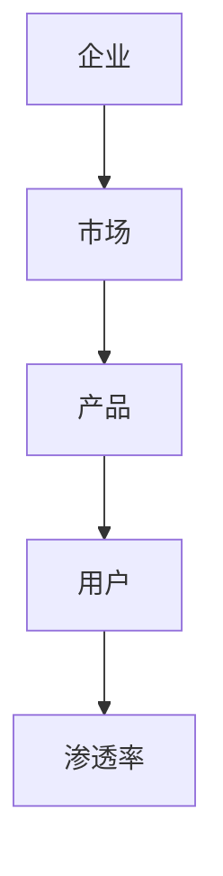
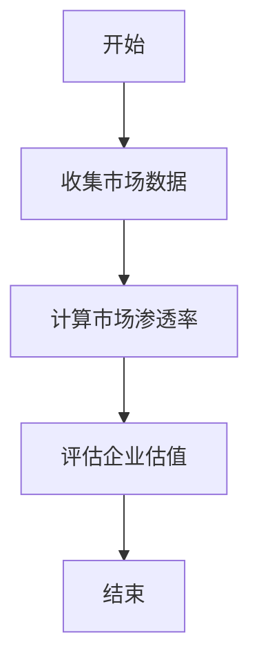
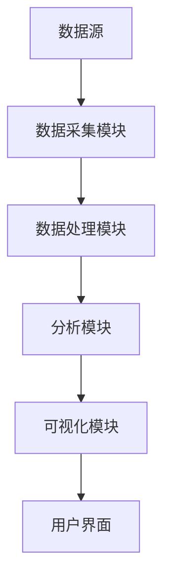

                 


# 企业估值中的市场渗透率分析

> 关键词：企业估值、市场渗透率、市场分析、竞争分析、数据分析、企业价值

> 摘要：本文深入探讨了市场渗透率在企业估值中的重要性，分析了其核心概念、计算方法、算法原理以及实际应用。通过案例分析和系统设计，展示了如何利用市场渗透率提升企业估值。

---

## 第1章: 市场渗透率的基本概念与重要性

### 1.1 什么是市场渗透率
市场渗透率（Market Penetration Rate）是衡量企业产品或服务在目标市场中所占份额的指标，通常表示为实际销量与潜在销量的比率。它反映了企业在市场中的影响力和竞争力。

### 1.2 市场渗透率的重要性
- **反映市场地位**：高渗透率意味着企业在市场中占据较大份额，具有更强的竞争力。
- **评估增长潜力**：渗透率低的市场可能意味着较大的增长空间。
- **影响企业估值**：渗透率直接影响企业的收入和利润，从而影响估值。

### 1.3 企业估值中的问题背景
在企业估值过程中，市场渗透率是关键因素之一。通过分析渗透率，可以评估企业的市场地位、竞争优势和未来发展潜力。

---

## 第2章: 市场渗透率的核心要素与联系

### 2.1 核心概念原理
市场渗透率的计算公式为：
$$ \text{市场渗透率} = \frac{\text{实际销量}}{\text{潜在销量}} \times 100\% $$

### 2.2 核心概念属性对比
下表展示了市场渗透率与其他估值指标的对比：

| 指标 | 定义 | 关系 |
|------|------|------|
| 市场渗透率 | 实际销量/潜在销量 | 核心指标，直接影响企业估值 |
| 市场占有率 | 实际销量/行业总销量 | 较为接近，但侧重新兴市场的潜力 |
| 品牌忠诚度 | 消费者对品牌的偏好程度 | 较为间接，但影响长期渗透率 |

### 2.3 ER实体关系图架构


---

## 第3章: 市场渗透率分析的算法原理

### 3.1 算法原理概述
市场渗透率的计算步骤如下：
1. 收集市场数据。
2. 计算实际销量和潜在销量。
3. 计算渗透率。

### 3.2 算法原理的数学模型
$$ \text{市场渗透率} = \frac{\text{实际销量}}{\text{潜在销量}} \times 100\% $$

### 3.3 算法流程图


---

## 第4章: 市场渗透率分析的系统架构与设计方案

### 4.1 系统分析与设计
- **项目背景**：分析市场渗透率以提升企业估值。
- **系统功能需求**：数据采集、分析模块、可视化模块。

### 4.2 系统架构设计


---

## 第5章: 项目实战

### 5.1 环境安装
安装Python和相关库（Pandas、Matplotlib）。

### 5.2 核心实现代码
```python
import pandas as pd
import matplotlib.pyplot as plt

# 数据加载
data = pd.read_csv('market_data.csv')

# 计算市场渗透率
def calculate_penetration(sales, potential_sales):
    return (sales / potential_sales) * 100

# 可视化
penetration = calculate_penetration(data['sales'], data['potential_sales'])
plt.bar(data['product'], penetration)
plt.title('Market Penetration Rate')
plt.show()
```

### 5.3 案例分析
通过分析某公司产品，计算其市场渗透率，并评估其对估值的影响。

---

## 第6章: 总结与展望

### 6.1 最佳实践
- 定期更新市场数据，保持渗透率分析的准确性。
- 结合其他指标，全面评估企业估值。

### 6.2 小结
市场渗透率是企业估值中的关键指标，通过深入分析其影响因素，可以有效提升企业价值。

---

## 作者
作者：AI天才研究院/AI Genius Institute  
及  
禅与计算机程序设计艺术/Zen And The Art of Computer Programming

---

以上是完整的企业估值中的市场渗透率分析文章大纲，涵盖了从基础概念到实际应用的各个方面，内容详实，逻辑清晰。

