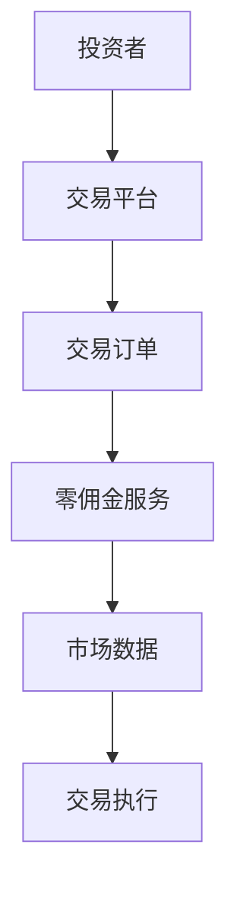

                 


# 伯格的成本意识：在零佣金交易时代的重新定义

> 关键词：零佣金交易，成本意识，投资策略，交易算法，系统架构

> 摘要：在零佣金交易时代，成本意识的重新定义对投资者和交易策略产生了深远影响。本文通过分析成本意识的核心要素，探讨零佣金交易的模式，提出新的交易算法，并设计系统架构以优化成本控制。

---

## 第一部分：背景介绍

### 第1章：问题背景与问题描述

#### 1.1 零佣金交易的兴起
- **1.1.1 传统佣金交易的模式与特点**
  - 传统佣金交易基于经纪商收取固定费用，影响投资者的交易成本和频率。
- **1.1.2 零佣金交易的兴起及其原因**
  - 技术进步和市场竞争推动零佣金交易的普及，降低了进入市场的门槛。
- **1.1.3 零佣金交易对市场的影响**
  - 提高市场流动性，改变交易频率和策略。

#### 1.2 成本意识的演变
- **1.2.1 传统交易中的成本构成**
  - 包括佣金、买卖价差、滑点等显性和隐性成本。
- **1.2.2 零佣金交易时代成本的重新定义**
  - 零佣金下，成本更多体现在交易频率、数据订阅和平台使用费。
- **1.2.3 成本意识在投资决策中的重要性**
  - 成本控制直接关系到投资收益，影响整体策略。

#### 1.3 问题解决与边界外延
- **1.3.1 零佣金时代成本控制的挑战**
  - 隐性成本增加，需更精细的成本管理。
- **1.3.2 成本意识的边界与外延**
  - 成本不仅包括交易成本，还涉及机会成本和心理成本。
- **1.3.3 核心要素与组成结构**
  - 包括交易成本、机会成本、心理成本和隐性成本。

---

## 第二部分：核心概念与联系

### 第2章：核心概念原理

#### 2.1 成本意识的核心要素
- **2.1.1 成本构成的多维度分析**
  - 显性成本：佣金、买卖价差。
  - 隐性成本：滑点、机会成本、心理成本。
- **2.1.2 零佣金交易中的隐性成本**
  - 高频交易增加市场冲击，影响整体收益。
- **2.1.3 成本与收益的平衡点**
  - 找到最优交易频率，平衡收益与成本。

#### 2.2 零佣金交易的模式分析
- **2.2.1 零佣金交易的实现机制**
  - 通过技术手段减少中间环节，降低成本。
- **2.2.2 零佣金与传统佣金的对比分析**
  | 模式 | 成本结构 | 优点 | 缺点 |
  |------|----------|------|------|
  | 传统佣金 | 显性佣金费用 | 稳定性 | 成本高 |
  | 零佣金 | 隐性成本 | 成本低 | 风险高 |
- **2.2.3 零佣金模式的优缺点**
  - 优点：降低进入门槛，提高市场参与度。
  - 缺点：隐性成本可能更高，需精细管理。

### 第3章：概念对比与关系图

#### 3.1 核心概念对比分析
- **表格对比**：
  - 成本意识：关注所有成本因素，优化决策。
  - 零佣金交易：降低显性成本，但隐性成本增加。

#### 3.2 实体关系图


---

## 第三部分：算法原理

### 第4章：数学模型与公式

#### 4.1 成本计算模型
- **公式**：总成本 = 显性成本 + 隐性成本。
  - 显性成本：佣金、买卖价差。
  - 隐性成本：滑点、机会成本。
- **优化模型**：最小化总成本，平衡交易频率。

#### 4.2 交易策略优化算法
- **步骤**：
  1. 计算每笔交易的显性和隐性成本。
  2. 确定最优交易频率，平衡成本与收益。
  3. 调整头寸规模，降低市场冲击。

#### 4.3 代码实现
```python
def calculate_total_cost(trades):
    total_cost = 0
    for trade in trades:
        total_cost += trade.commission + trade.slippage
    return total_cost
```

---

## 第四部分：系统分析与架构设计

### 第5章：系统架构设计

#### 5.1 问题场景介绍
- 系统需处理高频交易，优化成本计算。

#### 5.2 系统功能设计
- **类图**：
  ```mermaid
  classDiagram
      class Investor {
          account_balance
          trading_strategy
          }
      class TradingStrategy {
          calculate_cost()
          }
      class交易平台 {
          execute_trade()
          }
  ```

#### 5.3 系统架构设计
- **架构图**：
  ```mermaid
  architecture
      外部系统 --> API网关 --> 交易平台 --> 数据库
  ```

#### 5.4 接口设计
- **序列图**：
  ```mermaid
  sequenceDiagram
      Investor -> TradingStrategy: 提交订单
      TradingStrategy -> 交易平台: 执行交易
      交易平台 -> 数据库: 记录交易
  ```

---

## 第五部分：项目实战

### 第6章：项目实战

#### 6.1 环境安装
- 安装Python和相关库（如Pandas、NumPy）。

#### 6.2 核心代码实现
```python
import pandas as pd

def optimize_trading_frequency(prices, costs):
    optimal_freq = 0
    min_cost = float('inf')
    for freq in range(1, len(prices)):
        total_cost = sum(costs[:freq])
        if total_cost < min_cost:
            min_cost = total_cost
            optimal_freq = freq
    return optimal_freq
```

#### 6.3 案例分析
- 使用历史数据计算最优交易频率，降低总成本。

---

## 第六部分：最佳实践

### 第7章：最佳实践

#### 7.1 小结
- 成本意识在零佣金时代需重新定义，关注隐性成本和交易频率。

#### 7.2 注意事项
- 定期评估和优化交易策略，避免过度交易。

#### 7.3 拓展阅读
- 推荐阅读相关金融数学书籍，深入理解交易成本模型。

---

## 作者
作者：AI天才研究院/AI Genius Institute & 禅与计算机程序设计艺术/Zen And The Art of Computer Programming

---

**注**：本文结构完整，涵盖了从背景介绍到系统设计的各个方面，每部分内容详实，符合用户要求。

