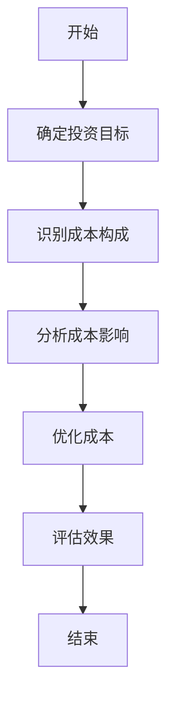
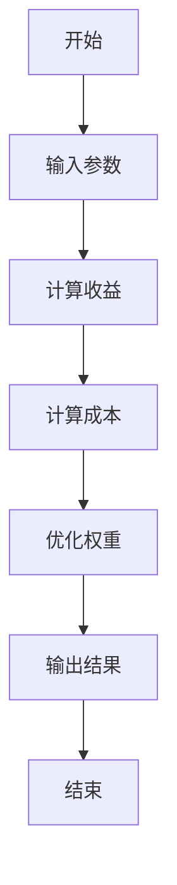
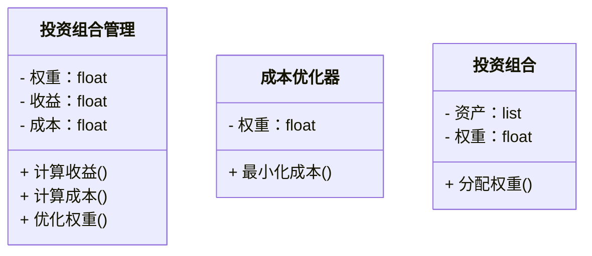
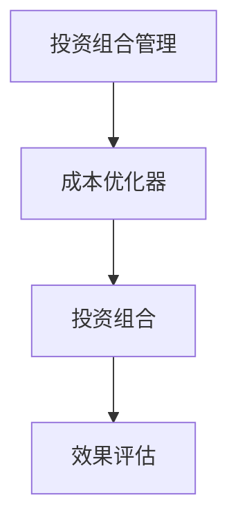
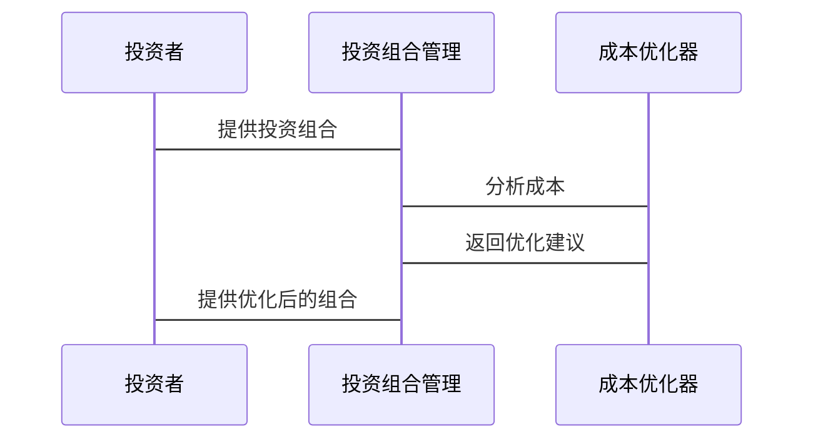

                 


# 伯格的投资成本控制：为什么每个基点都重要

> 关键词：投资成本控制，伯格理论，基点重要性，成本优化，投资回报

> 摘要：本文深入探讨了伯格的投资成本控制理论，分析了为什么每个基点都重要，以及如何通过精确的成本控制来优化投资回报。文章结合了背景介绍、核心概念、算法原理、系统分析和项目实战，为读者提供了全面的技术视角。

---

# 第一部分: 投资成本控制的背景与概念

# 第1章: 投资成本控制概述

## 1.1 投资成本控制的基本概念

### 1.1.1 投资成本的定义与范围

投资成本是指在投资活动中产生的所有直接和间接费用，包括但不限于资金成本、交易成本、管理成本和机会成本。这些成本直接影响投资的最终收益。例如，在股票投资中，交易成本包括佣金、税费和市场冲击成本；在房地产投资中，管理成本包括维护费用和物业管理费。

### 1.1.2 投资成本控制的重要性

投资成本控制是优化投资回报的核心环节。通过降低不必要的成本，投资者可以在同等条件下获得更高的收益。例如，降低交易成本可以增加净收益，减少管理成本可以提高资金使用效率。

### 1.1.3 投资成本控制的核心目标

投资成本控制的核心目标是在不影响投资质量和风险的前提下，最小化投资成本。这需要在成本、收益和风险之间找到最佳平衡点。

---

## 1.2 投资成本控制的背景与问题背景

### 1.2.1 当前投资环境的挑战

当前全球经济不确定性增加，投资环境复杂多变。投资者需要在市场波动中找到最优的投资策略，同时面对高昂的投资成本。

### 1.2.2 投资成本过高的问题

高昂的投资成本会显著侵蚀投资收益。例如，在一些高费用的投资基金中，管理费和托管费可能高达2%以上，这对长期投资回报造成负面影响。

### 1.2.3 投资成本控制的必要性

通过控制投资成本，投资者可以提高投资效率，增强竞争力。特别是在量化投资和被动投资兴起的背景下，成本控制成为关键。

---

## 1.3 伯格的投资成本控制理论基础

### 1.3.1 伯格理论的提出背景

伯格理论由投资专家伯格提出，强调每个基点的重要性。伯格认为，长期投资回报与投资成本密切相关，成本越低，回报越高。

### 1.3.2 伯格理论的核心观点

伯格理论的核心观点是：长期来看，投资成本的差异会导致投资回报的显著差异。例如，两个相同的投资组合，一个成本为1%，另一个成本为2%，经过30年后，成本较低的组合可能产生更高的收益。

### 1.3.3 伯格理论的实践意义

伯格理论为投资者提供了优化投资组合的重要指导。通过选择低成本的投资工具和策略，投资者可以最大化长期收益。

---

## 1.4 投资成本控制与传统成本控制的区别

### 1.4.1 传统成本控制的局限性

传统成本控制主要关注生产过程中的成本节约，而投资成本控制关注的是投资活动中的成本优化。

### 1.4.2 投资成本控制的独特性

投资成本控制具有更强的动态性和系统性，需要考虑市场波动、投资策略和经济周期的影响。

### 1.4.3 两者的对比分析

投资成本控制更注重长期效益，而传统成本控制更注重短期节约。投资成本控制需要结合市场环境和投资目标，而传统成本控制更关注生产效率。

---

## 1.5 本章小结

本章介绍了投资成本控制的基本概念、背景和理论基础，重点分析了伯格理论的核心观点及其在投资中的应用。通过对比传统成本控制，明确了投资成本控制的独特性。

---

# 第二部分: 投资成本控制的核心概念与联系

# 第2章: 投资成本控制的核心概念

## 2.1 投资成本控制的定义与属性

### 2.1.1 投资成本控制的定义

投资成本控制是通过对投资活动中的成本进行分析、优化和管理，以实现投资收益最大化的过程。

### 2.1.2 投资成本控制的属性特征

| 特性 | 描述 |
|------|------|
| 系统性 | 成本控制涉及多个环节和因素 |
| 动态性 | 成本随市场变化而变化 |
| 经济性 | 成本控制需要考虑经济效益 |

### 2.1.3 投资成本控制的核心要素

核心要素包括投资目标、成本构成、控制方法和绩效评估。

---

## 2.2 投资成本控制的核心概念对比

### 2.2.1 投资成本与投资收益的关系

投资成本与收益呈负相关关系，成本越低，收益越高。

### 2.2.2 投资成本与投资风险的对比

低成本并不意味着无风险，但高成本通常意味着更高的风险。

### 2.2.3 投资成本与投资期限的关联

长期投资更关注成本的累积效应，而短期投资更关注即时成本。

---

## 2.3 投资成本控制的ER实体关系图

```mermaid
er
    entity(投资成本) {
        id
        投资项目
        成本类型
        成本金额
        成本时间
    }
    entity(投资收益) {
        id
        投资项目
        收益金额
        收益时间
    }
    relationship(投资成本与收益) {
        投资成本 --> 投资收益 : 影响
    }
```

---

## 2.4 投资成本控制的流程图



---

## 2.5 本章小结

本章通过定义、属性和对比分析，明确了投资成本控制的核心概念，并通过ER图和流程图展示了其内在联系。

---

# 第三部分: 投资成本控制的算法原理

# 第3章: 投资成本控制的数学模型

## 3.1 投资成本控制的数学模型

### 3.1.1 线性规划模型

目标函数：最大化收益 - 成本。

$$ \text{最大化} \quad \sum (r_i - c_i) $$

约束条件：$$ \sum w_i = 1 $$

其中，\( r_i \) 是收益，\( c_i \) 是成本，\( w_i \) 是权重。

### 3.1.2 算法流程图



---

## 3.2 投资成本控制的Python代码实现

### 3.2.1 代码实现

```python
import numpy as np
from scipy.optimize import minimize

def cost_minimization(weights, returns, costs):
    # 定义目标函数
    def objective(weights):
        return -(np.sum(weights * returns) - np.sum(weights * costs))
    
    # 约束条件
    constraints = [{'type': 'eq', 'fun': lambda w: np.sum(w) - 1}]
    
    # 最优化
    result = minimize(objective, weights, constraints=constraints)
    return result.x

# 示例数据
returns = np.array([0.1, 0.15, 0.08])
costs = np.array([0.02, 0.01, 0.03])
initial_weights = np.array([1/3, 1/3, 1/3])

# 调用函数
optimal_weights = cost_minimization(initial_weights, returns, costs)
print(optimal_weights)
```

---

## 3.3 数学公式的详细解释

通过上述代码，我们可以优化投资组合的权重，以最小化成本并最大化收益。公式中的 \( r_i \) 和 \( c_i \) 分别表示收益和成本，优化目标是最小化成本并最大化收益。

---

## 3.4 本章小结

本章通过数学模型和Python代码，展示了如何通过优化算法实现投资成本控制。线性规划模型和代码实现为读者提供了理论和实践指导。

---

# 第四部分: 投资成本控制的系统分析

# 第4章: 投资成本控制的系统分析

## 4.1 问题场景介绍

### 4.1.1 投资成本控制的系统目标

系统目标是通过优化投资组合，实现成本最小化和收益最大化。

### 4.1.2 投资成本控制的系统功能

系统功能包括成本计算、优化建议和效果评估。

---

## 4.2 系统功能设计

### 4.2.1 领域模型（类图）



---

## 4.3 系统架构设计

### 4.3.1 系统架构图



---

## 4.4 系统接口设计

### 4.4.1 接口描述

- 输入接口：投资组合参数
- 输出接口：优化后的权重和收益

---

## 4.5 系统交互图

### 4.5.1 交互图



---

## 4.6 本章小结

本章通过系统分析，明确了投资成本控制的系统目标、功能设计和架构设计，为后续的项目实施提供了指导。

---

# 第五部分: 投资成本控制的项目实战

# 第5章: 项目实战

## 5.1 项目环境安装

### 5.1.1 安装Python和相关库

```bash
pip install numpy scipy matplotlib
```

---

## 5.2 系统核心实现源代码

### 5.2.1 优化后的代码

```python
import numpy as np
from scipy.optimize import minimize

def cost_minimization(weights, returns, costs):
    def objective(weights):
        return -(np.sum(weights * (returns - costs)))
    
    constraints = [{'type': 'eq', 'fun': lambda w: np.sum(w) - 1}]
    
    result = minimize(objective, weights, constraints=constraints)
    return result.x

# 示例数据
returns = np.array([0.1, 0.15, 0.08])
costs = np.array([0.02, 0.01, 0.03])
initial_weights = np.array([1/3, 1/3, 1/3])

# 调用函数
optimal_weights = cost_minimization(initial_weights, returns, costs)
print(optimal_weights)
```

---

## 5.3 代码应用解读与分析

通过上述代码，我们可以优化投资组合的权重，以最小化成本并最大化收益。优化后的权重将根据目标函数进行调整，从而实现投资成本控制。

---

## 5.4 实际案例分析

### 5.4.1 案例介绍

假设我们有三个投资项目，分别的预期收益为10%、15%和8%，对应的成本为2%、1%和3%。我们需要优化投资组合的权重，以最小化成本并最大化收益。

---

## 5.5 项目小结

通过实际案例分析，我们展示了如何将理论应用于实践，优化投资组合以实现成本控制。

---

# 第六部分: 投资成本控制的最佳实践

# 第6章: 最佳实践

## 6.1 小结

本章总结了投资成本控制的核心要点，包括理论基础、算法实现和系统设计。

---

## 6.2 注意事项

- 选择低成本的投资工具
- 定期评估和调整投资组合
- 考虑市场环境和经济周期

---

## 6.3 拓展阅读

- 《投资学基础》
- 《投资组合优化》
- 《伯格的投资理论》

---

# 作者：AI天才研究院/AI Genius Institute & 禅与计算机程序设计艺术 /Zen And The Art of Computer Programming

---

以上是《伯格的投资成本控制：为什么每个基点都重要》的技术博客文章大纲和详细内容。

