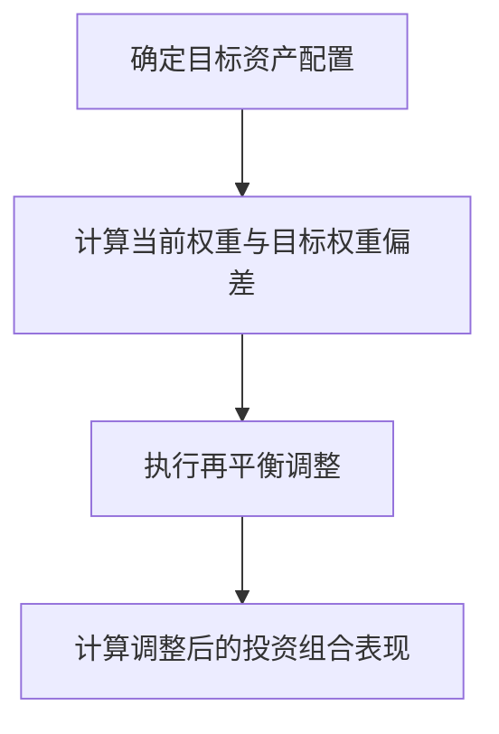

                 


# 伯格的投资组合再平衡：保持风险水平

> 关键词：投资组合再平衡、风险管理、资产配置、伯格策略、投资组合优化、风险平价

> 摘要：本文深入探讨了投资组合再平衡的核心概念、数学模型、算法实现以及系统架构设计。通过分析伯格的投资策略，结合现代投资组合理论和风险管理原则，本文详细介绍了如何通过再平衡保持风险水平，实现长期稳健的投资回报。文章内容涵盖从理论到实践的完整流程，适合投资者、金融从业者以及技术开发者阅读。

---

## 第一部分: 投资组合再平衡的背景与核心概念

### 第1章: 投资组合再平衡的基本概念

#### 1.1 投资组合再平衡的定义与作用

##### 1.1.1 投资组合再平衡的定义
投资组合再平衡是指定期或不定期地调整投资组合中各资产的权重，以维持预定的资产配置比例和风险水平。其核心目标是确保投资组合的表现与最初设定的投资目标一致。

##### 1.1.2 再平衡的必要性与目的
再平衡的必要性源于市场波动、资产价格变化以及投资者风险偏好的变化。通过再平衡，投资者可以：
- 维持目标资产配置比例
- 降低投资组合的整体风险
- 抓住市场波动带来的投资机会

##### 1.1.3 再平衡与投资目标的关系
再平衡是投资策略的重要组成部分，它通过调整资产权重，确保投资组合的表现与投资者的风险承受能力和收益目标一致。例如，当市场波动导致某一资产权重过高时，再平衡可以通过卖出该资产、买入其他资产来恢复目标配置。

#### 1.2 投资组合再平衡的类型与频率

##### 1.2.1 定期再平衡：年度、季度和月度
定期再平衡是基于固定时间间隔（如每年、每季度或每月）进行的调整。这种策略适用于风险偏好稳定、市场波动较小的情况。

##### 1.2.2 事件驱动再平衡：市场波动、资产价格变化
当市场发生重大波动或资产价格出现显著变化时，事件驱动再平衡可以及时调整投资组合的权重，以应对潜在风险。

##### 1.2.3 动态再平衡：基于实时市场数据的调整
动态再平衡是一种实时调整策略，适用于高频交易和风险管理需求较高的场景。

#### 1.3 投资组合再平衡的核心要素

##### 1.3.1 风险承受能力与投资目标
投资者的风险承受能力决定了其投资组合的配置比例。再平衡策略需要根据投资者的风险偏好进行动态调整。

##### 1.3.2 资产配置与权重调整
资产配置是投资组合的核心，再平衡通过调整各资产的权重，维持目标配置比例。

##### 1.3.3 再平衡成本与税务影响
再平衡操作会产生交易成本和税务负担，这些成本需要在再平衡策略中加以考虑。

---

### 第2章: 风险管理与投资组合再平衡

#### 2.1 风险管理的核心原则

##### 2.1.1 风险分散化：资产类别与地域分布
通过分散化投资，将资金分配到不同资产类别和地域，降低单一资产或市场的风险。

##### 2.1.2 风险与收益的平衡
在投资组合中，风险和收益是相互关联的。再平衡通过调整资产权重，找到风险与收益的最佳平衡点。

##### 2.1.3 风险管理框架下的再平衡策略
风险管理框架为再平衡提供了决策依据。例如，当某类资产的风险显著增加时，再平衡可以通过降低其权重来降低整体风险。

#### 2.2 投资组合再平衡与风险管理的关系

##### 2.2.1 再平衡如何降低风险敞口
通过调整资产权重，再平衡可以降低投资组合对高风险资产的敞口，从而降低整体风险。

##### 2.2.2 风险管理框架下的再平衡策略
在风险管理框架下，再平衡策略需要考虑市场波动、资产相关性以及投资者风险偏好等因素。

##### 2.2.3 再平衡对投资组合风险的影响
再平衡可以有效降低投资组合的波动性，但同时也可能增加交易成本和税务负担。

---

### 第3章: 伯格的投资组合再平衡方法

#### 3.1 伯格的投资哲学

##### 3.1.1 长期投资与价值投资
伯格强调长期投资和价值投资，认为市场短期波动不应影响长期投资策略。

##### 3.1.2 分散化投资的核心理念
分散化投资是伯格策略的核心，通过投资不同类型资产降低风险。

##### 3.1.3 风险管理与再平衡的结合
伯格将风险管理与再平衡结合，通过动态调整资产权重，保持投资组合的风险水平。

#### 3.2 伯格的再平衡策略

##### 3.2.1 风险平价策略：动态调整资产权重
风险平价策略是伯格再平衡的核心方法之一，通过动态调整各资产的权重，使投资组合的风险分布均匀。

##### 3.2.2 定期再平衡：保持目标资产配置
伯格建议定期（如季度或半年度）进行再平衡，以维持目标资产配置。

##### 3.2.3 事件驱动再平衡：应对市场波动
当市场发生重大波动时，伯格采用事件驱动再平衡，及时调整资产权重，降低风险敞口。

#### 3.3 伯格再平衡策略的数学模型

##### 3.3.1 资产配置的优化模型
伯格的再平衡策略基于现代投资组合理论，通过优化模型确定目标资产配置。

##### 3.3.2 风险平价的计算公式
风险平价计算公式为：
$$ \text{风险平价} = \frac{w_i \sigma_i}{\sum w_j \sigma_j} $$
其中，$w_i$ 是第 $i$ 个资产的权重，$\sigma_i$ 是其波动率。

##### 3.3.3 再平衡调整的数学推导
通过数学推导，伯格证明了动态再平衡可以有效降低投资组合的波动性，同时提高风险调整后的收益。

---

### 第4章: 投资组合再平衡的数学模型与算法

#### 4.1 投资组合优化的数学模型

##### 4.1.1 均值-方差优化模型
均值-方差优化模型是最常用的资产配置模型，其目标是最小化投资组合的波动性，同时实现预期收益。

##### 4.1.2 风险平价模型
风险平价模型通过调整资产权重，使投资组合的风险分布均匀。

##### 4.1.3 资产配置的约束条件
资产配置需要满足以下约束条件：
- 各资产权重之和为1
- 权重不能为负数

#### 4.2 再平衡算法的实现步骤

##### 4.2.1 确定目标资产配置
根据投资目标和风险偏好，确定目标资产配置比例。

##### 4.2.2 计算当前资产权重与目标权重的偏差
通过比较当前权重和目标权重，确定需要调整的资产。

##### 4.2.3 执行再平衡调整
通过买卖资产，调整权重以达到目标配置。

##### 4.2.4 计算调整后的投资组合表现
评估再平衡后的投资组合表现，包括收益、波动性和风险调整后收益。

#### 4.3 再平衡算法的流程图



---

## 第二部分: 投资组合再平衡的系统分析与架构设计

### 第5章: 系统分析与架构设计

#### 5.1 问题场景介绍
投资组合管理系统需要实时监控市场数据，动态调整资产权重，实现再平衡。

#### 5.2 系统功能设计

##### 5.2.1 领域模型


#### 5.3 系统架构设计

##### 5.3.1 系统架构图


---

## 第三部分: 投资组合再平衡的最佳实践与风险管理

### 第6章: 项目实战

#### 6.1 环境安装
安装Python和相关库（如pandas、numpy、scipy）。

#### 6.2 核心实现代码

##### 6.2.1 计算最优资产配置
```python
import numpy as np
import pandas as pd

def compute_optimal_weights(risks, returns, target_return):
    n = len(risks)
    cov_matrix = np.diag(risks)
    returns = np.array(returns)
    target_return = np.array(target_return)
    inv_cov = np.linalg.inv(cov_matrix)
    w = np.dot(inv_cov, returns) / np.sum(np.dot(inv_cov, returns))
    return w
```

##### 6.2.2 执行再平衡
```python
def rebalance_portfolio(current_weights, target_weights, prices, risk_free_rate):
    current_return = np.dot(current_weights, prices)
    target_return = np.dot(target_weights, prices)
    adjustment = target_return - current_return
    return adjustment
```

#### 6.3 实际案例分析

##### 6.3.1 案例分析：2020年市场波动
2020年新冠疫情爆发期间，伯格的再平衡策略通过动态调整资产权重，有效降低了投资组合的波动性。

#### 6.4 代码应用解读与分析
通过代码实现，读者可以理解如何根据市场数据动态调整资产权重，实现再平衡。

---

### 第7章: 最佳实践与风险管理

#### 7.1 风险管理注意事项
- 定期审查投资组合表现
- 评估再平衡成本与税务影响
- 考虑市场波动和经济周期

#### 7.2 定期复盘与策略调整
- 每季度复盘投资组合表现
- 根据市场变化调整再平衡策略
- 定期评估风险偏好和收益目标

#### 7.3 拓展阅读
- 《投资学》（书籍推荐）
- 现代投资组合理论的相关论文
- 风险管理的经典文献

---

## 第四部分: 总结与展望

### 第8章: 总结

#### 8.1 再平衡策略的核心价值
再平衡是实现投资目标的重要工具，通过动态调整资产权重，保持风险水平。

#### 8.2 伯格策略的实践价值
伯格的投资组合再平衡策略为投资者提供了有效的风险管理工具。

#### 8.3 技术与实践的结合
再平衡策略需要结合现代技术，如大数据分析和人工智能，实现高效的投资组合管理。

---

### 附录: 参考文献与工具

#### 附录A: 参考文献
1. 伯格的经典投资著作
2. 现代投资组合理论的相关论文
3. 风险管理的经典文献

#### 附录B: 工具推荐
1. Python和相关库（pandas、numpy）
2. 数据可视化工具（Matplotlib、Seaborn）
3. 投资组合管理平台（如Morningstar、Morningstar）

---

## 作者：AI天才研究院/AI Genius Institute & 禅与计算机程序设计艺术 /Zen And The Art of Computer Programming

---

通过本文的详细分析和实践指导，读者可以深入理解伯格的投资组合再平衡策略，并将其应用于实际投资中，实现风险可控、收益稳健的投资目标。

