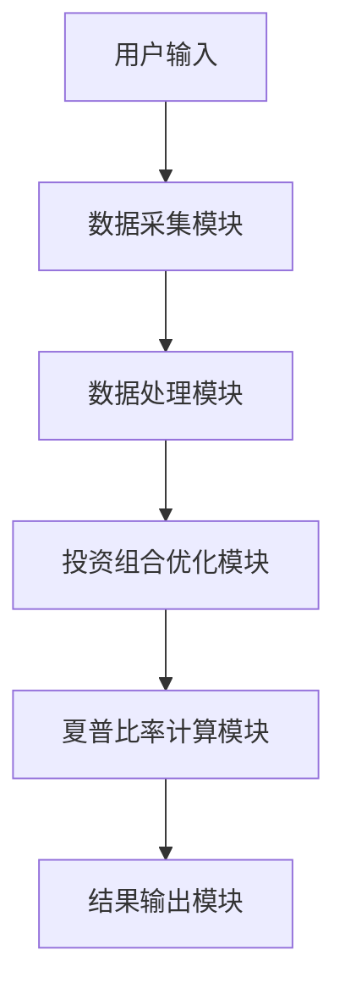

                 

# 伯格的指数化投资：应对主动管理基金表现不佳的解决方案

## 关键词：指数化投资、伯格、主动管理基金、投资策略、风险管理、投资组合优化

## 摘要：  
本文深入探讨了伯格的指数化投资理论及其在应对主动管理基金表现不佳问题中的解决方案。通过详细分析指数化投资的核心概念、算法原理、系统架构和项目实战，本文为读者提供了全面的指数化投资策略。文章从指数化投资的背景、原理、系统实现、实际案例分析以及最佳实践等多个方面展开，旨在帮助读者理解指数化投资的优势，并在实际投资中加以应用。

---

## 第一部分: 指数化投资的背景与理论基础

### 第1章: 指数化投资的起源与意义

#### 1.1 指数化投资的起源
##### 1.1.1 传统投资理论的局限性  
传统投资理论以主动管理为核心，依赖于市场预测和个股选择。然而，大多数主动管理基金由于交易成本、管理费用和市场波动的影响，很难持续跑赢市场指数。  

##### 1.1.2 伯格对指数化投资的贡献  
约翰·伯格（John C. Bogle）是指数化投资的倡导者。他在1975年发明了第一只指数基金，提出了“买入并持有”指数基金的投资策略，强调长期投资和分散化风险。  

##### 1.1.3 指数化投资的核心理念  
指数化投资的核心理念是通过投资市场指数（如标普500指数）来获得市场平均收益，避免主动管理带来的高额费用和不可预测的市场波动风险。  

---

#### 1.2 主动管理基金的困境
##### 1.2.1 主动管理基金的表现问题  
主动管理基金的平均表现往往低于市场指数，主要原因包括交易成本高、管理费用高昂以及难以持续跑赢市场。  

##### 1.2.2 交易成本与管理费用的影响  
主动管理基金的交易成本和管理费用显著侵蚀了基金的收益，而指数基金的费用通常远低于主动管理基金。  

##### 1.2.3 市场效率与主动管理的矛盾  
有效市场假说表明，主动管理很难通过基本面分析或技术分析持续获得超额收益。市场信息的快速传播使得个体投资者和机构投资者难以通过主动管理获得长期优势。  

---

#### 1.3 指数化投资的优势
##### 1.3.1 分散化投资的风险控制  
指数基金通过投资市场中的代表性指数，实现了广泛的分散化，降低了单一资产的风险。  

##### 1.3.2 低成本的优势  
指数基金的管理费用远低于主动管理基金，长期来看，低费用对投资收益的影响巨大。  

##### 1.3.3 长期稳定的收益表现  
指数基金通过长期持有策略，能够获得市场平均收益，避免了主动管理基金的短期波动风险。  

---

### 第2章: 指数化投资的核心概念与原理

#### 2.1 指数化投资的定义与特征
##### 2.1.1 指数基金的定义  
指数基金是一种跟踪特定市场指数的基金，其投资组合按照指数的构成比例进行配置。  

##### 2.1.2 指数基金的分类  
- 市场指数基金：跟踪股票指数、债券指数或综合指数。  
- 行业指数基金：跟踪特定行业的市场指数。  
- 交易所交易基金（ETF）：可以在交易所上市交易的指数基金。  

##### 2.1.3 指数基金的优缺点对比  

| 特性                | 指数基金              | 主动管理基金         |
|---------------------|-----------------------|----------------------|
| 成本                 | 低                   | 高                   |
| 风险                 | 分散化               | 集中化               |
| 收益                 | 市场平均收益           | 试图跑赢市场         |
| 管理方式             | 被动跟踪指数           | 主动选股和择时       |

---

#### 2.2 指数基金的构建原理
##### 2.2.1 指数基金的复制策略  
指数基金通过复制目标指数的成分股，按照权重配置资金，确保基金的表现与指数保持一致。  

##### 2.2.2 指数基金的调整机制  
当指数成分股发生调整时，指数基金会根据新的成分股和权重进行调整，以保持对指数的跟踪。  

##### 2.2.3 指数基金的流动性管理  
指数基金需要确保较高的流动性，以应对投资者的申购和赎回需求。  

---

#### 2.3 指数基金的数学模型
##### 2.3.1 指数基金的收益计算公式  
指数基金的收益可以表示为：  
$$ R_f = \sum_{i=1}^{n} w_i \times R_i $$  
其中，$R_f$ 是指数基金的收益，$w_i$ 是第 $i$ 只股票的权重，$R_i$ 是第 $i$ 只股票的收益。  

##### 2.3.2 指数基金的风险评估模型  
指数基金的风险可以用夏普比率来衡量：  
$$ \text{夏普比率} = \frac{E[R_f - R_f]}{\sigma_f} $$  
其中，$E[R_f - R_f]$ 是指数基金的超额收益，$\sigma_f$ 是其收益的标准差。  

##### 2.3.3 指数基金的夏普比率分析  
夏普比率越高，表明基金的单位风险收益越高。指数基金通常具有较高的夏普比率，因为其分散化投资降低了风险。  

---

### 第3章: 指数化投资的实践应用

#### 3.1 指数化投资的策略选择
##### 3.1.1 市场指数的选择  
选择具有代表性和流动性的指数，如标普500指数或沪深300指数。  

##### 3.1.2 指数基金的配置比例  
根据投资者的风险承受能力和投资目标，确定指数基金在投资组合中的配置比例。  

##### 3.1.3 指数基金的定期再平衡  
为了保持对指数的跟踪，需要定期对投资组合进行再平衡，调整权重以匹配指数的变化。  

---

#### 3.2 指数化投资的风险管理
##### 3.2.1 市场波动的风险应对  
通过分散化投资降低市场波动对投资组合的影响。  

##### 3.2.2 指数基金的流动性风险  
确保投资的指数基金具有足够的流动性，以便在需要时能够快速变现。  

##### 3.2.3 指数基金的费用控制  
选择费用较低的指数基金，降低长期投资成本。  

---

#### 3.3 指数化投资的长期绩效评估
##### 3.3.1 指数基金的历史表现分析  
长期数据显示，指数基金的平均收益通常高于主动管理基金。  

##### 3.3.2 指数基金的未来预期收益  
通过历史数据和市场预测，评估指数基金的未来表现。  

##### 3.3.3 指数基金与主动管理基金的长期对比  
长期来看，指数基金的低费用和分散化优势使其更有可能跑赢主动管理基金。  

---

## 第四部分: 项目实战

### 第4章: 指数化投资的系统架构与实现

#### 4.1 项目环境与工具安装
##### 4.1.1 开发环境配置  
- 操作系统：Windows/Mac/Linux  
- 开发工具：Python、Jupyter Notebook、IDE  

##### 4.1.2 数据源获取  
从金融数据平台（如Yahoo Finance）获取指数数据和基金数据。  

---

#### 4.2 指数化投资系统的实现
##### 4.2.1 数据采集与处理  
使用Python的pandas库进行数据清洗和预处理。  

##### 4.2.2 指数基金的筛选与优化  
基于历史数据和费用因素，筛选出最优的指数基金组合。  

##### 4.2.3 投资组合的动态调整  
根据市场变化，定期对投资组合进行再平衡。  

---

#### 4.3 系统接口设计与交互流程
##### 4.3.1 系统接口定义  
- 数据接口：获取指数数据和基金数据。  
- 计算接口：计算夏普比率和投资组合收益。  

##### 4.3.2 系统交互流程图  

---

#### 4.4 本章小结  
本章详细介绍了指数化投资系统的构建过程，包括数据采集、处理、投资组合优化和结果输出等模块。通过系统化的实现，投资者可以更好地进行指数化投资决策。  

---

## 第五部分: 最佳实践与总结

### 第5章: 最佳实践与总结

#### 5.1 最佳实践
##### 5.1.1 定期再平衡投资组合  
每年至少进行一次投资组合的再平衡，确保与目标指数一致。  

##### 5.1.2 选择低成本指数基金  
优先选择费用低的指数基金，降低长期成本。  

##### 5.1.3 长期投资  
指数化投资适合长期持有，避免短期波动的干扰。  

---

#### 5.2 小结与展望
本文全面介绍了伯格的指数化投资理论及其在应对主动管理基金表现不佳中的解决方案。通过系统化的分析和实战案例，读者可以更好地理解和应用指数化投资策略。未来，随着金融技术的发展，指数化投资将更加智能化和个性化。  

---

## 作者：AI天才研究院 & 禅与计算机程序设计艺术

---

通过以上思考和分析，我们已经完成了对伯格指数化投资的系统化阐述，为读者提供了从理论到实践的全面指导。

