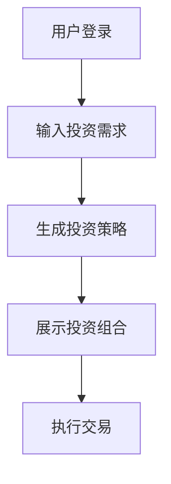
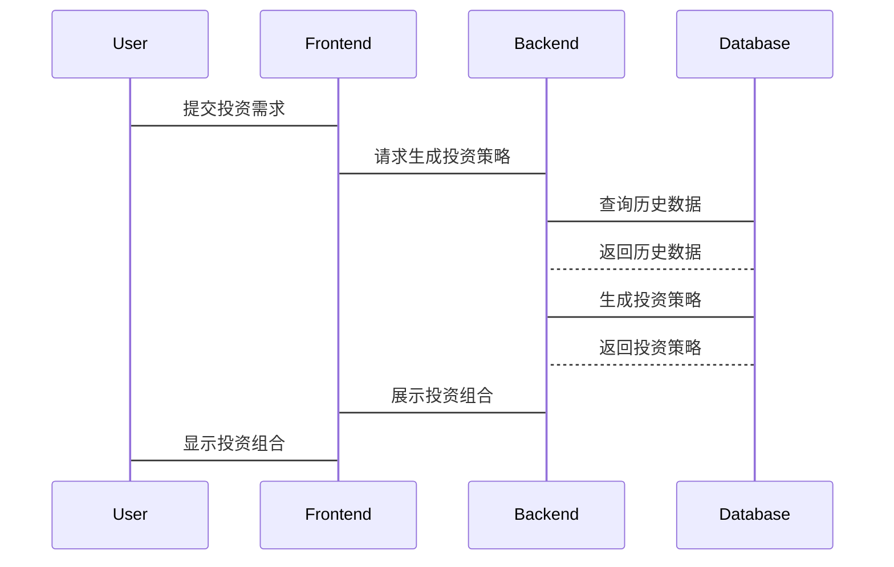

                 


# 伯格的被动投资理念：智能投顾时代的新发展

## 关键词：被动投资、智能投顾、伯格、指数基金、机器学习

## 摘要：本文探讨了伯格的被动投资理念在智能投顾时代的最新发展，结合数学模型和算法实现，分析了被动投资与智能投顾的结合方式，详细讲解了智能投顾的技术架构、算法实现和实际应用，最后总结了被动投资在智能投顾时代的未来发展趋势。

---

## 第1章: 被动投资的基本概念

### 1.1 伯格的被动投资理念

#### 1.1.1 伯格的生平与投资哲学
约翰·伯格（John Bogle）是被动投资的先驱，他创立了 Vanguard 集团，并提出了指数基金的投资理念。伯格认为，市场是无效的，主动投资难以长期跑赢市场指数，而被动投资通过持有指数基金，能够以最低的成本获得市场的平均收益。

#### 1.1.2 被动投资的定义与核心原则
被动投资是指通过持有特定的指数基金或ETF，长期跟踪市场指数，不频繁交易，不试图通过市场预测来获取超额收益的投资策略。其核心原则包括：
1. 长期持有，减少交易成本。
2. 分散投资，降低非系统性风险。
3. 低成本运作，降低管理费用。

#### 1.1.3 被动投资与主动投资的对比
| 对比维度       | 被动投资                  | 主动投资                  |
|----------------|--------------------------|--------------------------|
| 投资目标       | 追求市场平均收益          | 追求超额收益              |
| 管理方式       | 指数化投资                | 主动选股、择时            |
| 成本           | 低成本（管理费低）        | 成本较高（管理费、交易费）  |
| 风险           | 系统性风险                | 非系统性风险              |

### 1.2 被动投资的有效性

#### 1.2.1 被动投资的成本优势
被动投资通过持有指数基金，避免了主动投资中高昂的管理费用和交易费用。根据现代投资组合理论（MPT），低成本是实现长期收益的重要因素。

#### 1.2.2 被动投资的长期收益表现
长期来看，被动投资能够较好地跟踪市场指数，获得市场的平均收益。例如，标普500指数的长期年化收益约为7-8%，而主动管理型基金的平均收益难以超越这一水平。

#### 1.2.3 被动投资的风险管理特点
被动投资通过分散投资于指数成分股，降低了非系统性风险。同时，指数基金的Beta值与市场一致，能够较好地跟踪市场波动。

### 1.3 被动投资的数学模型

#### 1.3.1 被动投资的CAPM模型
$$ CAPM = E(r) = r_f + β(E(r_m - r_f)) $$
其中：
- \( E(r) \)：资产的预期收益率
- \( r_f \)：无风险利率
- \( β \)：资产的Beta系数
- \( E(r_m - r_f) \)：市场预期超额收益

#### 1.3.2 被动投资的长期回报公式
$$ R = (1 + r)^t - 1 $$
其中：
- \( R \)：总回报
- \( r \)：年化收益率
- \( t \)：投资时间（年）

---

## 第2章: 智能投顾的基本原理

### 2.1 智能投顾的定义与特点

#### 2.1.1 智能投顾的核心概念
智能投顾（Robo-Advisor）是基于算法和大数据分析的投资顾问服务。它通过机器学习和自然语言处理技术，为投资者提供个性化的投资建议和资产配置方案。

#### 2.1.2 智能投顾的技术基础
智能投顾的核心技术包括：
1. 机器学习：用于预测市场走势和客户行为分析。
2. 大数据分析：用于分析海量市场数据和客户信息。
3. 自然语言处理：用于解读市场新闻和分析师报告。

#### 2.1.3 智能投顾与传统投顾的区别
| 对比维度       | 智能投顾                  | 传统投顾                  |
|----------------|--------------------------|--------------------------|
| 投资策略       | 基于算法和大数据          | 基于人工分析和经验        |
| 服务成本       | 低成本（自动化服务）      | 高成本（人工服务）        |
| 服务效率       | 高效率（实时响应）        | 低效率（人工处理）        |

### 2.2 智能投顾的技术实现

#### 2.2.1 机器学习在智能投顾中的应用
机器学习用于预测市场走势和客户行为分析。例如，使用回归算法预测股票价格走势，使用聚类算法将客户分为不同的风险偏好类别。

#### 2.2.2 大数据分析在智能投顾中的应用
大数据分析用于分析海量市场数据和客户信息。例如，通过分析历史市场数据，发现市场周期性规律，为投资决策提供依据。

#### 2.2.3 自然语言处理在智能投顾中的应用
自然语言处理用于解读市场新闻和分析师报告。例如，通过情感分析技术，判断市场情绪对股票价格的影响。

### 2.3 智能投顾的算法原理

#### 2.3.1 基于机器学习的智能投顾算法
```python
def predict_stock_price(data):
    # 数据预处理
    processed_data = preprocess(data)
    # 训练模型
    model = train_model(processed_data)
    # 预测股票价格
    prediction = model.predict(processed_data)
    return prediction
```

#### 2.3.2 基于规则的智能投顾算法
```python
def asset Allocation(portfolio, risk_level):
    # 根据风险偏好分配资产
    if risk_level == 'low':
        allocate 60% to bonds, 40% to stocks
    elif risk_level == 'medium':
        allocate 40% to bonds, 60% to stocks
    else:
        allocate 20% to bonds, 80% to stocks
```

#### 2.3.3 智能投顾算法的优缺点对比
| 对比维度       | 基于机器学习的算法          | 基于规则的算法            |
|----------------|--------------------------|--------------------------|
| 优点           | 高精度，适应复杂市场        | 简单易懂，可解释性强        |
| 缺点           | 对数据依赖性强，可能过拟合    | 灵活性差，难以应对复杂情况  |

### 2.4 智能投顾的数学模型

#### 2.4.1 智能投顾的资产配置模型
$$ w_i = \frac{1}{n} $$
其中：
- \( w_i \)：第i种资产的权重
- \( n \)：资产种类数量

#### 2.4.2 智能投顾的风险评估模型
$$ \sigma^2 = \sum_{i=1}^n w_i^2 \sigma_i^2 + \sum_{i \neq j} w_i w_j \sigma_{ij} $$
其中：
- \( \sigma^2 \)：投资组合的总体风险
- \( \sigma_i^2 \)：第i种资产的方差
- \( \sigma_{ij} \)：第i种资产和第j种资产的协方差

#### 2.4.3 智能投顾的收益预测模型
$$ R = \sum_{i=1}^n w_i R_i $$
其中：
- \( R \)：投资组合的预期收益
- \( R_i \)：第i种资产的预期收益
- \( w_i \)：第i种资产的权重

---

## 第3章: 智能投顾与被动投资的结合

### 3.1 被动投资在智能投顾中的应用

#### 3.1.1 指数基金的投资策略
指数基金通过跟踪市场指数，实现被动投资的目标。智能投顾可以通过指数基金实现资产配置，降低投资门槛。

#### 3.1.2 被动投资在智能投顾中的优势
1. 成本低：指数基金的管理费用较低。
2. 风险分散：指数基金通过分散投资降低风险。
3. 简单易用：投资者只需选择合适的指数基金即可。

#### 3.1.3 被动投资在智能投顾中的挑战
1. 市场波动：指数基金的收益受市场波动影响。
2. 资产类别限制：指数基金的资产配置较为固定。

### 3.2 智能投顾如何实现被动投资

#### 3.2.1 智能投顾的指数化投资策略
智能投顾可以通过配置指数基金，实现对市场指数的跟踪。例如，通过配置标普500指数基金，实现对美国股市的被动投资。

#### 3.2.2 被动投资在智能投顾中的低成本优势
智能投顾通过自动化服务降低了管理成本，使被动投资的成本进一步降低。

#### 3.2.3 被动投资在智能投顾中的长期投资策略
智能投顾通过长期持有指数基金，实现对市场的长期跟踪，获取市场的平均收益。

### 3.3 被动投资与智能投顾的结合案例

#### 3.3.1 典型智能投顾平台的被动投资策略
以Vanguard为例，其智能投顾服务通过配置指数基金，实现对不同风险偏好的投资者的资产配置。

#### 3.3.2 被动投资在智能投顾中的实际应用
投资者通过智能投顾平台选择指数基金，平台根据投资者的风险偏好，自动配置相应的指数基金组合。

#### 3.3.3 被动投资与智能投顾结合的未来趋势
随着技术的进步，智能投顾将更加智能化，被动投资将更加广泛地应用于智能投顾中。

---

## 第4章: 智能投顾的技术架构

### 4.1 智能投顾系统的整体架构

#### 4.1.1 系统功能模块划分
1. 用户界面模块
2. 数据分析模块
3. 投资策略模块
4. 风险管理模块
5. 交易执行模块

#### 4.1.2 系统的技术选型
1. 前端：React或Vue.js
2. 后端：Python（Django或Flask）
3. 数据库：MySQL或PostgreSQL
4. 机器学习框架：TensorFlow或Scikit-learn

#### 4.1.3 系统的部署与运行环境
1. 服务器：云服务器（AWS、Azure等）
2. 数据存储：云数据库（AWS RDS、阿里云数据库等）
3. 服务部署：容器化部署（Docker、Kubernetes）

### 4.2 智能投顾系统的功能设计

#### 4.2.1 用户需求分析
1. 投资者的基本信息（风险偏好、投资期限等）
2. 投资目标（收益目标、风险承受能力等）

#### 4.2.2 系统功能流程图


#### 4.2.3 系统功能的优先级排序
| 功能模块       | 优先级 | 描述                     |
|----------------|--------|-------------------------|
| 用户登录         | 高     | 用户身份验证           |
| 投资需求输入     | 高     | 收集用户投资目标         |
| 投资策略生成     | 中     | 根据需求生成投资策略     |
| 投资组合展示     | 中     | 展示生成的投资组合       |
| 交易执行         | 低     | 执行具体交易指令         |

### 4.3 智能投顾系统的架构设计

#### 4.3.1 前端架构设计
- 使用React框架，构建用户友好的界面。
- 使用Redux管理前端状态。

#### 4.3.2 后端架构设计
- 使用Django框架，构建RESTful API。
- 使用Celery处理异步任务。

#### 4.3.3 数据库设计
- 使用MySQL存储用户数据和投资策略。
- 使用Redis缓存高频数据。

### 4.4 智能投顾系统的接口设计

#### 4.4.1 系统内部接口设计
```json
{
    "operation": "get_market_data",
    "parameters": {
        "symbol": "SPY",
        "start_date": "2020-01-01",
        "end_date": "2023-12-31"
    }
}
```

#### 4.4.2 系统外部接口设计
```json
{
    "action": "buy",
    "symbol": "AAPL",
    "quantity": 10,
    "price": 150.0
}
```

#### 4.4.3 接口的交互流程设计


---

## 第5章: 智能投顾的算法实现

### 5.1 智能投顾算法的选择

#### 5.1.1 基于机器学

