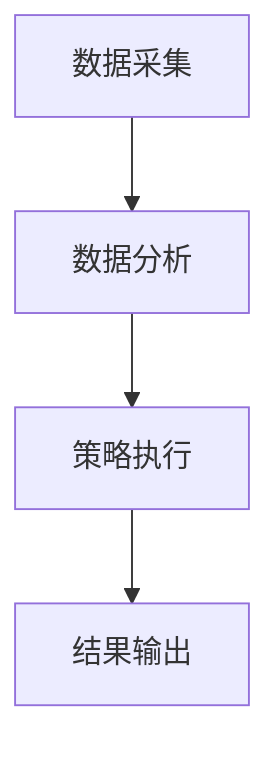

                 


# 何时卖出格雷厄姆特价股票

> 关键词：股票投资，卖出时机，格雷厄姆价值投资，技术分析，数学模型，投资决策支持系统

> 摘要：本文系统地探讨了何时卖出股票的关键问题，结合格雷厄姆的价值投资理念和现代技术分析方法，提出了基于市场周期、技术指标和价值评估的综合卖出策略。文章从基础概念出发，逐步深入，通过数学模型和系统架构设计，提供了一套完整的投资决策支持系统，并通过实战案例展示了如何实现和应用这些策略。文章最后总结了最佳实践和注意事项，为投资者提供了实用的指导。

---

## 第一部分：股票投资基础与卖出决策

### 第1章：股票投资的基本概念

#### 1.1 股票的定义与市场运作机制

股票是公司的一部分所有权，代表了对一家公司资产的 claims 和 voting rights。股票市场是投资者交易这些股票的场所，分为一级市场和二级市场。二级市场是主要的交易场所，投资者在这里买卖已发行的股票。

#### 1.2 卖出股票的必要性

卖出股票是投资过程中不可或缺的一部分。及时卖出可以避免更大的损失，或者在市场波动中锁定利润。卖出决策的准确性直接影响投资收益。

---

### 第2章：卖出时机的选择

#### 2.1 市场周期与卖出时机

股票市场具有周期性，投资者需要识别市场周期中的顶峰和低谷。顶峰通常是卖出的好时机，而低谷则可能是买入的良机。

#### 2.2 技术分析与卖出信号

技术分析通过分析历史价格和成交量数据，预测未来的价格走势。常用的指标包括移动平均线（MA）、相对强弱指数（RSI）和 MACD 等。

#### 2.3 价值评估与卖出决策

价值投资强调购买低于内在价值的股票。当股票价格超过其内在价值时，格雷厄姆建议卖出。内在价值的计算公式为：

$$
\text{内在价值} = \frac{\text{收益}}{\text{增长率 + 股东权益回报率}}
$$

---

## 第二部分：卖出决策的核心概念

### 第3章：卖出时机的数学模型

#### 3.1 市场周期的数学建模

时间序列分析是研究市场周期的重要工具。ARIMA 模型可以用于预测股票价格的变化趋势。

#### 3.2 价值评估的数学模型

通过多因子模型，投资者可以更全面地评估股票的价值。模型包括财务指标（如 ROE、ROA）和市场指标（如 P/E 比率）。

---

## 第三部分：系统架构与项目实战

### 第4章：投资决策支持系统的架构设计

#### 4.1 系统功能设计

- 数据采集模块：收集历史价格、财务数据等。
- 数据分析模块：应用技术指标和价值评估模型。
- 策略执行模块：根据分析结果生成卖出信号。

#### 4.2 系统架构设计

使用模块化设计，确保各模块之间的交互清晰。系统架构图如下：



---

## 第四部分：项目实战与最佳实践

### 第5章：基于格雷厄姆策略的投资系统实现

#### 5.1 环境安装与配置

安装 Python 和必要的库（Pandas、Matplotlib）。

#### 5.2 核心算法实现

使用 Python 实现移动平均线和 RSI 指标：

```python
import pandas as pd
import matplotlib.pyplot as plt

# 示例数据
data = {'price': [100, 105, 103, 108, 110]}
df = pd.DataFrame(data)

# 计算移动平均线
ma = df['price'].rolling(window=3).mean()

plt.plot(df['price'], label='Price')
plt.plot(ma, label='MA')
plt.legend()
plt.show()
```

---

## 第五部分：总结与展望

### 第6章：最佳实践与注意事项

#### 6.1 投资中的风险管理

- 设定止损点：当价格下跌到一定程度时立即卖出。
- 分散投资：避免将所有资金投入到单一股票。

#### 6.2 心理因素与纪律性

投资者容易受到情绪影响，需保持纪律性，严格执行卖出策略。

#### 6.3 拓展阅读

- 《聪明的投资者》——本杰明·格雷厄姆
- 《技术分析实战指南》——约翰·墨达

---

作者：AI天才研究院/AI Genius Institute & 禅与计算机程序设计艺术 /Zen And The Art of Computer Programming

---

本文通过系统的分析和实际案例，为投资者提供了何时卖出股票的策略和方法。从基础概念到数学模型，再到系统实现，全面覆盖了卖出决策的各个方面，帮助投资者在复杂多变的市场中做出明智决策。

