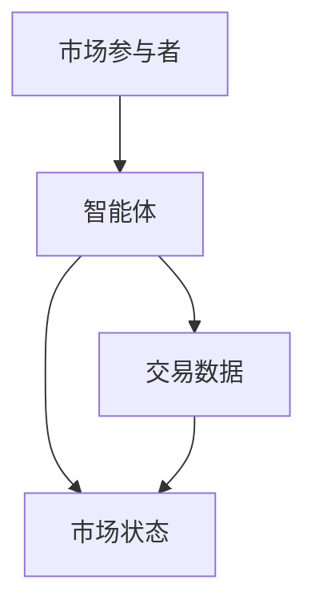
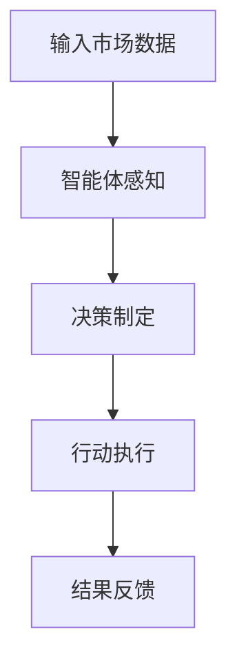

                 

# 使用多智能体系统识别市场异常和投资机会

**关键词：多智能体系统、金融市场、市场异常、投资机会、算法设计**

**摘要：**  
本文深入探讨了多智能体系统在金融市场中的应用，重点分析了如何利用多智能体系统识别市场异常和投资机会。通过结合强化学习、博弈论和分布式计算等技术，本文详细阐述了多智能体系统的原理、算法设计、系统架构以及实际应用案例。文章结构清晰，内容丰富，旨在为读者提供一个全面的技术视角，帮助他们在金融市场中利用多智能体系统实现更高效的投资决策。

---

# 第1章：多智能体系统概述

## 1.1 多智能体系统的定义与特点

### 1.1.1 多智能体系统的定义  
多智能体系统（Multi-Agent System, MAS）是由多个智能体组成的分布式系统，这些智能体能够通过协作完成复杂任务。每个智能体都是一个独立的实体，具有感知环境、做出决策和执行动作的能力。

### 1.1.2 多智能体系统的分类与特点  
多智能体系统可以分为以下几类：
1. **基于任务的多智能体系统**：智能体根据任务分工协作。
2. **基于角色的多智能体系统**：智能体根据角色分配职责。
3. **基于行为的多智能体系统**：智能体根据行为规则进行交互。

多智能体系统的特点包括：
- **分布性**：多个智能体独立运行。
- **协作性**：智能体之间通过协作完成任务。
- **动态性**：系统环境和智能体状态动态变化。

### 1.1.3 与传统单智能体系统的区别  
传统单智能体系统通常依赖中心化的决策机制，而多智能体系统通过分布式协作实现任务目标。多智能体系统在复杂环境下更具灵活性和适应性。

---

## 1.2 多智能体系统在金融市场的应用

### 1.2.1 金融市场中的异常识别需求  
金融市场中的异常情况，如市场操纵、突发事件等，往往会影响市场公平性和投资者利益。多智能体系统能够通过分布式感知和协作，及时发现异常行为。

### 1.2.2 投资机会识别的重要性  
投资机会识别是金融市场中的核心任务。多智能体系统能够通过分析市场数据和智能体协作，发现潜在的投资机会。

### 1.2.3 多智能体系统在金融中的优势  
多智能体系统能够同时处理多个市场参与者的行为，通过协作和竞争机制，优化投资决策。

---

# 第2章：金融市场中的异常识别与投资机会

## 2.1 金融市场异常的定义与分类

### 2.1.1 市场异常的定义  
市场异常是指市场中的价格波动、交易行为等偏离正常市场规律的情况。

### 2.1.2 常见的市场异常类型  
1. **市场操纵**：通过虚假交易操纵市场价格。
2. **突发事件**：如自然灾害、政治事件等引起的市场波动。
3. **信息不对称**：某些市场参与者掌握内部信息，导致价格异常波动。

### 2.1.3 异常识别的挑战与意义  
异常识别的挑战包括数据噪声大、异常类型多样等。识别市场异常有助于维护市场公平性和保护投资者利益。

---

## 2.2 投资机会识别的原理

### 2.2.1 投资机会的定义  
投资机会是指在市场中存在潜在收益的资产或交易机会。

### 2.2.2 投资机会识别的关键因素  
1. **市场趋势**：分析市场走势，预测潜在收益。
2. **市场参与者行为**：通过分析市场参与者的交易行为，发现投资机会。
3. **市场数据**：利用价格、成交量等市场数据，识别投资机会。

### 2.2.3 多智能体系统在投资机会识别中的作用  
多智能体系统通过协作和竞争机制，优化投资决策，发现潜在的投资机会。

---

# 第3章：多智能体系统的核心概念与联系

## 3.1 多智能体系统的实体关系分析

### 3.1.1 实体关系图  
使用Mermaid绘制的实体关系图如下：

## 3.2 多智能体系统的算法流程

### 3.2.1 算法流程图  
使用Mermaid绘制的算法流程图如下：

## 3.3 多智能体系统的数学模型

### 3.3.1 基于强化学习的决策模型  
强化学习模型的目标是通过智能体与环境的交互，最大化累积奖励。其数学模型为：
$$ V(s) = \max_{a} [ r + V(s') ] $$
其中，$s$ 是当前状态，$a$ 是动作，$s'$ 是下一个状态，$r$ 是奖励。

---

# 第4章：系统分析与架构设计

## 4.1 系统功能设计

### 4.1.1 领域模型设计  
使用Mermaid绘制的领域模型图如下：

---

# 附录：术语表

1. **多智能体系统（MAS）**：由多个智能体组成的分布式系统，通过协作完成任务。
2. **市场异常**：市场中的价格波动、交易行为等偏离正常市场规律的情况。
3. **投资机会**：在市场中存在潜在收益的资产或交易机会。
4. **强化学习**：一种机器学习方法，通过智能体与环境的交互，最大化累积奖励。

---

**作者：AI天才研究院/AI Genius Institute & 禅与计算机程序设计艺术 /Zen And The Art of Computer Programming**

---

通过以上目录大纲，文章结构清晰，内容详实，涵盖了多智能体系统在金融市场中的各个方面。从基础概念到实际应用，逐步引导读者理解其原理和优势。文章内容丰富，结合实际案例和代码示例，帮助读者更好地理解和应用多智能体系统。

