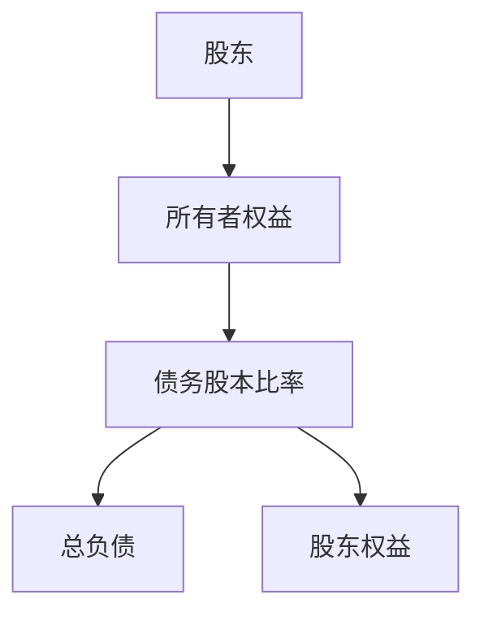
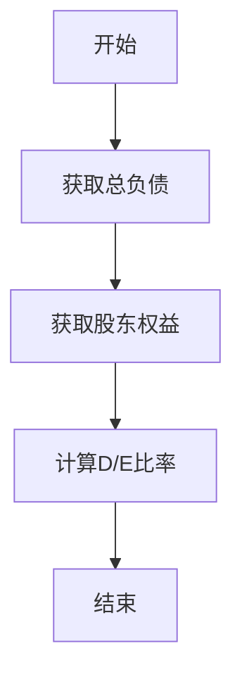
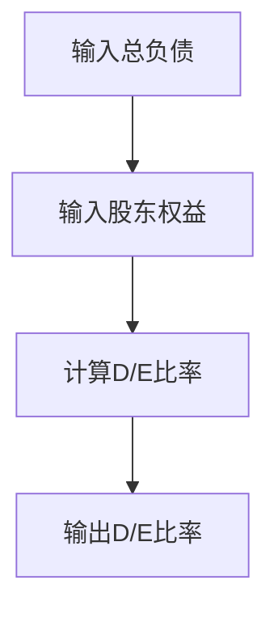
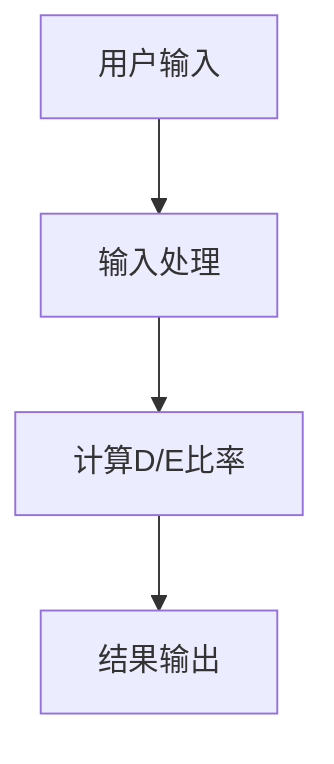

                 


# 债务股本比率：衡量公司健康度的关键

## 关键词：
债务股本比率，公司健康度，财务分析，投资决策，风险管理，D/E比率

## 摘要：
债务股本比率（Debt-to-Equity Ratio，简称D/E比率）是衡量公司财务健康的重要指标之一。本文将详细探讨D/E比率的定义、计算方法、应用场景及其对投资决策的影响。通过分析D/E比率，投资者可以更好地评估公司的财务风险和偿债能力，从而做出更明智的投资决策。

---

## 第一部分：债务股本比率的基础

### 第1章：债务股本比率的基本概念

#### 1.1 什么是债务股本比率
##### 1.1.1 资产、负债和所有者权益的基本概念
在会计学中，企业的财务状况通常由资产、负债和所有者权益三个核心要素构成。资产是指企业拥有的资源，负债是企业需要偿还的债务，所有者权益则是企业在扣除负债后的剩余部分。

- **资产**：资产是企业拥有或控制的资源，包括流动资产（如现金、应收账款）和非流动资产（如固定资产、无形资产）。
- **负债**：负债是企业在未来某个时间点需要偿还的债务，包括短期负债（如应付账款、短期借款）和长期负债（如长期借款、债券）。
- **所有者权益**：所有者权益是企业在扣除负债后的剩余部分，也称为股东权益，包括股本、资本公积、盈余公积和未分配利润等。

##### 1.1.2 债务股本比率的定义
债务股本比率（D/E比率）是衡量企业债务与股东权益之间关系的重要指标。具体来说，它是企业总负债与股东权益的比率，反映了企业通过债务融资的程度以及股东权益对债权人权益的保障程度。

公式为：
$$ D/E = \frac{\text{总负债}}{\text{股东权益}} $$

##### 1.1.3 债务股本比率的计算公式
$$ D/E = \frac{\text{总负债}}{\text{股东权益}} $$

#### 1.2 债务股本比率的重要性
##### 1.2.1 为什么需要衡量债务股本比率
- 债务股本比率是评估企业财务健康状况的重要工具，能够反映企业的偿债能力和财务风险。
- 通过分析D/E比率，投资者可以判断企业的资本结构是否合理，是否存在过度依赖债务融资的情况。

##### 1.2.2 债务股本比率在企业融资中的作用
- 债务股本比率影响企业的融资成本和融资能力。一般来说，D/E比率较低的企业更容易获得债权人的青睐，因为其偿债能力较强。
- 债务股本比率还影响企业的资本成本。通过合理配置债务和股本，企业可以降低加权平均资本成本（WACC）。

##### 1.2.3 债务股本比率与企业风险的关系
- D/E比率高的企业通常面临较高的财务风险，因为它们需要偿还更多的债务，一旦经营状况不佳，可能难以偿还债务。
- D/E比率低的企业财务风险较低，但可能资本利用效率不高。

#### 1.3 债务股本比率的应用场景
##### 1.3.1 企业财务健康度分析
- 通过分析D/E比率，企业可以评估自身的财务健康状况，判断是否需要调整资本结构。
- D/E比率还可以帮助企业识别潜在的财务问题，如过度负债或股东权益不足。

##### 1.3.2 投资者决策参考
- 投资者在选择投资标的时，通常会关注D/E比率。一般来说，D/E比率较低的企业风险较小，但回报也可能较低；D/E比率较高的企业风险较高，但可能回报也较高。
- 不同行业的D/E比率标准值有所不同，因此投资者在分析时需要结合行业特点。

##### 1.3.3 行业间对比分析
- 由于不同行业的资本结构和经营模式差异较大，D/E比率的行业标准值也有所不同。例如，资本密集型行业（如制造业、房地产）通常D/E比率较高，而劳动密集型行业（如零售业、服务业）D/E比率较低。

### 第2章：债务股本比率的核心概念与联系

#### 2.1 债务与股本的对比
##### 2.1.1 债务的特征与属性
- **偿债顺序**：债务是企业的优先偿债责任，优先于股本。
- **成本**：债务的直接成本是利息支出，通常固定且可税前列支。
- **风险**：债务融资的风险较高，因为债权人对企业的偿债能力有较强的要求。

##### 2.1.2 股本的特征与属性
- **所有权**：股本代表股东对企业所有权的持有，股东有权参与企业的经营决策和利润分配。
- **成本**：股本的直接成本是股息支出，通常不可税前列支。
- **风险**：股本的风险较低，股东的收益主要依赖于企业的盈利能力和股价波动。

##### 2.1.3 债务与股本的对比表格
| 特性 | 债务 | 股本 |
|------|------|------|
| 所有权 | 债权人 | 股东 |
| 偿还顺序 | 优先 | 优先于债务 |
| 成本 | 利息支出 | 股息支出 |
| 风险 | 较高 | 较低 |

#### 2.2 债务股本比率的实体关系图


#### 2.3 债务股本比率的计算流程


---

## 第二部分：债务股本比率的算法原理

### 第3章：债务股本比率的算法原理

#### 3.1 算法原理概述
债务股本比率的计算公式简单，但其应用和分析需要结合企业的具体经营环境和行业特点。以下是D/E比率计算的详细步骤：

1. **获取总负债**：总负债包括企业所有的流动负债和非流动负债。
2. **获取股东权益**：股东权益是企业在扣除负债后的剩余部分。
3. **计算D/E比率**：将总负债除以股东权益，得到D/E比率。

#### 3.2 算法实现步骤


#### 3.3 算法的数学模型
债务股本比率的计算公式如下：
$$ D/E = \frac{\text{总负债}}{\text{股东权益}} $$

---

## 第三部分：数学模型与系统分析

### 第4章：债务股本比率的数学模型

#### 4.1 数学模型的定义
债务股本比率的数学模型是基于上述公式构建的，用于量化企业的债务与股本之间的关系。

#### 4.2 数学模型的实现
假设某企业2023年的财务数据如下：
- 总负债：500万元
- 股东权益：200万元

计算D/E比率：
$$ D/E = \frac{500}{200} = 2.5 $$

---

## 第四部分：系统分析与架构设计

### 第5章：债务股本比率的系统分析

#### 5.1 系统功能设计
- **输入模块**：用户输入企业的总负债和股东权益数据。
- **计算模块**：根据公式计算D/E比率。
- **输出模块**：显示计算结果，并提供风险评估和投资建议。

#### 5.2 系统架构设计


---

## 第五部分：项目实战

### 第6章：债务股本比率的项目实战

#### 6.1 项目背景
某企业计划进行财务分析，以评估自身的财务健康状况。

#### 6.2 项目实现
```python
# 示例代码：计算D/E比率
负债 = 500  # 万元
股东权益 = 200  # 万元
D_E = 负债 / 股东权益
print(f"债务股本比率为：{D_E}")
```

#### 6.3 项目结果分析
计算结果显示，该企业的D/E比率为2.5，属于较高水平。这意味着企业的债务负担较重，财务风险较高，可能需要调整资本结构。

---

## 第六部分：最佳实践

### 第7章：债务股本比率的最佳实践

#### 7.1 小结
债务股本比率是衡量企业财务健康度的重要指标。通过合理分析D/E比率，投资者和企业管理者可以做出更明智的决策。

#### 7.2 注意事项
- D/E比率的分析需要结合企业的行业特点和经营环境。
- 单独分析D/E比率可能不够全面，应结合其他财务指标（如流动比率、速动比率等）进行综合判断。

#### 7.3 拓展阅读
- 《财务报表分析》
- 《资本预算与投资决策》
- 《风险管理与内部控制》

---

## 作者：AI天才研究院/AI Genius Institute & 禅与计算机程序设计艺术/Zen And The Art of Computer Programming

---

通过本文的详细分析，读者可以全面理解债务股本比率的定义、计算方法、应用场景及其对投资决策的影响。希望本文能够帮助读者在实际工作中更好地运用D/E比率，评估企业的财务健康状况，做出更明智的决策。

