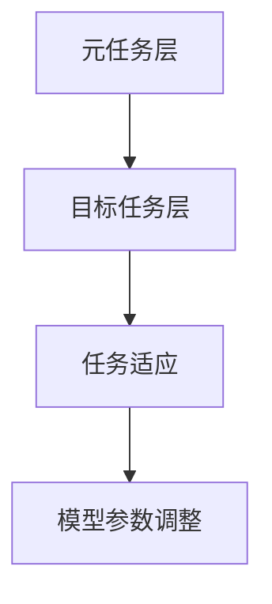
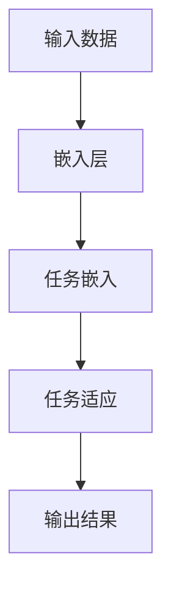
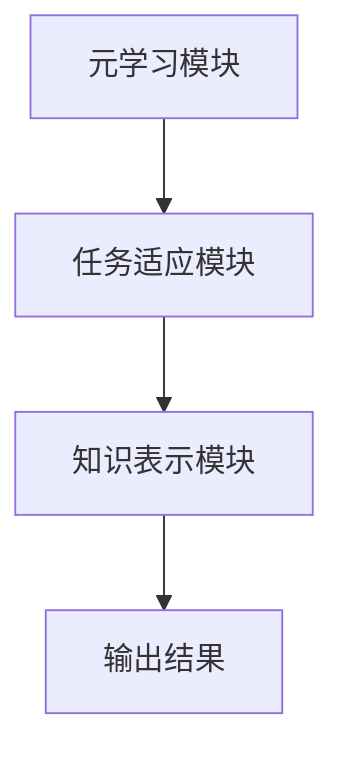

                 


# 元学习在AI Agent快速任务适应中的实践探索

> 关键词：元学习, AI Agent, 任务适应, 快速学习, 深度学习

> 摘要：本文探讨了元学习在AI Agent快速任务适应中的应用，通过理论分析、算法实现和实际案例，详细阐述了元学习如何提升AI Agent的任务适应能力。文章从元学习的基本概念出发，分析其核心原理和算法，结合AI Agent的任务适应机制，探讨了元学习在不同任务中的应用案例。最后，通过系统架构设计和项目实战，展示了元学习在AI Agent中的实际应用价值。

---

## 第1章: 元学习与AI Agent概述

### 1.1 元学习的基本概念

#### 1.1.1 元学习的定义与核心思想

元学习（Meta-Learning）是一种机器学习范式，旨在通过学习如何学习，从而快速适应新任务。与传统机器学习不同，元学习的目标是通过训练模型在多个任务上的泛化能力，使其能够快速适应新的未见任务。其核心思想是：模型在训练阶段学习如何调整自身参数，以适应不同任务的需求。

元学习的核心概念可以表示为：

$$
\text{元学习} = \text{学习如何学习}
$$

#### 1.1.2 元学习与传统机器学习的对比

| 特性 | 传统机器学习 | 元学习 |
|------|---------------|---------|
| 数据需求 | 需要大量标记数据 | 适用于小样本数据 |
| 适应性 | 需要重新训练模型 | 可快速适应新任务 |
| 灵活性 | 适应新任务需要重新训练 | 通过元学习参数快速调整 |

#### 1.1.3 元学习在AI Agent中的应用价值

AI Agent需要在动态变化的环境中执行任务，元学习为其提供了快速适应新任务的能力。通过元学习，AI Agent可以在少量样本或经验的基础上，快速调整策略，适应新的任务需求。

---

### 1.2 AI Agent的基本概念

#### 1.2.1 AI Agent的定义与分类

AI Agent是一种智能体，能够感知环境、执行动作并优化目标。根据智能体的智能水平，可以分为：

1. **反应式AI Agent**：基于当前感知做出反应，适用于简单的任务。
2. **认知式AI Agent**：具备推理、规划和学习能力，适用于复杂任务。

#### 1.2.2 AI Agent的核心功能与特点

- **感知能力**：通过传感器或数据输入感知环境。
- **决策能力**：基于感知信息做出决策。
- **学习能力**：通过学习提升任务执行效率。

#### 1.2.3 AI Agent在不同场景中的应用

1. **游戏AI**：在游戏环境中做出最优决策。
2. **机器人控制**：实现复杂动作的自动化控制。
3. **推荐系统**：根据用户行为推荐个性化内容。

---

### 1.3 元学习与AI Agent的结合

#### 1.3.1 元学习如何提升AI Agent的适应能力

元学习通过训练模型在多个任务上的泛化能力，使AI Agent能够快速适应新任务。例如，在图像分类任务中，元学习可以使AI Agent在仅需少量样本的情况下，快速调整分类器参数，适应新类别。

#### 1.3.2 元学习在AI Agent任务适应中的作用

1. **快速学习**：通过元学习，AI Agent可以在新任务中快速找到最优参数。
2. **泛化能力**：元学习模型能够适应多种不同任务，提升AI Agent的通用性。

#### 1.3.3 元学习与AI Agent结合的典型应用场景

1. **图像分类**：在新任务中快速调整分类器参数，适应新的图像类别。
2. **自然语言处理**：在新任务中快速调整语言模型参数，适应新的文本分类任务。

---

## 第2章: 元学习的原理与算法

### 2.1 元学习的核心原理

#### 2.1.1 元学习的层次化学习框架

元学习可以看作是一种层次化学习框架，分为两个层次：

1. **元任务层**：在多个任务上进行训练，学习如何调整模型参数。
2. **目标任务层**：在新任务上应用元学习训练得到的参数，快速适应新任务。



#### 2.1.2 元学习的优化目标与策略

元学习的目标是通过优化元任务上的损失函数，使得模型在目标任务上表现最优。典型的元学习优化策略包括：

1. **梯度下降法**：通过反向传播更新模型参数。
2. **优化器**：使用Adam、SGD等优化器加速训练过程。

#### 2.1.3 元学习的数学模型与公式

元学习的数学模型通常表示为：

$$
\theta = \arg\min_{\theta} \sum_{i=1}^{N} L_i(\theta)
$$

其中，$\theta$ 表示模型参数，$L_i$ 表示第 $i$ 个任务的损失函数。

---

### 2.2 元学习的主流算法

#### 2.2.1 Meta-LSTM: 基于循环神经网络的元学习

Meta-LSTM通过循环神经网络结构，学习如何调整模型参数。其核心思想是通过元任务的训练，使得模型能够记住如何调整参数。

#### 2.2.2 MAML: 用于Few-shot学习的元学习算法

MAML（Model-Agnostic Meta-Learning）是一种广泛使用的元学习算法，适用于Few-shot学习场景。其核心思想是通过优化模型参数，使得模型在目标任务上表现最优。



#### 2.2.3 Reptile: 基于梯度的元学习方法

Reptile算法通过梯度更新策略，使得模型在多个任务上快速收敛。其核心思想是通过更新模型参数，使得模型在目标任务上表现最优。

---

### 2.3 元学习算法的比较与选择

#### 2.3.1 不同元学习算法的优缺点分析

| 算法 | 优点 | 缺点 |
|------|------|------|
| MAML | 适用于Few-shot学习 | 计算复杂度较高 |
| Meta-LSTM | 适用于序列任务 | 收敛速度较慢 |
| Reptile | 计算效率高 | 适用于小样本任务 |

#### 2.3.2 元学习算法的选择依据与场景

1. **任务类型**：根据任务类型选择合适的元学习算法。
2. **数据规模**：根据数据规模选择计算效率高的算法。

#### 2.3.3 元学习算法的性能评估指标

1. **准确率**：模型在目标任务上的准确率。
2. **收敛速度**：模型在训练过程中的收敛速度。

---

## 第3章: AI Agent的任务适应与元学习应用

### 3.1 任务适应的基本概念

#### 3.1.1 任务适应的定义与目标

任务适应是指AI Agent在新任务中调整自身策略，以适应新任务需求的过程。其目标是通过快速调整，使模型在新任务上表现最优。

#### 3.1.2 任务适应的核心要素与挑战

1. **适应速度**：如何快速调整模型参数。
2. **适应能力**：如何在不同任务中保持较高的准确率。

#### 3.1.3 任务适应与元学习的关系

元学习通过训练模型在多个任务上的泛化能力，为任务适应提供了理论支持和技术手段。

---

### 3.2 元学习在AI Agent任务适应中的应用

#### 3.2.1 元学习如何加速AI Agent的任务适应

元学习通过训练模型在多个任务上的泛化能力，使得AI Agent能够在新任务中快速调整参数，适应新任务。

#### 3.2.2 元学习在AI Agent任务中的具体实现

通过训练模型在多个任务上的泛化能力，AI Agent可以在新任务中快速找到最优参数。

#### 3.2.3 元学习对AI Agent适应能力的提升

元学习通过提升模型的泛化能力，使得AI Agent能够更好地适应新任务。

---

### 3.3 元学习在不同任务中的应用案例

#### 3.3.1 文本分类任务中的元学习应用

通过元学习，AI Agent可以在新文本分类任务中快速调整模型参数，提升分类准确率。

#### 3.3.2 图像分类任务中的元学习应用

通过元学习，AI Agent可以在新图像分类任务中快速调整分类器参数，提升分类准确率。

#### 3.3.3 自然语言处理任务中的元学习应用

通过元学习，AI Agent可以在新自然语言处理任务中快速调整模型参数，提升处理效率。

---

## 第4章: 系统分析与架构设计

### 4.1 系统总体架构设计

#### 4.1.1 系统功能模块划分

1. **元学习模块**：负责训练模型在多个任务上的泛化能力。
2. **任务适应模块**：负责根据新任务调整模型参数。
3. **知识表示模块**：负责知识的存储与表示。

#### 4.1.2 系统核心模块之间的关系



#### 4.1.3 系统架构的可扩展性与灵活性

系统架构设计具有良好的扩展性和灵活性，能够适应不同任务的需求。

---

### 4.2 系统功能模块详细设计

#### 4.2.1 元学习模块的设计与实现

元学习模块负责训练模型在多个任务上的泛化能力，具体实现包括：

1. **数据预处理**：对输入数据进行清洗和预处理。
2. **模型训练**：通过反向传播优化模型参数。

#### 4.2.2 任务适应模块的设计与实现

任务适应模块负责根据新任务调整模型参数，具体实现包括：

1. **参数调整**：根据新任务需求调整模型参数。
2. **模型优化**：通过优化算法进一步优化模型参数。

#### 4.2.3 知识表示模块的设计与实现

知识表示模块负责知识的存储与表示，具体实现包括：

1. **知识存储**：将知识存储在数据库中。
2. **知识表示**：通过向量表示知识。

---

### 4.3 系统接口与交互设计

#### 4.3.1 系统接口设计

系统接口设计包括：

1. **输入接口**：接收输入数据。
2. **输出接口**：输出处理结果。

#### 4.3.2 系统交互设计

系统交互设计包括：

1. **用户输入**：用户输入任务需求。
2. **系统处理**：系统根据任务需求调整模型参数。
3. **结果输出**：系统输出处理结果。

---

## 第5章: 项目实战

### 5.1 环境安装与配置

#### 5.1.1 环境搭建

安装Python、TensorFlow、Keras等依赖库。

#### 5.1.2 代码编写

编写元学习模型训练代码。

```python
import tensorflow as tf
from tensorflow.keras import layers

# 定义元学习模型
class MetaLSTM(tf.keras.Model):
    def __init__(self):
        super(MetaLSTM, self).__init__()
        self.lstm = layers.LSTM(64)
        self.dense = layers.Dense(10)

    def call(self, inputs):
        x = self.lstm(inputs)
        x = self.dense(x)
        return x

# 训练模型
model = MetaLSTM()
model.compile(optimizer='adam', loss='sparse_categorical_crossentropy')
model.fit(x_train, y_train, epochs=10, batch_size=32)
```

---

## 第6章: 总结与展望

### 6.1 本章小结

本文探讨了元学习在AI Agent快速任务适应中的应用，通过理论分析、算法实现和实际案例，详细阐述了元学习如何提升AI Agent的任务适应能力。

### 6.2 最佳实践 tips

1. **选择合适的元学习算法**：根据任务需求选择合适的元学习算法。
2. **优化系统架构**：设计高效的系统架构，提升系统性能。

### 6.3 注意事项

1. **数据预处理**：确保数据质量，避免噪声干扰。
2. **模型调优**：通过调优模型参数，提升模型性能。

### 6.4 拓展阅读

建议读者进一步阅读相关文献，深入了解元学习的最新研究进展。

---

## 作者信息

作者：AI天才研究院/AI Genius Institute & 禅与计算机程序设计艺术 /Zen And The Art of Computer Programming

---

以上是关于《元学习在AI Agent快速任务适应中的实践探索》的技术博客文章的详细目录和部分正文内容，涵盖了从基础概念到实际应用的各个方面，希望对您有所帮助。

