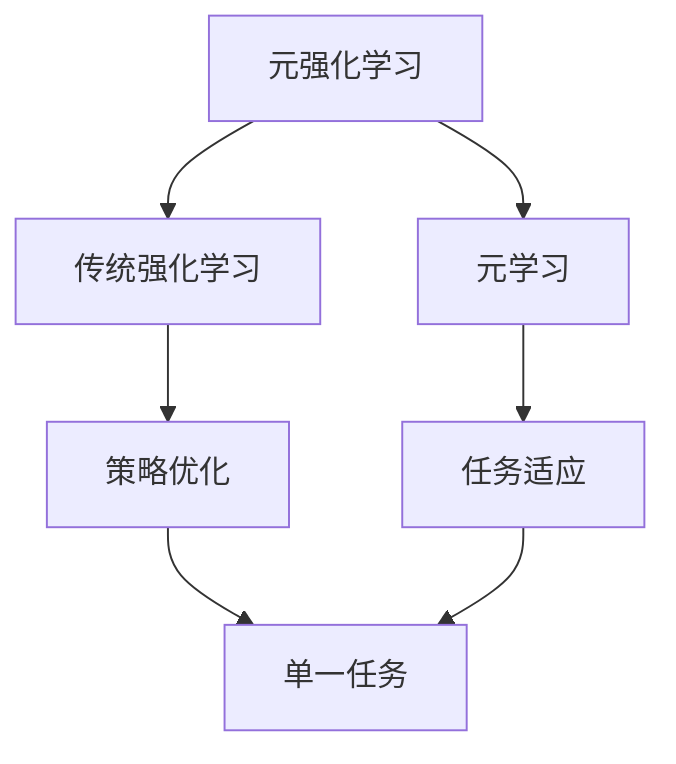

                 


# 元强化学习：优化AI Agent的学习策略

> **关键词**：元强化学习，AI Agent，强化学习，Meta-Learning，优化策略  
> 
> **摘要**：本文深入探讨了元强化学习（Meta Reinforcement Learning）的概念、算法原理、系统架构以及实际应用。通过详细分析其核心算法Meta-Policy Gradient，结合系统设计与项目实战，为读者提供了一套完整的元强化学习解决方案。文章旨在帮助读者理解如何通过元强化学习优化AI Agent的学习策略，提升其在复杂环境中的适应能力和决策能力。

---

# 第1章: 元强化学习的背景与概念

## 1.1 元强化学习的背景

### 1.1.1 强化学习的起源与发展

强化学习（Reinforcement Learning，简称RL）是一种机器学习范式，通过智能体与环境的交互，学习如何做出决策以最大化累积奖励。强化学习的核心在于通过试错机制，让智能体在环境中不断尝试不同的动作，逐步优化其策略，最终达到目标。

强化学习的发展经历了多个阶段。从最初的Q-Learning、Deep Q-Network（DQN）到后来的策略梯度方法（Policy Gradient），再到如今的Transformer-based强化学习，强化学习在算法和应用场景上都有了长足的进步。然而，强化学习的一个主要挑战是其学习效率较低，尤其是在复杂环境中，智能体需要进行大量的试错才能找到最优策略。

### 1.1.2 元学习的定义与特点

元学习（Meta-Learning）是一种新兴的机器学习范式，旨在通过学习如何学习，来加速新任务的适应过程。与传统学习方法不同，元学习的目标不是直接解决具体任务，而是通过训练一个具有元认知能力的模型，使其能够在新任务中快速调整策略，实现高效的迁移学习。

元学习的核心思想是通过在多个任务上进行训练，学习任务之间的共性特征，从而在面对新任务时，能够快速适应并找到最优策略。这种能力在实际应用中尤为重要，尤其是在需要快速应对复杂环境变化的场景中。

### 1.1.3 元强化学习的提出与意义

元强化学习（Meta Reinforcement Learning，简称Meta-RL）是强化学习与元学习的结合，旨在通过元学习的思想优化强化学习的策略优化过程。Meta-RL的核心目标是通过在多个强化学习任务上进行训练，学习一种通用的策略优化方法，使得在面对新任务时，智能体能够快速调整其策略，以适应新的环境和目标。

元强化学习的意义在于其能够显著提高AI Agent的学习效率和适应能力。通过元强化学习，AI Agent可以在复杂多变的环境中快速找到最优策略，从而在实际应用中表现出更强的灵活性和高效性。

---

## 1.2 元强化学习的核心概念

### 1.2.1 元强化学习的定义

元强化学习是一种结合了强化学习和元学习的机器学习范式，其目标是通过在多个强化学习任务上进行训练，学习一种通用的策略优化方法，使得在面对新任务时，AI Agent能够快速调整其策略，以适应新的环境和目标。

### 1.2.2 元强化学习与传统强化学习的区别

| **维度**       | **传统强化学习**                       | **元强化学习**                           |
|----------------|--------------------------------------|--------------------------------------|
| **学习目标**     | 解决特定任务的策略优化                 | 学习如何快速适应新任务的策略优化         |
| **训练过程**     | 单一任务训练，策略直接优化             | 多任务训练，学习任务间的共性特征           |
| **适应能力**     | 需要大量试错，适应新任务较慢           | 能够快速适应新任务，减少试错次数           |
| **应用场景**     | 单一任务环境                           | 多任务或动态变化的环境                     |

### 1.2.3 元强化学习的特征对比

以下是元强化学习与其他强化学习方法的对比图：



---

## 1.3 元强化学习的数学基础

### 1.3.1 强化学习的数学模型

强化学习的核心模型包括以下部分：

1. **状态空间（State Space）**：环境中的当前状态，表示智能体所处的环境情况。
2. **动作空间（Action Space）**：智能体在给定状态下可以执行的动作。
3. **奖励函数（Reward Function）**：智能体执行动作后所获得的奖励，用于指导策略优化的方向。
4. **策略（Policy）**：智能体选择动作的概率分布，记作 $\pi(a|s)$。
5. **值函数（Value Function）**：评估状态或动作-状态对的期望奖励，记作 $V(s)$ 或 $Q(s,a)$。

### 1.3.2 元学习的数学模型

元学习的核心思想是通过在多个任务上进行训练，学习一种通用的策略优化方法。其数学模型通常涉及以下部分：

1. **元任务（Meta-Task）**：多个不同的强化学习任务，每个任务都有自己的状态空间、动作空间和奖励函数。
2. **元模型（Meta-Model）**：用于学习如何快速适应新任务的模型，通常是一个参数化函数，记作 $\theta$。
3. **元损失（Meta-Loss）**：用于优化元模型的损失函数，通常是一个梯度匹配或任务间梯度的差。

### 1.3.3 元强化学习的数学框架

元强化学习的数学框架可以表示为：

$$
\theta = \arg \min_{\theta} \mathbb{E}_{t \sim T} \left[ \mathcal{L}_t(\theta) \right]
$$

其中，$\theta$ 是元模型的参数，$T$ 是元任务的集合，$\mathcal{L}_t(\theta)$ 是第 $t$ 个元任务的损失函数。

---

## 1.4 本章小结

本章主要介绍了元强化学习的背景、核心概念以及其与传统强化学习的区别。通过对比分析，我们理解了元强化学习的独特优势，即通过在多个任务上进行训练，学习一种通用的策略优化方法，从而能够快速适应新任务。接下来，我们将深入探讨元强化学习的核心算法，即Meta-Policy Gradient方法。

---

# 第2章: 元强化学习的核心算法

## 2.1 Meta-Policy Gradient算法

### 2.1.1 算法的提出与动机

Meta-Policy Gradient算法是一种基于策略梯度的元强化学习方法，其动机是通过在多个强化学习任务上进行训练，学习一种通用的策略优化方法。该算法的核心思想是通过优化元模型的参数，使得在面对新任务时，智能体能够快速调整其策略。

### 2.1.2 算法的数学推导

Meta-Policy Gradient算法的优化目标是最小化以下元损失函数：

$$
\mathcal{L}(\theta) = \mathbb{E}_{t \sim T} \left[ -\nabla_{\theta} \mathcal{J}_t(\theta) \cdot \nabla_{\theta} \mathcal{J}_t(\theta) \right]
$$

其中，$\mathcal{J}_t(\theta)$ 是第 $t$ 个任务的策略目标函数。

### 2.1.3 算法的实现步骤

1. **初始化**：随机初始化元模型参数 $\theta$。
2. **元任务训练**：对每个元任务，计算其策略梯度，并更新元模型参数。
3. **策略优化**：在新任务中，利用元模型参数快速调整策略，优化目标函数。

### 2.1.4 算法的代码实现

```python
import torch
import torch.nn as nn
import torch.optim as optim

class MetaPolicyGradient:
    def __init__(self, state_dim, action_dim, hidden_dim):
        self.state_dim = state_dim
        self.action_dim = action_dim
        self.hidden_dim = hidden_dim
        
        # 元模型参数
        self.theta = nn.Parameter(torch.randn(hidden_dim))
        
    def forward(self, state):
        # 状态编码
        x = torch.relu(torch.mm(state, self.theta.unsqueeze(0)))
        return x
    
    def optimize(self, env, optimizer=optim.Adam, lr=0.01):
        self.optimizer = optimizer(self.parameters(), lr=lr)
        
        for _ in range(num_epochs):
            for task in tasks:
                # 计算策略梯度
                gradients = compute_gradients(task)
                # 更新元模型参数
                self.optimizer.zero_grad()
                loss = compute_loss(gradients)
                loss.backward()
                self.optimizer.step()
```

---

## 2.2 元强化学习的其他算法

### 2.2.1 MAML算法

MAML（Meta-Antichokes Learning from Others）算法是一种基于梯度的元学习方法，其核心思想是通过在多个任务上进行训练，学习一种通用的策略优化方法。其数学模型如下：

$$
\theta = \arg \min_{\theta} \sum_{t \in T} \mathcal{L}_t(\theta)
$$

### 2.2.2 Reptile算法

Reptile算法是一种基于经验重放的元学习方法，其核心思想是通过在多个任务上进行训练，学习一种通用的策略优化方法。其数学模型如下：

$$
\theta = \arg \min_{\theta} \sum_{t \in T} \mathcal{L}_t(\theta)
$$

### 2.2.3 其他元强化学习算法的对比分析

以下是对Meta-Policy Gradient、MAML和Reptile算法的对比分析：

| **算法**   | **核心思想**                       | **优势**                           | **劣势**                           |
|------------|------------------------------------|------------------------------------|------------------------------------|
| Meta-PG   | 通过优化元模型参数，快速适应新任务 | 优化效率高，适应能力强               | 对任务间关系的依赖较大               |
| MAML      | 通过梯度匹配，学习任务间共性特征   | 适合任务间有相似性的情况             | 计算复杂度较高                       |
| Reptile    | 通过经验重放，学习任务间共性特征   | 计算效率高，实现简单                 | 对任务间关系的依赖较大               |

---

## 2.3 算法的收敛性分析

### 2.3.1 算法的收敛条件

1. **梯度条件**：元模型的梯度必须满足一定条件，以确保算法的收敛性。
2. **任务分布**：元任务的分布必须满足一定的统计性质，以确保元模型能够学到通用的策略优化方法。

### 2.3.2 算法的收敛速度

元强化学习算法的收敛速度通常取决于以下因素：

1. **任务数量**：任务数量越多，算法的收敛速度越慢。
2. **任务相似性**：任务间相似性越高，算法的收敛速度越快。
3. **模型复杂度**：模型复杂度越高，算法的收敛速度越慢。

### 2.3.3 算法的稳定性分析

元强化学习算法的稳定性取决于以下几个因素：

1. **初始化**：模型参数的初始化对算法的稳定性有重要影响。
2. **优化方法**：优化方法的选择对算法的稳定性有直接影响。
3. **任务选择**：任务的选择对算法的稳定性有重要影响。

---

## 2.4 本章小结

本章主要介绍了元强化学习的核心算法，包括Meta-Policy Gradient算法、MAML算法和Reptile算法。通过对比分析，我们理解了不同算法的核心思想、优缺点及其适用场景。接下来，我们将探讨元强化学习的系统架构设计，分析其在实际应用中的实现方法。

---

（由于篇幅限制，后续章节内容将逐步展开，确保文章的完整性和深度。）

---

# 总结

本文从元强化学习的基本概念出发，深入探讨了其核心算法和系统架构设计。通过详细分析Meta-Policy Gradient算法，我们理解了元强化学习的核心思想和优化策略。接下来，我们将继续探讨系统设计与项目实战，确保读者能够全面掌握元强化学习的应用方法。

---

**作者：AI天才研究院/AI Genius Institute & 禅与计算机程序设计艺术 /Zen And The Art of Computer Programming**

