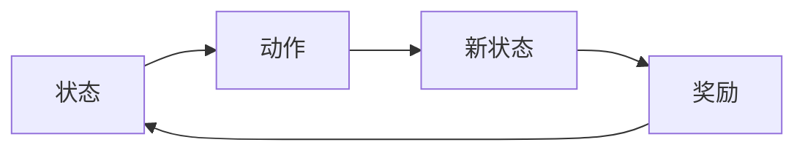
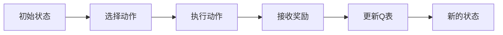
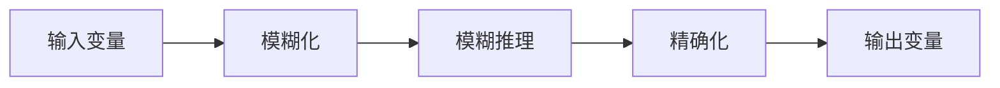
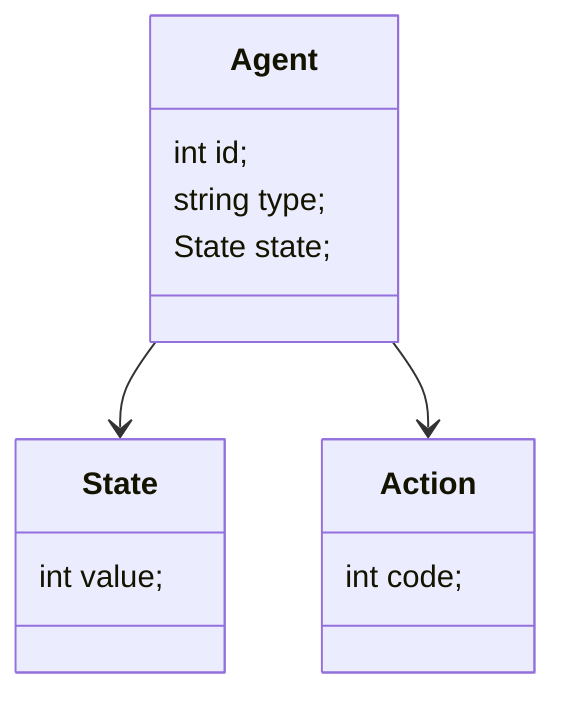
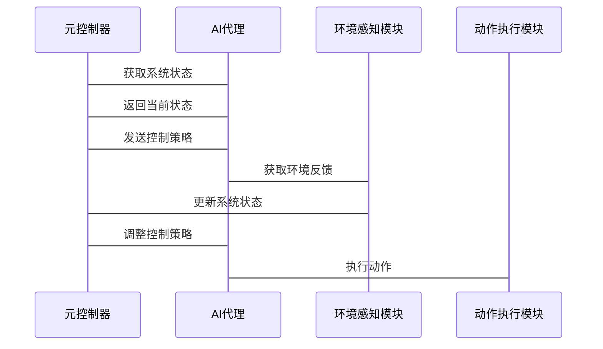

                 


# 元控制技术：AI Agent的自适应行为管理

## 关键词：
- 元控制技术
- AI Agent
- 自适应行为管理
- 强化学习
- 模糊控制
- 系统架构

## 摘要：
本文详细探讨了元控制技术在AI Agent行为管理中的应用，从基本概念到算法原理，再到系统架构和项目实战，全面解析了元控制技术的核心原理和实际应用。通过具体案例分析，展示了如何利用强化学习和模糊控制算法实现AI Agent的自适应行为管理，并提供了详细的系统架构设计和代码实现。本文旨在为AI领域的研究人员和开发人员提供理论支持和实践指导。

---

# 第一部分: 元控制技术基础

## 第1章: 元控制技术概述

### 1.1 元控制技术的背景与问题背景

#### 1.1.1 传统控制理论的局限性
传统控制理论在工业自动化和机器人等领域取得了巨大成功，但其固定性和刚性化在动态复杂环境中表现不足。例如，在多智能体协作场景中，传统控制难以应对实时变化的环境和任务需求。

#### 1.1.2 AI Agent行为管理的需求
AI Agent（智能体）在复杂环境中需要动态调整行为策略，传统控制方法难以满足其灵活性和自适应性需求。例如，在自动驾驶系统中，AI Agent需要实时响应交通状况和驾驶员意图。

#### 1.1.3 元控制技术的定义与目标
元控制技术是一种用于管理AI Agent行为的高级控制方法，其目标是通过动态调整控制策略，实现AI Agent的自适应行为管理。元控制技术的核心在于“元”（meta），即对控制过程的元层面进行管理，而不是直接控制执行动作。

### 1.2 元控制技术的核心概念

#### 1.2.1 元控制技术的基本原理
元控制技术通过监测系统状态和环境反馈，动态调整控制策略。其核心思想是“控制控制的过程”，即通过元控制器来优化控制策略，而不是直接控制执行动作。

#### 1.2.2 元控制技术的属性特征对比表

| 属性       | 传统控制技术       | 元控制技术       |
|------------|--------------------|------------------|
| 控制目标   | 执行动作           | 控制策略         |
| 策略调整   | 固定或有限制       | 动态自适应       |
| 环境适应性 | 低                 | 高               |

#### 1.2.3 元控制技术的ER实体关系图
```mermaid
er
    actor: 元控制器
    agent: AI代理
    action: 行为指令
    state: 系统状态
    relation: 元控制器与AI代理的关系
```

### 1.3 元控制技术的应用场景

#### 1.3.1 分布式系统中的行为管理
在分布式系统中，多个AI Agent需要协调合作。元控制技术可以通过动态调整各Agent的控制策略，实现系统的整体优化。

#### 1.3.2 多智能体协作中的协调控制
在多智能体协作中，元控制技术可以实时调整各智能体的行为策略，确保协作目标的实现。

#### 1.3.3 动态环境中的自适应控制
在动态环境中，元控制技术可以帮助AI Agent快速响应环境变化，调整行为策略以适应新情况。

## 1.4 本章小结
本章介绍了元控制技术的背景、核心概念和应用场景，为后续的算法和系统设计奠定了基础。

---

# 第二部分: 元控制技术的核心算法

## 第2章: 元控制算法原理

### 2.1 强化学习算法

#### 2.1.1 Q-learning算法
Q-learning是一种经典的强化学习算法，通过学习状态-动作值函数来优化决策。其核心思想是通过试错学习，找到最优策略。



##### 算法实现
```python
class QLearning:
    def __init__(self, state_space, action_space):
        self.q_table = np.zeros((state_space, action_space))
    
    def choose_action(self, state, epsilon):
        if np.random.random() < epsilon:
            return np.random.randint(action_space)
        return np.argmax(self.q_table[state])
    
    def update_q_table(self, state, action, reward, next_state, learning_rate):
        target = reward + np.max(self.q_table[next_state])
        self.q_table[state, action] = self.q_table[state, action] * (1 - learning_rate) + learning_rate * target
```

#### 2.1.2 算法流程图


### 2.2 模糊控制算法

#### 2.2.1 模糊推理流程
模糊控制算法通过将输入变量模糊化，进行模糊推理，最后精确化输出变量。



##### 模糊推理规则示例
- 如果状态是“高”，则动作是“右转”。
- 如果状态是“低”，则动作是“左转”。

### 2.3 元控制算法的数学模型

#### 2.3.1 状态空间模型
$$ S = \{s_1, s_2, ..., s_n\} $$

#### 2.3.2 动作空间模型
$$ A = \{a_1, a_2, ..., a_m\} $$

#### 2.3.3 奖励函数
$$ R(s, a) = r_{ij} $$

### 2.4 算法实现与案例分析

#### 2.4.1 算法实现代码
```python
def metcontrol_algorithm(state, action_space):
    # 初始化Q表
    q_table = np.zeros((1, action_space))
    
    # 设置超参数
    learning_rate = 0.1
    epsilon = 0.9
    
    # 状态空间和动作空间
    state_space = 1
    
    # 训练过程
    for _ in range(100):
        action = choose_action(state, epsilon)
        next_state = get_next_state(state, action)
        reward = get_reward(state, action, next_state)
        update_q_table(state, action, reward, next_state, learning_rate)
    
    return q_table
```

#### 2.4.2 案例分析
假设有一个AI Agent需要在动态环境中导航。元控制算法通过实时调整动作策略，帮助Agent避开障碍物，最终到达目标位置。

---

# 第三部分: 系统分析与架构设计

## 第3章: 系统分析与架构设计方案

### 3.1 问题场景介绍

#### 3.1.1 多智能体协作问题
在多智能体协作中，各智能体需要共享信息，协调动作，以实现共同目标。

#### 3.1.2 动态环境适应问题
AI Agent需要实时感知环境变化，动态调整行为策略。

### 3.2 系统功能设计

#### 3.2.1 领域模型设计


#### 3.2.2 系统架构设计


### 3.3 系统接口设计

#### 3.3.1 元控制器接口
- 输入：系统状态、环境反馈
- 输出：控制策略、行为指令

#### 3.3.2 动作执行模块接口
- 输入：行为指令
- 输出：执行结果

### 3.4 系统交互流程

#### 3.4.1 交互流程图


---

# 第四部分: 项目实战

## 第4章: 项目实战

### 4.1 环境安装

#### 4.1.1 安装Python环境
- 安装Python 3.8及以上版本
- 安装NumPy和Matplotlib库

#### 4.1.2 安装强化学习框架
- 安装OpenAI Gym库

### 4.2 系统核心实现

#### 4.2.1 元控制器实现
```python
class MetaController:
    def __init__(self, agents):
        self.agents = agents
    
    def update_strategies(self, states):
        for i in range(len(self.agents)):
            self.agents[i].update_strategy(states[i])
```

#### 4.2.2 动作执行模块实现
```python
class ActionExecutor:
    def __init__(self, agents):
        self.agents = agents
    
    def execute_actions(self, actions):
        for i in range(len(self.agents)):
            self.agents[i].execute_action(actions[i])
```

### 4.3 实际案例分析

#### 4.3.1 多智能体协作案例
实现一个多智能体协作系统，每个智能体负责不同的任务，元控制器动态调整各智能体的行为策略。

#### 4.3.2 动态环境适应案例
在动态环境中，AI Agent需要实时调整行为策略，以应对环境变化。

### 4.4 项目小结
通过实际案例分析，展示了元控制技术在AI Agent行为管理中的应用价值。

---

# 第五部分: 最佳实践与小结

## 第5章: 最佳实践与小结

### 5.1 最佳实践

#### 5.1.1 系统设计建议
- 采用分层架构设计，明确各模块职责
- 使用强化学习和模糊控制算法结合

#### 5.1.2 代码实现建议
- 保持代码简洁，便于维护
- 提供详细的文档和注释

### 5.2 注意事项

#### 5.2.1 系统稳定性
- 定期检查系统状态，防止系统崩溃
- 设计容错机制，应对突发情况

#### 5.2.2 安全性
- 防止恶意攻击，保护系统安全
- 定期更新系统，修复潜在漏洞

### 5.3 拓展阅读
- 《强化学习导论》
- 《模糊控制技术及其应用》
- 《多智能体协作算法研究》

## 5.4 本章小结
本文从理论到实践，全面解析了元控制技术在AI Agent行为管理中的应用，希望读者能够通过本文，深入了解元控制技术的核心原理和实际应用。

---

# 作者：AI天才研究院/AI Genius Institute & 禅与计算机程序设计艺术 /Zen And The Art of Computer Programming

