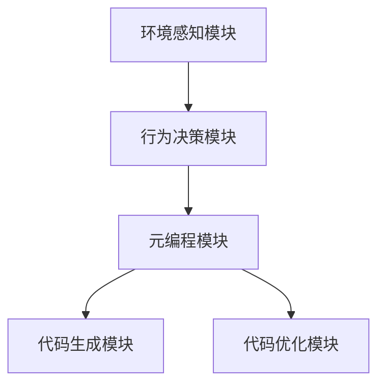

                 


# 元编程技术：赋予AI Agent自我改进的能力

> 关键词：元编程，AI Agent，自我改进，算法原理，系统架构

> 摘要：元编程是一种通过编写代码生成代码的技术，它能够赋予AI Agent自我改进的能力，从而使其在复杂环境中自主优化自身行为。本文将从元编程的基本概念出发，逐步分析其在AI Agent中的应用，探讨其实现机制和算法原理，并通过案例展示如何构建一个具备自我改进能力的AI Agent系统。

---

## 第一部分：元编程技术背景与基础

### 第1章：元编程技术的起源与发展

#### 1.1 元编程的定义与特点
元编程是一种编写代码生成代码的技术，它允许程序员在编写程序时，不仅定义程序的行为，还能定义如何生成程序的行为。元编程的特点包括高度的抽象性、灵活性和可扩展性。与传统编程不同，元编程允许程序在运行时动态地生成和修改代码，从而实现更复杂的任务。

#### 1.2 AI Agent的自我改进需求
AI Agent是一种能够感知环境并采取行动以实现目标的智能体。在复杂的动态环境中，AI Agent需要具备自我改进的能力，以便在面对新问题和挑战时能够不断优化自身的算法和行为策略。

#### 1.3 元编程与AI Agent的结合
元编程为AI Agent的自我改进提供了新的可能性。通过元编程，AI Agent可以在运行时动态地生成和修改自身的代码，从而实现算法的优化、行为策略的调整以及对环境变化的快速适应。

---

### 第2章：元编程的核心概念与原理

#### 2.1 元编程的基本概念
元编程的核心思想是将程序的结构和行为作为数据进行处理。元编程允许程序员编写能够生成其他程序的代码，从而实现代码的自动生成和优化。

#### 2.2 元编程与AI Agent的结合原理
在AI Agent中，元编程可以通过以下方式实现自我改进：
1. **动态代码生成**：AI Agent可以在运行时根据当前环境的状态生成新的代码，以适应新的任务需求。
2. **行为策略优化**：元编程可以用于动态调整AI Agent的行为策略，使其在复杂环境中表现更优。
3. **自适应算法设计**：通过元编程，AI Agent可以自动生成和优化算法，从而提高问题求解的效率。

#### 2.3 元编程的核心算法与实现
元编程的核心算法包括代码生成、代码分析和代码优化等。这些算法可以通过元编程语言或库来实现，例如Lisp、Scheme等语言天然支持元编程，而现代编程语言如Python和Java也可以通过元编程库实现类似的功能。

---

## 第二部分：元编程技术的算法原理

### 第3章：元编程的算法实现

#### 3.1 元编程的核心算法
元编程的核心算法包括：
1. **代码生成算法**：用于根据输入生成新的代码。
2. **代码分析算法**：用于分析现有代码的结构和行为。
3. **代码优化算法**：用于优化生成或分析的代码，使其运行效率更高。

#### 3.2 元编程算法的优化与改进
元编程算法的优化可以从以下几个方面入手：
1. **提高代码生成的效率**：通过优化代码生成算法，减少生成代码的冗余和重复。
2. **增强代码分析的准确性**：通过改进代码分析算法，提高对代码结构和行为的分析能力。
3. **优化代码优化策略**：通过引入新的优化策略，进一步提高生成代码的性能。

#### 3.3 元编程算法的实现案例
以下是一个简单的元编程实现案例，展示了如何通过Python的元编程能力动态生成函数：

```python
def generate_function(code):
    exec(code)
    return globals()[code.split('(')[0]]
```

这个函数接受一段代码字符串作为输入，并在全局作用域中执行这段代码，最终返回生成的函数对象。通过这种方式，AI Agent可以根据当前环境的需求动态生成和调用新的函数。

---

## 第三部分：元编程技术在AI Agent中的应用

### 第4章：AI Agent的自我改进机制

#### 4.1 AI Agent的行为优化
AI Agent可以通过元编程技术动态调整其行为策略。例如，当AI Agent在动态变化的环境中遇到新的任务时，它可以使用元编程生成新的行为逻辑，以适应新的任务需求。

#### 4.2 AI Agent的算法优化
元编程可以用于优化AI Agent的核心算法。例如，AI Agent可以通过元编程动态生成和优化搜索算法，从而在复杂环境中更快地找到最优解。

#### 4.3 AI Agent的自适应能力
通过元编程，AI Agent可以在运行时动态地修改和生成代码，从而实现对环境变化的快速适应。例如，当环境中的某些规则发生变化时，AI Agent可以使用元编程生成新的代码，以适应新的规则。

---

### 第5章：AI Agent的系统架构设计

#### 5.1 系统功能设计
AI Agent的系统架构设计需要考虑以下几个方面：
1. **环境感知模块**：用于感知外部环境的状态和变化。
2. **行为决策模块**：用于根据当前环境状态和任务需求做出决策。
3. **元编程模块**：用于动态生成和优化代码，实现自我改进。

#### 5.2 系统架构设计
以下是AI Agent系统的架构图：



#### 5.3 接口设计与交互
AI Agent系统的接口设计需要考虑以下几点：
1. **环境接口**：AI Agent需要通过接口感知环境的状态和变化。
2. **行为接口**：AI Agent需要通过接口与外部系统进行交互。
3. **元编程接口**：AI Agent需要通过接口调用元编程模块生成和优化代码。

---

## 第四部分：项目实战

### 第6章：构建一个具备自我改进能力的AI Agent系统

#### 6.1 项目环境安装
为了实现AI Agent的自我改进能力，我们需要以下环境：
1. Python 3.8+
2. 基础的Python库（如`exec`）

#### 6.2 核心代码实现
以下是AI Agent系统的核心代码实现：

```python
def generate_behavior(code):
    exec(code)
    return globals()[code.split('(')[0]]

def optimize_algorithm(code):
    # 这里可以实现代码优化算法，例如通过AOP等方式
    return optimized_code

def adapt_to_environment(environment_change):
    # 根据环境变化生成新的行为逻辑
    new_behavior_code = f"""
def new_behavior({environment_change}):
    # 新的行为逻辑
    pass
    """
    return generate_behavior(new_behavior_code)
```

#### 6.3 代码解读与分析
1. `generate_behavior`函数用于动态生成新的行为逻辑。
2. `optimize_algorithm`函数用于优化生成的代码。
3. `adapt_to_environment`函数根据环境变化生成新的行为逻辑。

#### 6.4 实际案例分析
假设环境中的规则发生变化，AI Agent可以调用`adapt_to_environment`函数生成新的行为逻辑，从而适应新的环境。

---

## 第五部分：最佳实践与总结

### 第7章：总结与展望

#### 7.1 关键点总结
1. 元编程是实现AI Agent自我改进的核心技术。
2. 通过元编程，AI Agent可以在运行时动态生成和优化代码，从而实现自我改进。
3. 元编程的应用场景包括动态环境适应、行为优化和算法优化等。

#### 7.2 小结
元编程技术为AI Agent的自我改进提供了强大的工具。通过元编程，AI Agent可以在复杂环境中动态调整其行为和算法，从而实现更高效的任务执行。

#### 7.3 注意事项
1. 元编程的使用需要谨慎，避免引入安全风险。
2. 在实现元编程功能时，需要考虑代码的可读性和可维护性。
3. 元编程的性能优化需要在代码生成和优化阶段进行充分考虑。

#### 7.4 拓展阅读
1. 《黑客与画家》——Paul Graham
2. 《计算机程序的构造和解释》——Harold Abelson

---

## 作者：AI天才研究院/AI Genius Institute & 禅与计算机程序设计艺术 /Zen And The Art of Computer Programming

---

这篇文章详细探讨了元编程技术在AI Agent自我改进中的应用，从基本概念到算法实现，再到系统架构和项目实战，为读者提供了一个全面的视角。希望这篇文章能为AI Agent的开发和研究提供有价值的参考。

