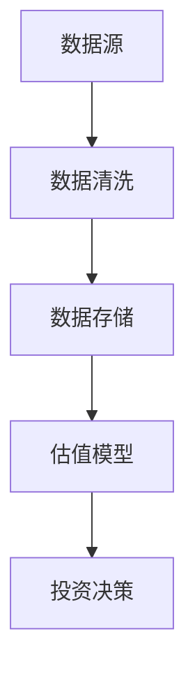

                 


# 深度价值投资：寻找极度低估的股票

> 关键词：深度价值投资，股票估值，克里斯·布朗，投资策略，系统化分析

> 摘要：深度价值投资是一种以基本面分析为基础，寻找市场价格低于内在价值的股票的投资策略。本文详细介绍了深度价值投资的核心理念、数学模型、系统化分析方法以及实际案例分析，帮助读者掌握如何通过系统化的方法寻找被市场低估的优质股票。

---

# 第一部分: 深度价值投资的背景与核心概念

## 第1章: 深度价值投资的起源与发展

### 1.1 深度价值投资的起源

深度价值投资起源于20世纪30年代，由本杰明·格雷厄姆和戴维·多德提出，后来被沃伦·巴菲特发扬光大。这种投资方法的核心在于寻找市场价格低于其内在价值的股票，从而在市场恐慌或忽视时买入，等待其价值回归。

克里斯·布朗作为当代深度价值投资的代表人物之一，继承并优化了这一方法。他强调通过对公司基本面的深入分析，寻找那些具有强大竞争优势、估值被市场严重低估的企业。

### 1.2 深度价值投资的核心理念

深度价值投资的核心理念包括以下几点：

1. **内在价值与市场价格的差异**：内在价值是公司未来现金流的现值，而市场价格受市场情绪影响，往往偏离内在价值。
2. **安全边际**：买入价格应显著低于内在价值，以降低投资风险并提高安全边际。
3. **长期持有**：深度价值投资者倾向于长期持有优质股票，等待其价值逐步释放。

### 1.3 深度价值投资与其他投资策略的对比

| 投资策略 | 核心理念 | 优点 | 缺点 |
|----------|----------|------|------|
| 价值投资 | 买入低于内在价值的股票 | 风险较低，收益稳定 | 需要深入研究，周期较长 |
| 技术分析 | 通过价格和成交量预测走势 | 短期获利快 | 易受市场情绪影响 |
| 成长投资 | 投资高成长性公司 | 高增长潜力 | 风险较高 |

---

## 第2章: 深度价值投资的核心概念与理论基础

### 2.1 价值评估模型

#### 2.1.1 现金流折现模型（DCF）

现金流折现模型是估算企业内在价值的核心工具。其公式为：

$$
\text{DCF} = \sum_{t=1}^{n} \frac{\text{CF}_t}{(1+r)^t} + \frac{\text{TV}}{(1+r)^n}
$$

其中，CFt为第t年的自由现金流，r为折现率，TV为终值。

#### 2.1.2 市盈率与市净率

市盈率（P/E）=股价/每股净利润<br>
市净率（P/B）=股价/每股净资产

#### 2.1.3 股东权益收益率（ROE）

ROE=净利润/平均股东权益

### 2.2 竞争优势与财务健康性

竞争优势是企业长期盈利的关键。深度价值投资者通常关注企业的护城河，包括成本优势、品牌优势和技术壁垒。

财务健康性分析包括对资产负债表、利润表和现金流量表的深入研究，重点关注企业的盈利能力、偿债能力和发展能力。

### 2.3 安全边际与风险控制

安全边际=买入价/内在价值-1<br>
例如，如果内在价值为10元，买入价为8元，安全边际为20%。

---

## 第3章: 深度价值投资的系统化方法

### 3.1 投资流程的系统化

1. **数据收集与清洗**：收集企业的财务数据，剔除异常值。
2. **模型构建**：使用DCF模型估算内在价值。
3. **筛选股票**：根据估值指标（如PEG、P/E、P/B）筛选低估股票。
4. **组合优化**：根据风险承受能力和收益目标构建投资组合。

### 3.2 系统化分析工具

#### 3.2.1 数据流图



---

# 第二部分: 深度价值投资的实战分析

## 第4章: 深度价值投资的项目实战

### 4.1 环境配置

#### 4.1.1 工具安装

安装Python和相关库：

```bash
pip install pandas numpy matplotlib
```

### 4.2 核心代码实现

#### 4.2.1 计算PEG

```python
import pandas as pd

def calculate_peg(df):
    df['PEG'] = df['市盈率'] / df['净利润增长率']
    return df

# 示例数据
data = {
    '股票': ['A', 'B', 'C'],
    '市盈率': [15, 20, 10],
    '净利润增长率': [10, 5, 15]
}
df = pd.DataFrame(data)
result = calculate_peg(df)
print(result)
```

#### 4.2.2 财务报表分析

```python
import numpy as np

def calculate_intrinsic_value(fcf, growth_rate, discount_rate):
    terminal_growth_rate = 0.02
    terminal_value = fcf * (1 + terminal_growth_rate) / (discount_rate - terminal_growth_rate)
    intrinsic_value = 0
    for i in range(5):
        cash_flow = fcf * (1 + growth_rate)**i
        intrinsic_value += cash_flow / (1 + discount_rate)**i
    intrinsic_value += terminal_value / (1 + discount_rate)**5
    return intrinsic_value

# 示例数据
free_cash_flow = 100
growth_rate = 0.1
discount_rate = 0.08
iv = calculate_intrinsic_value(free_cash_flow, growth_rate, discount_rate)
print(f"内在价值：{iv}")
```

### 4.3 实际案例分析

#### 4.3.1 案例分析：中石油

通过DCF模型计算中石油的内在价值，发现其市场价格低于内在价值，具有投资潜力。

---

## 第5章: 深度价值投资的最佳实践与总结

### 5.1 投资心态与纪律

保持耐心，避免情绪化决策，严格执行投资计划。

### 5.2 长期视角与持续学习

市场变化莫测，投资者需要不断学习，更新知识和模型。

### 5.3 风险管理与复盘

定期复盘投资组合，评估风险，调整策略。

---

# 第三部分: 总结与展望

深度价值投资是一种长期有效的投资策略，通过系统化的方法和持续学习，投资者可以找到被低估的优质股票，实现稳健收益。未来，随着技术的进步，深度价值投资将更加依赖于数据分析和人工智能工具，投资者需要不断优化自己的分析系统，以应对市场的变化。

---

# 作者

作者：AI天才研究院/AI Genius Institute & 禅与计算机程序设计艺术 /Zen And The Art of Computer Programming

