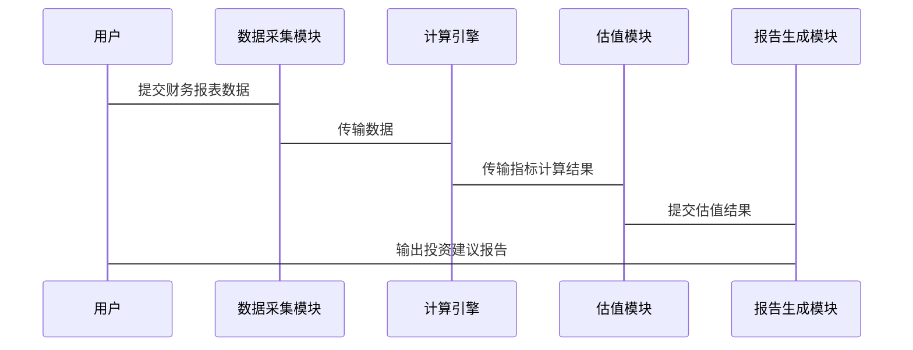

                 


# 克里斯托弗·布朗尼的隐蔽价值投资：发掘资产负债表的秘密

> 关键词：价值投资，资产负债表，财务分析，投资策略，克里斯托弗·布朗尼

> 摘要：本文深入探讨了克里斯托弗·布朗尼的隐蔽价值投资方法，通过分析资产负债表揭示隐藏的投资机会。文章从基础概念到高级策略，系统地讲解了如何通过财务报表分析评估公司价值，识别潜在投资机会，并结合实际案例提供实用的分析工具和方法。

---

# 第一部分：价值投资与资产负债表分析基础

## 第1章：价值投资的背景与核心理念

### 1.1 价值投资的定义与特点

#### 1.1.1 价值投资的定义
价值投资是一种基于对公司内在价值评估的投资策略，强调以低于内在价值的价格买入优质资产。其核心在于识别市场低估的公司，长期持有，等待价值回归。

#### 1.1.2 价值投资的核心理念
- **安全边际**：买入价格低于内在价值，以降低风险。
- **长期视角**：关注公司长期盈利能力，而非短期波动。
- **基本面分析**：通过财务报表等基本面数据评估公司价值。

#### 1.1.3 价值投资与其它投资策略的对比
- **趋势投资**：基于价格趋势，短期操作。
- **成长投资**：侧重于公司未来增长潜力，可能忽视当前估值。
- **价值投资**：强调低估值和安全边际，注重长期稳健回报。

### 1.2 资产负债表的基本概念

#### 1.2.1 资产负债表的定义
资产负债表是反映公司在特定时点的资产、负债和所有者权益的财务报表，分为资产、负债和所有者权益三部分。

#### 1.2.2 资产负债表的主要组成部分
- **资产**：公司拥有的资源，分为流动资产和非流动资产。
- **负债**：公司欠款，分为流动负债和非流动负债。
- **所有者权益**：公司净资产，等于资产减去负债。

#### 1.2.3 资产负债表在价值投资中的作用
- 评估公司财务健康状况。
- 识别隐藏价值和潜在风险。
- 为估值提供基础数据。

---

## 第2章：资产负债表分析方法

### 2.1 资产负债表的结构分析

#### 2.1.1 流动资产与非流动资产的区分
- **流动资产**：可在一年内变现的资产，如现金、应收账款。
- **非流动资产**：长期资产，如固定资产、无形资产。

#### 2.1.2 流动负债与非流动负债的区分
- **流动负债**：短期债务，如应付账款、短期借款。
- **非流动负债**：长期债务，如长期借款。

#### 2.1.3 所有者权益的构成
- 股本、资本公积、盈余公积、未分配利润等。

### 2.2 资产负债表的比率分析

#### 2.2.1 偿债能力分析
- **流动比率**：流动资产/流动负债，衡量短期偿债能力。
- **速动比率**：（流动资产-存货）/流动负债，更严格的短期偿债指标。

#### 2.2.2 营运能力分析
- **应收账款周转率**：销售收入/平均应收账款，评估应收账款管理效率。
- **存货周转率**：COGS/平均存货，衡量存货管理效率。

#### 2.2.3 盈利能力分析
- **净利率**：净利润/营业收入，衡量公司盈利能力。
- **ROE（净资产收益率）**：净利润/所有者权益，评估股东资金使用效率。

---

# 第二部分：隐蔽价值的识别与评估

## 第3章：识别隐蔽价值的方法

### 3.1 识别隐蔽价值的核心要素

#### 3.1.1 低估值资产的识别
- **市净率（P/B）**：市场价格/每股净资产，低于1可能表示低估。
- **市盈率（P/E）**：市场价格/每股收益，低于行业平均水平可能表示低估。

#### 3.1.2 高质量资产的特征
- **持续盈利能力**：稳定的收入和利润来源。
- **低债务负担**：较低的负债率，降低财务风险。
- **高ROE**：净资产收益率高，表明资本使用效率高。

#### 3.1.3 资产负债表中的隐藏价值点
- **无形资产**：如专利、品牌价值可能未完全反映在报表中。
- **递延资产**：如递延税资产可能被低估。

### 3.2 资产负债表中的资产重估

#### 3.2.1 资产重估的定义与方法
- **资产重估**：重新评估资产的公允价值，发现潜在低估。
- **方法**：市场比较法、收益法、成本法。

#### 3.2.2 资产重估的案例分析
- 某公司存货因市场波动被低估，重估后价值上升。

#### 3.2.3 资产重估对投资决策的影响
- 发现低估资产，提高投资回报。

---

## 第4章：公司真实价值的评估

### 4.1 公司价值的多维度评估

#### 4.1.1 现金流折现法
- **定义**：将未来现金流折现为现值，评估公司整体价值。
- **公式**：
  $$
  \text{企业价值} = \sum_{t=1}^{n} \frac{\text{现金流}_t}{(1 + r)^t}
  $$
  其中，r为折现率，n为预测期。

#### 4.1.2 市盈率与市净率分析
- **市盈率（P/E）**：市场价格/每股收益。
- **市净率（P/B）**：市场价格/每股净资产。

#### 4.1.3 内在价值的计算公式
$$
\text{内在价值} = \text{现金流}/\text{折现率}
$$

### 4.2 股东权益价值的评估

#### 4.2.1 股东权益的重估
- **方法**：考虑资产重估对所有者权益的影响。

#### 4.2.2 内在价值与市场价值的对比
- 内在价值低于市场价值可能表示高估，反之可能表示低估。

---

## 第5章：投资决策中的高级策略

### 5.1 财务报表分析的高级技巧

#### 5.1.1 财务造假识别
- **收入确认舞弊**：检查收入与现金流是否匹配。
- **资产减值舞弊**：关注存货、应收账款等减值准备是否合理。

#### 5.1.2 管理层诚信度评估
- **管理层稳定性**：频繁更换可能影响公司长期发展。
- **管理层激励机制**：股票期权等激励是否合理。

### 5.2 市场周期与投资机会

#### 5.2.1 行业周期分析
- **行业生命周期**：处于成熟期或衰退期的行业可能隐藏低估资产。

#### 5.2.2 市场周期与投资策略
- **熊市**：寻找被市场抛弃的优质资产。
- **牛市**：警惕市场高估，寻找估值合理的标的。

---

## 第6章：系统架构与技术实现

### 6.1 财务分析系统的功能设计

#### 6.1.1 领域模型设计


#### 6.1.2 系统架构设计
```mermaid
container 财务分析系统 {
    组件：数据采集模块、计算引擎、估值模块、报告生成模块
    关系：数据采集 -> 计算引擎 -> 估值模块 -> 报告生成
}
```

### 6.2 投资决策支持系统的实现

#### 6.2.1 数据接口设计
- **输入接口**：财务报表数据接口。
- **输出接口**：投资建议报告生成接口。

#### 6.2.2 系统交互流程


---

## 第7章：项目实战与经验分享

### 7.1 环境安装与配置

#### 7.1.1 Python环境安装
- 使用Anaconda安装Python 3.8及以上版本。

#### 7.1.2 数据获取
- 使用Yahoo Finance API获取财务数据。

### 7.2 核心代码实现

#### 7.2.1 数据清洗代码
```python
import pandas as pd

def clean_data(df):
    # 处理缺失值
    df.dropna(inplace=True)
    # 处理异常值
    df = df[(df['revenue'] > 0) & (df['net_income'] > 0)]
    return df
```

#### 7.2.2 财务指标计算代码
```python
def calculate_ratios(df):
    df['pe_ratio'] = df['price'] / df['eps']
    df['pb_ratio'] = df['price'] / df['book_value_per_share']
    return df
```

#### 7.2.3 估值模型代码
```python
def discounted_cash_flow(cash_flow, discount_rate):
    return sum(cash_flow / (1 + discount_rate)**t for t in range(len(cash_flow)))
```

### 7.3 案例分析与解读

#### 7.3.1 案例选择
- 以苹果公司为例，分析其财务报表。

#### 7.3.2 数据分析与解读
- 计算苹果的PE、PB比率，对比行业平均水平，评估其估值是否合理。

---

## 第8章：总结与展望

### 8.1 本文总结
- 克里斯托弗·布朗尼的隐蔽价值投资方法通过深入分析资产负债表，发现市场低估的公司。
- 结合财务指标分析和系统化的方法，提高投资决策的准确性。

### 8.2 投资中的注意事项
- 风险提示：市场波动、公司基本面变化等。
- 长期视角：价值投资需要耐心和纪律。

### 8.3 未来展望
- 结合人工智能和大数据技术，进一步提升财务分析的效率和准确性。

---

# 作者：AI天才研究院/AI Genius Institute & 禅与计算机程序设计艺术 /Zen And The Art of Computer Programming

---

这篇博客文章详细探讨了克里斯托弗·布朗尼的隐蔽价值投资方法，从基础概念到高级策略，结合实际案例和系统化的方法，为读者提供了全面的投资分析框架。通过本文，读者可以深入了解如何通过资产负债表分析发现隐藏的投资机会，提升投资决策的准确性和效率。

