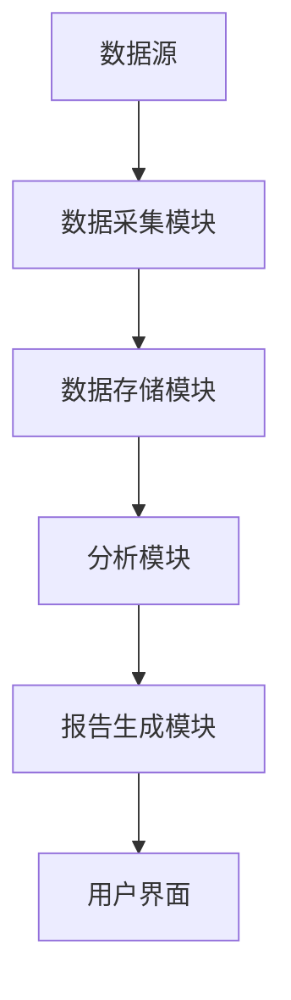

                 


# 克里斯托弗·布朗的小盘股研究方法论

## 关键词：小盘股研究，克里斯托弗·布朗，投资方法论，量化分析，市场流动性，市值分析，成长性分析

## 摘要：  
本文系统地介绍了克里斯托弗·布朗的小盘股研究方法论，从背景、核心概念到算法模型、系统架构，再到实际案例，全面剖析了小盘股研究的理论与实践。文章首先阐述了小盘股市场的定义、特点及其研究的重要性，接着详细探讨了克里斯托弗·布朗的研究框架和核心理论。随后，通过量化分析方法、数学模型和系统设计，深入分析了小盘股研究的算法与实现。最后，通过实际案例，展示了小盘股研究的实战应用。本文旨在为读者提供一套完整的小盘股研究方法论，帮助投资者在小盘股市场中做出明智的决策。

---

## 第一部分：小盘股研究方法论的背景与核心概念

### 第1章：小盘股市场的定义与特点

#### 1.1 小盘股市场的定义
小盘股是指市值较小的公司股票，通常指市值在10亿到50亿美元之间的公司。与大盘股相比，小盘股具有更高的波动性和不确定性，但也可能带来更高的回报。

#### 1.2 小盘股市场的特点与优势
- **低关注度**：小盘股通常不受主流媒体的关注，市场流动性较低。
- **高波动性**：小盘股价格波动较大，容易受市场情绪影响。
- **高潜力**：小盘股公司具有较高的成长潜力，尤其是在新兴行业或细分市场中。

#### 1.3 小盘股市场与大盘股市场的区别
| 特性 | 小盘股 | 大盘股 |
|------|--------|--------|
| 市值范围 | 10-50亿美元 | 50亿美元以上 |
| 波动性 | 高 | 低 |
| 市场关注度 | 低 | 高 |
| 投资门槛 | 低 | 高 |

---

### 第2章：克里斯托弗·布朗的小盘股研究方法论

#### 2.1 研究框架的核心要素
- **市场流动性**：小盘股的流动性较低，容易导致价格波动。
- **市值与成长性**：小盘股公司通常具有较高的成长潜力，但市值较小。
- **风险与收益**：小盘股投资风险较高，但潜在回报也更大。

#### 2.2 小盘股研究的核心理论
- **基本面分析**：关注公司的财务状况、盈利能力、管理团队等因素。
- **技术分析**：通过价格走势、成交量等指标预测未来的价格变动。

#### 2.3 研究方法的创新点
- **结合基本面与技术分析**：克里斯托弗·布朗提出将基本面分析与技术分析相结合，以提高研究的准确性。
- **动态调整策略**：根据市场环境的变化，动态调整投资策略。

---

## 第二部分：小盘股研究的算法与数学模型

### 第4章：小盘股研究的量化分析方法

#### 4.1 小盘股量化分析的核心算法
- **因子模型**：通过筛选特定的因子（如市值、流动性、成长性）来选择股票。
- **机器学习预测**：利用机器学习算法（如随机森林、支持向量机）预测股票价格。
- **时间序列分析**：通过分析历史价格数据，预测未来的价格走势。

#### 4.2 小盘股量化分析的数学模型

##### 4.2.1 因子模型
$$ R_i = \alpha + \beta R_m + \gamma Size_i + \epsilon $$

其中，$R_i$ 是股票 $i$ 的超额收益，$R_m$ 是市场收益，$Size_i$ 是股票 $i$ 的规模因子。

##### 4.2.2 机器学习模型
使用随机森林算法进行股票分类：
```python
from sklearn.ensemble import RandomForestClassifier
import pandas as pd

# 加载数据
data = pd.read_csv('small_cap_data.csv')

# 特征与标签分离
X = data[['market_cap', 'volume', 'beta']]
y = data['target']

# 训练模型
model = RandomForestClassifier(n_estimators=100)
model.fit(X, y)

# 预测
predictions = model.predict(X)
```

##### 4.2.3 时间序列模型
使用ARIMA模型预测股票价格：
```python
from statsmodels.tsa.arima_model import ARIMA

# 加载数据
data = pd.read_csv('stock_prices.csv')

# 拟合模型
model = ARIMA(data['price'], order=(1, 1, 1))
model_fit = model.fit()

# 预测未来价格
forecast = model_fit.forecast(steps=5)
```

---

## 第三部分：系统分析与架构设计

### 第5章：小盘股研究系统的架构设计

#### 5.1 问题场景介绍
小盘股研究需要一个高效的系统来处理大量数据，进行实时分析，并生成研究报告。

#### 5.2 系统功能设计
- **数据采集模块**：从多个数据源获取小盘股数据。
- **分析模块**：包括基本面分析和技术分析。
- **报告生成模块**：生成研究报告和投资建议。

#### 5.3 系统架构设计


#### 5.4 接口设计
- 数据接口：与数据源对接，获取实时数据。
- 用户接口：提供友好的用户界面，方便用户查看分析结果。

---

## 第四部分：项目实战

### 第6章：小盘股研究的实战案例

#### 6.1 环境安装
安装必要的Python库：
```bash
pip install pandas numpy scikit-learn statsmodels
```

#### 6.2 核心代码实现
##### 6.2.1 数据预处理
```python
import pandas as pd

data = pd.read_csv('small_cap_data.csv')
data = data.dropna()
```

##### 6.2.2 模型训练
```python
from sklearn.model_selection import train_test_split
from sklearn.metrics import accuracy_score

X_train, X_test, y_train, y_test = train_test_split(X, y, test_size=0.2)

model = RandomForestClassifier()
model.fit(X_train, y_train)
print("Accuracy:", accuracy_score(model.predict(X_test), y_test))
```

#### 6.3 案例分析
通过实际数据，展示如何使用上述方法进行小盘股研究。

---

## 总结

克里斯托弗·布朗的小盘股研究方法论结合了基本面分析、技术分析和量化分析，为投资者提供了一套高效的研究工具。通过本文的详细介绍，读者可以全面理解小盘股研究的理论与实践，并在实际投资中灵活应用这些方法。

---

## 作者

作者：AI天才研究院/AI Genius Institute & 禅与计算机程序设计艺术 /Zen And The Art of Computer Programming

---

希望这篇文章能够帮助您更好地理解克里斯托弗·布朗的小盘股研究方法论！

