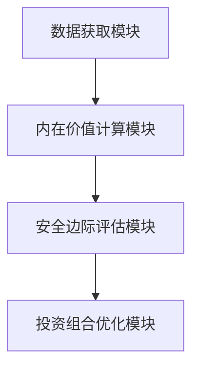

                 


# 克里斯托弗·布朗的深度价值投资方法

## 关键词：深度价值投资、克里斯托弗·布朗、安全边际、内在价值、投资策略、股票筛选、投资组合管理

## 摘要：深度价值投资是一种强调长期持有优质股票的投资策略，注重安全边际和内在价值。本文将详细探讨克里斯托弗·布朗的深度价值投资方法，从其核心理念、算法原理到实际应用，帮助读者全面理解并掌握这一投资策略。

## 第一部分: 深度价值投资的背景与核心理念

### 第1章: 深度价值投资的起源与发展

#### 1.1 深度价值投资的起源

深度价值投资的起源可以追溯到20世纪30年代，由本杰明·格雷厄姆和戴维·多德共同提出的“价值投资”理念。这一理念强调以低于内在价值的价格购买股票，以确保投资的安全性和长期收益。

随着市场的演变，深度价值投资逐渐发展出更复杂的策略和方法，结合了更多的量化分析和技术手段。克里斯托弗·布朗作为这一领域的杰出代表，将深度价值投资的理念进一步发扬光大，并提出了许多创新性的方法。

#### 1.2 深度价值投资的核心理念

深度价值投资的核心理念是寻找那些市场价格低于其内在价值的股票。投资者通过分析公司的基本面，如盈利能力、财务状况、竞争优势等，来评估其内在价值。当市场价格显著低于内在价值时，投资这些股票具有较高的安全边际，能够在长期带来超额收益。

### 第2章: 克里斯托弗·布朗的深度价值投资方法

#### 2.1 克里斯托弗·布朗的背景与成就

克里斯托弗·布朗是深度价值投资领域的权威专家，以其严谨的投资理念和卓越的投资业绩闻名。他著有多本关于投资的经典著作，提出了许多被广泛认可的投资策略和方法。布朗的投资理念强调长期持有、安全边际和对公司基本面的深入分析。

#### 2.2 深度价值投资的核心概念与联系

深度价值投资的核心概念包括安全边际、内在价值和市场先生理论。安全边际是指股票市场价格与内在价值之间的差距，是投资的安全垫。内在价值是股票的真实价值，反映了公司的盈利能力、成长潜力和财务状况。市场先生理论则强调市场情绪的波动性，投资者应利用市场的非理性波动来寻找投资机会。

### 第3章: 深度价值投资的算法原理

#### 3.1 股票筛选算法

深度价值投资的股票筛选算法通常包括以下几个步骤：

1. 数据获取：收集目标公司的财务数据，包括收入、利润、现金流等。
2. 内在价值计算：使用现金流折现法等方法计算股票的内在价值。
3. 安全边际评估：计算股票市场价格与内在价值的差距，确定是否具备足够的安全边际。
4. 筛选符合条件的股票：根据设定的标准筛选出符合条件的股票。
5. 生成投资组合：根据筛选结果，生成投资组合并进行优化。

#### 3.2 算法实现代码

以下是一个简单的股票筛选算法的Python代码示例：

```python
def calculate_intrinsic_value(stock_data):
    # 使用现金流折现法计算内在价值
    return stock_data['现金流'].sum() / (0.12 + 1/5)

def screen_stocks(stocks):
    selected_stocks = []
    for stock in stocks:
        iv = calculate_intrinsic_value(stock)
        if stock['price'] < 0.8 * iv:
            selected_stocks.append(stock)
    return selected_stocks

# 示例数据
stocks = [
    {'name': '公司A', 'price': 50, '现金流': 100},
    {'name': '公司B', 'price': 60, '现金流': 120}
]

selected = screen_stocks(stocks)
print(selected)
```

### 第4章: 深度价值投资的系统架构设计

#### 4.1 系统功能设计

深度价值投资系统的功能模块包括：

1. 数据获取模块：收集股票的财务数据和市场数据。
2. 内在价值计算模块：使用算法计算股票的内在价值。
3. 安全边际评估模块：评估股票的安全边际。
4. 投资组合优化模块：生成并优化投资组合。

#### 4.2 系统架构图



### 第5章: 项目实战

#### 5.1 实际案例分析

以下是一个实际案例分析：

假设我们有两家公司，公司A和公司B。公司A的股价为50元，现金流为100元；公司B的股价为60元，现金流为120元。使用现金流折现法计算内在价值，假设折现率为12%。

公司A的内在价值为100 / (0.12 + 1/5) ≈ 100 / 1.24 ≈ 80.65元。公司B的内在价值为120 / (0.12 + 1/5) ≈ 120 / 1.24 ≈ 96.77元。

根据安全边际标准，我们选择股价低于内在价值80%的股票。公司A的股价50元低于80.65元的80%，即64.52元；公司B的股价60元低于96.77元的80%，即77.42元。因此，公司A和公司B都符合条件，可以被选入投资组合。

#### 5.2 投资组合构建

根据筛选结果，我们可以构建一个包含公司A和公司B的投资组合。为了分散风险，我们可以根据股票的风险水平分配不同的权重。例如，分配50%的资金投资公司A，50%的资金投资公司B。

### 第6章: 小结与注意事项

#### 6.1 核心要点总结

- 深度价值投资的核心理念是寻找市场价格低于内在价值的股票。
- 克里斯托弗·布朗提出了许多创新性的投资策略和方法。
- 股票筛选算法和系统架构设计是实现深度价值投资的重要工具。

#### 6.2 投资建议与风险管理

- 在进行深度价值投资时，应注重对公司的基本面分析，确保内在价值的准确性。
- 投资组合应多样化，以分散风险。
- 定期评估投资组合的绩效，并根据市场变化进行调整。

### 第7章: 拓展阅读与资源推荐

#### 7.1 相关书籍

1. 《价值投资实战》——克里斯托弗·布朗
2. 《投资学基础》——本杰明·格雷厄姆

#### 7.2 网络资源

1. 克里斯托弗·布朗的官方网站：https://www.christopherbrown.com
2. 投资论坛和社区：例如，投资界（https://www.investor.com）

## 作者：AI天才研究院/AI Genius Institute & 禅与计算机程序设计艺术 /Zen And The Art of Computer Programming

