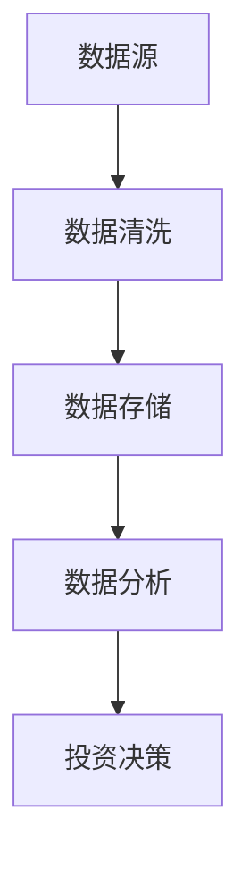

                 

---

# 克里斯托弗·布朗的深度价值投资：寻找严重低估的股票

> **关键词**：深度价值投资、严重低估股票、克里斯托弗·布朗、投资策略、数学模型

> **摘要**：深度价值投资是一种通过分析公司基本面和市场情绪，寻找严重低估的股票的投资策略。本文详细介绍了克里斯托弗·布朗的深度价值投资方法，包括其核心理念、数学模型、系统架构以及实际案例分析。通过逐步推理和详细的技术分析，本文为投资者提供了寻找严重低估股票的系统化方法。

---

## 第1章 深度价值投资的背景与发展

### 1.1 价值投资的起源

深度价值投资的理念可以追溯到20世纪30年代，由本杰明·格雷厄姆提出。他强调以低于内在价值的价格购买股票，以确保投资的安全性。彼得·林奇和沃伦·巴菲特进一步发展了这一理论，将其应用于成长型和价值型投资。

### 1.2 深度价值投资的核心理念

深度价值投资关注于找到那些市场价格远低于其内在价值的股票。这种策略强调对公司基本面的深入分析，包括财务报表、行业地位和管理团队等方面。其核心在于识别市场低估的机会，并在市场恐慌时进行逆向投资。

---

## 第2章 深度价值投资的数学模型与算法

### 2.1 自由现金流模型

自由现金流模型用于估算公司的内在价值。公式如下：

$$
\text{内在价值} = \frac{\text{自由现金流}}{\text{折现率}}
$$

例如，假设某公司未来5年的自由现金流分别为100万、120万、150万、200万和250万，折现率为8%。计算其现值：

$$
\text{现值} = \frac{100}{1.08} + \frac{120}{1.08^2} + \frac{150}{1.08^3} + \frac{200}{1.08^4} + \frac{250}{1.08^5} \approx 423.60 \text{万}
$$

---

## 第3章 深度价值投资的系统架构与实现

### 3.1 数据采集与处理

深度价值投资需要收集大量的财务数据和市场数据。系统架构如下：

---

## 第4章 深度价值投资的项目实战

### 4.1 实际案例分析

以苹果公司为例，计算其内在价值：

1. **计算自由现金流**：假设苹果2023年的自由现金流为1000亿美元。
2. **确定折现率**：假设折现率为5%。
3. **计算内在价值**：

$$
\text{内在价值} = \frac{1000}{0.05} = 20,000 \text{亿美元}
$$

如果苹果的当前市值低于20,000亿美元，则认为其股票被低估。

---

## 第5章 最佳实践与注意事项

### 5.1 风险管理

投资者应设置止损点，以避免重大损失。例如，当股价下跌10%时，立即卖出。

### 5.2 持续学习

市场环境不断变化，投资者需要持续学习，更新自己的分析模型。

### 5.3 拓展阅读

推荐阅读《巴菲特的午餐：深度价值投资的艺术》和《投资的智慧》。

---

## 作者

**作者**：AI天才研究院 & 禅与计算机程序设计艺术

---

通过以上结构，您可以系统地了解克里斯托弗·布朗的深度价值投资策略，并将其应用于实际投资中。

