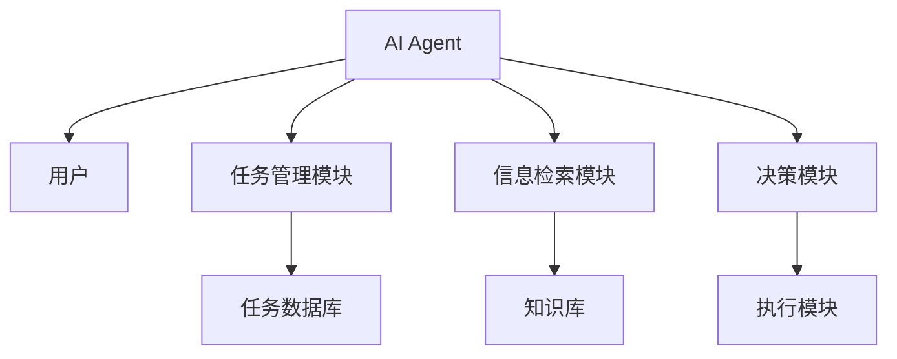
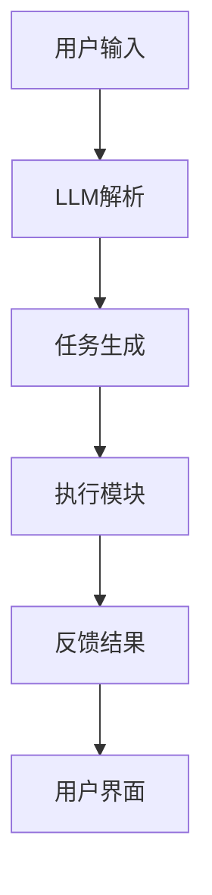
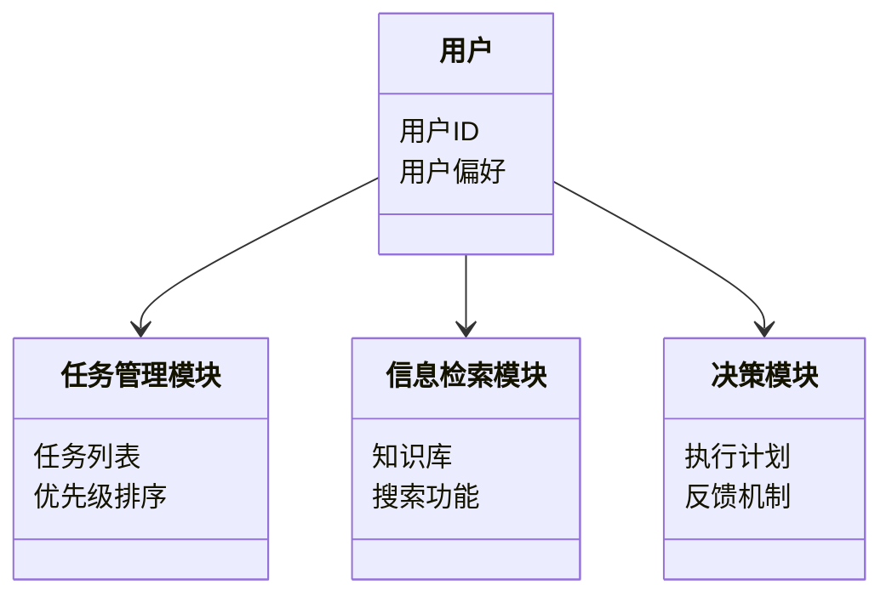
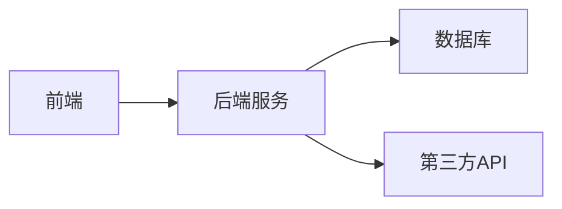

                 


# 全方位生活助手AI Agent：LLM驱动的个人管理系统

## 关键词：AI Agent, LLM, 个人管理系统, 智能助手, 任务管理, 自然语言处理

## 摘要

随着人工智能技术的飞速发展，AI Agent（人工智能代理）在个人管理领域的应用日益广泛。本文将详细介绍一种基于LLM（大语言模型）驱动的全方位生活助手AI Agent系统，探讨其核心概念、算法原理、系统架构以及实际应用场景。通过本文，读者将能够全面理解AI Agent在个人管理中的重要性，并掌握如何利用这种技术提升个人效率和生活质量。

---

# 第一部分: AI Agent与LLM驱动的个人管理概述

## 第1章: AI Agent与个人管理系统的背景介绍

### 1.1 AI Agent的基本概念

AI Agent是一种能够感知环境并采取行动以实现目标的智能实体。在个人管理领域，AI Agent可以通过自然语言处理、机器学习等技术，帮助用户完成任务管理、时间规划、信息检索等多种功能。相比于传统任务管理工具，AI Agent的优势在于其智能化和自动化能力，能够根据用户的习惯和需求，提供个性化的服务。

### 1.2 LLM驱动的个人管理系统简介

LLM（Large Language Model，大语言模型）是基于Transformer架构的自然语言处理模型，具有强大的文本生成和理解能力。在个人管理中，LLM可以作为AI Agent的核心驱动力，通过解析用户的自然语言指令，执行任务、提供建议、管理信息等。本文将重点介绍这种基于LLM的个人管理系统的功能、架构和实现方式。

### 1.3 个人管理系统的现状与未来趋势

传统的个人管理工具主要依赖于手动输入和规则匹配，存在效率低、灵活性差等问题。而AI Agent的出现，为个人管理带来了革命性的变化。未来，随着LLM技术的不断进步，AI Agent将更加智能化，能够处理更复杂的任务，并实现多模态交互。

---

## 第2章: 核心概念与联系

### 2.1 AI Agent的核心概念原理

AI Agent的核心原理是通过感知环境、理解用户需求、执行任务和反馈结果来实现智能化管理。LLM在其中扮演了关键角色，负责解析用户的自然语言指令，并生成相应的执行计划。

#### AI Agent与传统任务管理工具的对比

| 属性         | 传统任务管理工具 | AI Agent驱动的管理系统 |
|--------------|------------------|-------------------------|
| 自动化程度   | 低               | 高                     |
| 交互方式     | 基于规则         | 基于自然语言           |
| 学习能力     | 无               | 有                     |

### 2.2 核心概念对比分析

#### 任务处理能力对比

| 功能         | 传统任务管理工具 | AI Agent驱动的管理系统 |
|--------------|------------------|-------------------------|
| 任务分解     | 无               | 支持                   |
| 优先级排序   | 基于规则         | 基于上下文             |
| 自动执行     | 无               | 支持                   |

#### LLM与传统NLP技术的对比

| 技术         | 传统NLP技术       | LLM技术                 |
|--------------|-------------------|-------------------------|
| 核心算法     | 基于规则         | 基于Transformer         |
| 模型能力     | 任务专用         | 通用性强               |
| 训练数据     | 小规模           | 大规模                 |

### 2.3 实体关系图



---

## 第3章: 算法原理

### 3.1 LLM的工作原理

LLM的核心算法基于Transformer模型，包括编码器和解码器两部分。编码器负责将输入的文本转换为向量表示，解码器则根据编码结果生成输出文本。

#### Transformer模型的数学公式

编码器的注意力机制公式为：
$$
\text{Attention}(Q, K, V) = \text{softmax}\left(\frac{QK^T}{\sqrt{d_k}}\right)V
$$

解码器的前向网络公式为：
$$
\text{FFN}(x) = \text{ReLU}(W_1x + b_1)W_2 + b_2
$$

### 3.2 系统算法流程



---

## 第4章: 系统分析与架构设计

### 4.1 功能设计

系统功能模块包括：
- 用户模块：管理用户信息
- 任务管理模块：分解和执行任务
- 信息检索模块：获取所需信息
- 决策模块：制定最优执行计划

#### 系统功能类图



### 4.2 架构设计

系统采用微服务架构，包括前端、后端和数据库三部分。

#### 系统架构图



### 4.3 接口设计

系统主要接口包括：
- 用户输入接口：接收用户的自然语言指令
- 任务执行接口：调用第三方服务执行任务
- 反馈接口：向用户反馈执行结果

---

## 第5章: 项目实战

### 5.1 环境安装

安装Python和必要的库：
```bash
pip install python
pip install tensorflow
pip install numpy
```

### 5.2 核心代码实现

```python
class AIAssistant:
    def __init__(self):
        self.llm = LLM()
    
    def process_request(self, user_input):
        response = self.llm.generate_response(user_input)
        return response
```

### 5.3 代码解读

AIAssistant类负责接收用户输入并调用LLM生成响应。LLM类封装了大语言模型的具体实现，包括编码器和解码器。

---

## 第6章: 最佳实践

### 6.1 小结

本文详细介绍了基于LLM的AI Agent系统，从核心概念到算法实现，再到系统架构，为读者提供了全面的视角。

### 6.2 注意事项

- 数据隐私保护
- 模型调优与优化

### 6.3 拓展阅读

推荐阅读《Large Language Models》和《Transformer in Action》等书籍，深入了解LLM和AI Agent的最新技术动态。

---

## 作者

作者：AI天才研究院/AI Genius Institute & 禅与计算机程序设计艺术 /Zen And The Art of Computer Programming

