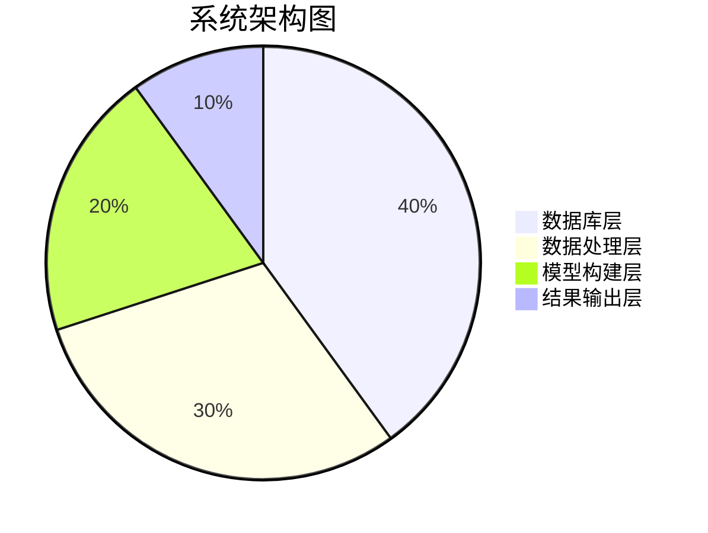

                 


# 全球股市估值与利率环境的互动关系

## 关键词：股市估值，利率环境，互动关系，宏观经济，资产定价，货币政策，全球市场

## 摘要：本文深入探讨全球股市估值与利率环境之间的互动关系，分析利率变化对股市估值的影响，以及股市反馈对利率政策的潜在影响。通过构建数学模型和实证分析，揭示两者之间的动态关系，并结合实际案例，提出投资策略和政策建议。文章内容涵盖理论分析、模型构建、系统设计和实战应用，帮助读者全面理解这一复杂而重要的金融议题。

---

# 全球股市估值与利率环境的互动关系

## 第一部分：引言

### 第1章：研究背景与意义

#### 1.1 研究背景
- **宏观经济视角**：近年来，全球经济波动加剧，利率政策和股市估值的变化对经济发展产生了深远影响。
- **全球化背景**：全球市场的互联互通使得利率变化对股市的影响更加显著。
- **政策制定者的关注点**：央行如何通过利率工具影响股市估值，成为政策制定者的重要课题。

#### 1.2 研究意义
- **理论层面**：理解股市与利率的互动关系，有助于完善资产定价理论。
- **实践层面**：为投资者和政策制定者提供科学的决策依据。
- **学术价值**：填补相关领域的研究空白，推动金融学的发展。

#### 1.3 研究目标与方法
- **研究目标**：揭示全球股市估值与利率环境的互动机制。
- **研究方法**：实证分析、模型构建、案例研究。
- **数据来源**：全球主要股市指数、央行利率数据、宏观经济指标。

#### 1.4 研究框架
- **本文结构**：从理论到实践，从分析到应用，层层递进。
- **核心问题**：利率变化如何影响股市估值，股市反馈如何影响利率政策。

---

## 第二部分：理论基础

### 第2章：金融市场与股市估值

#### 2.1 金融市场的基本概念
- **证券市场定义**：证券交易的场所，包括股票、债券等。
- **股市功能**：融资、价格发现、风险分散。
- **股票估值方法**：市盈率、市净率、股息率等。

#### 2.2 宏观经济与股市的关系
- **经济周期对股市的影响**：繁荣期股市上涨，衰退期股市下跌。
- **通货膨胀与股市估值**：适度通胀利好股市，过热通胀引发担忧。
- **失业率与股市的关系**：低失业率通常伴随股市上涨。

#### 2.3 资产定价模型
- **CAPM模型**：资本资产定价模型，用于确定资产的预期收益。
- **APT模型**：套利定价理论，考虑多个因素影响资产价格。
- **股票定价的其他理论**：行为金融学视角下的投资者心理影响。

### 第3章：利率环境与货币政策

#### 3.1 利率的基本概念
- **名义利率与实际利率**：实际利率 = 名义利率 - 通货膨胀率。
- **短期利率与长期利率**：短期利率影响当前经济，长期利率影响投资决策。
- **中央银行的利率政策**：如美联储的联邦基金利率。

#### 3.2 利率对经济的影响
- **利率对消费和投资的影响**：低利率刺激投资和消费，高利率抑制经济活动。
- **利率对汇率的影响**：高利率可能导致本币升值，影响出口。
- **利率对股市的影响**：低利率降低借贷成本，推高股市估值；高利率反之。

#### 3.3 全球化背景下的利率环
- **全球利率联动**：各国利率政策相互影响，形成复杂的全球利率环境。
- **美元霸权的影响**：美国利率政策对全球股市和汇率的深远影响。

---

## 第三部分：互动机制分析

### 第4章：利率变化对股市估值的影响

#### 4.1 利率变化的传导机制
- **直接传导机制**：利率下降，企业融资成本降低，盈利能力提升，股价上涨。
- **间接传导机制**：利率下降，债券收益率下降，资金流向股市，推高股价。

#### 4.2 利率对股市估值的短期与长期影响
- **短期影响**：利率变动迅速反映在股市中，引发市场波动。
- **长期影响**：持续的低利率政策可能导致股市泡沫，长期高利率抑制股市增长。

#### 4.3 利率对不同行业的影响
- **利率敏感型行业**：如房地产、金融行业，利率变动对其股价影响显著。
- **非利率敏感型行业**：如科技、消费等行业，受利率影响较小。

### 第5章：股市反馈对利率政策的影响

#### 5.1 股市表现对货币政策的启示
- **股市上涨对货币政策的信号作用**：股市繁荣可能暗示经济过热，央行需警惕通胀风险。
- **股市下跌对货币政策的信号作用**：股市低迷可能预示经济衰退，央行需采取宽松政策。

#### 5.2 投资者预期与利率政策的互动
- **预期的自我实现效应**：投资者对利率政策的预期可能影响市场走势，进而反过来影响实际利率政策。
- **政策制定者的博弈论视角**：央行在制定利率政策时需考虑市场预期的反馈。

#### 5.3 全球股市联动对利率环境的影响
- **全球资产价格联动**：一个市场的波动可能迅速传导至全球，影响全球利率环境。
- **新兴市场与发达市场的互动**：新兴市场利率受发达市场影响较大，反过来也会影响全球经济。

---

## 第四部分：系统分析与架构设计

### 第6章：系统分析与架构设计

#### 6.1 问题场景介绍
- **问题背景**：分析全球股市估值与利率环境的互动关系，构建预测模型。
- **项目介绍**：基于历史数据，构建数学模型，预测未来股市走势。

#### 6.2 系统功能设计
- **领域模型**：构建包含股市数据、利率数据、宏观经济指标的数据库。
- **系统架构**：使用数据挖掘和机器学习技术，构建预测模型。

#### 6.3 系统架构设计


#### 6.4 系统接口设计
- **数据接口**：从金融数据源获取实时数据。
- **模型接口**：与第三方预测模型集成。

#### 6.5 系统交互设计
```mermaid
sequenceDiagram
    actor 用户
    节点 数据处理层
    节点 模型构建层
    节点 结果输出层
    用户 -> 数据处理层: 提供数据
    数据处理层 -> 模型构建层: 构建模型
    模型构建层 -> 结果输出层: 输出结果
    结果输出层 -> 用户: 返回预测结果
```

---

## 第五部分：项目实战

### 第7章：项目实战

#### 7.1 环境安装
- **工具安装**：安装Python、Pandas、NumPy、Scikit-learn、Matplotlib。
- **数据获取**：从Yahoo Finance获取全球股市数据和利率数据。

#### 7.2 核心实现

##### 7.2.1 数据预处理
```python
import pandas as pd
import numpy as np

# 读取数据
df = pd.read_csv('stock_data.csv')

# 数据清洗
df.dropna(inplace=True)
df = df[~df['date'].isnull()]
```

##### 7.2.2 模型实现
```python
from sklearn.linear_model import LinearRegression
from sklearn.metrics import mean_squared_error

# 训练模型
model = LinearRegression()
model.fit(X_train, y_train)

# 预测
y_pred = model.predict(X_test)
```

##### 7.2.3 结果分析
```python
print('均方误差:', mean_squared_error(y_test, y_pred))
print('决定系数:', model.score(X_test, y_pred))
```

#### 7.3 案例分析

##### 7.3.1 美国市场的分析
- **案例背景**：美联储利率政策对美国股市的影响。
- **分析结果**：低利率政策推动科技股上涨。

##### 7.3.2 中国市场的分析
- **案例背景**：中国央行利率政策对A股的影响。
- **分析结果**：高利率政策对金融行业影响显著。

#### 7.4 总结与优化
- **总结**：模型的有效性和局限性。
- **优化方向**：引入更多宏观经济指标，改进模型算法。

---

## 第六部分：结论与展望

### 第8章：结论与展望

#### 8.1 研究结论
- **核心结论**：利率变化对股市估值有显著影响，股市反馈也会影响利率政策。
- **研究创新**：构建了全球股市估值与利率环境的互动模型。

#### 8.2 研究展望
- **未来研究方向**：进一步完善模型，引入更多变量。
- **实际应用**：为政策制定者和投资者提供更精准的决策支持。

---

## 附录

### 附录A：完整代码

```python
import pandas as pd
import numpy as np
from sklearn.linear_model import LinearRegression
from sklearn.metrics import mean_squared_error

# 数据获取与处理
df = pd.read_csv('stock_data.csv')
df.dropna(inplace=True)
df = df[~df['date'].isnull()]

# 数据分割
X = df[['interest_rate', 'inflation']]
y = df['stock_price']

X_train, X_test, y_train, y_test = train_test_split(X, y, test_size=0.2, random_state=42)

# 模型训练
model = LinearRegression()
model.fit(X_train, y_train)

# 预测与评估
y_pred = model.predict(X_test)
print('均方误差:', mean_squared_error(y_test, y_pred))
print('决定系数:', model.score(X_test, y_test))
```

### 附录B：数据来源与工具

- **数据来源**：Yahoo Finance、央行官网、经济指标数据库。
- **工具**：Python、Pandas、NumPy、Scikit-learn、Matplotlib。

---

## 作者：AI天才研究院/AI Genius Institute & 禅与计算机程序设计艺术 /Zen And The Art of Computer Programming

---

**文章结束**

