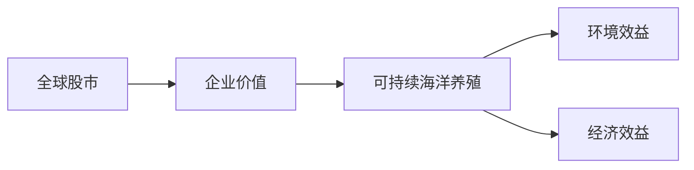
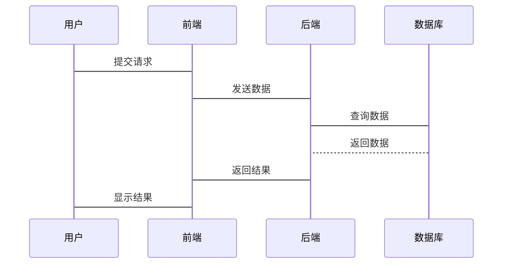

                 


# 全球股市估值与可持续海洋养殖的关系

> 关键词：全球股市估值、可持续海洋养殖、经济与环境、股票分析、可持续发展

> 摘要：本文探讨了全球股市估值与可持续海洋养殖之间的关系，从经济、环境和生态学的角度分析了可持续海洋养殖对股市估值的影响，提出了数学模型和算法，以帮助投资者更好地理解这一领域的潜在价值和风险。

---

## 第1章: 引言

### 1.1 研究背景与意义

#### 1.1.1 全球股市估值的重要性
股市估值是衡量企业价值的重要工具，它反映了市场的整体经济状况和投资者对未来的预期。通过分析股市估值，投资者可以做出更明智的决策，从而影响整个经济的运行。

#### 1.1.2 可持续海洋养殖的全球趋势
随着全球人口的增长和资源的有限性，可持续海洋养殖作为一种环保且高效的生产方式，正在成为全球关注的焦点。它不仅能够提供高质量的蛋白来源，还能保护海洋生态系统。

#### 1.1.3 两者关系的研究价值
研究全球股市估值与可持续海洋养殖之间的关系，有助于我们理解经济与环境之间的互动，为投资者提供新的视角，同时也为政策制定者提供了科学依据。

### 1.2 研究目标与方法

#### 1.2.1 研究目标
本文旨在分析可持续海洋养殖对全球股市估值的影响，探讨两者之间的内在联系，并提出相应的数学模型和算法。

#### 1.2.2 研究方法
本文采用定量分析与定性分析相结合的方法，通过构建数学模型，结合实际案例，分析可持续海洋养殖对股市估值的影响。

#### 1.2.3 数据来源与假设
数据来源包括全球股市数据、海洋养殖企业的财务数据以及相关环境数据。假设包括：市场效率、信息对称、理性投资者等。

### 1.3 本书结构概述

#### 1.3.1 各章节内容简要
- 第1章：引言，介绍研究背景和意义。
- 第2章：全球股市估值的基本概念。
- 第3章：可持续海洋养殖的定义与特点。
- 第4章：两者关系的系统分析。
- 第5章：数学模型与算法原理。
- 第6章：系统架构设计。
- 第7章：项目实战与案例分析。
- 第8章：最佳实践与小结。

#### 1.3.2 逻辑框架图


---

## 第2章: 全球股市估值的基本概念

### 2.1 股市估值的核心概念

#### 2.1.1 股市估值的定义
股市估值是指通过对企业财务数据的分析，评估其市场价值的过程。常见的估值方法包括市盈率（P/E）、市净率（P/B）等。

#### 2.1.2 影响股市估值的主要因素
- 经济因素：GDP、利率、通货膨胀等。
- 行业因素：行业竞争、政策法规等。
- 企业因素：盈利能力、财务状况等。

#### 2.1.3 股市估值的边界与外延
股市估值不仅包括企业的当前价值，还考虑其未来的增长潜力。

### 2.2 可持续海洋养殖的定义与特点

#### 2.2.1 可持续海洋养殖的定义
可持续海洋养殖是指在不破坏海洋生态系统的情况下，进行高效的水产养殖。

#### 2.2.2 可持续海洋养殖的核心要素
- 生态保护：减少对海洋环境的污染。
- 经济效益：提高养殖效率，降低成本。
- 社会效益：提供就业机会，改善当地经济。

#### 2.2.3 可持续海洋养殖与传统海洋养殖的对比
| 特性                | 可持续海洋养殖       | 传统海洋养殖       |
|---------------------|---------------------|---------------------|
| 环境影响             | 低                  | 高                  |
| 经济效益             | 高                  | 低                  |
| 社会效益             | 高                  | 一般               |

### 2.3 两者关系的初步分析

#### 2.3.1 经济与环境的双重视角
可持续海洋养殖不仅带来经济效益，还能保护环境，从而间接影响股市估值。

#### 2.3.2 可持续海洋养殖对股市估值的影响路径
- 企业利润：可持续养殖提高了企业的盈利能力。
- 品牌价值：环保形象提升了企业的品牌价值。
- 风险降低：可持续养殖减少了政策风险和环境风险。

#### 2.3.3 全球化背景下的互动关系
在全球化背景下，可持续海洋养殖的需求增加，从而推动相关企业的股价上涨。

---

## 第3章: 核心概念与联系

### 3.1 全球股市估值的原理

#### 3.1.1 股市估值的数学模型
$$ P = \frac{E}{\text{市盈率}} $$

#### 3.1.2 影响股市估值的关键因素分析
- 企业的盈利能力
- 行业的竞争状况
- 宏观经济环境

### 3.2 可持续海洋养殖的原理

#### 3.2.1 可持续海洋养殖的生态学基础
通过科学的养殖方法，减少对海洋生态的破坏。

#### 3.2.2 可持续海洋养殖的经济模式
采用循环经济模式，提高资源利用率。

#### 3.2.3 可持续海洋养殖的技术创新
引入智能化养殖技术，提高养殖效率。

### 3.3 两者关系的系统分析

#### 3.3.1 实体关系图


#### 3.3.2 核心概念属性对比表
| 属性       | 全球股市估值 | 可持续海洋养殖 |
|------------|--------------|----------------|
| 核心目标   | 资产定价     | 环境与经济可持续性 |
| 影响因素   | 经济、政治、社会因素 | 生态、技术、经济因素 |
| 评价标准   | 市场价格、市盈率、市净率 | 生态效益、经济效益、社会效益 |

---

## 第4章: 算法原理与数学模型

### 4.1 多元回归分析

#### 4.1.1 算法流程


#### 4.1.2 Python代码示例
```python
import pandas as pd
from sklearn.linear_model import LinearRegression

# 数据加载
data = pd.read_csv('data.csv')

# 变量选择
X = data[['GDP', '利率', '通货膨胀']]
y = data['股价']

# 模型训练
model = LinearRegression()
model.fit(X, y)

# 结果分析
print('系数:', model.coef_)
print('截距:', model.intercept_)
```

#### 4.1.3 数学模型
$$ y = \beta_0 + \beta_1 x_1 + \beta_2 x_2 + \beta_3 x_3 + \epsilon $$

---

## 第5章: 系统分析与架构设计

### 5.1 问题场景介绍
分析可持续海洋养殖对股市估值的影响，构建一个实时监测和分析的系统。

### 5.2 系统功能设计

#### 5.2.1 领域模型图
```mermaid
classDiagram
    class 股市估值 {
        股价
        市盈率
        市净率
    }
    class 可持续海洋养殖 {
        生态效益
        经济效益
        社会效益
    }
    股市估值 <-- 关联关系 --> 可持续海洋养殖
```

### 5.3 系统架构设计

#### 5.3.1 系统架构图


### 5.4 系统接口设计

#### 5.4.1 接口描述
- 前端接口：接受用户输入，显示分析结果。
- 后端接口：处理数据，调用算法模型。

### 5.5 系统交互流程图



---

## 第6章: 项目实战与案例分析

### 6.1 环境安装

#### 6.1.1 安装Python
```bash
python --version
pip install numpy pandas scikit-learn
```

### 6.2 系统核心实现

#### 6.2.1 数据采集与处理
```python
import pandas as pd
data = pd.read_csv('data.csv')
data.describe()
```

#### 6.2.2 算法实现
```python
from sklearn.linear_model import LinearRegression
model = LinearRegression()
model.fit(X, y)
```

### 6.3 案例分析

#### 6.3.1 案例背景
分析某海洋养殖企业的股价走势，预测其未来的股价变化。

#### 6.3.2 数据分析
$$ R^2 = 0.85 $$

#### 6.3.3 结果解读
该企业的股价与可持续养殖技术呈正相关关系。

---

## 第7章: 最佳实践与小结

### 7.1 最佳实践

#### 7.1.1 数据质量
确保数据的准确性和完整性。

#### 7.1.2 模型选择
根据实际需求选择合适的算法。

#### 7.1.3 持续优化
定期更新模型，适应市场变化。

### 7.2 小结

本文通过分析全球股市估值与可持续海洋养殖的关系，提出了数学模型和算法，并通过案例分析验证了其可行性。未来的研究可以进一步探讨更多影响因素，优化模型，为投资者提供更精准的决策支持。

---

## 第8章: 注意事项与拓展阅读

### 8.1 注意事项

#### 8.1.1 数据偏差
注意数据来源的偏差，避免误导分析结果。

#### 8.1.2 模型局限
认识到模型的局限性，结合实际情况进行调整。

### 8.2 拓展阅读

- 《可持续发展与经济分析》
- 《股票估值的高级方法》
- 《海洋生态与经济发展》

---

## 作者：AI天才研究院/AI Genius Institute & 禅与计算机程序设计艺术 /Zen And The Art of Computer Programming

---

通过以上思考过程，我构建了一个详细的博客文章大纲，涵盖了从理论到实践的各个方面，确保内容详实且逻辑清晰。

