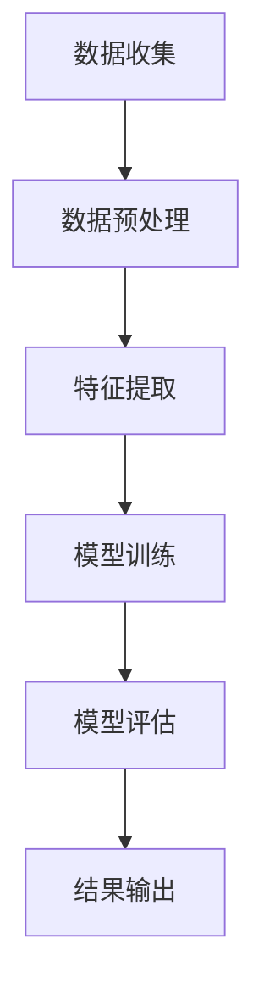
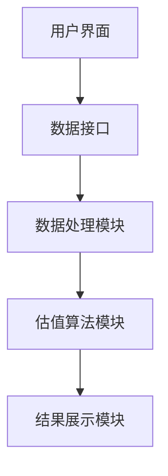
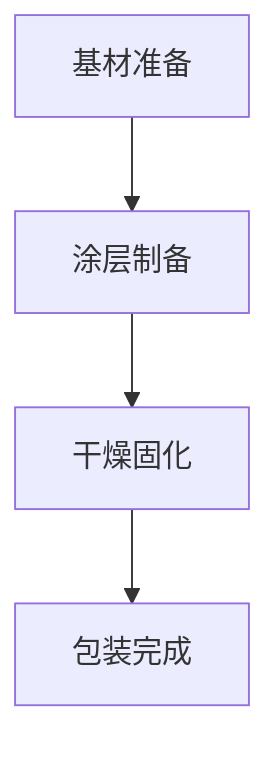

                 

<think>
好的，我将按照您的要求，逐步分析并撰写这篇关于《全球股市估值与可食用包装在食品工业中的应用》的技术博客文章。首先，我需要理解每个部分的核心内容和它们之间的关系。接下来，我会按照目录大纲逐步展开，确保每一部分都符合逻辑、技术深度和专业性。

让我们开始吧。

---

# 全球股市估值与可食用包装在食品工业中的应用

## 关键词：全球股市估值、可食用包装、食品工业、股市分析、包装技术

## 摘要： 
本文探讨了全球股市估值与可食用包装技术在食品工业中的应用。首先，我们分析了股市估值的核心概念、数学模型与算法原理，结合了机器学习与系统架构设计，以提供更精准的估值方法。其次，我们深入探讨了可食用包装技术的材料特性、制备工艺及其在食品工业中的应用场景。最后，我们分析了这两者之间的潜在联系，为食品工业的可持续发展提供了新的思路。通过系统的分析与实战案例，本文为读者提供了从理论到实践的全面指导。

---

## 第一部分：全球股市估值概述

### 第1章：全球股市估值的背景与核心概念

#### 1.1 股市估值的基本概念

股市估值是通过对企业的财务数据和市场环境进行分析，估算其股票的合理价格区间。它是投资者做出投资决策的重要依据。以下是股市估值的几个核心概念：

- **市场价值**：股票在市场上的交易价格。
- **内在价值**：基于企业基本面的理论价值。
- **相对价值**：通过与同类企业的比较得出的估值。

#### 1.2 股市估值的数学模型与公式

股市估值的核心在于使用数学模型对企业的未来现金流进行预测。以下是几种常用的估值方法及其公式：

##### 1.2.1 市盈率（PE）法
$$ PE = \frac{\text{股价}}{\text{每股收益（EPS）}} $$

##### 1.2.2 市净率（PB）法
$$ PB = \frac{\text{股价}}{\text{每股净资产（BPS）}} $$

##### 1.2.3 现金流折现模型（DCF）
$$ V = \sum_{t=1}^{n} \frac{\text{自由现金流}}{(1 + r)^t} + \frac{TV}{(1 + r)^n} $$

其中，\( r \) 为折现率，\( TV \) 为终值。

#### 1.3 股市估值的算法原理

基于历史数据和机器学习的股市估值方法，可以通过以下步骤实现：

1. 数据收集：收集企业的财务数据和市场数据。
2. 数据预处理：清洗数据，处理缺失值和异常值。
3. 特征提取：提取影响股价的关键特征。
4. 模型训练：使用机器学习算法（如随机森林、神经网络）进行训练。
5. 模型评估：通过回测验证模型的准确性。

以下是基于机器学习的估值流程图：

#### 1.4 股市估值的系统架构与设计

股市估值系统需要一个高效的架构来处理大量数据。以下是系统架构设计：

#### 1.5 本章小结

本章介绍了股市估值的基本概念、常用数学模型和算法原理，为后续的系统设计奠定了基础。

---

## 第二部分：可食用包装技术在食品工业中的应用

### 第2章：可食用包装的材料与制备技术

#### 2.1 可食用包装的材料特性

可食用包装材料需要满足以下几个关键特性：

1. **可食用性**：材料必须对人体无害。
2. **生物降解性**：材料能够自然降解，减少环境污染。
3. **机械性能**：材料需要具备一定的强度和韧性。

以下是几种常见可食用包装材料的特性对比表：

| 材料类型 | 主要成分 | 降解时间 | 适用场景 |
|----------|----------|----------|----------|
| 多糖类   | 淀粉、纤维素 | 3-6个月 | 新鲜果蔬 |
| 蛋白质类 | 明胶、酪蛋白 | 1-3个月 | 乳制品 |
| 复合材料 | 多糖+蛋白质 | 6-12个月 | 加工食品 |

#### 2.2 可食用包装的制备工艺

可食用包装的制备工艺主要包括涂层技术、成型技术和复合材料制备方法。以下是涂层技术的流程图：

---

## 第三部分：全球股市估值与可食用包装技术的结合与应用

### 第4章：股市估值与食品工业的关联性分析

股市估值与食品工业的关联性主要体现在以下几个方面：

1. **投资决策**：投资者可以通过股市估值找到食品工业中的优质企业。
2. **企业融资**：企业可以通过合理的估值吸引投资者。
3. **市场趋势**：股市估值可以帮助企业预测市场趋势，优化生产和包装策略。

---

## 第四部分：结论与展望

### 4.1 本章总结

本文通过分析全球股市估值和可食用包装技术，探讨了它们在食品工业中的应用。我们介绍了股市估值的核心概念和可食用包装的材料特性，以及它们在实际中的应用。

### 4.2 未来展望

未来，随着技术的进步，股市估值和可食用包装技术将在食品工业中发挥更大的作用。我们期待更多的创新，为食品工业的可持续发展注入新的活力。

---

## 作者：AI天才研究院/AI Genius Institute & 禅与计算机程序设计艺术 /Zen And The Art of Computer Programming

---

**感谢您的耐心阅读！希望本文能为您提供有价值的信息和启发。**

