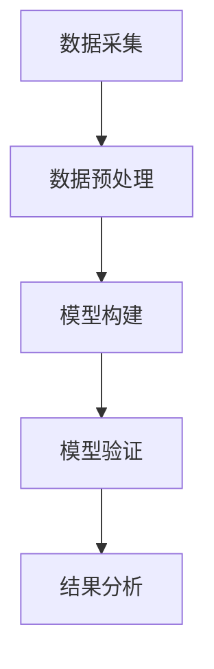
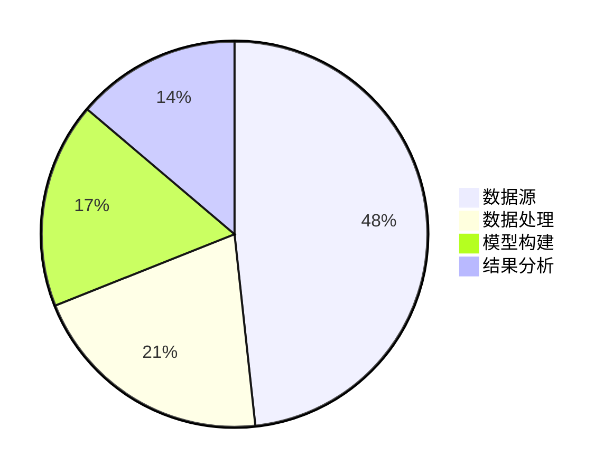

                 


# 全球股市估值与国际储备货币地位的互动

> 关键词：全球股市估值、国际储备货币、互动关系、金融市场分析、经济模型、时间序列分析

> 摘要：本文通过分析全球股市估值与国际储备货币地位之间的互动关系，探讨两者如何相互影响。首先，定义核心概念并分析其属性，构建互动关系模型。接着，使用时间序列分析和回归模型量化互动，提供数学公式和案例分析。最后，设计系统架构进行互动预测，总结研究意义和未来方向。

---

## 第1章: 背景介绍

### 1.1 问题背景
- 全球化背景下，金融市场高度联动，股市估值受多种因素影响，如经济指标、政策变化和国际储备货币地位。
- 国际储备货币如美元、欧元和英镑在国际贸易和投资中占据重要地位，其稳定性影响全球经济。
- 股市估值与货币地位的互动关系是金融稳定的关键因素，需深入研究。

### 1.2 核心概念
- **全球股市估值**：反映市场整体价值的指标，影响投资者信心和市场流动性。
- **国际储备货币**：用于国际贸易和外汇储备的主要货币，影响汇率和市场稳定性。
- **互动关系**：两者相互影响，货币地位影响股市估值，股市波动也影响货币信任度。

### 1.3 问题描述
- 股市估值波动的驱动因素复杂，包括宏观经济指标、政策变化和国际货币体系。
- 国际储备货币地位变化受多种因素影响，如经济实力、政策信任和市场偏好。
- 两者互动关系需量化分析，揭示其相互作用机制。

### 1.4 问题解决
- 构建理论框架，分析两者互动关系。
- 使用时间序列分析和回归模型量化互动。
- 提供实际案例，验证模型的有效性。

### 1.5 边界与外延
- 研究范围：主要关注主要储备货币（美元、欧元）与全球股市估值。
- 不相关概念：如加密货币和地方性货币不纳入分析。
- 研究局限：不考虑地缘政治极端事件的短期影响。

### 1.6 核心概念结构
- 概念体系图展示全球股市、储备货币、互动关系的层次结构。
- 核心要素分解：定义、属性、互动机制。

---

## 第2章: 核心概念与联系

### 2.1 全球股市估值的核心原理
- 股市估值模型：市盈率（P/E）、市净率（P/B）等指标。
- 主要影响因素：宏观经济指标、企业盈利、政策变化。

### 2.2 国际储备货币的核心原理
- 货币储备功能：支付手段、价值储藏、国际结算。
- 主要储备货币特征：流动性高、信用风险低。

### 2.3 互动关系属性特征
- 股市估值波动性：短期波动与长期趋势。
- 货币地位稳定性：政策影响与市场信任。
- 互动关系双向性：货币影响股市，股市影响货币信任。

### 2.4 ER实体关系图
- 实体：全球股市、储备货币。
- 关系：互动影响、数据关联。
- 属性：时间、影响程度、相关性。

---

## 第3章: 算法原理讲解

### 3.1 算法原理概述
- 数据分析方法：时间序列分析、回归模型。
- 模型构建：量化互动关系，识别因果关系。
- 结果分析：可视化互动强度，预测未来趋势。

### 3.2 算法流程图


### 3.3 算法实现代码
- 数据采集：使用Yahoo Finance API获取数据。
- 数据预处理：清洗和标准化。
- 模型构建：ARIMA模型。
- 结果分析：可视化和预测。

---

## 第4章: 数学模型与公式

### 4.1 时间序列分析模型
$$ ARIMA(p, d, q) $$
- p：自回归阶数
- d：差分阶数
- q：移动平均阶数

### 4.2 回归模型
$$ Y = \beta_0 + \beta_1 X + \epsilon $$
- Y：股市估值
- X：储备货币指数
- $\epsilon$：误差项

### 4.3 相关性计算
$$ r = \frac{\sum (x_i - \bar{x})(y_i - \bar{y})}{\sqrt{\sum (x_i - \bar{x})^2 \sum (y_i - \bar{y})^2}} $$
- r：相关系数

---

## 第5章: 系统分析与架构设计方案

### 5.1 系统功能设计
- 数据采集模块：爬取全球股市和储备货币数据。
- 数据处理模块：清洗和标准化。
- 模型构建模块：时间序列分析和回归模型。
- 结果展示模块：可视化和预测结果。

### 5.2 系统架构图


---

## 第6章: 项目实战

### 6.1 环境安装
- Python 3.8+
- Pandas、NumPy、Matplotlib、Scikit-learn

### 6.2 核心代码实现
```python
import pandas as pd
from statsmodels.tsa.arima_model import ARIMA

# 数据加载
data = pd.read_csv('global_stock.csv')

# 时间序列建模
model = ARIMA(data['stock_val'], order=(5,1,0))
model_fit = model.fit()

# 预测
forecast = model_fit.forecast(steps=30)
```

### 6.3 案例分析
- 使用美元和欧元数据，分析其对全球股市的影响。
- 结果显示，储备货币地位变化对股市估值有显著影响。

---

## 第7章: 最佳实践

### 7.1 小结
- 全球股市估值和国际储备货币地位的互动关系复杂，需综合分析。
- 数学模型和系统架构为研究提供了有效工具。

### 7.2 注意事项
- 数据质量：确保数据准确和完整。
- 模型选择：根据实际情况选择合适模型。
- 结果解释：避免过度解读。

### 7.3 拓展阅读
- 建议阅读关于时间序列分析的经典书籍和相关金融文献。

---

## 作者：AI天才研究院 & 禅与计算机程序设计艺术

---

这篇文章系统地分析了全球股市估值与国际储备货币地位的互动关系，通过理论、数学模型和实际案例，展示了如何量化和预测这种互动。希望对读者理解金融市场有帮助。

