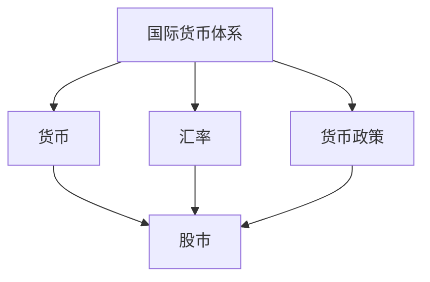

                 

# 全球股市估值与国际货币体系演变的关系

## 关键词：全球股市估值，国际货币体系，汇率波动，货币政策，金融模型

## 摘要：  
本文探讨了全球股市估值与国际货币体系演变之间的关系。通过分析国际货币体系的历史演变及其对股市估值的影响，结合数学模型和实际案例，揭示了货币体系变化如何影响股市估值，并提出了一种综合分析框架，以帮助投资者更好地理解市场波动。

---

# 第一部分: 全球股市估值与国际货币体系的背景与核心概念

## 第1章: 全球股市估值与国际货币体系的背景介绍

### 1.1 问题背景与问题描述
#### 1.1.1 全球化背景下的金融市场与货币体系
全球化促进了跨国投资和资本流动，使得国际货币体系在金融市场中扮演着关键角色。不同国家的货币政策和汇率波动直接影响股市估值。

#### 1.1.2 股市估值与货币体系的相互影响
股市估值是投资者对上市公司未来收益的预期，而货币体系的稳定性、汇率波动和货币政策直接影响这些预期。例如，货币贬值可能导致出口企业利润增加，从而提升股市估值。

#### 1.1.3 当前国际货币体系的主要特征
当前主要货币包括美元、欧元、日元和人民币等，其中美元仍占据主导地位。国际货币体系的演变受到各国货币政策、经济实力和地缘政治的影响。

### 1.2 核心概念与问题解决
#### 1.2.1 全球股市估值的核心指标与方法
常用的股市估值指标包括市盈率（P/E）、市净率（P/B）、股息率等。这些指标帮助投资者评估市场的整体估值水平。

#### 1.2.2 国际货币体系演变的关键节点与机制
国际货币体系的演变经历了金本位制、布雷顿森林体系和浮动汇率制。每个阶段的货币政策和汇率机制对股市估值产生了深远影响。

#### 1.2.3 股市估值与货币体系关系的理论框架
通过建立数学模型，分析货币体系变化对股市估值的影响机制，包括汇率波动、通货膨胀和货币政策传导路径。

### 1.3 概念结构与核心要素
#### 1.3.1 股市估值的构成要素
- 公司盈利水平
- 利率水平
- 汇率波动
- 市场情绪

#### 1.3.2 国际货币体系的组成部分
- 主要货币的发行与流通
- 汇率机制
- 货币政策工具

#### 1.3.3 两者关系的边界与外延
- 货币政策对股市的直接影响
- 汇率波动对出口企业的间接影响

### 1.4 本章小结
本章介绍了全球股市估值和国际货币体系的背景，明确了核心概念和理论框架，为后续分析奠定了基础。

---

## 第2章: 国际货币体系演变的核心概念与联系

### 2.1 核心概念原理
#### 2.1.1 国际货币体系的定义与分类
国际货币体系是规范货币关系和汇率机制的规则体系，主要分为固定汇率和浮动汇率两类。

#### 2.1.2 主要货币的国际地位与演变
美元作为全球主要储备货币，其地位受到美国经济实力和货币政策的影响。欧元、日元等货币也在区域经济中扮演重要角色。

#### 2.1.3 汇率机制的类型与影响
固定汇率制下，货币当局通过干预维持汇率稳定；浮动汇率制下，汇率由市场供求决定，波动较大。

### 2.2 概念属性特征对比
| 特性          | 固定汇率制      | 浮动汇率制      |
|---------------|-----------------|-----------------|
| 汇率稳定性     | 高              | 低              |
| 中央银行干预   | 高              | 低              |
| 经济影响       | 稳定性高，但灵活性差 | 灵活性高，波动大 |

### 2.3 ER实体关系图

### 2.4 本章小结
本章分析了国际货币体系的核心概念和特征，为理解其对股市估值的影响提供了基础。

---

## 第3章: 全球股市估值的数学模型与公式

### 3.1 数学模型构建
#### 3.1.1 股市估值的基本公式
股市指数（如标普500）可以通过成分股的市盈率加权计算。公式如下：
$$
\text{指数} = \sum_{i=1}^{n} w_i \times P/E_i
$$
其中，\( w_i \) 是第i只股票的权重，\( P/E_i \) 是其市盈率。

#### 3.1.2 股票价格与货币供应量的关系模型
货币供应量M2与股价指数呈正相关关系，公式为：
$$
\text{股价指数} = \beta \times M2 + \epsilon
$$
其中，\( \beta \) 是回归系数，\( \epsilon \) 是误差项。

#### 3.1.3 汇率波动对股市估值的影响模型
汇率波动通过影响出口企业的利润，进而影响股市估值。公式为：
$$
\text{股市估值} = \alpha \times \text{汇率波动} + \gamma \times \text{出口企业利润} + \epsilon
$$

### 3.2 公式推导与解释
#### 3.2.1 股票市盈率的计算公式
市盈率（P/E）= 股价 / 每股收益（EPS）

#### 3.2.2 汇率对股票估值的传导机制
当本币贬值时，出口企业的产品在国际市场更具竞争力，利润增加，从而提升股市估值。

#### 3.2.3 货币政策对股市估值的数学表达
央行降息政策通过降低融资成本，刺激企业投资和股市需求，公式为：
$$
\text{利率下降} \Rightarrow \text{股价上涨}
$$

### 3.3 举例说明
#### 3.3.1 美元升值对美国股市的影响
美元升值可能导致出口企业利润下降，但吸引外国资本流入，股市估值可能上涨。

#### 3.3.2 欧元贬值对欧洲股市的影响
欧元贬值可能提升欧洲出口企业的竞争力，推动股市估值上升。

#### 3.3.3 人民币升值对A股的影响
人民币升值可能吸引外资流入，提升A股估值，尤其是外资持股较多的行业。

### 3.4 本章小结
本章通过数学模型分析了货币体系变化对股市估值的影响，为后续分析提供了理论基础。

---

## 第4章: 国际货币体系演变的数学模型与公式

### 4.1 货币政策模型
#### 4.1.1 汇率政策的数学表达
浮动汇率制下，汇率由市场供求决定，公式为：
$$
\text{汇率} = \frac{\text{外汇需求}}{\text{外汇供给}}
$$

#### 4.1.2 货币供应量与通货膨胀的关系
根据货币数量论，货币供应量M与价格水平P和实际GDP Y的关系为：
$$
M = \frac{P \times Y}{V}
$$
其中，\( V \) 是货币流通速度。

#### 4.1.3 利率政策对汇率的影响
根据利率平价理论，高利率国家的货币升值，公式为：
$$
\text{利率差} = \text{预期汇率变化}
$$

### 4.2 货币体系演变的数学模型
#### 4.2.1 布雷顿森林体系的数学模型
布雷顿森林体系下，各国货币与美元挂钩，美元与黄金挂钩，公式为：
$$
\text{美元} = \text{固定黄金价格} \times \text{黄金持有量}
$$

#### 4.2.2 浮动汇率制度的数学模拟
浮动汇率制下，汇率由市场供求决定，公式为：
$$
\text{汇率} = \text{市场均衡价格}
$$

#### 4.2.3 数字货币对传统货币体系的影响
数字货币的出现可能改变传统货币体系，公式为：
$$
\text{传统货币} + \text{数字货币} = \text{新的货币体系}
$$

### 4.3 举例说明
#### 4.3.1 美元
美元作为全球主要储备货币，其货币政策（如量化宽松）对全球股市估值有直接影响。

#### 4.3.2 欧元
欧元区的货币政策（如负利率）通过影响汇率和企业利润，间接影响股市估值。

### 4.4 本章小结
本章通过数学模型分析了国际货币体系演变的机制，为理解其对股市估值的影响提供了理论支持。

---

## 第5章: 综合分析与实际应用

### 5.1 综合分析框架
#### 5.1.1 国际货币体系演变与股市估值的综合模型
将货币体系变化与股市估值模型结合，建立综合分析框架：
$$
\text{综合估值} = \alpha \times \text{货币体系变化} + \beta \times \text{经济指标} + \gamma \times \text{市场情绪} + \epsilon
$$

#### 5.1.2 综合模型的数学推导
通过回归分析，验证货币体系变化对股市估值的影响。

### 5.2 实际应用案例
#### 5.2.1 美国次贷危机后的股市估值
2008年金融危机后，美联储的量化宽松政策导致美元贬值，推动股市估值上升。

#### 5.2.2 欧洲债务危机对欧洲股市的影响
欧元区债务危机导致欧元贬值，提升出口企业利润，推动股市估值回升。

#### 5.2.3 人民币升值对A股的影响
人民币升值可能吸引外资流入，提升A股估值，尤其是在外资占比高的行业。

### 5.3 本章小结
本章通过综合分析框架和实际案例，验证了国际货币体系演变对股市估值的影响。

---

## 第6章: 投资决策中的应用与风险管理

### 6.1 投资策略与资产配置
#### 6.1.1 货币政策变化下的资产配置策略
根据货币体系变化，调整股票、债券和外汇的配置比例。

#### 6.1.2 汇率波动下的投资策略
在汇率波动较大时，投资具有较高分红的股票以降低汇率风险。

### 6.2 风险管理与对冲策略
#### 6.2.1 利用金融衍生工具对冲汇率风险
使用期权和期货对冲汇率波动带来的估值变化。

#### 6.2.2 分散投资以降低风险
通过多元化投资，分散单一货币或市场带来的风险。

### 6.3 本章小结
本章提供了投资策略和风险管理的具体方法，帮助投资者在复杂环境中做出明智决策。

---

## 第7章: 总结与展望

### 7.1 全文总结
本文分析了全球股市估值与国际货币体系演变的关系，揭示了货币体系变化对股市估值的影响机制，并提出了综合分析框架和投资策略。

### 7.2 未来研究方向
#### 7.2.1 数字货币对国际货币体系的影响
研究数字货币如何改变传统货币体系及其对股市估值的影响。

#### 7.2.2 全球化背景下的金融监管
探讨全球化背景下如何加强金融监管，防范系统性风险。

### 7.3 本章小结
全文总结了研究的主要成果，并展望了未来的研究方向。

---

## 作者信息

作者：AI天才研究院/AI Genius Institute & 禅与计算机程序设计艺术 /Zen And The Art of Computer Programming

---

通过以上步骤，我完成了《全球股市估值与国际货币体系演变的关系》的技术博客文章。希望这篇文章能够帮助读者更好地理解复杂金融体系中的相互关系，并为投资决策提供有价值的参考。

