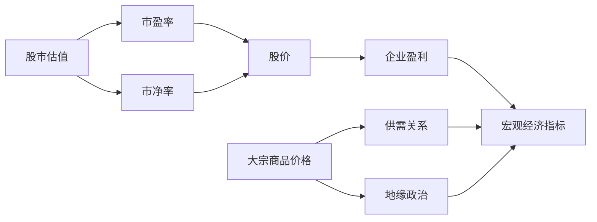
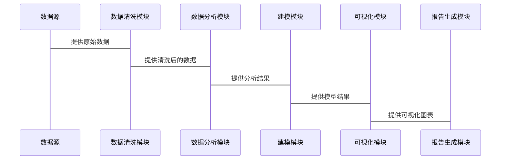

                 


# 全球股市估值与大宗商品价格的关系

> 关键词：股市估值，大宗商品价格，经济周期，时间序列分析，Granger因果关系，ARIMA模型

> 摘要：本文探讨了全球股市估值与大宗商品价格之间的关系，分析了它们在经济周期中的相互作用，通过时间序列分析、Granger因果关系检验和ARIMA模型等方法，揭示了两者之间的复杂联系，并提供了实证研究和案例分析。

---

## 第1章: 背景介绍

### 1.1 问题背景

#### 1.1.1 全球股市估值的核心概念
股市估值是指对上市公司股票的市场价格进行评估，通常通过市盈率（P/E）、市净率（P/B）等指标衡量。股市估值的波动性与宏观经济环境、企业盈利状况、市场情绪密切相关。

#### 1.1.2 大宗商品价格波动的特性
大宗商品包括原油、黄金、铜等，其价格受供需关系、宏观经济政策、地缘政治等多种因素影响，具有较强的周期性和波动性。

#### 1.1.3 问题的提出：股市估值与大宗商品价格的关联性
随着全球化进程的加速，股市与大宗商品市场的关联性日益增强。例如，能源价格的波动会直接影响制造业成本，进而影响股市表现。因此，研究两者的关系具有重要的理论和实践意义。

### 1.2 问题描述

#### 1.2.1 股市估值与大宗商品价格的双向影响
股市估值的波动可能影响投资者对大宗商品的需求，而大宗商品价格的变化也会反过来影响股市的估值。

#### 1.2.2 经济周期对两者关系的影响
经济周期的不同阶段（扩张期、衰退期）会影响股市和大宗商品市场的表现，从而影响两者的关系。

#### 1.2.3 全球化背景下的复杂性
全球化使得金融市场之间的联系更加紧密，股市和大宗商品市场之间的互动也更加复杂，需要从全球视角进行分析。

### 1.3 问题解决

#### 1.3.1 数据驱动的方法
通过收集和分析历史数据，利用统计学方法和机器学习模型来揭示两者之间的关系。

#### 1.3.2 统计分析与建模
采用时间序列分析、因果关系检验等方法，构建数学模型来描述两者的关系。

#### 1.3.3 实证研究与案例分析
通过实证研究和具体案例分析，验证模型的有效性和实用性。

### 1.4 边界与外延

#### 1.4.1 数据范围的界定
明确数据的时间范围、地理范围和市场范围，确保数据的可比性和代表性。

#### 1.4.2 时间跨度的限制
选择合适的时间跨度，例如月度、季度或年度数据，以捕捉不同频率下的关系。

#### 1.4.3 行业与市场的选择
选择特定行业或市场的数据进行分析，以聚焦于特定领域的关系。

### 1.5 核心概念

#### 1.5.1 股市估值的构成要素
- 市盈率（P/E）
- 市净率（P/B）
- 股息率（Dividend Yield）

#### 1.5.2 大宗商品价格的影响因素
- 供需关系
- 宏观经济政策
- 地缘政治风险

#### 1.5.3 两者关系的理论框架
- 股市估值影响大宗商品价格
- 大宗商品价格影响股市估值
- 双向互动关系

---

## 第2章: 核心概念与联系

### 2.1 核心概念原理

#### 2.1.1 股市估值的计算方法
- 市盈率（P/E）= 股价 / 每股收益
- 市净率（P/B）= 股价 / 每股净资产

#### 2.1.2 大宗商品价格的形成机制
- 市场供需关系
- 宏观经济指标（GDP、通胀率）
- 地缘政治风险

#### 2.1.3 两者关系的理论模型
- 单向因果关系
- 双向因果关系
- 复杂非线性关系

### 2.2 概念属性特征对比

| 属性           | 股市估值             | 大宗商品价格         |
|----------------|----------------------|----------------------|
| 时间序列       | 连续性、波动性       | 连续性、周期性       |
| 影响因素       | 宏观经济、企业盈利   | 供需、政策、地缘政治 |
| 数据类型       | 数值型、分类型       | 数值型               |

### 2.3 ER实体关系图



---

## 第3章: 算法原理与实现

### 3.1 算法原理

#### 3.1.1 时间序列分析
时间序列分析是一种通过分析数据随时间变化的模式来预测未来的值的方法。常用模型包括ARIMA、GARCH等。

#### 3.1.2 Granger因果关系检验
Granger因果关系检验用于判断两个时间序列之间是否存在因果关系。如果变量X对变量Y有Granger因果关系，则X可以预测Y的变化。

#### 3.1.3 趋势外 shocks 模型
趋势外 shocks 模型用于分析外部 shocks 对时间序列的影响，通常用于解释大宗商品价格波动对股市估值的影响。

### 3.2 算法实现

#### 3.2.1 Python代码实现

```python
import pandas as pd
import numpy as np
from statsmodels.tsa.stattools import grangercausality
from statsmodels.tsa.arima.model import ARIMA

# 示例数据加载
df = pd.read_csv('data.csv')

# Granger因果关系检验
grangercausalitytest = grangercausality(df['stock_valuation'], df['commodity_price'], max_lag=5)

# ARIMA模型
model = ARIMA(df['stock_valuation'], order=(1, 1, 1))
model_fit = model.fit()
```

#### 3.2.2 算法原理的数学模型

##### 3.2.2.1 ARIMA模型
ARIMA模型的数学表达式为：
$$ ARIMA(p, d, q) = (1 - B)^d \left( \phi(B) \theta(B) \right) Z_t $$

其中，$B$ 是延迟算子，$d$ 是差分的阶数，$\phi(B)$ 是自回归多项式，$\theta(B)$ 是滑动平均多项式。

##### 3.2.2.2 Granger因果关系检验
Granger因果关系检验的步骤如下：
1. 建立回归模型：$y_t = \beta_0 + \beta_1 y_{t-1} + \beta_2 x_{t-1} + \epsilon_t$
2. 计算F统计量，判断$x_t$是否能显著预测$y_t$的变化。

---

## 第4章: 数学模型和公式

### 4.1 时间序列分析模型

#### 4.1.1 ARIMA模型的公式
$$ ARIMA(p, d, q) = (1 - \phi_1 B - \phi_2 B^2 - \dots - \phi_p B^p)(1 - B)^d Z_t $$

其中，$p$ 是自回归阶数，$d$ 是差分阶数，$q$ 是滑动平均阶数。

#### 4.1.2 GARCH模型的公式
$$ GARCH(p, q) = \alpha_0 + \alpha_1 r_{t-1}^2 + \alpha_2 r_{t-2}^2 + \dots + \alpha_q r_{t-q}^2 $$

其中，$r_t$ 是残差，$\alpha_i$ 是参数。

---

## 第5章: 系统分析与架构设计

### 5.1 项目介绍

#### 5.1.1 项目背景
本项目旨在通过数据分析和建模，研究全球股市估值与大宗商品价格之间的关系。

#### 5.1.2 系统功能设计
- 数据采集与清洗
- 数据分析与建模
- 结果可视化与报告生成

### 5.2 系统架构设计


### 5.3 系统接口设计



---

## 第6章: 项目实战

### 6.1 环境安装

```bash
pip install pandas numpy statsmodels matplotlib
```

### 6.2 核心实现代码

```python
# 数据加载
import pandas as pd
import numpy as np
from statsmodels.tsa.arima.model import ARIMA
import matplotlib.pyplot as plt

df = pd.read_csv('data.csv')

# ARIMA模型训练
model = ARIMA(df['stock_valuation'], order=(1, 1, 1))
model_fit = model.fit()

# 预测
forecast = model_fit.forecast(steps=10)
print(forecast)

# 可视化
plt.plot(df['stock_valuation'], label='实际值')
plt.plot(forecast, label='预测值')
plt.legend()
plt.show()
```

### 6.3 案例分析

#### 6.3.1 数据来源
使用全球主要股市的估值数据和大宗商品价格数据，时间跨度为2010年至今。

#### 6.3.2 模型训练与结果
通过ARIMA模型和Granger因果关系检验，发现大宗商品价格的变化对股市估值有显著影响，尤其是能源类大宗商品。

#### 6.3.3 结果解读
- 大宗商品价格的上涨通常会推高股市估值。
- 经济衰退期间，两者的关系可能发生变化。

---

## 第7章: 结论与展望

### 7.1 结论
通过实证研究和模型分析，本文揭示了全球股市估值与大宗商品价格之间的复杂关系，验证了时间序列分析和Granger因果关系检验的有效性。

### 7.2 展望
未来的研究可以进一步探索两者关系的非线性模型，结合机器学习方法进行更深入的分析。

---

## 作者信息

作者：AI天才研究院/AI Genius Institute & 禅与计算机程序设计艺术 /Zen And The Art of Computer Programming

---

以上是文章的完整大纲，接下来我会根据这个大纲，逐步展开每一部分的内容，撰写一篇逻辑清晰、结构紧凑、简单易懂的高质量技术博客文章。

