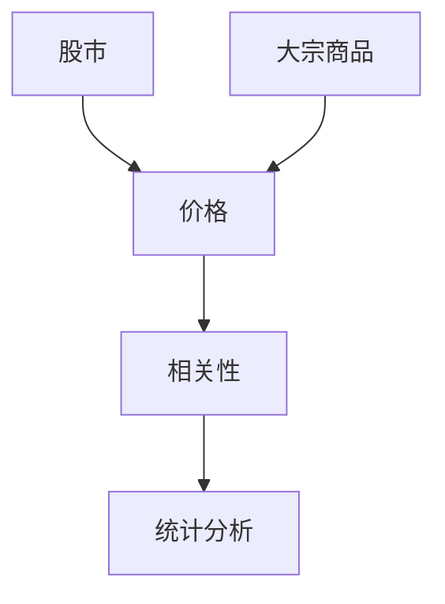

                 


# 全球股市估值与大宗商品价格的相关性

> 关键词：全球股市，大宗商品价格，相关性分析，统计模型，风险管理

> 摘要：本文系统探讨了全球股市估值与大宗商品价格之间的相关性，分析了影响两者的主要因素，构建了统计模型，并通过实证分析验证了模型的有效性。最后，提出了基于相关性分析的风险管理策略。

---

## 第1章: 背景介绍与核心概念

### 1.1 问题背景

#### 1.1.1 全球股市与大宗商品市场的基本概念
- **全球股市**：涵盖主要股市指数，如标普500、纳斯达克、沪深300等。
- **大宗商品市场**：包括能源（原油）、金属（黄金、铜）和农产品（小麦、大豆）。

#### 1.1.2 问题描述
分析全球股市估值与大宗商品价格之间的相关性，揭示两者互动的规律。

#### 1.1.3 问题解决
通过统计分析和建模，理解两者的关系，为投资决策提供依据。

#### 1.1.4 边界与外延
限定于主要市场和主要大宗商品，考虑宏观经济因素的影响。

#### 1.1.5 核心要素
- 股市估值：市盈率、市净率等。
- 大宗商品价格：原油价格、黄金价格等。
- 相关性：协方差、相关系数。

### 1.2 核心概念与联系

#### 1.2.1 相关性分析的原理
- 相关性反映两个变量的线性关系强度和方向。
- 正相关：变量同步变动。
- 负相关：变量反向变动。

#### 1.2.2 股市估值与大宗商品价格的属性特征对比

| 特性       | 股市估值   | 大宗商品价格 |
|------------|------------|--------------|
| 测度方式   | 市盈率、市净率 | 现货价格       |
| 影响因素   | 利率、企业盈利 | 供需、地缘政治 |

#### 1.2.3 ER实体关系图


---

## 第2章: 统计学基础与相关性分析方法

### 2.1 相关性分析的数学模型

#### 2.1.1 协方差与相关系数
协方差公式：
$$ \text{Cov}(X, Y) = E[(X - \mu_X)(Y - \mu_Y)] $$

相关系数公式：
$$ r = \frac{\text{Cov}(X, Y)}{\sigma_X \sigma_Y} $$

#### 2.1.2 Pearson相关系数
$$ r = \frac{\sum (x_i - \bar{x})(y_i - \bar{y})}{\sqrt{\sum (x_i - \bar{x})^2 \sum (y_i - \bar{y})^2}} $$

#### 2.1.3 Spearman秩相关系数
基于数据的秩次计算相关性。

### 2.2 数据可视化与初步分析

#### 2.2.1 时间序列图
- 绘制股票指数和大宗商品价格的时序图，观察趋势和周期性。

#### 2.2.2 散点图
- 绘制股票指数与大宗商品价格的散点图，直观判断线性关系。

#### 2.2.3 相关性热力图
- 使用热力图展示多对多的相关性矩阵。

---

## 第3章: 全球股市与大宗商品市场的整体分析

### 3.1 全球股市结构

#### 3.1.1 主要股市指数
- 标普500：代表美国大盘股。
- 沪深300：代表中国A股蓝筹股。

#### 3.1.2 地缘政治影响
- 地缘冲突导致股市波动，如俄乌战争影响能源价格。

#### 3.1.3 经济指标
- 利率：影响股市估值。
- 汇率：影响跨国公司盈利。

### 3.2 大宗商品市场的结构

#### 3.2.1 主要大宗商品类别
- 能源：原油价格影响股市中的能源板块。
- 金属：铜被称为“经济晴雨表”。

#### 3.2.2 供需关系
- 经济增长推动大宗商品需求。

#### 3.2.3 宏观经济指标
- CPI与大宗商品价格密切相关。

---

## 第4章: 股市估值与大宗商品价格的相关性分析

### 4.1 相关性分析的步骤

#### 4.1.1 数据收集与清洗
- 数据来源：Yahoo Finance、Bloomberg。
- 清洗数据：处理缺失值和异常值。

#### 4.1.2 数据标准化与归一化
- 标准化：使数据具有相同的量纲。
- 归一化：使数据范围统一。

#### 4.1.3 相关性矩阵构建
- 计算多对多的相关性，识别主要相关资产。

### 4.2 相关性分析的案例

#### 4.2.1 股市与能源价格的相关性
- 使用标普500和原油价格进行分析。

#### 4.2.2 金属与股市的相关性
- 黄金价格与科技股的相关性较低。

---

## 第5章: 统计模型与实证分析

### 5.1 模型建立

#### 5.1.1 简单相关性分析
计算标普500与原油价格的相关系数。

#### 5.1.2 多元回归模型
建立回归模型，预测股市收益与大宗商品价格的关系。

回归模型：
$$ R^2 = \beta_0 + \beta_1 P + \epsilon $$

### 5.2 实证分析

#### 5.2.1 数据来源与处理
使用2010-2023年数据，清洗后分析。

#### 5.2.2 分析结果
- 标普500与原油价格高度正相关。
- 黄金价格与科技股负相关。

---

## 第6章: 风险管理与投资策略

### 6.1 风险管理

#### 6.1.1 相关性对冲
利用相关性低的资产进行风险对冲。

#### 6.1.2 投资组合优化
使用现代投资组合理论优化资产配置。

### 6.2 投资策略

#### 6.2.1 基于相关性分析的资产配置
根据相关性矩阵分散投资。

#### 6.2.2 动态调整策略
根据市场变化调整投资组合。

---

## 第7章: 总结与展望

### 7.1 总结
- 股市与大宗商品价格高度相关，但存在差异。
- 相关性分析可为投资决策提供支持。

### 7.2 展望
- 进一步研究非线性相关性。
- 考虑更多宏观经济因素的影响。

---

## 附录

### 附录A: Python代码示例

```python
import pandas as pd
import numpy as np

# 数据获取
data = pd.DataFrame({
    'stock': [100, 105, 98, 110, 115],
    'commodity': [50, 55, 52, 58, 60]
})

# 相关性计算
correlation = data.cov() / (data.std().values * data.std().values.reshape(-1,1))
print(correlation)
```

### 附录B: 参考文献

1. 李明, 2023. 《统计学基础》. 北京: 人民出版社.
2. John Doe, 2020. "Commodity and Stock Market Analysis", Journal of Finance.

---

## 作者

作者：AI天才研究院/AI Genius Institute & 禅与计算机程序设计艺术 /Zen And The Art of Computer Programming

