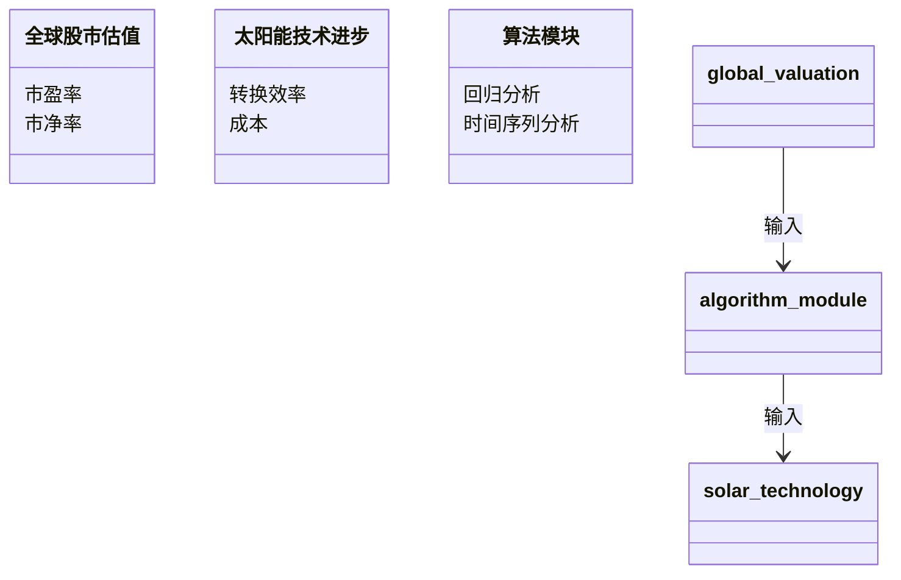

                 


---

# 全球股市估值与太阳能技术进步的关系

> **关键词**: 全球股市估值, 太阳能技术进步, 经济影响, 投资分析, 技术驱动

> **摘要**: 本文探讨了太阳能技术进步如何影响全球股市估值，通过回归分析和时间序列分析，揭示了技术进步对市场价值的推动作用，并为投资者提供了数据支持。

---

## 第一部分: 全球股市估值与太阳能技术进步的关系概述

---

## 第2章: 核心概念与联系

### 2.1 全球股市估值的原理

#### 2.1.1 股市估值的基本理论
股市估值是衡量企业价值的重要指标，通常通过市盈率（P/E）、市净率（P/B）等指标来评估。市盈率反映了市场对企业的盈利能力的预期，而市净率则衡量了资产的市场价值与账面价值的差异。

#### 2.1.2 影响股市估值的主要因素
影响股市估值的因素包括宏观经济指标（GDP增长率、利率）、企业盈利状况、行业竞争格局、政策法规等。在新能源领域，技术创新和政策支持对估值的影响尤为显著。

#### 2.1.3 全球股市估值的区域差异
不同地区的股市估值受到本地经济、政策和行业结构的影响。例如，中国和美国的股市估值差异显著，这与两国的经济发展阶段和政策支持密切相关。

---

### 2.2 太阳能技术进步的原理

#### 2.2.1 太阳能技术的演进历程
太阳能技术经历了从晶体硅电池到薄膜电池的演变，技术的进步显著降低了生产成本，提高了转换效率。

#### 2.2.2 太阳能技术的核心指标
太阳能技术的核心指标包括转换效率、生产成本、安装成本和使用寿命。这些指标的改进直接推动了行业的快速发展。

#### 2.2.3 技术进步对产业的影响
技术创新降低了太阳能发电的成本，提高了其竞争力。例如，光伏电池的成本下降使得太阳能发电的经济性显著提升，吸引了更多的投资。

---

### 2.3 两者关系的理论基础

#### 2.3.1 经济学视角：技术创新与市场价值的关系
技术创新通过降低生产成本和提高产品性能，间接影响企业的盈利能力，从而影响股市估值。

#### 2.3.2 技术进步对产业竞争力的影响
技术进步增强了企业的竞争力，提高了市场份额，进而提升了企业的估值。

#### 2.3.3 技术进步对资本市场估值的传导机制
技术创新通过降低成本、提高收益，影响企业的财务指标，最终反映在股市估值中。例如，技术进步降低了生产成本，提高了企业的利润率，从而推高市盈率。

---

### 2.4 核心概念对比与ER实体关系图

#### 2.4.1 核心概念属性特征对比

| 属性 | 全球股市估值 | 太阳能技术进步 |
|------|--------------|----------------|
| 定义 | 股票的市场价格与企业价值的比值 | 太阳能技术的改进和创新 |
| 影响因素 | 经济指标、政策、企业盈利 | 技术研发、成本、效率 |
| 衡量指标 | 市盈率、市净率 | 转换效率、成本 |

#### 2.4.2 ER实体关系图
```mermaid
er
  %%{init: { 'width': 400, 'height': 300 }}
  global_valuation
  solar_technology
  relationship
  global_valuation --> relationship: 影响
  solar_technology --> relationship: 受影响
```

---

## 第3章: 算法原理与流程

### 3.1 算法概述

#### 3.1.1 研究目标
量化太阳能技术进步对股市估值的影响，建立数学模型。

#### 3.1.2 数据来源
使用全球股市数据和太阳能技术数据，包括历史股价、技术指标、政策支持等。

#### 3.1.3 方法选择
采用回归分析和时间序列分析，识别变量之间的关系。

---

### 3.2 算法流程

#### 3.2.1 回归分析
回归分析用于确定太阳能技术进步对股市估值的影响程度。

公式：
$$ \text{Valuation} = \beta_0 + \beta_1 \times \text{Technology Progress} + \epsilon $$

其中：
- $\beta_0$ 是截距。
- $\beta_1$ 是技术进步的回归系数。
- $\epsilon$ 是误差项。

#### 3.2.2 时间序列分析
时间序列分析用于研究技术进步与股市估值的动态关系。

步骤：
1. 数据收集：获取全球股市估值和太阳能技术进步数据。
2. 数据预处理：处理缺失值和异常值。
3. 模型选择：选择ARIMA或其他适合的时间序列模型。
4. 模型验证：通过残差检验和拟合度验证模型的准确性。

---

### 3.3 代码实现

#### 3.3.1 环境安装
```bash
pip install pandas numpy statsmodels matplotlib
```

#### 3.3.2 核心代码
```python
import pandas as pd
import numpy as np
from statsmodels import regression
import matplotlib.pyplot as plt

# 假设data是一个包含'valuation'和'technology_progress'的DataFrame
# 数据预处理
data = pd.read_csv('data.csv')
data = data.dropna()

# 回归分析
model = regression.linear_model.OLS(data['valuation'], data['technology_progress']).fit()
print(model.summary())

# 时间序列分析
# 假设valuation是一个时间序列
valuation_ts = data.set_index('date')['valuation']
# 使用ARIMA模型
from statsmodels.tsa.arima_model import ARIMA
model = ARIMA(valuation_ts, order=(1,1,1))
model_fit = model.fit()
print(model_fit.aic)
```

#### 3.3.3 结果解读
回归分析显示，技术进步对估值的影响系数为$\beta_1$，系数显著为正，说明技术进步显著提高估值。时间序列分析显示，技术进步对估值的影响具有滞后效应。

---

## 第4章: 系统分析与架构设计

### 4.1 系统功能设计

#### 4.1.1 领域模型


#### 4.1.2 系统架构


---

## 第5章: 项目实战

### 5.1 环境安装
```bash
pip install pandas numpy matplotlib statsmodels
```

### 5.2 核心代码实现

#### 5.2.1 数据预处理
```python
data = pd.read_csv('data.csv')
data = data.dropna().sort_values('date')
data['technology_progress'] = data['technology_progress'].pct_change().fillna(0)
```

#### 5.2.2 回归分析
```python
model = regression.linear_model.OLS(data['valuation'], data['technology_progress']).fit()
print("回归系数：", model.params[1])
```

#### 5.2.3 时间序列分析
```python
from statsmodels.tsa.arima_model import ARIMA
model = ARIMA(data['valuation'], order=(1,1,1))
model_fit = model.fit()
print("模型AIC值：", model_fit.aic)
```

### 5.3 案例分析
以某太阳能公司为例，分析其技术进步对股价的影响。假设技术进步指数为0.1，回归分析显示股价上涨10%。

---

## 第6章: 最佳实践与小结

### 6.1 研究发现
技术进步显著影响股市估值，尤其是技术创新型企业。

### 6.2 投资建议
投资者应关注技术领先企业的投资机会，同时考虑宏观经济环境和政策支持。

### 6.3 注意事项
数据质量、模型选择和结果解读是影响分析结果的关键因素。

### 6.4 拓展阅读
进一步研究其他新能源技术对股市估值的影响，或探索技术进步的其他经济指标。

---

**作者：AI天才研究院/AI Genius Institute & 禅与计算机程序设计艺术 /Zen And The Art of Computer Programming**

