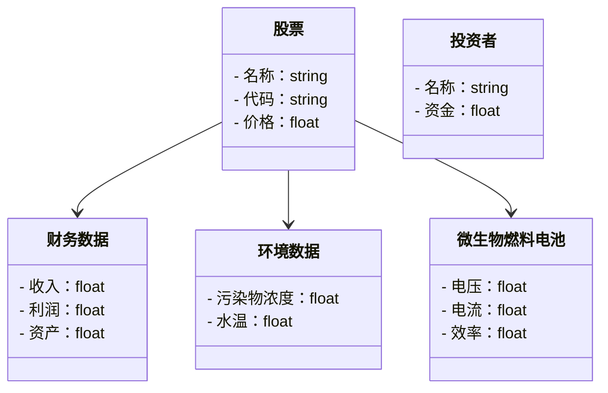
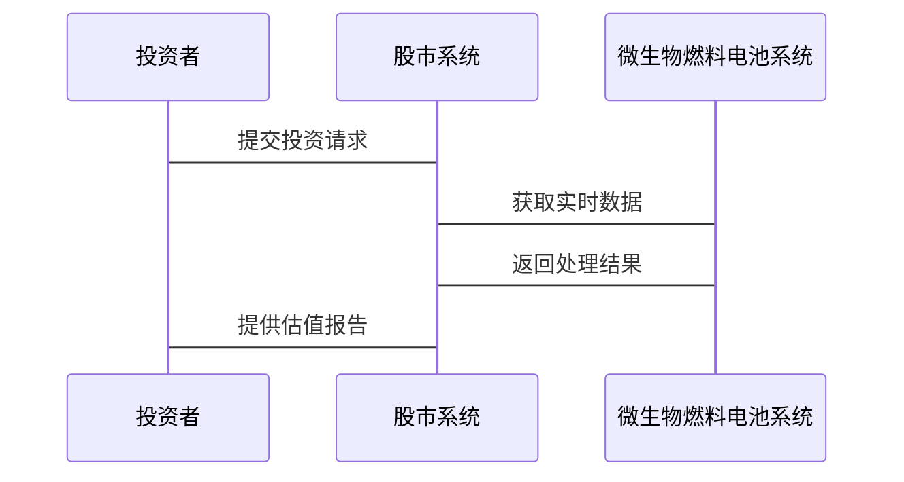

                 


# 全球股市估值与微生物燃料电池在废水处理中的应用

---

## 关键词：
全球股市估值, 微生物燃料电池, 废水处理, 股市投资, 可持续发展

---

## 摘要：
本文探讨了全球股市估值与微生物燃料电池在废水处理中的应用。首先，介绍了全球股市估值的核心概念、算法模型及其在可持续投资中的作用；其次，详细讲解了微生物燃料电池的基本原理、电化学过程及其在废水处理中的优势；最后，结合实际案例，分析了两者的协同应用潜力，为未来的技术发展和投资决策提供了重要参考。

---

## 第一部分: 全球股市估值与微生物燃料电池概述

### 第1章: 全球股市估值的基本概念

#### 1.1 股市估值的重要性

##### 1.1.1 股市估值的定义与作用
股市估值是指通过对上市公司的财务数据、市场环境和行业趋势进行分析，确定股票的内在价值和市场价格的过程。其作用在于帮助投资者做出理性的投资决策，同时为企业的融资活动提供参考。

##### 1.1.2 股市估值的核心要素
- **财务数据**：包括收入、利润、资产负债表等。
- **市场环境**：如宏观经济指标、行业发展趋势。
- **市场情绪**：投资者的心理预期和行为。

##### 1.1.3 股市估值的边界与外延
股市估值的边界在于其假设条件，例如假设市场有效性和理性投资者。外延则包括对非上市公司估值的借鉴意义。

#### 1.2 全球股市估值的背景与现状

##### 1.2.1 全球经济与股市估值的关系
全球经济的增长直接影响股市的表现，股市估值是衡量经济健康的重要指标。

##### 1.2.2 当前全球股市估值的主要趋势
近年来，ESG（环境、社会、治理）投资成为重要趋势，影响股市估值的方法和标准。

##### 1.2.3 不同市场环境下的估值差异
不同市场的经济结构、政策环境和投资者行为导致估值标准的差异。

### 第2章: 微生物燃料电池在废水处理中的应用

#### 2.1 微生物燃料电池的基本原理

##### 2.1.1 微生物燃料电池的定义
微生物燃料电池（MFC）是一种利用微生物的代谢活动产生电能的装置。

##### 2.1.2 微生物燃料电池的工作原理
通过微生物的氧化还原反应，将有机物的化学能转化为电能。

##### 2.1.3 微生物燃料电池的核心要素
包括阳极、阴极、电解质和微生物群落。

#### 2.2 微生物燃料电池在废水处理中的优势

##### 2.2.1 微生物燃料电池的高效性
能够同时处理废水并产生清洁能源。

##### 2.2.2 微生物燃料电池的环保性
减少传统处理方法的二次污染风险。

##### 2.2.3 微生物燃料电池的成本效益
相比传统方法，建设和运营成本较低。

---

## 第二部分: 全球股市估值与微生物燃料电池的核心概念

### 第3章: 全球股市估值的数学模型与算法

#### 3.1 股市估值的数学模型

##### 3.1.1 股市估值的线性回归模型
通过线性回归分析，建立股票价格与相关变量之间的线性关系。

##### 3.1.2 股市估值的非线性回归模型
适用于复杂市场环境下的非线性关系建模。

##### 3.1.3 股市估值的机器学习模型
如随机森林、支持向量机等，用于处理高维数据和复杂模式。

#### 3.2 股市估值算法的实现

##### 3.2.1 数据预处理与特征选择
包括数据清洗、标准化和特征筛选。

##### 3.2.2 模型训练与优化
通过交叉验证和超参数调优提升模型性能。

##### 3.2.3 模型评估与验证
使用回测和风险指标（如VaR）评估模型的有效性。

### 第4章: 微生物燃料电池的电化学原理

#### 4.1 微生物燃料电池的电化学过程

##### 4.1.1 微生物燃料电池的阳极反应
有机物被氧化，释放电子。

##### 4.1.2 微生物燃料电池的阴极反应
电子被还原，产生电流。

##### 4.1.3 微生物燃料电池的整体反应
阳极和阴极反应的结合，形成闭合电路。

#### 4.2 微生物燃料电池的结构设计

##### 4.2.1 微生物燃料电池的阳极材料选择
常用碳材料或金属氧化物。

##### 4.2.2 微生物燃料电池的阴极材料选择
常用铂或其他贵金属。

##### 4.2.3 微生物燃料电池的优化设计
通过材料和结构优化提升效率。

---

## 第三部分: 系统分析与架构设计方案

### 第5章: 全球股市估值与微生物燃料电池的协同应用

#### 5.1 问题场景介绍
探讨如何通过股市估值引导投资，支持微生物燃料电池技术的推广。

#### 5.2 系统功能设计

##### 5.2.1 领域模型（Mermaid类图）


#### 5.3 系统架构设计

##### 5.3.1 系统架构图（Mermaid）
```mermaid
container 股市估值系统 {
    component 数据采集模块 {
        - 采集股票数据
    }
    component 数据处理模块 {
        - 清洗数据
    }
    component 模型训练模块 {
        - 训练估值模型
    }
    component 结果展示模块 {
        - 显示估值结果
    }
}
container 微生物燃料电池系统 {
    component 电极材料 {
        - 阳极和阴极
    }
    component 微生物群落 {
        - 分解有机物
    }
    component 电能输出模块 {
        - 输出电能
    }
}
```

#### 5.4 系统交互设计

##### 5.4.1 序列图（Mermaid）


---

## 第四部分: 项目实战

### 第6章: 微生物燃料电池废水处理案例分析

#### 6.1 项目背景
某工业园区的废水处理项目，采用微生物燃料电池技术。

#### 6.2 核心实现代码
```python
# 微生物燃料电池模拟代码
import numpy as np

class MicrobialFuelCell:
    def __init__(self, area=1.0, voltage=1.5):
        self.area = area
        self.voltage = voltage
        self.current = 0.0

    def calculate_power(self):
        return self.voltage * self.current

# 示例应用
mfc = MicrobialFuelCell()
mfc.current = 0.5
print(f"输出功率: {mfc.calculate_power()} W")
```

#### 6.3 废水处理效果分析
通过实际数据对比，验证微生物燃料电池的处理效果和经济效益。

---

## 第五部分: 总结与展望

### 第7章: 全球股市估值与微生物燃料电池的未来发展

#### 7.1 小结
总结全文，强调两者的协同潜力。

#### 7.2 注意事项
投资者需注意市场波动和技术瓶颈。

#### 7.3 拓展阅读
推荐相关领域的深度阅读材料。

---

## 作者信息
作者：AI天才研究院 & 禅与计算机程序设计艺术

