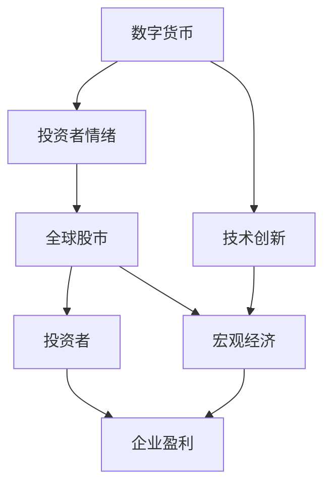

                 

# 全球股市估值与数字货币发展的关系

## 关键词：全球股市估值，数字货币发展，市场联动性，投资影响，经济趋势

## 摘要：  
本文探讨全球股市估值与数字货币发展的关系，分析数字货币对传统金融市场的影响机制，包括市场联动性、投资者行为、技术驱动和宏观经济因素。通过实证分析和案例研究，揭示两者互动的潜在规律，为投资者和政策制定者提供参考。

---

## 第一部分: 全球股市估值与数字货币发展的背景与概述

### 第1章: 全球股市估值与数字货币的背景介绍

#### 1.1 全球股市估值的基本概念
- **股票估值**：评估公司内在价值的方法，包括市盈率（PE）、市净率（PB）等指标。  
- **市场整体估值**：反映市场信心和经济状况的晴雨表，如道琼斯指数和标普500指数。  
- **影响因素**：宏观经济政策、企业盈利、投资者情绪等。

#### 1.2 数字货币的基本概念与分类
- **数字货币**：基于区块链技术的加密货币，如比特币、以太坊。  
- **分类**：按用途分为支付型、投资型；按技术分为PoW、PoS等共识机制。  
- **市场规模**：截至2023年，数字货币总市值已超过3万亿美元。

### 第2章: 全球股市估值与数字货币发展的核心概念

#### 2.1 核心概念的属性对比
| 股市估值 | 数字货币 |
|---------|----------|
| 稳定性高 | 波动性大 |
| 受监管严格 | 监管不确定性高 |
| 投资者成熟 | 投资者风险偏好高 |

#### 2.2 实体关系图

---

## 第二部分: 全球股市估值与数字货币发展的关系分析

### 第3章: 数字货币对股市估值的影响机制

#### 3.1 数字货币价格波动对股市的影响
- **溢出效应**：比特币等数字货币的价格波动可能传染至传统股市。  
- **投资者行为**：部分投资者将资金从股市转移至数字货币，影响股市流动性。  
- **市场情绪**：数字货币的高波动性可能加剧市场恐慌或乐观情绪。

#### 3.2 数字货币技术对股市的影响
- **区块链技术**：提升股市交易透明度和效率。  
- **去中心化金融（DeFi）**：挑战传统金融体系，可能影响股市估值。

### 第4章: 全球股市与数字货币市场的互动关系

#### 4.1 市场联动性的实证分析
- **相关性分析**：比特币与纳斯达克指数的相关性逐步增强。  
- **典型案例**：2020年新冠疫情后，比特币价格与标普500指数的相关性显著提高。

#### 4.2 数字货币对股市估值的反馈机制
- **资产配置**：投资者通过配置数字货币分散风险，影响股市估值。  
- **监管政策**：数字货币监管政策的出台可能引发股市估值波动。

---

## 第三部分: 全球股市估值与数字货币发展的未来趋势

### 第5章: 宏观经济环境对股市与数字货币的影响

#### 5.1 利率政策与通货膨胀
- **低利率环境**：推动股市估值上升，同时增加数字货币的吸引力。  
- **通货膨胀**：可能削弱传统资产的吸引力，加剧数字货币投资。

### 第6章: 数字货币对股市估值的长期影响

#### 6.1 技术驱动的市场变革
- **区块链技术**：可能降低股市交易成本，提升市场效率。  
- **智能合约**：改变传统金融市场的运作方式，影响股市估值模型。

### 第7章: 全球经济与金融市场的未来展望

#### 7.1 数字货币的潜在风险
- **价格波动**：可能引发市场恐慌。  
- **监管不确定性**：影响市场信心。

---

## 第四部分: 投资者视角与风险管理

### 第8章: 投资者策略与风险管理

#### 8.1 资产配置建议
- **多元化投资**：将部分资金配置至数字货币，降低风险。  
- **风险管理工具**：利用衍生品对冲市场波动风险。

#### 8.2 数字货币与股市的动态平衡
- **短期策略**：利用市场波动进行短期交易。  
- **长期策略**：关注技术创新和政策变化，布局长期投资。

---

## 结语

全球股市估值与数字货币发展密切相关，投资者和政策制定者需关注市场联动性、技术变革和宏观经济因素。未来，数字货币将继续影响股市估值，两者互动将更加复杂和紧密。

---

## 作者：AI天才研究院 & 禅与计算机程序设计艺术

