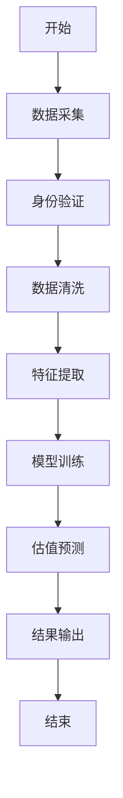
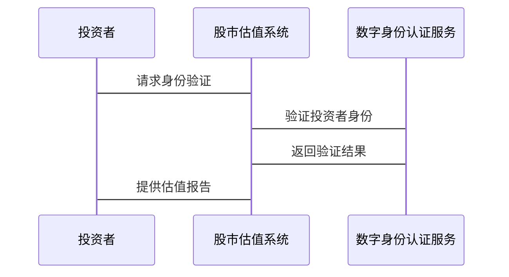

                 


# 全球股市估值与数字身份认证的关联

## 关键词：全球股市估值、数字身份认证、关联分析、技术应用、金融市场

## 摘要：本文探讨了全球股市估值与数字身份认证之间的关联，分析了数字身份认证技术如何影响股市估值的准确性与安全性。通过核心概念、算法原理、系统设计与项目实战的详细讲解，展示了数字身份认证在金融领域的应用潜力。文章最后总结了最佳实践与未来发展方向。

---

## 第一部分: 全球股市估值与数字身份认证的背景与关联

### 第1章: 全球股市估值的现状与挑战

#### 1.1 全球股市估值的定义与重要性
股市估值是通过对上市公司财务数据和市场表现进行分析，估算其股票的合理价格范围。它是投资者、分析师和金融机构评估市场健康状况的重要工具。股市估值的准确性直接影响投资决策和市场稳定性。

#### 1.2 数字身份认证的发展与应用
数字身份认证是通过技术手段验证用户身份的真实性。随着互联网和金融交易的普及，数字身份认证在金融领域的应用越来越广泛，尤其是在证券交易、身份验证和数据安全方面。

#### 1.3 股市估值与数字身份认证的关联背景
数字身份认证技术的引入可以提升股市估值的准确性和安全性。通过身份验证，确保数据来源的可靠性，从而提高估值模型的可信度。全球化背景下，数字身份认证的跨国互认也为全球股市估值提供了技术基础。

---

### 第2章: 股市估值与数字身份认证的核心概念与联系

#### 2.1 核心概念的原理分析
- 股市估值的核心要素包括市盈率、市净率、市值等指标，这些指标反映了企业的经营状况和市场表现。
- 数字身份认证的关键技术包括生物识别、加密算法和区块链，这些技术确保了身份验证的可靠性和安全性。

#### 2.2 核心概念的属性特征对比
| 股市估值 | 数字身份认证 |
|----------|---------------|
| 数据驱动 | 技术驱动       |
| 侧重市场表现 | 侧重身份验证 |
| 结果用于投资决策 | 结果用于系统访问控制 |

#### 2.3 ER实体关系图架构
```mermaid
erDiagram
    investor[投资者] {
        投资者ID
        姓名
        身份验证状态
    }
    stock[股票] {
        股票代码
        市值
        估值指标
    }
    investor --> stock : 交易
    investor --> stock : 估值
```

---

## 第二部分: 股市估值与数字身份认证的算法原理

### 第3章: 算法原理概述

#### 3.1 基于数字身份认证的股市估值模型
通过数字身份认证技术，确保数据来源的可靠性，从而提高估值模型的准确性。模型通过机器学习算法对市场数据进行分析，结合身份验证结果，生成股票的估值报告。

#### 3.2 算法流程图


### 第4章: 算法实现与数学模型

#### 4.1 算法实现
使用Python实现基于数字身份认证的股市估值算法：
```python
import pandas as pd
from sklearn import linear_model

# 数据预处理
data = pd.read_csv('stock_data.csv')
data_cleaned = data.dropna()

# 特征提取
features = data_cleaned[['市盈率', '市净率']]
target = data_cleaned['股价']

# 模型训练
model = linear_model.LinearRegression()
model.fit(features, target)

# 预测与评估
predictions = model.predict(features)
print('预测结果:', predictions)
```

#### 4.2 数学模型
股市估值模型：
$$ 股价 = \beta_0 + \beta_1 \times 市盈率 + \beta_2 \times 市净率 + \epsilon $$

数字身份认证模型：
$$ 认证结果 = f(身份证号, 密码, 生物特征) $$

---

## 第三部分: 系统分析与架构设计方案

### 第5章: 问题场景介绍
在金融市场中，投资者和机构需要通过数字身份认证进行证券交易和数据访问。如何确保数据安全和交易合法性是股市估值系统设计的关键问题。

### 第6章: 系统功能设计

#### 6.1 系统功能模块
- 用户认证模块：验证投资者身份。
- 数据采集模块：收集股票市场数据。
- 分析模块：计算股票估值指标。
- 报告生成模块：输出估值报告。

#### 6.2 系统架构设计


### 第7章: 系统交互设计

#### 7.1 系统交互流程图


---

## 第四部分: 项目实战

### 第8章: 项目实战与实现

#### 8.1 环境安装
- 安装Python和相关库：
  ```bash
  pip install pandas scikit-learn
  ```

#### 8.2 核心代码实现
```python
from sklearn.model_selection import train_test_split

# 数据加载
data = pd.read_csv('stock_data.csv')

# 数据分割
X_train, X_test, y_train, y_test = train_test_split(
    data[['市盈率', '市净率']], data['股价'], test_size=0.2
)

# 模型训练
model = linear_model.LinearRegression()
model.fit(X_train, y_train)

# 模型评估
score = model.score(X_test, y_test)
print('模型得分:', score)
```

#### 8.3 案例分析
以某科技公司为例，通过模型计算其股票的合理估值范围，验证数字身份认证对数据安全的影响。

---

## 第五部分: 总结与展望

### 第9章: 最佳实践与注意事项

#### 9.1 最佳实践
- 在系统设计中，确保数字身份认证的安全性。
- 定期更新模型参数，适应市场变化。

#### 9.2 注意事项
- 避免过度依赖单一技术，保持系统的灵活性。
- 注意数据隐私保护，符合相关法律法规。

### 第10章: 小结
本文详细探讨了全球股市估值与数字身份认证的关联，分析了两者的技术原理和应用场景。通过系统设计和项目实战，展示了如何将数字身份认证技术应用于股市估值系统，以提升数据安全性和估值准确性。

### 第11章: 拓展阅读
- 《金融数据分析与机器学习》
- 《数字身份认证技术与应用》

---

## 作者：AI天才研究院/AI Genius Institute & 禅与计算机程序设计艺术 /Zen And The Art of Computer Programming

