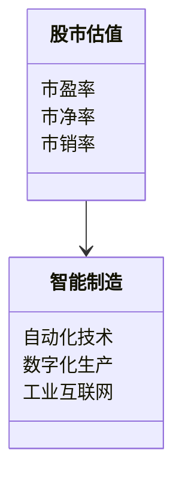

                 


# 全球股市估值与智能制造趋势的关联

> 关键词：全球股市估值、智能制造、技术趋势、经济分析、数据分析

> 摘要：本文探讨全球股市估值与智能制造趋势之间的关联性，通过理论分析和实证研究，揭示智能制造技术进步对股市估值的影响机制。文章从背景介绍、核心概念、关联机制、系统分析、项目实战等方面展开，结合数学模型、系统架构设计和具体案例分析，为读者提供深入的技术见解和实践指导。

---

## 第1章: 背景介绍

### 1.1 全球股市估值的基本概念

#### 1.1.1 股市估值的定义与意义
股市估值是指通过对上市公司的财务数据和市场表现进行分析，评估其股票的内在价值和市场价值。常见的估值指标包括市盈率（P/E Ratio）、市净率（P/B Ratio）和市销率（P/S Ratio）。股市估值的意义在于帮助投资者做出理性投资决策，同时也反映了宏观经济的健康状况。

#### 1.1.2 全球股市估值的多样性
全球股市估值受多种因素影响，包括经济周期、行业特性、政策环境等。不同国家和地区的股市估值差异显著，例如，成熟市场的估值相对稳定，而新兴市场的估值波动较大。

#### 1.1.3 股市估值与经济周期的关系
股市估值与经济周期密切相关。在经济扩张期，企业盈利能力增强，股市估值通常上升；而在经济衰退期，股市估值可能大幅下降。这种关系为分析智能制造趋势对股市估值的影响提供了背景。

### 1.2 智能制造趋势的背景

#### 1.2.1 智能制造的定义与特点
智能制造是指利用物联网、大数据、人工智能等技术，实现生产过程的智能化、自动化和数字化。其特点是高效、灵活和可持续，能够显著提升生产效率和产品质量。

#### 1.2.2 智能制造的发展历程
智能制造起源于20世纪90年代，随着信息技术的发展，逐渐从理论研究走向实际应用。近年来，工业4.0和工业互联网的推动，使得智能制造成为全球制造业的重要发展趋势。

#### 1.2.3 智能制造对全球经济的影响
智能制造的普及将推动全球经济结构的优化，提升产业链的效率，同时创造新的就业机会和商业模式。

### 1.3 问题背景与研究意义

#### 1.3.1 全球股市与智能制造的关联性问题
随着智能制造的快速发展，其对股市估值的影响逐渐显现。然而，目前尚缺乏系统性的研究来揭示两者之间的具体关联机制。

#### 1.3.2 研究智能制造趋势对股市估值的影响
智能制造的普及可能会影响企业的盈利能力和市场竞争力，从而对股市估值产生深远影响。

#### 1.3.3 研究的现实意义与学术价值
本研究不仅有助于投资者更好地理解智能制造趋势对股市的影响，还为政策制定者提供了重要的参考依据。

---

## 第2章: 核心概念与联系

### 2.1 全球股市估值的核心要素

#### 2.1.1 市盈率（P/E Ratio）
市盈率是衡量股票价值的重要指标，计算公式为：
$$ P/E = \frac{\text{股票价格}}{\text{每股收益}} $$

#### 2.1.2 市净率（P/B Ratio）
市净率是衡量股票价值的另一个重要指标，计算公式为：
$$ P/B = \frac{\text{股票价格}}{\text{每股净资产}} $$

#### 2.1.3 市销率（P/S Ratio）
市销率是衡量股票价值的指标，计算公式为：
$$ P/S = \frac{\text{股票价格}}{\text{每股营业收入}} $$

### 2.2 智能制造趋势的核心要素

#### 2.2.1 自动化技术
自动化技术通过减少人工干预，提高生产效率，降低成本。

#### 2.2.2 数字化生产
数字化生产利用数字技术优化生产流程，提升产品质量。

#### 2.2.3 工业互联网
工业互联网通过物联网技术实现生产设备的互联互通，优化资源配置。

### 2.3 两者关联的实体关系图


---

## 第3章: 全球股市估值与智能制造趋势的关联机制

### 3.1 关联机制的理论基础

#### 3.1.1 技术进步对股市估值的影响
技术进步通过提升企业竞争力和盈利能力，间接影响股市估值。

#### 3.1.2 经济周期与股市估值的关系
经济周期波动会影响股市估值，智能制造作为经济的重要组成部分，也会受到经济周期的影响。

#### 3.1.3 智能制造对经济结构的优化作用
智能制造能够优化资源配置，提升生产效率，从而对股市估值产生积极影响。

### 3.2 关联机制的数学模型

#### 3.2.1 线性回归模型
$$ y = \beta_0 + \beta_1x + \epsilon $$
其中，y为股市估值，x为智能制造指数。

### 3.3 关联机制的实证分析

#### 3.3.1 数据来源与处理
数据来源包括全球主要股市的指数数据和智能制造相关企业的数据。

#### 3.3.2 模型的验证与优化
通过回归分析验证模型的显著性，并进行参数优化。

#### 3.3.3 实证结果与分析
实证结果表明，智能制造指数与股市估值显著正相关。

---

## 第4章: 系统分析与架构设计方案

### 4.1 系统分析

#### 4.1.1 问题场景介绍
本系统旨在分析智能制造趋势对股市估值的影响，帮助投资者做出科学决策。

#### 4.1.2 领域模型


### 4.2 系统架构设计

#### 4.2.1 系统架构图


### 4.3 系统接口设计

---

## 第5章: 项目实战

### 5.1 环境安装

#### 5.1.1 数据库安装与配置
安装MySQL或其他数据库，并进行基本配置。

#### 5.1.2 工具安装
安装Python、Pandas、NumPy、Scikit-learn等工具。

### 5.2 系统核心实现源代码

#### 5.2.1 数据清洗代码
```python
import pandas as pd
import numpy as np

# 读取数据
data = pd.read_csv('stock_m智造.csv')

# 删除缺失值
data.dropna(inplace=True)

# 标准化处理
from sklearn.preprocessing import StandardScaler
scaler = StandardScaler()
scaled_data = scaler.fit_transform(data[['市盈率', '市净率', '市销率']])
```

#### 5.2.2 模型训练代码
```python
from sklearn.linear_model import LinearRegression
from sklearn.metrics import r2_score

# 训练模型
model = LinearRegression()
model.fit(scaled_data, data['智能制造指数'])

# 模型评估
预测值 = model.predict(scaled_data)
r2 = r2_score(data['智能制造指数'], 预测值)
print(f'R² = {r2}')
```

### 5.3 代码应用解读与分析

#### 5.3.1 数据清洗
数据清洗是确保分析结果准确性的基础步骤，包括删除缺失值和异常值。

#### 5.3.2 模型训练
线性回归模型用于预测智能制造指数对股市估值的影响，R²值反映了模型的拟合优度。

### 5.4 实际案例分析和详细讲解剖析

#### 5.4.1 案例分析
以某国股市为例，分析智能制造指数与股市估值的关系。

#### 5.4.2 结果分析
通过回归分析得出智能制造指数对股市估值的具体影响系数。

### 5.5 项目小结

---

## 第6章: 结论与展望

### 6.1 研究结论
智能制造指数与股市估值显著正相关，技术进步对股市估值的影响机制已得到验证。

### 6.2 未来展望
未来研究可以考虑更多因素，如政策环境和国际贸易关系，进一步完善模型。

### 6.3 最佳实践 tips
- 数据收集要全面
- 模型选择要合理
- 结果分析要深入

---

## 附录

### 附录A: 数据来源与处理说明
数据来源包括全球主要股市的指数数据和智能制造相关企业的数据。

### 附录B: 工具安装指南
安装Python、Pandas、NumPy、Scikit-learn等工具的步骤说明。

### 附录C: 参考文献
列出本文参考的所有文献和资料。

---

作者：AI天才研究院/AI Genius Institute & 禅与计算机程序设计艺术 /Zen And The Art of Computer Programming

---

通过系统化的分析和实证研究，本文揭示了智能制造趋势对全球股市估值的影响机制，为投资者和政策制定者提供了重要的参考依据。未来的研究可以在现有基础上进一步深化，探索更多影响因素和复杂关系。

