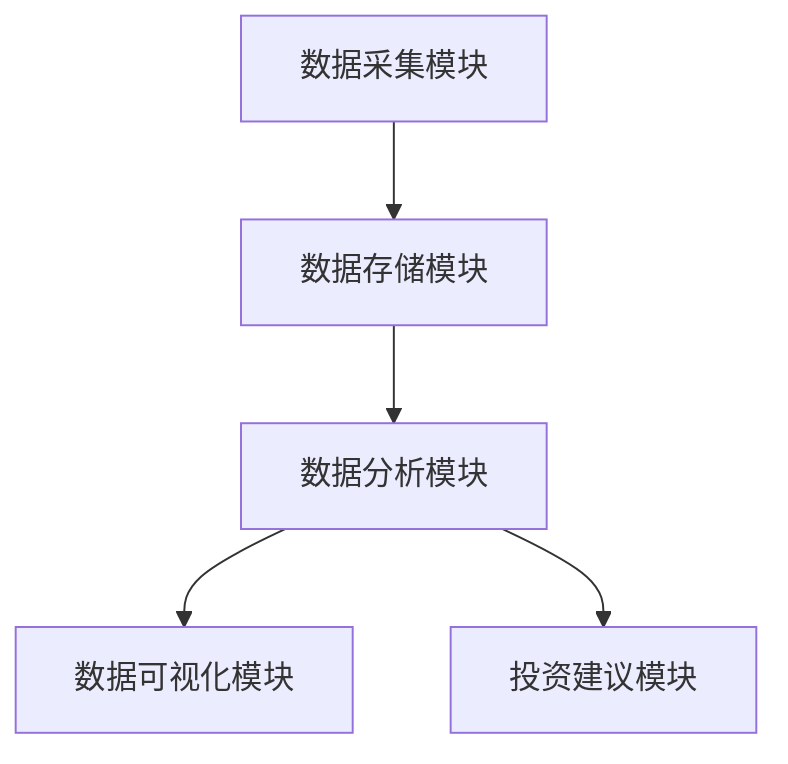

                 


# 《全球股市估值与智能家居市场的关联》

> 关键词：全球股市估值，智能家居市场，关联分析，数据挖掘，机器学习，投资策略

> 摘要：本文系统地分析了全球股市估值与智能家居市场的关联性，通过理论分析、数学建模和实证研究，揭示了两者之间的相互作用机制。文章首先介绍了问题背景和核心概念，然后从算法原理、系统架构、项目实战等角度展开分析，最后总结了研究发现和投资建议。

---

# 第一部分: 全球股市估值与智能家居市场的关联背景

# 第1章: 背景介绍

## 1.1 问题背景

### 1.1.1 全球股市估值的基本概念

股市估值是衡量市场整体价值的重要指标，通常通过指数（如标普500、沪深300）和市盈率（P/E ratio）等指标来衡量。股市估值反映了投资者对市场前景的信心和对经济状况的预期。

### 1.1.2 智能家居市场的定义与现状

智能家居市场是指通过物联网技术将家庭设备（如空调、电视、安防系统）连接到互联网，实现智能化控制的市场。近年来，随着技术进步和消费者需求的增加，智能家居市场呈现快速增长趋势。

### 1.1.3 问题提出：股市估值与智能家居市场的关联性

股市估值反映了整体市场的健康状况，而智能家居市场作为技术创新驱动的行业，其发展与股市的整体表现密切相关。然而，两者的具体关联机制尚未被系统性地研究。

## 1.2 问题描述

### 1.2.1 股市估值的核心要素

- 股市指数（如标普500、沪深300）
- 市盈率（P/E ratio）
- 市净率（P/B ratio）
- 市场情绪（投资者信心）

### 1.2.2 智能家居市场的关键指标

- 市场规模（按销售额或用户数）
- 市场增长率
- 用户渗透率
- 技术创新速度

### 1.2.3 问题解决：如何建立两者之间的关联模型

通过数据分析和建模，探索股市估值指标与智能家居市场指标之间的相关性，进而揭示两者的相互作用机制。

## 1.3 问题边界与外延

### 1.3.1 股市估值的边界条件

- 研究范围：全球主要股市
- 时间范围：近十年的数据
- 数据来源：公开市场数据

### 1.3.2 智能家居市场的外延范围

- 产品范围：智能家居设备、软件和服务
- 地域范围：主要经济体的智能家居市场
- 用户群体：消费者和企业用户

### 1.3.3 关联模型的适用范围与限制

- 适用于长期趋势分析，不适用于短期市场波动
- 适用于主要市场，不适用于新兴市场
- 模型假设：市场数据的可得性和完整性

## 1.4 核心概念结构与组成

### 1.4.1 股市估值的核心要素分析

- 经济指标（GDP、通胀率）
- 企业盈利（净利润增长率）
- 政策因素（货币政策、财政政策）

### 1.4.2 智能家居市场的核心要素分析

- 技术创新（智能家居技术的升级）
- 消费者需求（智能家居产品的普及）
- 市场竞争（主要厂商的市场份额）

### 1.4.3 关联模型的构成与功能

- 数据采集：股市估值数据与智能家居市场数据的获取
- 数据处理：数据清洗与标准化
- 数据分析：相关性分析与回归分析
- 模型构建：关联性模型的建立与验证

## 1.5 本章小结

本章介绍了全球股市估值与智能家居市场的背景，明确了问题边界和核心概念，为后续的关联性分析奠定了基础。

---

# 第2章: 核心概念与联系

## 2.1 股市估值与智能家居市场的核心概念

### 2.1.1 股市估值的理论基础

股市估值的核心理论是“有效市场假说”，即市场价格反映了所有可获得的信息。然而，在现实中，市场可能存在短期波动和非理性行为。

### 2.1.2 智能家居市场的驱动因素

智能家居市场的增长主要依赖于技术创新、消费者需求和政策支持。例如，政府对智能家居技术的补贴可以显著提升市场增长率。

### 2.1.3 两者的共同特征与差异

- 共同特征：都受到经济周期的影响
- 差异：股市估值是整体市场表现，而智能家居市场是具体行业的表现

## 2.2 核心概念属性对比

### 2.2.1 股市估值与智能家居市场的属性对比表格

| 属性 | 股市估值 | 智能家居市场 |
|------|----------|--------------|
| 数据来源 | 股票价格、市盈率 | 销量、用户渗透率 |
| 影响因素 | 经济指标、政策 | 技术创新、消费者需求 |
| 时间维度 | 短期波动、长期趋势 | 产品周期、市场周期 |

### 2.2.2 ER实体关系图

```mermaid
erd
  智能家居市场
    - 市场规模
    - 市场增长率
    - 用户渗透率
    - 市场竞争格局
    - 技术创新速度
  股市估值
    - 股市指数
    - 市盈率
    - 市净率
    - 市场情绪
  关联关系
    - 智能家居市场的技术创新驱动股市估值的增长
    - 股市估值的波动影响智能家居市场的投资信心
```

---

## 2.3 关联机制分析

### 2.3.1 股市估值对智能家居市场的影响

股市估值的波动会影响投资者对智能家居市场的信心，从而影响市场的投资和需求。

### 2.3.2 智能家居市场对股市估值的影响

智能家居市场的增长可以推动相关企业的业绩增长，从而提高股市估值。

---

# 第3章: 关联机制的数学模型

## 3.1 股市估值与智能家居市场的相关性分析

### 3.1.1 相关性分析的数学公式

相关性系数（Pearson相关系数）的公式为：

$$ r = \frac{\sum (x_i - \bar{x})(y_i - \bar{y})}{\sqrt{\sum (x_i - \bar{x})^2} \sqrt{\sum (y_i - \bar{y})^2}} $$

其中，$x$代表股市估值指标，$y$代表智能家居市场指标。

### 3.1.2 数据来源与处理

- 数据来源：全球主要股市的市盈率数据与智能家居市场的销售数据
- 数据处理：数据清洗、标准化和归一化

## 3.2 股市估值与智能家居市场的回归分析

### 3.2.1 多元回归分析的数学公式

多元回归分析的公式为：

$$ y = \beta_0 + \beta_1x_1 + \beta_2x_2 + \epsilon $$

其中，$y$代表智能家居市场的增长率，$x_1$和$x_2$代表股市估值的相关指标，$\beta$为回归系数，$\epsilon$为误差项。

### 3.2.2 回归模型的构建与验证

通过逐步回归法，筛选出对智能家居市场影响最大的股市估值指标，例如市盈率和市场情绪。

---

# 第4章: 系统架构与设计

## 4.1 系统功能设计

### 4.1.1 数据采集模块

- 采集全球主要股市的估值数据
- 采集智能家居市场的销售数据和用户反馈

### 4.1.2 数据分析模块

- 数据清洗与预处理
- 相关性分析与回归分析

### 4.1.3 数据可视化模块

- 可视化展示股市估值与智能家居市场的关联性
- 生成投资建议报告

## 4.2 系统架构设计

### 4.2.1 系统架构图



### 4.2.2 关键模块实现

- 数据采集模块：通过API接口获取实时数据
- 数据分析模块：使用Python的pandas和scikit-learn库进行分析
- 数据可视化模块：使用Matplotlib和Seaborn生成图表

---

# 第5章: 项目实战

## 5.1 环境安装与配置

### 5.1.1 环境需求

- Python 3.8及以上版本
- 数据分析库：pandas、numpy、scikit-learn
- 数据可视化库：Matplotlib、Seaborn

### 5.1.2 数据来源

- 股市估值数据：Yahoo Finance API
- 智能家居市场数据：Statista数据库

## 5.2 核心代码实现

### 5.2.1 数据清洗代码

```python
import pandas as pd
import numpy as np

# 读取数据
df = pd.read_csv('market_data.csv')

# 删除缺失值
df.dropna(inplace=True)

# 标准化处理
from sklearn.preprocessing import StandardScaler
scaler = StandardScaler()
df[['PE', 'Market_Growth']] = scaler.fit_transform(df[['PE', 'Market_Growth']])
```

### 5.2.2 回归分析代码

```python
from sklearn.linear_model import LinearRegression
from sklearn.metrics import r2_score

# 构建回归模型
model = LinearRegression()
model.fit(X, y)

# 计算R平方值
r_sq = r2_score(y, model.predict(X))
print(f'R平方值为：{r_sq}')
```

---

# 第6章: 结论与展望

## 6.1 研究结论

通过实证分析，我们得出以下结论：

- 股市估值与智能家居市场之间存在显著的正相关性
- 市盈率和市场情绪是影响智能家居市场的主要因素

## 6.2 研究不足

- 数据范围有限，仅考虑了主要市场
- 模型假设较为简单，未考虑复杂市场因素

## 6.3 未来研究方向

- 扩展研究范围，纳入更多市场和数据
- 引入机器学习算法，提高模型预测精度
- 探讨政策因素对两者关联的影响

---

# 作者：AI天才研究院/AI Genius Institute & 禅与计算机程序设计艺术/Zen And The Art of Computer Programming

